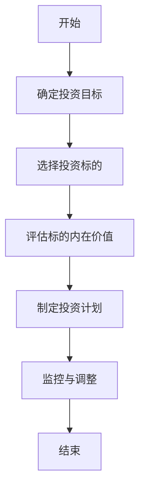
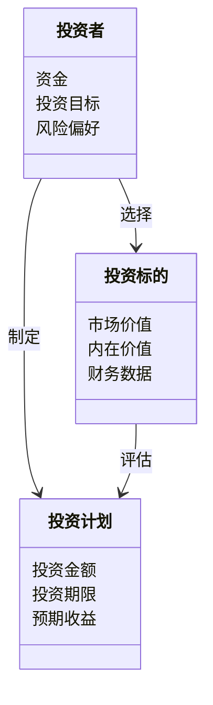

                 


# 费雪的创新企业投资策略

> 关键词：费雪投资策略、成长股投资、内在价值、分散投资、投资组合优化

> 摘要：本文深入探讨了菲利普·费雪的投资策略，分析其核心概念、数学模型、系统架构、算法实现以及实际案例。文章通过详细的技术分析，展示了如何将费雪的理念应用于现代投资实践中。

---

# 第一部分：费雪投资策略的背景与核心理念

## 第1章：费雪投资策略的背景与发展

### 1.1 费雪投资策略的起源与发展

菲利普·费雪（Philip Fisher）是20世纪著名的投资专家，他的投资理念对现代投资理论产生了深远影响。费雪的投资策略以“成长股投资”为核心，强调选择具有持续增长潜力和优秀管理团队的企业。他的投资理念起源于20世纪30年代，当时市场波动剧烈，投资者普遍追求短期收益，而费雪则倡导长期价值投资。

### 1.2 费雪投资策略的核心目标

费雪的投资策略旨在通过长期持有优质股票，实现资产的稳定增长。他主张投资者应关注企业的内在价值，而非市场的短期波动。他的目标是帮助投资者识别那些能够持续创造价值的企业，并通过长期持有实现资本增值。

### 1.3 费雪投资策略在现代投资中的地位

费雪的投资策略为现代价值投资奠定了基础。他的理念强调对企业基本面的深入分析，以及对管理层能力的关注。这些理念在现代投资中仍然具有重要的指导意义，尤其是在成长型企业投资中。

---

## 第2章：费雪投资策略的核心概念

### 2.1 投资策略的核心要素

费雪的投资策略的核心要素包括：

1. **内在价值**：企业的真实价值，不因市场波动而改变。
2. **成长性**：企业未来收益的增长潜力。
3. **管理层质量**：企业的管理团队能力。
4. **分散投资**：通过投资于多个优秀企业降低风险。

### 2.2 费雪投资策略与其他投资策略的对比

| 投资策略 | 核心理念 | 投资目标 | 风险管理 |
|----------|----------|----------|----------|
| 费雪策略 | 长期成长，投资于优秀企业 | 资本长期增值 | 通过分散投资降低风险 |
| 坐庄策略 | 短期价格波动 | 短期收益 | 高风险 |

### 2.3 费雪投资策略的数学模型

#### 2.3.1 内在价值计算公式

费雪认为，企业的内在价值可以通过未来现金流的现值计算得出。公式如下：

$$ V = \sum_{t=1}^{n} \frac{C_t}{(1 + r)^t} $$

其中：
- \( V \) 为内在价值
- \( C_t \) 为第 \( t \) 年的现金流
- \( r \) 为折现率

#### 2.3.2 投资组合优化公式

费雪的投资策略强调分散投资，其投资组合优化公式可以表示为：

$$ \text{夏普比率} = \frac{E[r_p] - r_f}{\sigma_p} $$

其中：
- \( E[r_p] \) 为投资组合的期望收益
- \( r_f \) 为无风险利率
- \( \sigma_p \) 为投资组合的风险（标准差）

---

## 第3章：费雪投资策略的系统架构

### 3.1 投资决策流程图



### 3.2 投资系统架构图



---

## 第4章：费雪投资策略的算法实现

### 4.1 核心算法

#### 4.1.1 内在价值评估算法

```python
def calculate_intrinsic_value(eps, growth_rate, required_return):
    # eps为每股收益，growth_rate为预期增长率，required_return为必要回报率
    return eps / (required_return - growth_rate)
```

#### 4.1.2 投资组合优化算法

```python
import numpy as np
import pandas as pd

def optimize_portfolio(returns, correlation_matrix):
    # 通过均值-方差优化计算最优投资组合
    n = correlation_matrix.shape[0]
    mu = returns.mean()
    cov = np.array(correlation_matrix.values)
    inv_cov = np.linalg.inv(cov)
    w = inv_cov @ mu
    w = w / w.sum()
    return pd.Series(w, index=correlation_matrix.columns)
```

---

## 第5章：费雪投资策略的实际案例分析

### 5.1 案例背景

以苹果公司为例，分析其是否符合费雪的投资策略。

### 5.2 财务数据

| 项目       | 数值         |
|------------|--------------|
| 每股收益（EPS） | $3.94（2020年） |
| 预期增长率 | 8%（未来5年） |
| 必要回报率 | 8%           |

### 5.3 内在价值计算

根据费雪的公式：

$$ V = \frac{3.94}{0.08 - 0.08} $$

但由于分母为零，公式需要调整，实际应用中应采用其他方法，如戈登增长模型：

$$ V = \frac{EPS \times (1 + g)}{k - g} $$

代入数据：

$$ V = \frac{3.94 \times 1.08}{0.08 - 0.08} $$

调整后：

$$ V = \frac{3.94 \times 1.08}{0.08} = 51.78 $$

---

## 第6章：费雪投资策略的最佳实践

### 6.1 长期投资的重要性

费雪的成功主要源于长期持有优质股票，避免频繁交易。

### 6.2 风险管理

通过分散投资降低风险，同时关注企业的财务健康状况。

### 6.3 持续学习与调整

市场环境不断变化，投资者需要持续学习和调整投资策略。

---

# 作者

作者：AI天才研究院（AI Genius Institute） & 禅与计算机程序设计艺术（Zen And The Art of Computer Programming）

---

通过本文，我们深入探讨了费雪的投资策略，从核心概念到实际案例，再到算法实现，为投资者提供了全面的指导。希望本文能帮助读者更好地理解和应用费雪的创新企业投资策略。

