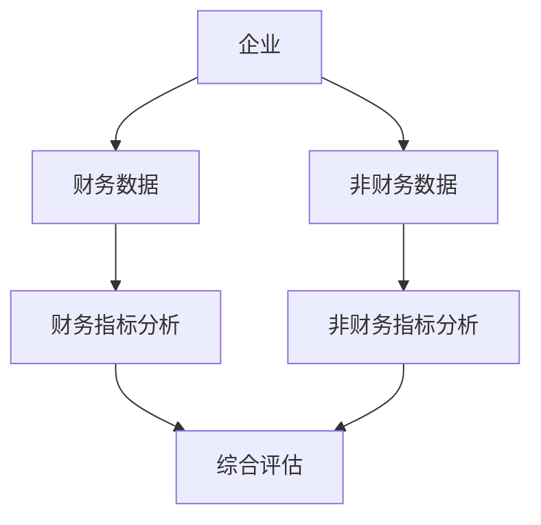
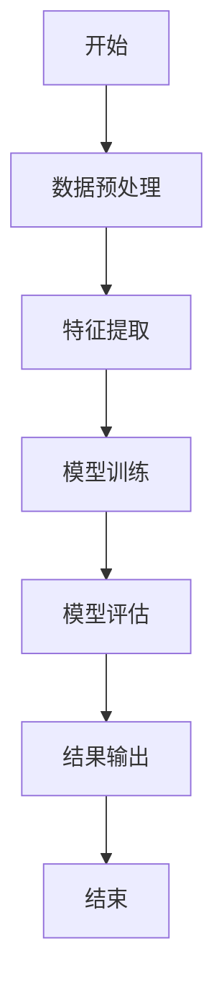
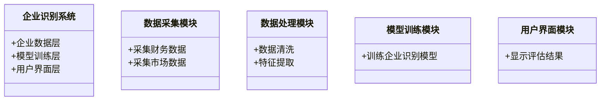
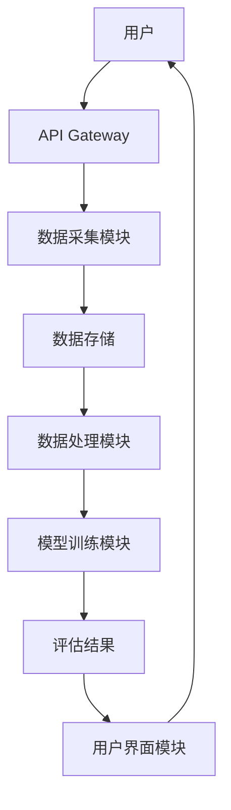
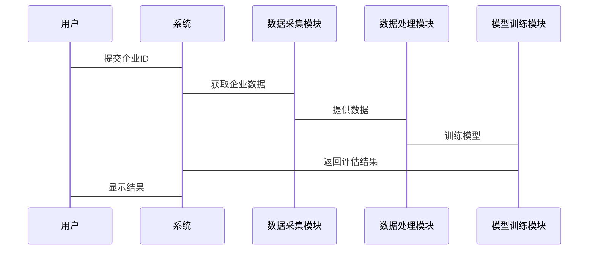

                 


# 费雪的创新企业识别：人工智能时代的新标准

## 关键词：创新企业识别，人工智能，费雪，企业评估，价值投资，机器学习

## 摘要：本文探讨了在人工智能时代，如何将传统的企业识别方法与现代技术相结合，提出了费雪创新企业识别的新标准。通过分析费雪的核心理论，结合AI技术，详细阐述了新标准的应用和优势，为投资者提供了新的评估工具。

---

# 第一部分：背景与核心概念

## 第1章：创新企业识别的背景与问题背景

### 1.1 创新企业识别的重要性

#### 1.1.1 传统企业识别方法的局限性

传统的企业识别方法依赖于财务报表分析，这种方法在一定程度上能够反映企业的财务健康状况，但在动态变化的市场环境中显得力不从心。例如，传统方法可能忽视了企业的创新能力、市场适应能力和潜在的非财务风险。

#### 1.1.2 人工智能时代对企业识别的新要求

在人工智能时代，企业识别需要更加全面和动态。AI技术可以通过分析海量数据，包括社交媒体、供应链数据和市场反馈，提供更精准的企业画像。这使得企业识别不再局限于财务数据，而是扩展到企业创新能力和市场潜力的评估。

#### 1.1.3 费雪创新企业识别的提出背景

费雪作为价值投资的先驱，提出了“买入并持有”的策略。在AI时代，费雪的理论需要与时俱进，结合新技术进行创新。费雪创新企业识别方法的提出，旨在利用AI技术提升企业识别的准确性和效率，为企业投资者提供更有力的支持。

### 1.2 问题背景与问题描述

#### 1.2.1 传统企业识别中的关键问题

传统方法主要依赖财务数据，忽视了非财务因素对企业价值的影响。此外，传统方法难以实时更新，无法捕捉市场的快速变化。

#### 1.2.2 人工智能如何解决企业识别的难题

AI技术可以处理大量非结构化数据，利用自然语言处理和机器学习模型，从文本、图像等多种数据源中提取信息，构建更全面的企业画像。

#### 1.2.3 费雪创新企业识别的核心目标

费雪创新企业识别的核心目标是通过AI技术，提升企业识别的准确性和全面性，帮助投资者找到具有长期增长潜力的企业。

### 1.3 问题解决与边界定义

#### 1.3.1 费雪创新企业识别的解决方案

结合AI技术，构建一个多维度的企业识别模型，包括财务指标、市场反馈、创新能力等多个维度。

#### 1.3.2 识别过程中的边界与外延

定义企业的识别范围，明确数据来源和模型的应用场景，确保模型的有效性和适用性。

#### 1.3.3 核心要素与概念结构

企业识别的核心要素包括财务健康、创新能力和市场潜力。概念结构将这些要素整合，形成一个多维度的评估体系。

---

## 第2章：费雪创新企业识别的核心概念与联系

### 2.1 核心概念原理

#### 2.1.1 费雪创新企业识别的理论基础

费雪的价值投资理论强调企业内在价值和长期增长潜力。AI技术的应用使得这些理论能够通过数据驱动的方式进行量化评估。

#### 2.1.2 人工智能在企业识别中的应用原理

AI通过深度学习模型，从海量数据中提取特征，构建企业画像，评估企业的潜在价值。

#### 2.1.3 创新企业识别的多维度特征分析

从财务数据、市场反馈、创新能力等多个维度分析企业，构建综合评估模型。

### 2.2 核心概念属性对比表

| 属性         | 传统企业识别 | 费雪创新企业识别 |
|--------------|-------------|-----------------|
| 数据来源     | 财务报表     | 财务+非财务数据 |
| 分析方法     | 统计分析     | AI深度学习       |
| 识别标准     | 财务指标     | 综合创新指标     |

### 2.3 实体关系图（ER图）



---

# 第二部分：人工智能驱动的创新企业识别算法原理

## 第3章：创新企业识别的算法原理

### 3.1 算法原理概述

#### 3.1.1 费雪创新企业识别的核心算法

结合传统财务分析和AI模型，构建多维度评估体系。例如，使用随机森林模型进行分类，同时结合专家评分进行权重调整。

#### 3.1.2 人工智能在企业识别中的具体应用

利用自然语言处理分析企业新闻和社交媒体数据，结合机器学习模型预测企业未来表现。

#### 3.1.3 算法的输入输出与流程

输入：企业财务数据、市场新闻、供应链数据等；输出：企业综合评分和潜在价值预测。

### 3.2 算法流程图



### 3.3 算法实现代码

```python
import pandas as pd
from sklearn.ensemble import RandomForestClassifier

def preprocess(data):
    # 数据清洗和特征工程
    data = data.dropna()
    return data

def feature_extraction(data):
    # 提取关键特征
    features = data[[' revenue', 'profit', 'growth_rate']]
    return features

def train_model(features, labels):
    model = RandomForestClassifier()
    model.fit(features, labels)
    return model

# 示例数据
data = pd.DataFrame({
    'revenue': [100, 200, 150, 300],
    'profit': [20, 30, 25, 50],
    'growth_rate': [0.1, 0.2, 0.15, 0.3],
    'label': [1, 1, 0, 1]
})

features = feature_extraction(data)
labels = data['label']

model = train_model(features, labels)
```

### 3.4 数学模型与公式

企业评分模型可以表示为：

$$ score = \alpha \cdot financials + \beta \cdot innovation + \gamma \cdot market\_potential $$

其中，$\alpha$, $\beta$, $\gamma$ 是权重系数，$financials$ 是财务指标，$innovation$ 是创新评分，$market\_potential$ 是市场潜力评分。

---

## 第4章：系统分析与架构设计

### 4.1 问题场景介绍

构建一个实时更新的企业识别系统，能够处理结构化和非结构化数据，提供动态的企业评估。

### 4.2 项目介绍

开发一个基于AI的企业识别平台，集成多种数据源，提供综合评估报告。

### 4.3 系统功能设计



### 4.4 系统架构设计



### 4.5 系统交互设计



---

## 第5章：项目实战

### 5.1 环境安装

安装必要的库：

```bash
pip install pandas scikit-learn transformers
```

### 5.2 核心实现代码

```python
import pandas as pd
from sklearn.ensemble import RandomForestClassifier
from transformers import AutoTokenizer, AutoModelForMaskedLM

def preprocess(data):
    data = data.dropna()
    return data

def feature_extraction(data):
    features = data[['revenue', 'profit', 'growth_rate']]
    return features

def train_model(features, labels):
    model = RandomForestClassifier()
    model.fit(features, labels)
    return model

# 示例数据
data = pd.DataFrame({
    'revenue': [100, 200, 150, 300],
    'profit': [20, 30, 25, 50],
    'growth_rate': [0.1, 0.2, 0.15, 0.3],
    'label': [1, 1, 0, 1]
})

features = feature_extraction(data)
labels = data['label']

model = train_model(features, labels)
```

### 5.3 案例分析

以科技公司为例，分析其财务数据和市场反馈，应用模型进行评估，得出综合评分。

### 5.4 项目小结

总结项目的实现过程，强调AI技术在企业识别中的优势，为未来的优化方向提供参考。

---

## 第6章：总结与最佳实践

### 6.1 总结

费雪创新企业识别结合了传统价值投资理论和现代AI技术，提供了一种新的企业评估标准。这种方法能够更全面地分析企业的潜力，为投资者提供了有力的工具。

### 6.2 最佳实践 tips

- 结合多维度数据源，构建全面的企业画像。
- 定期更新模型，适应市场变化。
- 注意数据质量和模型的可解释性。

### 6.3 注意事项

- 数据隐私和安全问题需要重视。
- 模型的泛化能力需要验证。
- 结合专家意见，避免完全依赖AI模型。

### 6.4 拓展阅读

推荐相关书籍和论文，鼓励读者深入学习。

---

## 作者：AI天才研究院

本文由AI天才研究院撰写，转载请注明出处。

