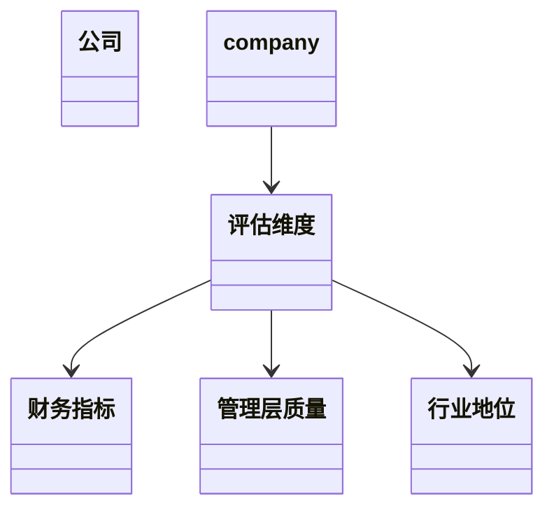
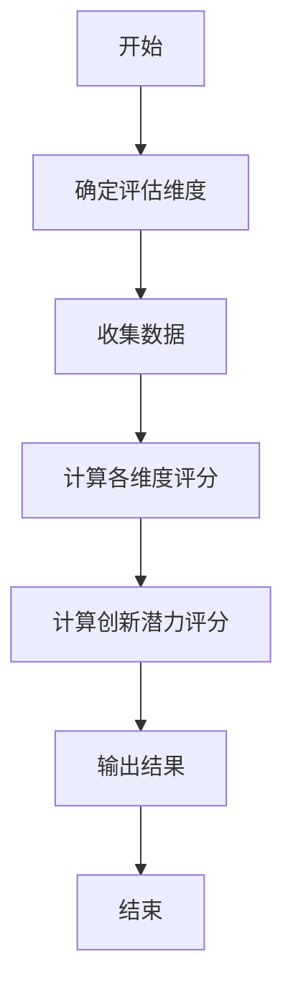

                 


# 费雪的创新型公司识别方法

> 关键词：费雪，创新型公司，投资方法，筛选标准，成长股，三圈投资法

> 摘要：本文详细介绍了费雪识别创新型公司的方法，从其投资理念、筛选标准到实际应用，结合系统分析和项目实战，全面解析费雪的成长股投资策略，帮助读者掌握如何在实际投资中识别和评估创新型公司。

---

## 第一部分: 费雪的创新型公司识别方法概述

### 第1章: 费雪投资理念与创新型公司概述

#### 1.1 费雪投资方法的核心思想

费雪是20世纪著名的投资大师之一，其成长股投资理论在金融界具有重要地位。费雪的成长股投资方法基于对公司基本面的深入分析，特别是对管理层质量、财务状况和行业地位的关注。他的核心思想是通过识别具有持续成长潜力的公司，实现长期投资收益最大化。

##### 1.1.1 费雪的成长股投资理论

费雪的成长股理论强调投资于那些具有持续增长潜力的公司。他认为，真正的成长股公司具备以下特征：
- **稳定的收益增长**：公司收入和利润持续增长。
- **强大的竞争优势**：公司在行业内具有显著的竞争优势。
- **优秀的管理层**：公司管理层具有高度的责任感和卓越的管理能力。

##### 1.1.2 费雪的"三圈投资法"原理

费雪的"三圈投资法"是一种通过分析公司基本面来筛选成长股的方法。具体步骤如下：
1. **第一圈**：分析公司的财务状况，确保公司具有健康的财务状况。
2. **第二圈**：分析公司的行业地位，确保公司在行业内具有竞争力。
3. **第三圈**：分析公司的管理层质量，确保管理层具备高度的责任感和能力。

##### 1.1.3 费雪投资方法的现代应用

尽管费雪的投资方法最初应用于传统行业，但在现代科技和互联网时代，其方法仍具有重要价值。例如，对于科技公司，费雪的筛选标准可以帮助投资者识别那些具有持续创新能力的公司。

#### 1.2 创新型公司的定义与特征

创新型公司是指那些能够通过创新的产品、技术或商业模式实现持续增长的公司。与传统公司相比，创新型公司具有以下特征：
- **高成长潜力**：公司收入和利润增长速度快。
- **创新能力**：公司具备持续创新能力，能够推出新产品或服务。
- **竞争优势**：公司在行业内具有显著的竞争优势。

##### 1.2.1 创新型公司的定义

创新型公司是指那些通过创新的产品、技术或商业模式实现持续增长的公司。这些公司通常具有较高的成长潜力和市场竞争力。

##### 1.2.2 创新型公司的核心特征对比表

| 特征               | 创新型公司             | 传统公司             |
|--------------------|-----------------------|----------------------|
| 收入增长率         | 高                   | 低或稳定            |
| 创新能力           | 强                   | 弱或无               |
| 竞争优势           | 显著                 | 一般或无             |
| 管理层质量         | 高                   | 中或低              |

##### 1.2.3 创新型公司的ER实体关系图（Mermaid流程图）



---

### 第2章: 费雪的公司筛选标准与模型

#### 2.1 费雪筛选模型的核心要素

费雪的筛选模型通过分析公司的财务状况、行业地位和管理层质量，识别出具有持续增长潜力的创新型公司。

##### 2.1.1 管理层质量评估标准

管理层质量是费雪筛选模型中的重要评估维度。具体标准如下：
- **管理层的责任感**：管理层是否具有高度的责任感，是否愿意为股东创造价值。
- **管理层的能力**：管理层是否具备足够的能力和经验，能够带领公司实现持续增长。

##### 2.1.2 财务指标评估标准

财务指标是评估公司财务健康状况的重要依据。具体指标如下：
- **收入增长率**：公司收入是否持续增长。
- **利润率**：公司的利润率是否稳定且高于行业平均水平。
- **资产负债率**：公司的资产负债率是否合理，财务风险是否可控。

##### 2.1.3 行业地位评估标准

行业地位是评估公司市场竞争力的重要依据。具体标准如下：
- **市场份额**：公司在行业内的市场份额是否占据领先地位。
- **行业增长潜力**：行业是否具有较大的增长潜力。

#### 2.2 费雪筛选模型的数学模型与公式

费雪的筛选模型通过加权评分的方式，对公司的财务状况、行业地位和管理层质量进行综合评估。公式如下：

$$
\text{创新潜力评分} = w_1 \cdot x_1 + w_2 \cdot x_2 + w_3 \cdot x_3
$$

其中：
- \( w_1, w_2, w_3 \) 分别为财务状况、行业地位和管理层质量的权重，权重总和为1。
- \( x_1, x_2, x_3 \) 分别为财务状况评分、行业地位评分和管理层质量评分，评分范围为1-10分。

#### 2.3 算法原理与流程图（Mermaid）



---

### 第3章: 费雪方法的实际应用与案例分析

#### 3.1 费雪方法在实际投资中的应用

##### 3.1.1 案例1：XYZ公司的分析与评估

假设我们对XYZ公司进行分析，具体步骤如下：
1. **收集数据**：收集XYZ公司的财务数据、行业数据和管理层信息。
2. **计算各维度评分**：根据费雪的筛选模型，计算XYZ公司在财务状况、行业地位和管理层质量三个维度的评分。
3. **计算创新潜力评分**：根据公式计算XYZ公司的创新潜力评分。
4. **输出结果**：根据评分结果，判断XYZ公司是否具有投资价值。

##### 3.1.2 案例2：ABC公司的分析与评估

类似地，我们也可以对ABC公司进行分析，具体步骤与案例1相同。

#### 3.2 费雪方法与其他投资方法的对比分析

##### 3.2.1 费雪方法与价值投资方法的对比

价值投资方法注重寻找被市场低估的公司，而费雪方法注重寻找具有持续增长潜力的公司。两者在投资目标和策略上有所不同。

##### 3.2.2 费雪方法与成长股投资的其他方法的对比

费雪方法与成长股投资的其他方法（如PE投资法）在评估标准和侧重点上有所不同。费雪方法更加注重公司的基本面分析，特别是管理层质量和行业地位。

---

### 第4章: 系统分析与架构设计方案

#### 4.1 系统分析

##### 4.1.1 问题场景介绍

在实际投资中，投资者需要通过分析公司的财务状况、行业地位和管理层质量，识别出具有持续增长潜力的创新型公司。

##### 4.1.2 领域模型（Mermaid类图）


#### 4.2 系统架构设计

##### 4.2.1 系统架构（Mermaid架构图）


---

### 第5章: 项目实战与代码实现

#### 5.1 项目环境安装

##### 5.1.1 安装Python环境

安装Python 3.8及以上版本。

##### 5.1.2 安装必要的Python库

安装以下库：
```bash
pip install pandas numpy matplotlib
```

#### 5.2 核心代码实现

##### 5.2.1 数据预处理代码

```python
import pandas as pd

def preprocess_data(data):
    data = data.dropna().astype(float)
    return data
```

##### 5.2.2 费雪筛选模型的实现代码

```python
import pandas as pd
import numpy as np

def fisher_innovation_score(data, weights):
    # 计算各维度评分
    financial_score = np.mean(data['financial indicators'])
    management_score = np.mean(data['management quality'])
    industry_score = np.mean(data['industry position'])
    
    # 计算创新潜力评分
    innovation_score = weights[0] * financial_score + weights[1] * management_score + weights[2] * industry_score
    return innovation_score
```

---

## 第六部分: 总结与展望

### 6.1 总结

本文详细介绍了费雪识别创新型公司的方法，从其投资理念、筛选标准到实际应用，结合系统分析和项目实战，全面解析费雪的成长股投资策略，帮助读者掌握如何在实际投资中识别和评估创新型公司。

### 6.2 展望

未来，随着科技的不断发展，创新型公司的识别方法也将不断进化。投资者需要结合市场变化和公司实际情况，灵活调整投资策略，以实现长期投资收益最大化。

---

## 作者：AI天才研究院/AI Genius Institute & 禅与计算机程序设计艺术 /Zen And The Art of Computer Programming

---

**注**：本文内容基于费雪的投资理论和方法，结合现代技术手段进行分析和实现。

