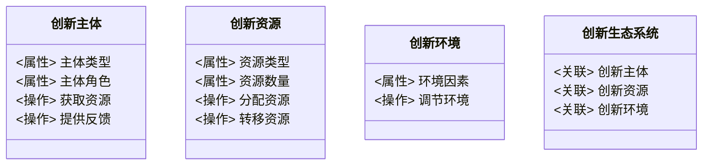

                 


# 费雪的创新生态系统分析：把握产业链机会

## 关键词：创新生态系统，产业链机会，费雪理论，系统分析，创新评估

## 摘要：  
费雪的创新生态系统分析是一种系统性方法，用于理解创新在产业链中的扩散和应用。本文通过分析创新生态系统的构成、关系和动态演化，探讨如何通过系统分析和优化策略来把握产业链机会。文章结合实际案例，详细讲解创新生态系统的评估方法、算法原理和系统架构设计，并提供实战项目分析，帮助读者掌握创新生态系统的核心概念和应用技巧。

---

## 第1章：创新生态系统的核心概念

### 1.1 创新生态系统的基本定义

#### 1.1.1 创新生态系统的定义与内涵  
创新生态系统是一个由多方参与者（企业、用户、科研机构、政府等）共同构成的复杂系统，旨在通过协同合作推动技术创新和价值创造。费雪理论强调，创新不仅依赖于单一主体的努力，更需要整个生态系统中各要素的互动与协作。

#### 1.1.2 费雪创新理论的背景与核心观点  
费雪理论提出于20世纪40年代，主要关注创新的扩散和应用。他认为，创新的成功不仅依赖于技术本身的先进性，还取决于生态系统中各主体的协同能力。费雪理论的核心观点是：创新生态系统是一个动态的、多维的系统，其成功依赖于各个参与者之间的互动与合作。

#### 1.1.3 创新生态系统与产业链的关系  
创新生态系统与产业链密切相关。产业链中的每个环节都可能成为创新的来源或受益者。通过分析创新生态系统，可以更好地把握产业链中的机会和挑战，从而制定更有效的战略。

---

### 1.2 创新生态系统的主要特征

#### 1.2.1 开放性与协同性  
创新生态系统具有高度的开放性，允许不同类型的参与者加入。协同性是其核心特征之一，通过协同合作，各主体可以实现资源的优化配置和能力的互补。

#### 1.2.2 多元性与互补性  
创新生态系统中的参与者具有高度的多元性，包括企业、用户、科研机构、政府等。这些参与者之间通过互补性合作，可以实现技术创新和价值创造。

#### 1.2.3 动态性与适应性  
创新生态系统是一个动态的系统，参与者之间的关系和互动会随着环境的变化而不断调整。系统的适应性使其能够应对外部的挑战和变化。

---

### 1.3 创新生态系统的核心要素

#### 1.3.1 创新主体  
创新主体是创新生态系统的核心要素之一，包括企业、科研机构、用户等。它们是技术创新的主要推动者和应用者。

#### 1.3.2 创新资源  
创新资源包括技术、资金、人才等。这些资源是技术创新的基础，也是创新生态系统运行的关键要素。

#### 1.3.3 创新环境  
创新环境包括政策、市场、文化等因素。良好的创新环境可以为创新主体提供支持，促进技术创新和扩散。

---

## 第2章：创新生态系统的构成与关系

### 2.1 创新生态系统的构成要素

#### 2.1.1 创新主体的分类与角色  
创新主体可以分为企业、科研机构、用户等。企业是技术创新的主要推动者，科研机构提供技术支持，用户则是创新的最终受益者。

#### 2.1.2 创新资源的分配与流动  
创新资源在系统中的分配与流动是创新生态系统运行的关键。企业通过资金和技术投入推动创新，科研机构通过知识和技术转移支持企业创新，用户通过反馈推动创新的改进。

#### 2.1.3 创新环境的影响与调节  
创新环境对创新生态系统具有重要影响。政策支持、市场需求、文化氛围等因素都会影响创新主体的行为和创新资源的分配。

---

### 2.2 创新生态系统中的核心关系

#### 2.2.1 主体间的关系  
创新主体之间的关系包括协同、竞争和互补。协同关系是创新生态系统的核心，通过协同合作，各主体可以实现资源的优化配置和能力的互补。

#### 2.2.2 资源与主体的关系  
创新资源与主体之间的关系是动态的。企业通过投入资源推动创新，科研机构通过技术转移支持企业创新，用户通过反馈推动创新的改进。

#### 2.2.3 环境与系统的互动  
创新环境与创新生态系统之间存在双向互动。环境因素影响创新主体的行为和资源分配，创新生态系统的发展也会影响环境因素。

---

### 2.3 创新生态系统的动态演化

#### 2.3.1 系统的生命周期  
创新生态系统的生命周期包括形成、发展、成熟和衰退四个阶段。每个阶段的特点和行为模式不同，需要不同的战略和管理方法。

#### 2.3.2 系统的自我调节机制  
创新生态系统具有自我调节能力，能够通过内部互动和外部反馈实现系统的动态平衡。自我调节机制是系统适应外部变化的关键。

#### 2.3.3 系统的外部干扰与适应  
外部干扰（如政策变化、市场需求变化）会影响创新生态系统的发展。系统需要通过调整和适应来应对外部干扰，保持系统的稳定和持续发展。

---

## 第3章：创新生态系统的评估与优化

### 3.1 评估指标的选择与设计

#### 3.1.1 经济效益指标  
经济效益指标包括GDP增长、就业率、企业利润等。这些指标反映了创新生态系统对经济发展的贡献。

#### 3.1.2 技术创新指标  
技术创新指标包括专利数量、技术转移效率、新产品开发速度等。这些指标反映了创新生态系统的技术创新能力。

#### 3.1.3 社会效益指标  
社会效益指标包括生活质量、环境改善、社会公平等。这些指标反映了创新生态系统对社会发展的贡献。

---

### 3.2 评估模型的构建

#### 3.2.1 层次分析法（AHP）的应用  
层次分析法是一种常用的评估方法。通过构建层次结构，确定各指标的权重，进行综合评估。

#### 3.2.2 系统动力学模型的构建  
系统动力学模型可以模拟创新生态系统的动态演化，帮助预测系统的行为和趋势。

---

### 3.3 评估结果的分析与优化

#### 3.3.1 问题识别与瓶颈分析  
通过评估结果，识别创新生态系统中的问题和瓶颈，制定优化策略。

#### 3.3.2 优化策略的制定与实施  
根据评估结果，制定优化策略，包括资源优化配置、主体协同合作、环境改善等。

---

## 第4章：创新生态系统的算法与模型

### 4.1 创新生态系统评估的数学模型

#### 4.1.1 层次分析法（AHP）的数学模型  
层次分析法的数学模型包括判断矩阵的构建、权重的计算等。通过这些步骤，可以得出各指标的权重，进行综合评估。

#### 4.1.2 系统动力学模型的构建  
系统动力学模型通过微分方程描述系统的动态行为，帮助预测系统的发展趋势。

---

### 4.2 算法实现与代码示例

#### 4.2.1 层次分析法的Python实现  
以下是一个层次分析法的Python代码示例：

```python
import numpy as np

def calculate_weights(matrix):
    # 计算判断矩阵的特征值和特征向量
    eigenvalues, eigenvectors = np.linalg.eig(matrix)
    # 计算特征向量的最大特征值对应的权重
    max_eigenvalue = eigenvalues.max()
    weights = eigenvectors[:, np.argmax(eigenvalues)] / eigenvectors[:, np.argmax(eigenvalues)].sum()
    return weights

# 示例判断矩阵
matrix = np.array([
    [1, 2, 3],
    [1/2, 1, 2],
    [1/3, 1/2, 1]
])

weights = calculate_weights(matrix)
print("权重向量为：", weights)
```

#### 4.2.2 系统动力学模型的Python实现  
以下是一个系统动力学模型的Python代码示例：

```python
import numpy as np

def system_dynamics_model(initial_conditions, parameters, steps):
    # 初始化状态
    state = initial_conditions.copy()
    results = [state.copy()]
    
    for _ in range(steps):
        # 更新状态
        new_state = state * (1 - parameters['decay_rate']) + parameters['growth_rate']
        results.append(new_state.copy())
        state = new_state
        
    return results

# 示例参数
initial_conditions = [100]
parameters = {
    'decay_rate': 0.1,
    'growth_rate': 2
}
steps = 10

results = system_dynamics_model(initial_conditions, parameters, steps)
print("系统动力学模型结果为：", results)
```

---

## 第5章：创新生态系统系统的分析与架构设计

### 5.1 系统功能设计

#### 5.1.1 系统功能模块  
创新生态系统分析系统包括数据采集、分析、可视化和优化建议四个功能模块。

#### 5.1.2 领域模型设计  
领域模型展示了系统中各模块之间的关系，使用Mermaid类图表示。



---

## 第6章：创新生态系统的项目实战

### 6.1 环境安装与代码实现

#### 6.1.1 环境安装  
需要安装Python、NumPy、Matplotlib等库。

#### 6.1.2 核心代码实现  
以下是一个创新生态系统分析的Python代码示例：

```python
import numpy as np
import matplotlib.pyplot as plt

def analyze_innovation_system(data):
    # 数据分析与可视化
    plt.figure(figsize=(10, 6))
    plt.plot(data, label='创新生态系统演化')
    plt.xlabel('时间')
    plt.ylabel('系统状态')
    plt.legend()
    plt.show()

# 示例数据
data = np.random.rand(10)
analyze_innovation_system(data)
```

#### 6.1.3 代码应用解读  
上述代码展示了如何通过数据分析与可视化技术，分析创新生态系统的演化过程。

---

## 第7章：总结与展望

### 7.1 本章总结  
本文详细讲解了费雪的创新生态系统分析方法，从理论到实践，结合实际案例，展示了如何通过系统分析和优化策略来把握产业链机会。

### 7.2 小结与注意事项  
在实际应用中，需要注意创新生态系统的动态性和复杂性，结合具体产业特点，制定合适的分析和优化策略。

### 7.3 未来研究方向  
未来的研究可以进一步探索创新生态系统与其他管理理论的结合，如敏捷管理、数字化转型等，为创新生态系统研究提供新的视角和方法。

---

## 作者：AI天才研究院/AI Genius Institute & 禅与计算机程序设计艺术 /Zen And The Art of Computer Programming

