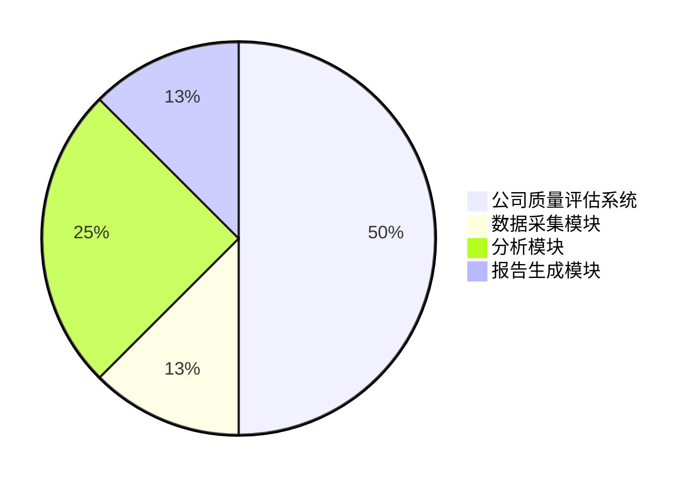

                 


# 费雪的判断公司质量的15个要点

## 关键词：公司质量、投资分析、费雪要点、财务指标、市场地位、竞争优势

## 摘要：  
本文系统地介绍并分析了费雪提出的判断公司质量的15个要点，从理论背景、核心要点、系统设计、项目实战到数学模型，全面阐述了如何通过这些要点进行公司质量评估。通过实际案例和系统架构设计，展示了如何将这些要点应用于实际投资分析中，帮助读者掌握公司质量评估的核心方法。

---

## 第1章：背景与核心概念

### 1.1 投资的基本概念

#### 1.1.1 投资的定义与分类
- **定义**：投资是指将资金投入某个项目或资产，以期在未来获得收益或资本增值。
- **分类**：包括股票、债券、房地产、基金等多种形式。
- **特点**：风险与收益并存，需要长期关注和管理。

#### 1.1.2 投资与公司质量的关系
- 投资的最终目标是通过评估公司的质量，选择具有长期增长潜力的公司。
- 公司质量决定了投资的收益和风险。

### 1.2 费雪投资理论的起源

#### 1.2.1 费雪的投资理念
- 费雪强调长期投资和价值发现，认为公司的质量是投资成功的关键。
- 他提出了15个要点，用于系统地评估公司的财务、管理、市场等方面。

#### 1.2.2 费雪理论的核心思想
- **长期增长**：关注公司长期的盈利能力和发展潜力。
- **质量优先**：选择具有强大竞争优势和管理能力的公司。
- **分散风险**：通过多元化投资降低风险。

### 1.3 公司质量评估的重要性

#### 1.3.1 评估的目的
- 识别具有长期增长潜力的公司。
- 降低投资风险，提高收益。

#### 1.3.2 评估的流程
1. 收集公司数据（财务报表、市场信息等）。
2. 分析财务指标（如ROE、净利润增长率等）。
3. 评估管理能力和市场地位。
4. 综合评分，做出投资决策。

#### 1.3.3 评估的边界与外延
- **边界**：仅限于公司本身的财务和管理因素，不考虑外部宏观经济因素。
- **外延**：通过评估结果，为投资组合提供参考。

---

## 第2章：费雪的15个判断要点

### 2.1 费雪15个要点的定义与分类

#### 2.1.1 核心定义
| 要点编号 | 要点名称                | 定义与说明                                   |
|----------|------------------------|--------------------------------------------|
| 1        | 盈利能力                | 公司的净利润率和ROE（股东权益回报率）       |
| 2        | 收入增长                | 收入的年增长率                              |
| 3        | 市场地位                | 公司在市场中的份额和竞争优势                |
| 4        | 管理层稳定性            | 管理层的稳定性与决策能力                   |
| 5        | 创新能力                | 公司研发投入和新产品推出能力                |
| 6        | 财务健康性              | 负债率、现金流健康性                       |
| 7        | 行业地位                | 行业周期和未来发展前景                    |
| 8        | 客户忠诚度              | 客户满意度和品牌影响力                      |
| 9        | 经营效率                | 资产周转率和运营效率                       |
| 10       | 利润质量                | 利润来源的可持续性                          |
| 11       | 竞争优势                | 技术壁垒、成本优势等                      |
| 12       | 政策环境                | 政府政策对公司的影响                        |
| 13       | 管理层动机              | 管理层的分红政策和激励机制                 |
| 14       | 估值合理性              | 市盈率、市净率等估值指标                   |
| 15       | 风险管理能力            | 风险控制机制和财务稳健性                   |

---

### 2.2 费雪要点的ER实体关系图

```mermaid
er
    客户忠诚度
    管理层稳定性
    创新能力
    财务健康性
    市场地位
    竞争优势
    利润质量
    经营效率
    政策环境
    管理层动机
    估值合理性
    风险管理能力
    盈利能力
    收入增长
```

---

## 第3章：基于费雪要点的公司质量评估系统

### 3.1 系统分析

#### 3.1.1 系统目标
- 基于费雪的15个要点，构建一个自动化、智能化的公司质量评估系统。

#### 3.1.2 系统功能需求
- 数据采集模块：收集公司财务数据、市场数据等。
- 分析模块：根据15个要点进行评分。
- 报告生成模块：输出评估报告和投资建议。

#### 3.1.3 系统边界与接口
- 数据输入：财务报表、市场数据。
- 用户交互：输入公司名称，输出评估结果。

---

### 3.2 系统架构设计



---

### 3.3 系统功能设计

#### 3.3.1 数据采集模块
- 数据来源：公司财务报表、行业报告、新闻资讯。
- 数据清洗：去除无效数据，处理异常值。

#### 3.3.2 分析模块
- 基于费雪要点的评分算法：
  1. 对每个要点进行评分（1-10分）。
  2. 综合评分：加权平均，权重根据重要性调整。

#### 3.3.3 报告生成模块
- 自动生成HTML报告，包括评分结果、建议和可视化图表。

---

## 第4章：项目实战

### 4.1 环境安装

#### 4.1.1 数据库安装与配置
- 使用MySQL或PostgreSQL存储公司数据。

#### 4.1.2 工具安装
- Python、Pandas、Matplotlib用于数据分析和可视化。

---

### 4.2 核心实现

#### 4.2.1 数据采集与清洗
```python
import pandas as pd
import requests
from bs4 import BeautifulSoup

# 示例：从公司财报中提取数据
def fetch_data(company):
    url = f'https://example.com/financial_data/{company}'
    response = requests.get(url)
    soup = BeautifulSoup(response.text, 'html.parser')
    data = {
        'revenue': float(soup.find('revenue').text),
        'net_profit': float(soup.find('net_profit').text),
        # 其他财务指标...
    }
    return data
```

---

### 4.2.2 费雪要点评分算法

#### 4.2.2.1 算法原理
- 对每个要点进行评分，计算加权总分：
  $$ \text{总分} = \sum (\text{权重}_i \times \text{评分}_i) $$

#### 4.2.2.2 评分函数
```python
def calculate_score(financial_data):
    scores = []
    # 示例：盈利能力
    roe = financial_data['net_profit'] / financial_data['equity']
    scores.append(min(10, max(0, 2 * roe - 1)))
    # 其他要点类似计算...
    return scores
```

---

### 4.2.3 可视化报告

```python
import matplotlib.pyplot as plt

# 示例：绘制公司评分分布图
companies = ['Company A', 'Company B', 'Company C']
scores = [7.5, 8.2, 6.8]

plt.bar(companies, scores)
plt.title('Company Quality Scores')
plt.ylabel('Score')
plt.show()
```

---

## 第5章：数学模型与算法原理

### 5.1 费雪要点评分模型

#### 5.1.1 模型公式
$$ \text{总分} = \sum_{i=1}^{15} (\text{权重}_i \times \text{评分}_i) $$

#### 5.1.2 评分权重
| 要点编号 | 权重 |
|----------|------|
| 盈利能力 | 15% |
| 收入增长 | 10% |
| 管理层稳定性 | 15% |
| ...       | ...  |

---

## 第6章：总结与展望

### 6.1 小结
本文系统地介绍了费雪的15个判断要点，并通过实际案例展示了如何构建评估系统。这些要点为投资者提供了科学的评估方法。

### 6.2 注意事项
- 数据来源的可靠性。
- 模型的可扩展性和灵活性。
- 定期更新评估结果。

### 6.3 拓展阅读
- 《投资学基础》
- 《费雪投资理论》

---

## 作者信息

作者：AI天才研究院/AI Genius Institute & 禅与计算机程序设计艺术/Zen And The Art of Computer Programming

---

通过以上内容，您可以系统地了解费雪的15个判断要点，并将其应用于实际投资分析中。

