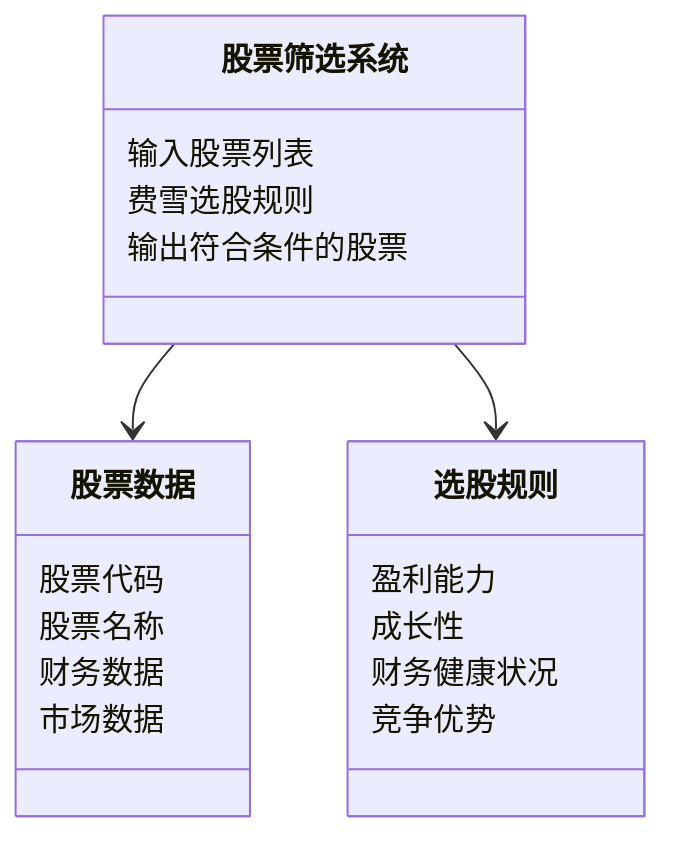

                 


# 费雪的十五个投资点：选股的黄金法则

> 关键词：费雪投资法则、选股策略、股票估值、财务分析、投资策略

> 摘要：本文深入分析了费雪的十五个投资点，结合现代投资理论，详细解读了每个法则的核心思想和应用场景。通过数学模型、系统架构和实际案例的分析，帮助投资者掌握选股的黄金法则，制定科学的投资策略。

---

# 第一部分：费雪投资理念的背景与核心思想

## 第1章：费雪投资理念的背景与核心思想

### 1.1 费雪及其投资理念的起源

#### 1.1.1 费雪的生平简介
菲利普·费雪（Philip Fisher）是20世纪的投资大师，被誉为“成长股之父”。他于1907年出生于美国纽约，毕业于加州大学伯克利分校，后加入投资银行，逐渐发展出一套独特的投资理念。费雪的投资理念以长期成长为导向，强调选择具有强大竞争优势和持续增长潜力的公司。

#### 1.1.2 费雪投资理念的形成背景
20世纪初，美国股市经历了多次剧烈波动，投资者普遍追求短期收益，忽视了企业的基本面。费雪在实践中意识到，只有通过深入分析企业的财务状况、行业地位和竞争优势，才能实现长期稳定的收益。

#### 1.1.3 费雪投资理念的核心思想
费雪的核心思想是“投资于成长”。他认为，成功的投资不在于市场的短期波动，而在于选择那些能够持续增长的企业。他提出了十五个选股法则，旨在帮助投资者筛选出具有长期增长潜力的优秀企业。

---

### 1.2 费雪投资理念的现代意义

#### 1.2.1 费雪理念在现代投资中的地位
尽管费雪的投资理念诞生于20世纪，但其核心思想在现代投资中依然具有重要价值。尤其是在成长股投资领域，费雪的方法论为投资者提供了重要的指导。

#### 1.2.2 费雪理念与现代金融理论的联系
费雪的理念与现代金融理论中的“基本面分析”密切相关。他强调的企业财务健康、竞争优势和成长潜力，与现代企业价值评估的核心思想一致。

#### 1.2.3 费雪理念在个人投资中的应用
对于个人投资者来说，费雪的投资法则提供了一套系统的选股标准。通过这些标准，投资者可以避免盲目跟风，实现科学的投资决策。

---

### 1.3 费雪投资理念的十五个黄金法则概述

#### 1.3.1 十五个法则的基本框架
费雪的十五个选股法则涵盖了企业的财务状况、行业地位、竞争优势、管理团队等多个方面，形成了一个完整的选股框架。

#### 1.3.2 每个法则的核心要点
- **企业盈利能力**：关注企业的净利润率和利润率。
- **企业成长性**：评估企业的收入和利润增长率。
- **财务健康状况**：分析企业的资产负债表，确保财务稳健。
- **竞争优势**：评估企业的市场地位和核心竞争力。
- **管理团队**：考察管理团队的能力和诚信。
- **市场地位**：分析企业在行业中的位置。
- **创新能力**：关注企业的研发投入和新产品开发能力。
- **财务杠杆**：评估企业的负债水平和偿债能力。
- **股息支付率**：分析企业的分红政策和股息支付能力。
- **估值方法**：通过市盈率、市净率等指标评估企业价值。
- **历史表现**：分析企业的历史股价表现和市场反应。
- **未来增长潜力**：评估企业在未来市场的扩展能力。
- **行业周期**：分析行业周期对企业的影响。
- **长期投资价值**：综合评估企业的长期增长潜力。

#### 1.3.3 十五个法则的相互关系与整体结构
这些法则并非孤立存在，而是相互关联、相互补充。投资者需要综合考虑多个因素，才能做出最优的投资决策。

---

## 第2章：费雪十五个投资点的详细解读

### 2.1 股票投资的基本原则

#### 2.1.1 股票投资的核心目标
股票投资的核心目标是通过选择优质企业，实现资产的长期增值。

#### 2.1.2 股票投资的基本策略
- 长期持有优质股票。
- 分散投资，降低风险。
- 定期审视投资组合，调整持仓。

#### 2.1.3 股票投资的风险管理
- 设置止损点，避免重大损失。
- 保持合理的杠杆水平，避免过度杠杆。

---

### 2.2 费雪十五个投资点的详细分析

#### 2.2.1 点1：企业盈利能力的重要性
企业的盈利能力是选股的核心指标之一。通过分析净利润率、毛利率等指标，评估企业的盈利能力和持续性。

$$ \text{净利润率} = \frac{\text{净利润}}{\text{营业收入}} $$

#### 2.2.2 点2：企业成长性的评估标准
企业的成长性主要通过收入增长率和利润增长率来衡量。成长性好的企业能够为股东创造持续的收益。

$$ \text{收入增长率} = \frac{\text{本年收入} - \text{上年收入}}{\text{上年收入}} $$

---

### 2.3 十五个法则的综合应用

#### 2.3.1 各个法则的权重分配
在实际选股中，投资者需要根据市场环境和自身需求，对各个法则赋予不同的权重。例如，成长性较高的企业可能更适合长期投资者。

#### 2.3.2 法则之间的相互作用
企业的财务状况和行业地位是相辅相成的。财务稳健的企业更容易在行业中占据优势地位。

#### 2.3.3 法则在实际选股中的综合运用
投资者需要将多个法则结合起来，才能选出真正具有投资价值的企业。例如，选择一家财务稳健、成长性良好且具有竞争优势的企业。

---

## 第3章：费雪投资理念的数学模型与公式

### 3.1 股票估值的核心公式

#### 3.1.1 市盈率（P/E）
市盈率是衡量企业股票价值的重要指标，用于评估企业的盈利能力。

$$ \text{市盈率} = \frac{\text{股票价格}}{\text{每股净利润}} $$

#### 3.1.2 市净率（P/B）
市净率是衡量企业股票价值的另一个重要指标，用于评估企业的资产质量。

$$ \text{市净率} = \frac{\text{股票价格}}{\text{每股净资产}} $$

#### 3.1.3 股息率
股息率是衡量企业分红能力的重要指标。

$$ \text{股息率} = \frac{\text{每股股息}}{\text{股票价格}} $$

---

### 3.2 财务分析的核心公式

#### 3.2.1 净利润率
净利润率是衡量企业盈利能力的重要指标。

$$ \text{净利润率} = \frac{\text{净利润}}{\text{营业收入}} $$

#### 3.2.2 负债率
负债率是衡量企业财务风险的重要指标。

$$ \text{负债率} = \frac{\text{总负债}}{\text{总资产}} $$

---

## 第4章：系统分析与架构设计方案

### 4.1 问题场景介绍
投资者需要通过一套系统化的选股模型，筛选出符合费雪十五个投资点的优质企业。

### 4.2 项目介绍
本项目旨在构建一个基于费雪选股法则的自动化选股系统，帮助投资者快速筛选出具有长期增长潜力的企业。

### 4.3 系统功能设计（领域模型）



### 4.4 系统架构设计


---

## 第5章：项目实战

### 5.1 环境安装
- 数据来源：使用公开的股票数据，例如Yahoo Finance。
- 工具：Python编程语言，Pandas、NumPy数据处理库。

### 5.2 核心实现源代码

```python
import pandas as pd

# 加载股票数据
df = pd.read_csv('stock_data.csv')

# 费雪选股法则
def fisher选股法则(股票数据):
    符合条件的股票 = []
    for stock in 股票数据:
        # 判断盈利能力
        净利润率 = stock['净利润率']
        if 净利润率 < 0.1:
            continue
        # 判断成长性
        收入增长率 = stock['收入增长率']
        if 收入增长率 < 0.1:
            continue
        # 判断财务健康状况
        负债率 = stock['负债率']
        if 负债率 > 0.5:
            continue
        # 判断竞争优势
        市场地位 = stock['市场地位']
        if 市场地位 < '行业领先':
            continue
        符合条件的股票.append(stock)
    return 符合条件的股票

# 应用选股法则
符合条件的股票 = fisher选股法则(df)
```

---

## 第6章：总结与展望

### 6.1 小结
费雪的十五个选股法则为投资者提供了一套系统化的选股标准。通过深入分析企业的财务状况、行业地位和竞争优势，投资者可以更好地筛选出具有长期增长潜力的优质企业。

### 6.2 注意事项
- 投资者需要根据市场环境和自身需求，灵活调整选股标准。
- 在实际操作中，建议结合多种选股法则，避免过于单一。

### 6.3 拓展阅读
- 《投资学原理》
- 《费雪的投资哲学》

---

# 作者：AI天才研究院/AI Genius Institute & 禅与计算机程序设计艺术 /Zen And The Art of Computer Programming

---

通过以上分析，费雪的十五个选股法则为投资者提供了一套科学的选股标准。投资者可以通过深入分析企业的财务状况、行业地位和竞争优势，筛选出具有长期增长潜力的优质企业，从而实现稳健的投资收益。

