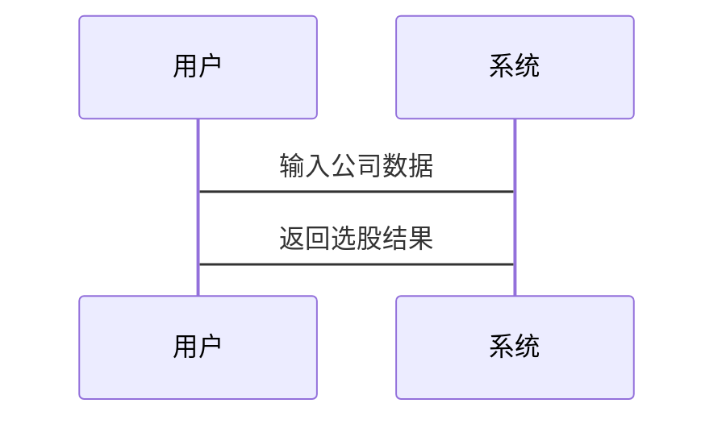

                 


# 费雪的十五个投资点：选股的黄金法则

> **关键词**：费雪投资理念、选股要点、投资策略、费雪选股模型、投资分析

> **摘要**：本文将详细介绍费雪的投资理念及其著名的十五个选股要点。通过分析每个要点的定义、数学模型、系统架构以及实际案例，帮助读者全面理解并应用这些投资法则。文章还将探讨如何将这些要点整合到实际投资策略中，并提供最佳实践和注意事项。

---

# 引言：费雪的投资哲学与十五个选股要点

## 1.1 费雪投资理念的背景与核心思想

### 1.1.1 费雪的投资哲学与方法

菲利普·费雪（Philip Fisher）是20世纪的投资大师，以其“成长型投资”理念闻名。他认为，投资的核心在于选择那些具有持续增长潜力的公司，并长期持有。费雪强调深入研究公司基本面，尤其是其盈利能力、管理团队和行业地位。

费雪的投资哲学可以总结为以下几点：
1. **长期增长**：寻找那些能够持续增长的公司。
2. **管理质量**：管理层的能力和决策对企业成功至关重要。
3. **竞争优势**：企业应具备独特的竞争优势，以抵御竞争。

### 1.1.2 费雪选股要点的提出背景

费雪在长期的投资实践中总结出十五个选股要点，这些要点涵盖了公司基本面的各个方面，包括财务状况、行业地位、管理层质量等。这些要点并非独立存在，而是相互关联，共同构成一个完整的选股框架。

### 1.1.3 费雪选股理念的核心要素

费雪选股的核心要素可以分为三大类：
1. **财务健康**：包括盈利能力、资产负债表和现金流。
2. **行业地位**：包括行业前景、市场占有率和竞争优势。
3. **管理层质量**：包括管理层的能力、决策和道德标准。

---

# 第1章：费雪十五个选股要点的定义与分类

## 1.2 费雪十五个选股要点的详细定义

### 1.2.1 定义与分类

费雪的十五个选股要点可以分为以下几个类别：
- **财务指标**：如净利润率、毛利率、ROE（净资产收益率）。
- **行业分析**：如行业增长潜力、市场地位。
- **管理层评估**：如管理层的背景和决策能力。

---

# 第2章：费雪选股要点的数学模型与算法

## 2.1 费雪选股模型的数学公式

### 2.1.1 净利润率计算

$$ \text{净利润率} = \frac{\text{净利润}}{\text{营业收入}} \times 100\% $$

### 2.1.2 净资产收益率（ROE）

$$ \text{ROE} = \frac{\text{净利润}}{\text{净资产}} \times 100\% $$

### 2.1.3 市盈率（P/E）

$$ \text{P/E} = \frac{\text{股价}}{\text{每股收益}} $$

---

# 第3章：系统架构与流程设计

## 3.1 费雪选股系统的架构设计


## 3.2 系统接口设计



---

# 第4章：项目实战与案例分析

## 4.1 环境安装与代码实现

### 4.1.1 环境搭建

```bash
pip install numpy pandas matplotlib
```

### 4.1.2 核心代码实现

```python
import pandas as pd

def fisher选股要点(data):
    data['净利润率'] = data['净利润'] / data['营业收入'] * 100
    data['ROE'] = data['净利润'] / data['净资产'] * 100
    return data

# 示例数据
data = {
    '公司': ['公司A', '公司B'],
    '净利润': [100, 200],
    '营业收入': [500, 1000],
    '净资产': [200, 500]
}

df = pd.DataFrame(data)
结果 = fisher选股要点(df)
print(结果)
```

---

# 第5章：最佳实践与注意事项

## 5.1 最佳实践

- **持续学习**：市场变化快，需不断更新知识。
- **分散投资**：避免过度集中。
- **长期持有**：耐心等待投资成果。

## 5.2 小结

费雪的十五个选股要点为投资者提供了系统化的选股框架。通过深入理解和实践这些要点，投资者可以更好地捕捉优质企业，实现长期收益。

---

# 结语：费雪投资理念的现代应用

## 6.1 费雪投资理念的现代价值

尽管费雪的投资理念提出于几十年前，但其核心思想依然适用于当今的市场环境。随着科技的发展，投资者可以利用大数据和人工智能工具更高效地执行费雪的选股策略。

---

作者：AI天才研究院/AI Genius Institute & 禅与计算机程序设计艺术 /Zen And The Art of Computer Programming

