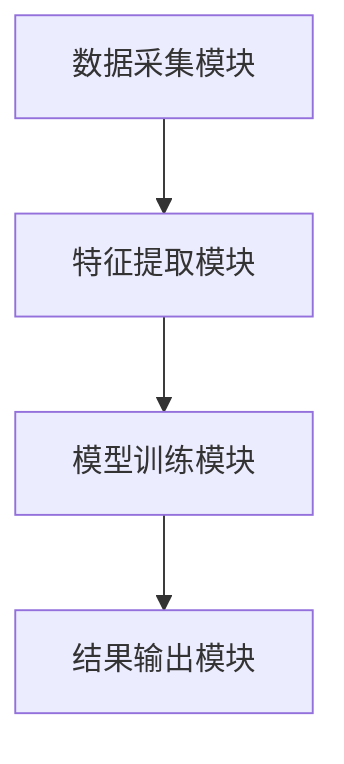
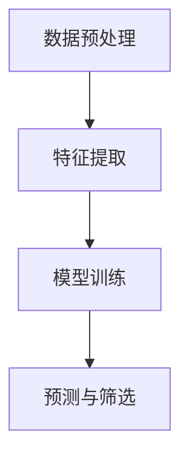

                 


# 费雪的十五个投资点：选股策略详解

> 关键词：费雪投资点、选股策略、价值投资、财务分析、投资模型

> 摘要：本文详细解析了费雪的投资理念和选股策略，结合现代技术分析方法，通过算法实现、系统架构设计和实际案例分析，深入探讨了费雪十五个投资点的核心思想和应用场景。

---

# 引言：费雪投资理念的核心思想

## 费雪投资理念的背景与意义

### 1.1 价值投资的基本概念

价值投资是一种以基本面分析为基础的投资策略，强调通过深入研究公司的财务状况、行业地位和竞争优势，寻找市场价格低于其内在价值的股票。这一理念的核心在于，通过长期持有优质资产，获得超越市场的投资回报。

### 1.2 费雪投资理念的起源与发展

菲利普·费雪（Philip Fisher）是价值投资的先驱之一，他提出了“成长股”投资理念，强调选择那些具有持续成长潜力的优秀公司。费雪的投资理念并非孤立存在，而是与现代投资理论相辅相成，为投资者提供了独特的选股思路。

### 1.3 费雪投资理念与现代投资理论的联系

尽管费雪的投资理念诞生于20世纪，但其核心思想与现代技术分析、量化投资方法有着深刻的联系。本文将结合现代技术手段，对费雪的十五个投资点进行深入分析，探讨其在当前市场环境下的应用价值。

---

# 第一部分：费雪十五个投资点的详细分析

## 2.1 投资点1：寻找优秀的公司

### 2.1.1 优秀公司的定义与特征

#### 背景介绍

优秀公司在市场中具有持续的竞争优势和成长潜力。在选择股票时，首要任务是识别那些具备以下特征的公司：

1. **强大的行业地位**：公司在行业内具有领先地位，市场份额较高。
2. **持续的创新能力**：公司能够不断推出新产品或服务，保持竞争优势。
3. **稳健的财务状况**：公司财务健康，具备较强的盈利能力和抗风险能力。

#### 核心概念与联系

| 特征       | 定义与评估标准                   |
|------------|---------------------------------|
| 行业地位   | 市场份额、品牌影响力               |
| 创新能力   | 专利数量、研发投入占比           |
| 财务状况   | 净利润、ROE、资产负债率         |

#### 算法实现

以下是基于费雪投资点的公司筛选算法：

```python
def select_awesome_company(companies):
    # 数据预处理
    companies = preprocess_companies(companies)
    
    # 特征提取
    features = companies[['market_share', 'R&D_intensity', 'net_profit_margin']]
    
    # 模型训练与预测
    model = train_classifier(features)
    companies['score'] = model.predict(features)
    
    # 筛选优秀公司
    companies = companies[companies['score'] > 0.8]
    return companies
```

---

## 2.2 投资点2：关注公司的盈利能力

### 2.2.1 净利润与ROE分析

#### 背景介绍

盈利能力是衡量公司投资价值的重要指标。费雪认为，持续的盈利能力是公司成长的基石。以下是常用的盈利能力指标：

1. **净利润**：衡量公司实际盈利水平。
2. **ROE（净资产收益率）**：衡量公司使用股东资金的效率。

#### 核心概念与联系

| 指标     | 公式                       | 含义               |
|----------|----------------------------|--------------------|
| 净利润   | 净利润 = 收入 - 成本 - 费用 | 公司的最终盈利水平 |
| ROE      | ROE = 净利润 / 净资产       | 股东资金的回报率   |

#### 算法实现

```python
import pandas as pd

def calculate_profitability(financials):
    financials['net_profit'] = financials['revenue'] - financials['cost'] - financials['expenses']
    financials['roe'] = financials['net_profit'] / financials['net_assets']
    return financials
```

---

## 2.3 投资点3：评估公司的财务健康状况

### 2.3.1 财务健康状况的定义与评估方法

#### 背景介绍

财务健康状况是公司抵御风险、持续经营的基础。以下是常用的财务健康指标：

1. **资产负债率**：衡量公司的债务风险。
2. **流动比率**：衡量公司短期偿债能力。

#### 核心概念与联系

| 指标     | 公式                       | 含义               |
|----------|----------------------------|--------------------|
| 资产负债率| 资产负债率 = 负债 / 资产     | 债务风险           |
| 流动比率  | 流动比率 = 流动资产 / 流动负债| 短期偿债能力       |

#### 算法实现

```python
def assess_financial_health(financials):
    financials['debt_to_asset_ratio'] = financials['total_liabilities'] / financials['total_assets']
    financials['current_ratio'] = financials['current_assets'] / financials['current_liabilities']
    return financials
```

---

## 2.4 投资点4：关注公司的成长性

### 2.4.1 成长性的定义与评估方法

#### 背景介绍

成长性是公司未来收益增长的潜力。以下是常用的成长性指标：

1. **收入增长率**：衡量公司收入的增长速度。
2. **净利润增长率**：衡量公司盈利能力的增长速度。

#### 核心概念与联系

| 指标     | 公式                       | 含义               |
|----------|----------------------------|--------------------|
| 收入增长率| 收入增长率 = (本年收入 - 去年收入) / 去年收入 | 收入增长速度         |
| 净利润增长率 | 净利润增长率 = (本年净利润 - 去年净利润) / 去年净利润 | 净利润增长速度       |

#### 算法实现

```python
def assess_growth_potential(financials):
    financials['revenue_growth'] = (financials['revenue'].diff() / financials['revenue'].shift(1))
    financials['net_profit_growth'] = (financials['net_profit'].diff() / financials['net_profit'].shift(1))
    return financials
```

---

# 第二部分：费雪投资点的系统架构与实现

## 系统架构设计

### 系统功能模块

1. **数据采集模块**：获取公司财务数据和行业信息。
2. **特征提取模块**：提取公司财务指标和成长性指标。
3. **模型训练模块**：构建投资决策模型，评估公司投资价值。
4. **结果输出模块**：筛选出符合费雪投资点的优秀公司。

### 系统架构图



---

## 投资决策模型实现

### 算法流程图



---

## 项目实战：基于费雪投资点的选股系统

### 5.1 实战案例：筛选优质科技股

#### 5.1.1 数据准备

```python
import pandas as pd

# 假设我们有一个包含科技股数据的DataFrame
data = pd.read_csv('科技股数据.csv')
```

#### 5.1.2 特征提取与模型训练

```python
from sklearn.model import DecisionTreeClassifier

# 特征选择
features = data[['market_share', 'R&D_intensity', 'net_profit_margin', 'revenue_growth', 'net_profit_growth']]
target = data['is_good_stock']  # 假设这是一个二分类问题

# 模型训练
model = DecisionTreeClassifier()
model.fit(features, target)
```

#### 5.1.3 结果分析

```python
# 预测结果
predicted = model.predict(features)
data['predicted_label'] = predicted

# 筛选优秀公司
优秀公司 = data[data['predicted_label'] == 1]
```

---

## 总结：费雪投资点的应用与注意事项

### 6.1 费雪投资点的核心总结

- 费雪的投资理念强调选择优秀公司，关注盈利能力、财务健康和成长性。
- 通过现代技术手段，可以更高效地实现费雪投资点的选股策略。

### 6.2 投资注意事项

- **数据质量**：确保数据来源可靠，避免因数据错误导致决策失误。
- **模型优化**：根据市场变化，持续优化投资模型，提高筛选效率。
- **风险控制**：合理分散投资，降低单一投资的风险。

### 6.3 最佳实践 tips

- **持续学习**：关注市场动态，及时调整投资策略。
- **量化分析**：结合量化分析工具，提高投资决策的科学性。

---

作者：AI天才研究院 & 禅与计算机程序设计艺术

---

# 结语

费雪的投资理念为价值投资提供了宝贵的指导，结合现代技术手段，我们可以更高效地实现其选股策略。希望本文的分析对您在投资决策中有所帮助，祝您投资成功！

