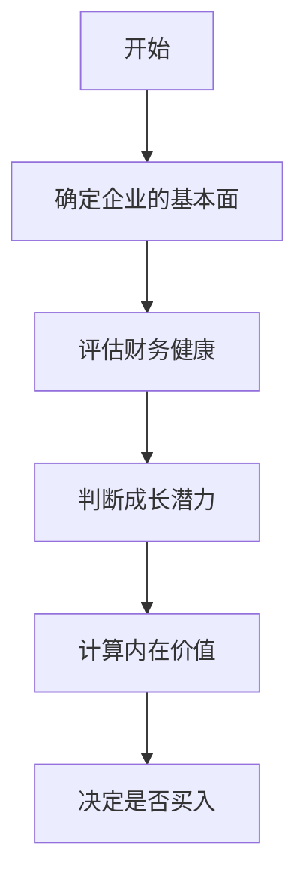
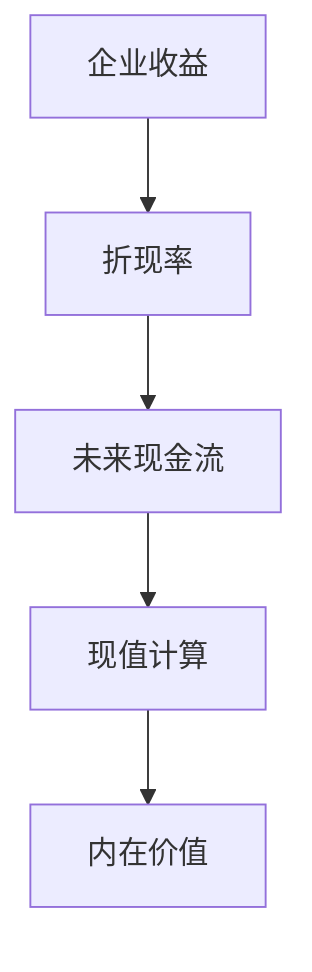
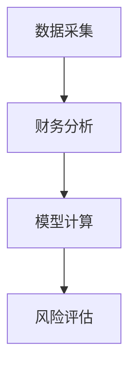

                 


---

# 费雪的十五个投资要点：选股的艺术

> 关键词：费雪投资理论、选股艺术、内在价值、成长股、风险管理

> 摘要：本文深入解析了费雪的十五个投资要点，从投资理念到选股标准，从数学模型到系统架构，结合实例分析，帮助投资者理解并应用费雪的投资理论。

---

## 第一部分：引言

### 第1章：投资的基石：费雪与他的投资理念

#### 1.1 费雪的投资哲学

##### 背景介绍
- 费雪（Philip Fisher）是20世纪的投资大师，提出了“成长股投资”的理念。
- 费雪的投资哲学以基本面分析为核心，强调企业的成长性和管理层的质量。
- 他的理论对现代投资学有深远影响，尤其在技术领域，许多投资者将其应用于量化选股。

##### 核心概念与联系
- 费雪的投资理念可以归纳为：寻找具有持续增长潜力的企业，并以合理的价格买入。
- 下表对比了费雪与其他投资流派的核心区别：

| 投资流派 | 核心观点                     | 费雪观点                     |
|----------|------------------------------|------------------------------|
| 价值投资 | 以低于内在价值的价格买入股票 | 买入具有成长潜力的股票       |
| 成长股投资 | 侧重于企业未来的增长潜力       | 两者结合，注重成长与估值      |

##### 算法原理讲解
- 费雪的内在价值计算公式：
  $$ \text{内在价值} = \frac{\text{收益}}{\text{资本成本}} $$
- 下图展示了费雪投资模型的流程图：



---

## 第二部分：费雪的十五个投资要点

### 第2章：投资的第一步：理解企业的内在价值

#### 2.1 内在价值的定义与计算

##### 背景介绍
- 内在价值是企业未来现金流的现值，是选股的核心依据。
- 费雪认为，内在价值决定了股票的长期表现。

##### 核心概念与联系
- 下图展示了企业内在价值的计算流程：



##### 算法原理讲解
- 费雪的内在价值公式：
  $$ \text{内在价值} = \sum_{t=1}^{n} \frac{\text{CF}_t}{(1 + r)^t} $$
  其中，CF_t是第t年的现金流，r是折现率。

### 第3章：寻找优秀的成长股

#### 3.1 成长股的定义与特征

##### 背景介绍
- 成长股是指那些收入和利润持续增长的企业。
- 费雪认为，成长股是投资的主要目标。

##### 核心概念与联系
- 下表对比了成长股与价值股的特征：

| 特征     | 成长股                   | 价值股                   |
|----------|--------------------------|--------------------------|
| 收益率   | 高增长                   | 稳定                     |
| 估值     | 偏高                     | 低于内在价值             |
| 风险     | 较高                     | 较低                     |

---

## 第三部分：费雪投资要点的系统化应用

### 第6章：投资系统的架构与实现

#### 6.1 投资系统的核心模块

##### 背景介绍
- 投资系统需要整合数据采集、财务分析、模型计算和风险评估四大模块。
- 下图展示了系统的整体架构：



##### 项目实战
- 环境安装：Python 3.8+，Pandas、NumPy、Matplotlib等库。
- 核心代码实现：

```python
import pandas as pd
import numpy as np

def calculate_intrinsic_value(revenue, margin, growth_rate, discount_rate):
    # 计算未来现金流
    cash_flows = [revenue * (1 + growth_rate) ** t for t in range(10)]
    # 计算现值
    present_values = [cf / (1 + discount_rate) ** t for t, cf in enumerate(cash_flows)]
    intrinsic_value = sum(present_values)
    return intrinsic_value

# 示例数据
revenue = 10000000
margin = 0.2
growth_rate = 0.1
discount_rate = 0.05

iv = calculate_intrinsic_value(revenue, margin, growth_rate, discount_rate)
print(f"内在价值：{iv}")
```

---

## 第四部分：总结与展望

### 第7章：项目实战：基于费雪要点的选股系统

#### 7.1 系统小结
- 通过系统化的方法，投资者可以更高效地筛选出具有成长潜力的企业。
- 费雪的投资理论结合现代技术手段，为量化投资提供了新的思路。

#### 最佳实践 Tips
- **持续学习**：市场变化快，需不断更新知识。
- **风险管理**：分散投资，避免过度集中。
- **长期视角**：耐心持有优质资产，避免短期波动干扰。

---

# 作者：AI天才研究院 & 禅与计算机程序设计艺术

---

### 总结
费雪的投资理论不仅是选股的艺术，更是现代投资学的重要基石。通过系统化的分析和实践，投资者可以更好地理解和应用这些理论，实现长期稳健的投资回报。

