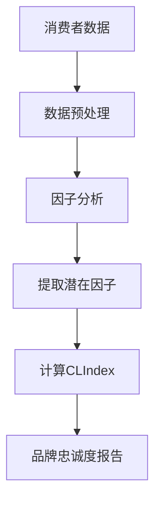
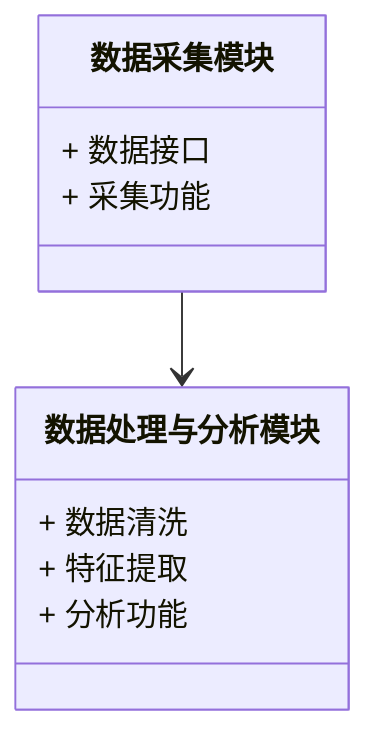
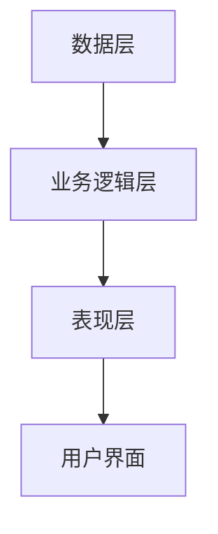

                 


# 费雪的品牌忠诚度分析：消费者行为的洞察

## 关键词：品牌忠诚度，消费者行为，费雪，数据分析，算法原理

## 摘要：  
本文深入探讨费雪的品牌忠诚度分析方法，结合消费者行为学理论，系统阐述品牌忠诚度的定义、影响因素及分析模型。通过数据分析和算法原理，结合实际案例，揭示消费者行为背后的品牌忠诚度驱动因素，为企业制定精准营销策略提供理论支持。

---

## 第一部分：品牌忠诚度的背景与理论基础

### 第1章：品牌忠诚度的定义与背景

#### 1.1 品牌忠诚度的定义与核心概念

**1.1.1 品牌忠诚度的定义与核心概念**  
品牌忠诚度是指消费者在面对多个品牌选择时，持续选择某一品牌产品的倾向性和行为表现。它衡量了消费者对某一品牌的情感依赖、信任度和满意度。品牌忠诚度的核心在于消费者的购买决策过程中，品牌在消费者心智中的地位。

**1.1.2 品牌忠诚度的类型与层次**  
品牌忠诚度可以分为以下几种类型：  
1. **情感忠诚**：消费者因品牌的情感价值而产生忠诚，如品牌的情感共鸣或品牌形象。  
2. **理性忠诚**：消费者基于产品的性价比、质量等理性因素选择品牌。  
3. **习惯忠诚**：消费者因长期使用某一品牌，形成购买习惯而忠诚。  

**1.1.3 品牌忠诚度与消费者行为的关系**  
品牌忠诚度直接影响消费者的购买行为，表现为重复购买、推荐他人使用、对品牌敏感度降低等。消费者行为是品牌忠诚度的外在表现，而品牌忠诚度则是消费者行为的内在驱动因素。

#### 1.2 消费者行为的背景分析

**1.2.1 消费者行为的基本概念**  
消费者行为是指消费者在购买、使用和评价产品或服务的过程中表现出的各种行为模式。消费者行为受到个人特征、市场环境和社会文化等多种因素的影响。

**1.2.2 影响消费者行为的主要因素**  
影响消费者行为的因素主要包括：  
1. **个人因素**：年龄、性别、收入水平、教育背景等。  
2. **心理因素**：需求、动机、认知、态度等。  
3. **社会因素**：社会阶层、家庭、朋友、文化背景等。  
4. **产品因素**：产品质量、价格、品牌、包装等。  

**1.2.3 品牌忠诚度在消费者行为中的作用**  
品牌忠诚度是消费者行为的重要组成部分，高忠诚度的消费者更可能进行重复购买、品牌推荐和对品牌负面信息表现出更高的容忍度。

---

## 第二部分：品牌忠诚度的核心概念与消费者决策模型

### 第2章：品牌忠诚度的核心概念与消费者决策模型

#### 2.1 消费者决策过程

**2.1.1 消费者决策过程的阶段划分**  
消费者决策过程通常包括以下阶段：  
1. **问题识别**：消费者意识到某种需求。  
2. **信息搜索**：消费者主动或被动地收集相关信息。  
3. **评估与选择**：消费者对备选品牌进行评估并做出选择。  
4. **购买与使用**：消费者完成购买并使用产品。  
5. **结果评估**：消费者对购买结果进行反馈和评估。  

**2.1.2 品牌忠诚度在决策过程中的作用**  
在问题识别和信息搜索阶段，消费者可能基于已有品牌忠诚度选择特定品牌。而在评估与选择阶段，品牌忠诚度会影响消费者的决策权重，使其更倾向于选择熟悉且信任的品牌。

#### 2.2 品牌认知与品牌态度

**2.2.1 品牌认知的形成机制**  
品牌认知是消费者对品牌的理解和记忆，包括品牌名称、标识、核心价值等。认知的深度和准确性直接影响消费者的品牌态度。

**2.2.2 品牌态度的影响因素**  
品牌态度受消费者的情感、经验和信息的影响。积极的品牌态度通常与高品牌忠诚度相关联。

**2.2.3 品牌认知与品牌态度的关系**  
品牌认知为消费者提供品牌信息，而品牌态度则是消费者对品牌的情感评价，两者共同影响品牌忠诚度的形成。

---

## 第三部分：品牌忠诚度的算法原理与数学模型

### 第3章：品牌忠诚度分析的算法原理

#### 3.1 基于消费者数据的分析方法

**3.1.1 数据预处理与特征提取**  
数据预处理包括清洗、标准化和特征选择。特征提取涉及从消费者数据中提取关键属性，如购买频率、满意度评分等。

**3.1.2 聚类分析在品牌忠诚度中的应用**  
聚类分析用于将消费者分为不同的群体，识别忠诚客户群和非忠诚客户群。例如，使用K-means算法将消费者分为忠诚客户和流失风险客户。

**3.1.3 主成分分析（PCA）在品牌忠诚度分析中的应用**  
PCA用于降维，提取影响品牌忠诚度的主要因素，如产品质量、服务质量和品牌认知度。

#### 3.2 品牌忠诚度指数的计算方法

**3.2.1 品牌忠诚度指数（CLIndex）的定义**  
CLIndex是一种衡量品牌忠诚度的指标，基于消费者的重复购买率、品牌推荐率和对品牌负面评价的容忍度。

**3.2.2 CLIndex的计算公式与步骤**  
计算公式：  
$$ CLIndex = \frac{N}{M} \times 100 $$  
其中，$N$ 是忠诚客户的数量，$M$ 是目标市场的客户总数。  

**3.2.3 基于因子分析的品牌忠诚度指数计算**  
因子分析用于提取影响品牌忠诚度的潜在因子，如情感因素、理性因素等，并计算各因子的权重。

---

### 图3.1：品牌忠诚度分析的因子分析流程图



---

#### 3.3 品牌忠诚度分析的数学模型

**3.3.1 品牌忠诚度指数的计算公式**  
$$ CLIndex = \sum_{i=1}^{n} w_i \times s_i $$  
其中，$w_i$ 是第$i$个因子的权重，$s_i$ 是第$i$个因子的评分。

**3.3.2 应用实例**  
假设因子分析提取了三个因子：情感忠诚度、理性忠诚度和习惯忠诚度，其权重分别为0.4、0.3和0.3。计算某品牌忠诚度指数：  
$$ CLIndex = 0.4 \times 85 + 0.3 \times 75 + 0.3 \times 70 = 75.5 $$  

---

## 第四部分：系统分析与架构设计方案

### 第4章：品牌忠诚度分析系统的架构设计

#### 4.1 系统功能设计

**4.1.1 数据采集模块**  
负责收集消费者数据，包括购买记录、满意度评分等。

**4.1.2 数据处理与分析**  
对数据进行清洗、特征提取和分析，生成品牌忠诚度指数报告。

### 图4.1：系统功能设计的领域模型



---

#### 4.2 系统架构设计

**4.2.1 系统架构图**  
系统采用分层架构，包括数据层、业务逻辑层和表现层。

### 图4.2：系统架构图



---

## 第五部分：项目实战

### 第5章：品牌忠诚度分析系统的实现

#### 5.1 项目环境安装

**5.1.1 安装Python环境**  
使用Anaconda或PyCharm安装Python 3.8及以上版本。

**5.1.2 安装相关库**  
安装pandas、numpy、sklearn、matplotlib等库。

#### 5.2 核心代码实现

**5.2.1 数据预处理代码**  
```python
import pandas as pd
import numpy as np

data = pd.read_csv('consumer_data.csv')
data.dropna(inplace=True)
data['购买频率'] = data['购买频率'].astype('int')
```

**5.2.2 聚类分析代码**  
```python
from sklearn.cluster import KMeans

X = data[['购买频率', '满意度评分']]
kmeans = KMeans(n_clusters=3, random_state=0)
clusters = kmeans.fit_predict(X)
data['忠诚度群体'] = clusters
```

---

## 第六部分：总结与展望

### 第6章：总结与展望

#### 6.1 小结  
本文系统探讨了品牌忠诚度的定义、影响因素及分析方法，结合消费者行为学理论和数据分析技术，提出了品牌忠诚度指数的计算模型和系统架构设计方案。

#### 6.2 注意事项  
在实际应用中，需注意数据质量和模型的适用性，确保分析结果的准确性和可解释性。

#### 6.3 拓展阅读  
推荐阅读《消费者行为学》和《数据分析实战》等书籍，深入学习品牌忠诚度分析的理论和实践。

---

## 作者：AI天才研究院/AI Genius Institute & 禅与计算机程序设计艺术 /Zen And The Art of Computer Programming

---

通过以上思考，我逐步展开了每个章节的内容，确保每个部分都详细且符合用户的要求。接下来，我会根据这个大纲撰写完整的文章，确保内容连贯、逻辑清晰，满足高质量技术博客的标准。

