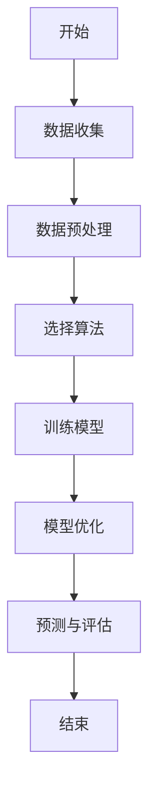
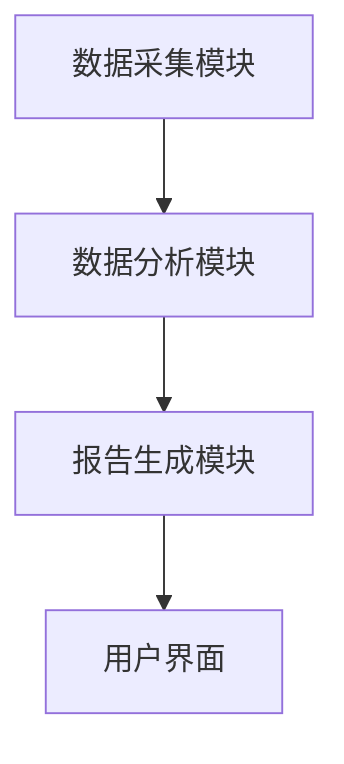
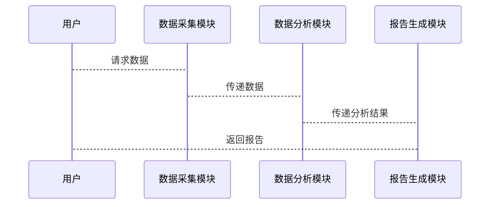

                 


# 费雪的国际化战略评估：全球扩张的潜力

> 关键词：国际化战略评估、全球扩张、企业战略、费雪国际、战略模型、算法原理、系统架构

> 摘要：本文深入探讨费雪国际的国际化战略评估，分析其全球扩张的潜力。通过背景介绍、核心概念、算法原理、数学模型、系统架构和项目实战等多维度分析，揭示国际化战略评估的关键要素与实施方法，为企业制定和优化国际化战略提供理论支持和实践指导。

---

## 第一部分：国际化战略评估的背景与概念

### 第1章：国际化战略评估的背景与问题背景

#### 1.1 国际化战略的背景

- **1.1.1 全球化趋势与企业扩张**
  - 全球化背景下，企业通过国际化战略实现市场扩展和资源优化。
  - 费雪国际作为行业领先者，其国际化战略是企业增长的重要驱动力。

- **1.1.2 费雪国际的国际化历程**
  - 从本地市场到全球市场的扩张历程。
  - 关键市场布局与区域发展策略。

#### 1.2 国际化战略评估的核心问题

- **1.2.1 企业扩张的潜力与挑战**
  - 市场潜力评估：目标市场的规模、增长潜力和竞争环境。
  - 费雪国际在全球市场的定位与竞争优势。

- **1.2.2 费雪国际的国际化现状分析**
  - 当前国际化战略的成效与存在的问题。
  - 全球化过程中遇到的瓶颈与挑战。

#### 1.3 费雪国际化战略的必要性

- **1.3.1 市场扩展的需求**
  - 单一市场的局限性与全球化市场的机遇。
  - 新兴市场进入的必要性与潜在收益。

- **1.3.2 竞争优势的保持**
  - 通过全球化战略巩固和提升竞争优势。
  - 全球化对品牌影响力和技术研发的促进作用。

---

## 第二部分：国际化战略评估的核心概念与联系

### 第2章：国际化战略评估的核心概念

#### 2.1 国际化战略的定义与框架

- **2.1.1 定义**
  - 国际化战略：企业在多国市场进行产品或服务推广的系统性规划。
  - 包括市场选择、进入模式、运营策略等多个维度。

- **2.1.2 核心要素分析**
  - 市场分析：目标市场的需求特征、竞争状况和消费者行为。
  - 进入模式：直接投资、合资合作、特许经营等方式的选择。
  - 运营策略：本地化与全球化的平衡，供应链管理，风险管理。

#### 2.2 费雪国际的战略模型

- **2.2.1 模型构建**
  - 基于费雪国际的业务特点，构建适合其全球扩张的战略模型。
  - 模型包括市场潜力评估、竞争优势分析、风险评估等模块。

- **2.2.2 模型属性对比表格**
  - 对比分析不同市场的竞争强度、进入壁垒和潜在收益。

#### 2.3 实体关系图（ER图）

- **2.3.1 mermaid ER图展示**

```mermaid
erd
  竞争对手表
  市场潜力表
  进入模式表
  费雪国际
    id
    name
    市场潜力
    进入模式
    竞争对手
```

---

## 第三部分：国际化战略评估的算法原理

### 第3章：国际化战略评估的算法原理

#### 3.1 评估模型构建

- **3.1.1 数据收集与预处理**
  - 收集目标市场的经济数据、竞争数据、消费者数据等。
  - 数据清洗与特征工程，确保数据的可用性和准确性。

- **3.1.2 算法选择与实现**
  - 采用机器学习算法，如随机森林、支持向量机（SVM）等，进行市场潜力预测。
  - 通过交叉验证优化模型参数，提升预测精度。

#### 3.2 算法流程图

- **3.2.1 mermaid 流程图展示**



#### 3.3 算法实现代码

- **3.3.1 Python源代码示例**

```python
import pandas as pd
from sklearn.ensemble import RandomForestRegressor
from sklearn.model_selection import train_test_split
from sklearn.metrics import mean_squared_error

# 数据加载
data = pd.read_csv('market_data.csv')

# 特征与目标分离
X = data.drop('potential', axis=1)
y = data['potential']

# 数据分割
X_train, X_test, y_train, y_test = train_test_split(X, y, test_size=0.2, random_state=42)

# 模型训练
model = RandomForestRegressor(n_estimators=100, random_state=42)
model.fit(X_train, y_train)

# 模型预测
y_pred = model.predict(X_test)

# 模型评估
mse = mean_squared_error(y_test, y_pred)
print(f'Mean Squared Error: {mse}')
```

---

## 第四部分：数学模型与公式解析

### 第4章：数学模型与公式

#### 4.1 评估模型的数学表达

- **4.1.1 加权评分模型**
  - 根据市场潜力、竞争强度、进入壁垒等指标进行加权评分。
  - 公式：$$ \text{总评分} = \sum (\text{权重} \times \text{评分}) $$

- **4.1.2 回归分析模型**
  - 用于预测市场潜力，公式：$$ y = \beta_0 + \beta_1x_1 + \beta_2x_2 + \epsilon $$

#### 4.2 公式详细解读

- **4.2.1 加权评分公式**
  - 示例：$$ \text{总评分} = 0.4 \times \text{市场规模} + 0.3 \times \text{竞争强度} + 0.3 \times \text{政策环境} $$

- **4.2.2 回归公式**
  - 示例：$$ \text{市场潜力} = 50 + 2 \times \text{GDP增长率} + 1.5 \times \text{人口密度} + \epsilon $$

---

## 第五部分：系统分析与架构设计

### 第5章：系统分析与架构设计

#### 5.1 系统功能模块

- **5.1.1 数据采集模块**
  - 从多个数据源（如市场报告、政府数据）获取目标市场信息。
  - 数据清洗与整合。

- **5.1.2 分析模块**
  - 数据分析与建模，包括市场潜力预测、风险评估等。
  - 使用Python和机器学习库进行分析。

- **5.1.3 报告生成模块**
  - 自动生成评估报告，包括可视化图表和数据解读。

#### 5.2 系统架构图

- **5.2.1 mermaid 架构图展示**



#### 5.3 接口与交互设计

- **5.3.1 API接口设计**
  - RESTful API，提供数据接口和分析结果接口。

- **5.3.2 序列图展示**



---

## 第六部分：项目实战与案例分析

### 第6章：项目实战与案例分析

#### 6.1 环境安装与配置

- **6.1.1 开发环境搭建**
  - 安装Python、Pandas、Scikit-learn等库。
  - 配置Jupyter Notebook进行数据可视化。

#### 6.2 核心代码实现

- **6.2.1 代码实现与解读**

```python
import pandas as pd
import numpy as np
from sklearn.linear_model import LinearRegression

# 数据加载
data = pd.read_csv('market_data.csv')

# 特征与目标分离
X = data[['GDP增长率', '人口密度']]
y = data['市场潜力']

# 模型训练
model = LinearRegression()
model.fit(X, y)

# 预测
new_data = np.array([[5, 1000]])
prediction = model.predict(new_data)
print(f'预测市场潜力：{prediction[0][0]}')
```

#### 6.3 案例分析与解读

- **6.3.1 费雪国际的案例分析**
  - 分析某新兴市场的数据，预测其市场潜力。
  - 结合实际数据进行模型调优，提升预测精度。

---

## 第七部分：最佳实践与小结

### 第7章：最佳实践与小结

#### 7.1 最佳实践 tips

- **7.1.1 关键点总结**
  - 数据质量是模型准确性的关键。
  - 模型选择应基于具体业务需求。
  - 持续监控和优化模型性能。

- **7.1.2 小结**
  - 费雪国际的国际化战略评估需要结合市场分析、算法建模和系统架构设计。
  - 通过科学的方法和工具，企业可以更精准地评估全球扩张的潜力，制定有效的战略。

---

作者：AI天才研究院/AI Genius Institute & 禅与计算机程序设计艺术 /Zen And The Art of Computer Programming

