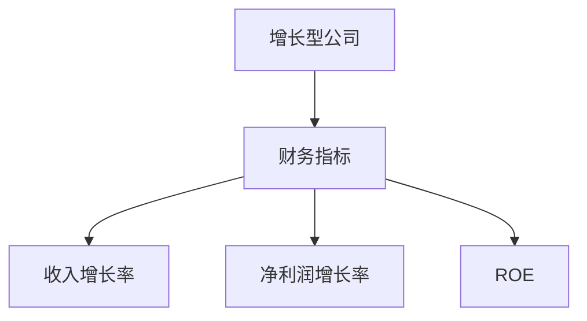
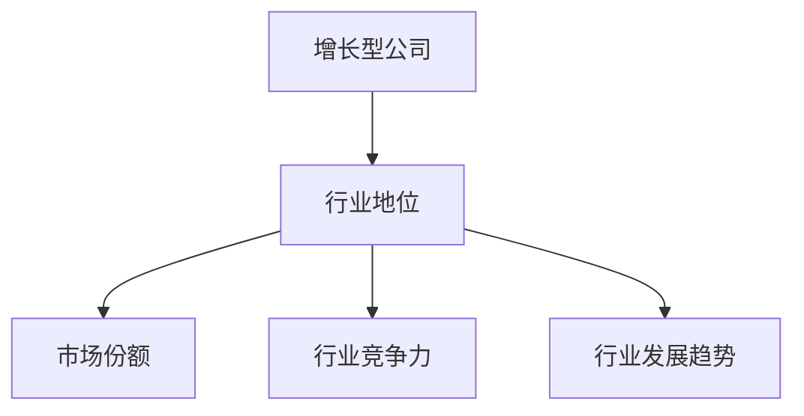
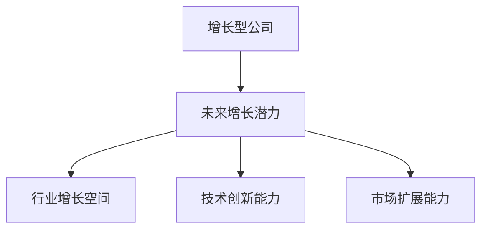

                 


# 费雪的增长型公司特征分析

---

## 关键词  
增长型公司, 投资分析, 财务指标, 行业地位, 管理团队

---

## 摘要  
本文深入分析了费雪提出的增长型公司的特征，从财务表现、行业地位、管理团队等多个维度展开探讨。通过构建数学模型和系统架构，结合实际案例，揭示了增长型公司的核心特征及其投资价值。文章内容丰富，逻辑清晰，旨在为投资者提供科学的分析方法和决策依据。

---

# 第一部分：增长型公司的背景与概念

## 第1章：增长型公司的定义与背景

### 1.1 增长型公司的定义  
增长型公司是指那些收入和利润能够持续以较高速度增长的企业。这类公司通常处于高增长行业，具有较强的市场竞争力和创新能力，能够通过持续的扩张实现股东价值的最大化。  

#### 增长型公司的核心概念  
- **高收入增长率**：收入年均增长率超过行业平均水平。  
- **高利润率**：净利润率持续高于同行业平均水平。  
- **高ROE（净资产收益率）**：ROE指标反映公司盈利能力，通常高于行业平均水平。  

### 1.2 增长型公司的投资背景  
- **投资背景**：  
  增长型公司因其持续增长的潜力，成为投资者青睐的对象。尤其是在科技、消费、医疗等高增长行业，增长型公司往往能够带来超额收益。  
- **理论基础**：  
  费雪的增长型投资理论强调，投资的增长型公司能够通过持续的收入和利润增长，为股东创造长期价值。  

### 1.3 增长型公司与传统公司的区别  
| 特征维度 | 增长型公司 | 传统公司 |  
|----------|------------|----------|  
| 收入增长率 | 高 | 低或持平 |  
| 利润率 | 高 | 中低 |  
| ROE | 高 | 中低 |  
| 行业地位 | 领先地位 | 一般或弱势 |  

---

## 第2章：增长型公司的特征与核心要素

### 2.1 增长型公司的核心特征  
- **收入增长率**：收入增长率是衡量增长型公司的重要指标，通常要求年均收入增长率超过15%。  
- **利润率**：高利润率反映了公司的盈利能力和成本控制能力。  
- **ROE（净资产收益率）**：ROE指标反映了公司利用股东权益创造利润的能力，通常要求ROE高于15%。  

### 2.2 增长型公司的属性对比  
- **与周期性公司对比**：  
  增长型公司不受经济周期影响，而周期性公司在经济波动中表现不稳定。  
- **与防御型公司对比**：  
  增长型公司具有更强的增长潜力，而防御型公司更注重稳定收益。  

---

# 第二部分：增长型公司的特征分析

## 第3章：增长型公司的财务特征分析

### 3.1 财务指标分析  
- **收入增长率**：  
  收入增长率 = （本年收入 - 上年收入）/ 上年收入 × 100%  
  例如，某公司收入从100万增长到115万，收入增长率为15%。  

- **净利润增长率**：  
  净利润增长率 = （本年净利润 - 上年净利润）/ 上年净利润 × 100%  
  例如，某公司净利润从50万增长到60万，净利润增长率为20%。  

- **ROE（净资产收益率）**：  
  ROE = 净利润 / 平均净资产 × 100%  
  例如，某公司净利润为60万，平均净资产为400万，ROE为15%。  

### 3.2 财务特征对比表  
| 特征维度 | 增长型公司 | 价值型公司 |  
|----------|------------|------------|  
| 收入增长率 | >15% | <10% |  
| 净利润率 | >20% | <15% |  
| ROE | >15% | <10% |  

### 3.3 财务特征的ER实体关系图  


---

## 第4章：增长型公司的行业地位分析

### 4.1 行业地位的定义与分类  
- **行业地位**：指公司在所在行业的市场份额、竞争能力和影响力。  
- **分类标准**：  
  - 市场领导者：市场份额第一。  
  - 市场挑战者：市场份额第二。  
  - 市场跟随者：市场份额第三。  

### 4.2 行业地位的分析方法  
- **市场份额分析**：通过行业报告和公司财报获取市场份额数据。  
- **行业竞争结构分析**：使用五力模型（波特五力分析）评估行业竞争状况。  
- **行业发展趋势分析**：关注行业增长潜力和技术发展趋势。  

### 4.3 行业地位的ER实体关系图  


---

## 第5章：增长型公司的管理团队分析

### 5.1 管理团队的核心要素  
- **管理能力**：团队是否具备战略规划和执行能力。  
- **团队稳定性**：管理团队是否稳定，是否有频繁的人员变动。  
- **激励机制**：公司是否建立了有效的激励机制，以激发团队积极性。  

### 5.2 管理团队的评估方法  
- **团队背景分析**：查看公司高管的教育背景和从业经历。  
- **团队稳定性分析**：关注公司高管在过去几年的变动情况。  
- **激励机制分析**：查看公司股权激励计划等信息。  

---

## 第6章：增长型公司的未来增长潜力分析

### 6.1 未来增长潜力的定义  
未来增长潜力是指公司在未来一段时间内的收入和利润增长的可能性。  

### 6.2 增长潜力的评估方法  
- **行业增长空间**：行业是否具有高增长潜力。  
- **技术创新能力**：公司是否具备持续的技术创新能力。  
- **市场扩展能力**：公司是否能够在现有市场之外开拓新市场。  

### 6.3 未来增长潜力的ER实体关系图  


---

## 第7章：增长型公司的数学模型与算法

### 7.1 增长型公司评估模型  
- **模型目标**：通过财务指标和行业地位等多维度评估公司是否符合增长型公司的特征。  
- **模型公式**：  
  增长型公司评分 = 0.4 × 财务指标评分 + 0.3 × 行业地位评分 + 0.3 × 管理团队评分  

### 7.2 增长型公司评估算法  
```python
def growth_company_score(finance_score, industry_score, management_score):
    return 0.4 * finance_score + 0.3 * industry_score + 0.3 * management_score

# 示例计算
finance_score = 85
industry_score = 70
management_score = 80
total_score = growth_company_score(finance_score, industry_score, management_score)
print(f"增长型公司评分为：{total_score}")
```

---

## 第8章：增长型公司系统架构设计

### 8.1 系统功能设计  
- **数据收集模块**：收集公司的财务数据、行业数据和管理团队信息。  
- **特征分析模块**：分析公司的财务指标、行业地位和管理团队。  
- **模型评估模块**：使用数学模型评估公司是否符合增长型公司的特征。  

### 8.2 系统架构设计  


---

## 第9章：增长型公司项目实战

### 9.1 环境配置  
- **工具选择**：使用Python和Pandas进行数据处理，使用Matplotlib进行数据可视化。  

### 9.2 核心实现代码  
```python
import pandas as pd
import matplotlib.pyplot as plt

# 示例数据
data = {
    "公司名称": ["公司A", "公司B", "公司C"],
    "收入增长率": [20, 15, 10],
    "净利润增长率": [18, 12, 5],
    "ROE": [20, 15, 10]
}
df = pd.DataFrame(data)

# 可视化
df.plot(kind="bar", figsize=(10, 6))
plt.title("增长型公司特征对比")
plt.xlabel("公司名称")
plt.ylabel("增长率")
plt.show()
```

---

## 第10章：总结与展望

### 10.1 本章总结  
通过本文的分析，我们全面探讨了增长型公司的特征，包括财务表现、行业地位、管理团队和未来增长潜力。通过构建数学模型和系统架构，我们为投资者提供了一个科学的分析框架。  

### 10.2 未来展望  
未来，随着人工智能和大数据技术的发展，增长型公司的分析将更加智能化和精准化。投资者可以通过大数据分析和机器学习模型，进一步优化增长型公司的识别和评估过程。  

---

## 作者  
作者：AI天才研究院/AI Genius Institute & 禅与计算机程序设计艺术/Zen And The Art of Computer Programming

