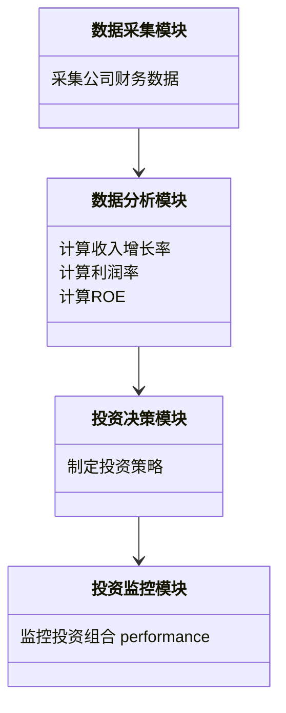

                 

# 费雪的增长型公司特征分析

> 关键词：增长型公司，菲利普·费雪，投资策略，财务指标，股东权益回报率（ROE）

> 摘要：本文系统地分析了菲利普·费雪所提出的增长型公司的特征，从理论背景、核心概念、数学模型到实际应用进行了全面探讨。通过详细分析增长型公司的核心特征，包括收入增长率、利润率、股东权益回报率（ROE）等，结合实际案例和数学模型，为投资者提供了科学的分析方法和决策支持。

---

# 第1章: 费雪投资理念与增长型公司概述

## 1.1 费雪投资理论的背景与核心思想

### 1.1.1 费雪的生平与投资理念形成
菲利普·费雪（Philip Fisher）是20世纪著名的投资专家，被誉为“成长股投资之父”。他于1906年进入哈佛大学，主修化学，后转向法律和投资领域。费雪的投资理念主要形成于20世纪30年代至50年代，他提出的“成长股”概念对现代投资理论产生了深远影响。

### 1.1.2 费雪对投资学的贡献
费雪的主要贡献包括：
1. 提出“成长股”概念，强调投资于具有持续增长潜力的公司。
2. 强调对公司基本面的深入分析，尤其是收入增长率和利润率。
3. 提出“投资金字塔”理论，认为投资回报与公司的成长潜力密切相关。

### 1.1.3 增长型投资的核心理念
增长型投资的核心理念是通过投资于那些收入和利润能够持续增长的公司，以实现资本的长期增值。与价值型投资不同，增长型投资更注重公司的未来潜力，而非当前的估值。

## 1.2 增长型公司的定义与特征

### 1.2.1 增长型公司的定义
增长型公司是指那些收入和利润能够持续以较高速度增长的公司。这类公司通常处于高增长行业，具有较强的市场竞争力和创新能力强。

### 1.2.2 增长型公司的核心特征
1. **收入增长率高**：收入增长率是衡量公司增长潜力的核心指标，通常要求年收入增长率超过行业平均水平。
2. **利润率高且稳定**：利润率是衡量公司盈利能力的重要指标，增长型公司通常具有较高的净利率和稳定的盈利能力。
3. **股东权益回报率（ROE）高**：ROE是衡量公司使用股东资金效率的重要指标，增长型公司通常具有较高的ROE。

### 1.2.3 增长型公司与价值型公司的对比
| 特征                | 增长型公司                | 价值型公司                |
|---------------------|--------------------------|--------------------------|
| 投资逻辑            | 未来增长潜力              | 当前低估的估值              |
| 关注指标            | 收入增长率、ROE            | 市盈率、市净率              |
| 适合行业            | 高科技、新兴行业          | 传统行业、周期性行业        |
| 风险程度            | 较高                     | 较低                     |

## 1.3 费雪选股标准与投资策略

### 1.3.1 费雪的选股标准
1. **收入增长率**：费雪认为，收入增长率是衡量公司增长潜力的核心指标，通常要求年收入增长率超过行业平均水平。
2. **利润率**：费雪强调，公司应具有较高的净利率和稳定的盈利能力。
3. **ROE**：费雪认为，ROE是衡量公司使用股东资金效率的重要指标，通常要求ROE超过行业平均水平。

### 1.3.2 费雪的投资策略
1. **长期持有**：费雪主张长期持有优质股票，避免频繁交易。
2. **分散投资**：费雪建议投资者分散投资于多个增长型公司，以降低风险。
3. **持续关注**：费雪强调，投资者需要持续关注公司的财务状况和市场变化，及时调整投资组合。

### 1.3.3 费雪投资策略的实际应用
通过分析费雪的经典投资案例，我们可以更好地理解其投资策略的实际应用。例如，费雪在20世纪50年代投资于德州仪器（Texas Instruments），该公司当时是一家高速增长的半导体公司，符合费雪的选股标准。

## 1.4 本章小结
本章从费雪的投资理念入手，详细介绍了增长型公司的定义、核心特征以及费雪的选股标准和投资策略。通过对增长型公司与价值型公司的对比，我们可以更好地理解增长型投资的核心逻辑。

---

# 第2章: 增长型公司的核心特征分析

## 2.1 收入增长率

### 2.1.1 收入增长率的定义
收入增长率是指公司在一定时间内收入的增长速度，通常以年增长率表示。计算公式为：
$$ 收入增长率 = \frac{\text{当年收入} - \text{上一年收入}}{\text{上一年收入}} \times 100\% $$

### 2.1.2 收入增长率的计算公式
通过上述公式，我们可以计算出公司的收入增长率。例如，某公司上一年收入为100万元，当年收入为120万元，则收入增长率为20%。

### 2.1.3 收入增长率与公司发展的关系
收入增长率是衡量公司增长潜力的核心指标。通常情况下，收入增长率越高，公司的增长潜力越大。然而，收入增长率的行业差异较大，投资者需要结合行业特点进行分析。

## 2.2 利润率

### 2.2.1 利润率的定义
利润率是指公司在一定时间内实现的利润与收入的比率。常用的利润率指标包括净利润率、毛利率和营业利润率。

### 2.2.2 利润率的计算公式
1. 净利润率：
$$ 净利润率 = \frac{\text{净利润}}{\text{营业收入}} \times 100\% $$
2. 毛利率：
$$ 毛利率 = \frac{\text{毛利润}}{\text{营业收入}} \times 100\% $$
3. 营业利润率：
$$ 营业利润率 = \frac{\text{营业利润}}{\text{营业收入}} \times 100\% $$

### 2.2.3 利润率与公司盈利能力的关系
利润率是衡量公司盈利能力的重要指标。通常情况下，利润率越高，公司的盈利能力越强。然而，利润率的行业差异较大，投资者需要结合行业特点进行分析。

## 2.3 股东权益回报率（ROE）

### 2.3.1 ROE的定义
股东权益回报率（ROE）是指公司净利润与股东权益的比率，通常以百分比表示。

### 2.3.2 ROE的计算公式
$$ ROE = \frac{\text{净利润}}{\text{股东权益}} \times 100\% $$

### 2.3.3 ROE与公司投资价值的关系
ROE是衡量公司使用股东资金效率的重要指标。通常情况下，ROE越高，公司的投资价值越大。然而，ROE的行业差异较大，投资者需要结合行业特点进行分析。

## 2.4 公司竞争优势分析

### 2.4.1 核心竞争力的定义
核心竞争力是指公司相对于竞争对手的独特优势，通常体现在技术、品牌、市场占有率等方面。

### 2.4.2 核心竞争力的评估方法
1. 技术创新能力
2. 品牌影响力
3. 市场占有率
4. 成本优势
5. 管理团队

### 2.4.3 核心竞争力与增长型公司的关系
核心竞争力是增长型公司持续增长的核心驱动力。具有强大核心竞争力的公司通常能够保持较高的收入增长率和利润率。

## 2.5 本章小结
本章详细分析了增长型公司的核心特征，包括收入增长率、利润率和ROE。通过对这些指标的分析，我们可以更好地识别具有增长潜力的公司。

---

# 第3章: 增长型公司的财务指标分析

## 3.1 财务指标概述

### 3.1.1 常用财务指标分类
常用的财务指标包括收入增长率、利润率、ROE、每股收益（EPS）、市盈率（P/E）等。

### 3.1.2 财务指标的重要性
财务指标是衡量公司财务状况和投资价值的重要工具。通过分析财务指标，投资者可以更好地理解公司的经营状况和未来潜力。

### 3.1.3 财务指标与公司价值的关系
财务指标与公司价值密切相关。例如，收入增长率和ROE是衡量公司增长潜力的重要指标，而市盈率和市净率是衡量公司估值的重要指标。

## 3.2 收入增长率的分析

### 3.2.1 收入增长率的计算与评估
通过计算收入增长率，我们可以评估公司的增长潜力。例如，某公司上一年收入为100万元，当年收入为120万元，则收入增长率为20%。

### 3.2.2 收入增长率与公司扩张能力的关系
收入增长率越高，公司的扩张能力越强。然而，收入增长率的行业差异较大，投资者需要结合行业特点进行分析。

### 3.2.3 收入增长率的行业差异
不同行业的收入增长率差异较大。例如，高科技行业通常具有较高的收入增长率，而传统行业通常具有较低的收入增长率。

## 3.3 利润率的分析

### 3.3.1 利润率的计算与评估
通过计算利润率，我们可以评估公司的盈利能力。例如，某公司营业收入为100万元，净利润为20万元，则净利润率为20%。

### 3.3.2 利润率与公司盈利能力的关系
利润率越高，公司的盈利能力越强。然而，利润率的行业差异较大，投资者需要结合行业特点进行分析。

### 3.3.3 利润率的行业差异
不同行业的利润率差异较大。例如，高科技行业的利润率通常较高，而传统行业的利润率通常较低。

## 3.4 股东权益回报率（ROE）的分析

### 3.4.1 ROE的计算与评估
通过计算ROE，我们可以评估公司使用股东资金的效率。例如，某公司净利润为20万元，股东权益为100万元，则ROE为20%。

### 3.4.2 ROE与公司投资价值的关系
ROE越高，公司的投资价值越大。然而，ROE的行业差异较大，投资者需要结合行业特点进行分析。

### 3.4.3 ROE的行业差异
不同行业的ROE差异较大。例如，高科技行业的ROE通常较高，而传统行业的ROE通常较低。

## 3.5 本章小结
本章详细分析了增长型公司的财务指标，包括收入增长率、利润率和ROE。通过对这些指标的分析，我们可以更好地识别具有增长潜力的公司。

---

# 第4章: 费雪选股模型的数学分析

## 4.1 费雪选股模型的数学基础

### 4.1.1 增长型公司的数学模型
通过建立数学模型，我们可以更好地理解增长型公司的特征。例如，我们可以用收入增长率和ROE作为变量，建立一个多元回归模型来预测公司的投资价值。

### 4.1.2 费雪选股标准的数学表达
费雪选股标准可以用以下数学表达式表示：
$$ \text{投资价值} = \beta_1 \times \text{收入增长率} + \beta_2 \times \text{ROE} + \epsilon $$

### 4.1.3 费雪投资策略的数学分析
通过数学分析，我们可以更好地理解费雪的投资策略。例如，我们可以用时间序列分析来预测公司的未来收入增长率和ROE。

## 4.2 增长型公司的数学模型

### 4.2.1 收入增长率的数学模型
通过建立收入增长率的数学模型，我们可以更好地预测公司的未来收入。例如，我们可以用线性回归模型来预测公司的收入增长率。

### 4.2.2 利润率的数学模型
通过建立利润率的数学模型，我们可以更好地预测公司的未来盈利能力。例如，我们可以用Logistic回归模型来预测公司的利润率。

### 4.2.3 ROE的数学模型
通过建立ROE的数学模型，我们可以更好地预测公司的投资价值。例如，我们可以用多元回归模型来预测公司的ROE。

## 4.3 费雪选股标准的数学表达

### 4.3.1 收入增长率的数学公式
$$ \text{收入增长率} = \frac{\text{当年收入} - \text{上一年收入}}{\text{上一年收入}} \times 100\% $$

### 4.3.2 利润率的数学公式
$$ \text{净利润率} = \frac{\text{净利润}}{\text{营业收入}} \times 100\% $$

### 4.3.3 ROE的数学公式
$$ \text{ROE} = \frac{\text{净利润}}{\text{股东权益}} \times 100\% $$

## 4.4 费雪投资策略的数学分析

### 4.4.1 投资组合的数学优化
通过数学优化，我们可以更好地构建投资组合。例如，我们可以用均值-方差模型来优化投资组合的风险和收益。

### 4.4.2 风险与收益的数学平衡
通过数学分析，我们可以更好地理解风险与收益的平衡。例如，我们可以用CAPM模型来评估公司的期望收益和风险。

### 4.4.3 数学模型在投资决策中的应用
通过应用数学模型，我们可以更好地进行投资决策。例如，我们可以用蒙特卡洛模拟来评估投资组合的未来表现。

## 4.5 本章小结
本章详细分析了费雪选股模型的数学基础，包括收入增长率、利润率和ROE的数学表达和模型。通过对这些模型的分析，我们可以更好地理解增长型公司的投资价值。

---

# 第5章: 增长型公司投资策略的系统分析

## 5.1 投资策略的系统架构

### 5.1.1 系统架构的定义
系统架构是指系统各组成部分的结构和功能。在增长型公司投资策略中，系统架构包括数据采集、分析、决策和监控四个模块。

### 5.1.2 系统架构的功能模块
1. 数据采集模块：负责采集公司的财务数据。
2. 数据分析模块：负责分析公司的财务指标。
3. 投资决策模块：负责制定投资策略。
4. 投资监控模块：负责监控投资组合的 performance.

### 5.1.3 系统架构的mermaid类图

## 5.2 项目介绍

### 5.2.1 项目背景
本项目旨在通过系统分析，帮助投资者识别和投资增长型公司。

### 5.2.2 项目目标
本项目的

