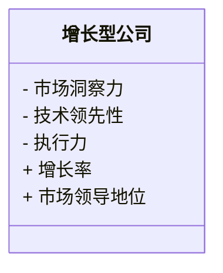
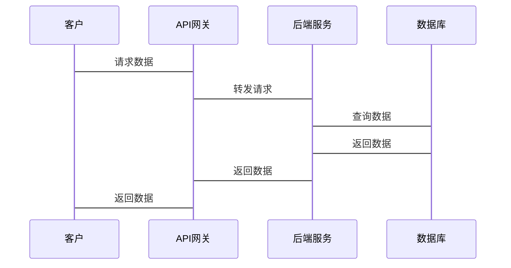

                 


# 费雪的增长型公司特征：适应数字化转型时代

## 关键词：费雪增长型公司、数字化转型、企业增长、系统架构、算法原理

## 摘要：费雪增长型公司是一种以持续创新和市场领导地位为核心特征的企业类型。在数字化转型时代，这类公司通过适应新技术和市场变化，展现出独特的优势。本文将从费雪增长型公司的定义、特征、数字化转型的影响、系统架构设计、算法原理等多个方面进行详细分析，并结合实际案例，探讨其在数字化转型中的应用和发展。

---

## 第一部分: 费雪增长型公司特征概述

### 第1章: 费雪增长型公司的定义与核心概念

#### 1.1 费雪增长型公司的定义与核心概念

##### 1.1.1 费雪增长型公司的定义

费雪增长型公司是指那些能够在市场中持续创新，并通过技术和商业模式的优化实现快速增长的企业。这类公司通常具有强大的市场洞察力、技术领先性和高效的执行力。

##### 1.1.2 增长型公司的核心要素

- 市场洞察力：能够准确识别市场机会和趋势。
- 技术领先性：在核心技术领域具有领先地位。
- 执行力：能够高效地将战略转化为实际成果。

##### 1.1.3 费雪增长型公司的边界与外延

费雪增长型公司的外延包括那些能够通过数字化转型实现增长的企业，而其边界则在于是否具备持续创新的能力和市场领导地位。

#### 1.2 费雪增长型公司的特征分析

##### 1.2.1 增长型公司的关键特征

- 持续创新：通过技术研发和产品迭代保持竞争优势。
- 市场领导地位：在目标市场中占据领先地位。
- 高增长性：年增长率显著高于行业平均水平。

##### 1.2.2 费雪增长型公司的独特性

费雪增长型公司的独特性体现在其对技术创新的依赖和对市场的深刻理解。这类公司通常具有较强的抗风险能力和快速响应市场变化的能力。

##### 1.2.3 费雪增长型公司与传统公司的对比

| 特征          | 费雪增长型公司                | 传统公司                  |
|---------------|------------------------------|---------------------------|
| 创新能力      | 强                            | 弱                        |
| 市场领导地位    | 高                            | 一般                      |
| 增长速度      | 快                            | 慢                        |

---

### 第2章: 费雪增长型公司的数字化转型分析

#### 2.1 数字化转型对企业增长的影响

数字化转型通过技术手段优化企业的运营效率、降低成本，并提升客户体验，从而为企业带来新的增长机会。

#### 2.2 费雪增长型公司的特征与数字化转型的关系

费雪增长型公司的特征（如持续创新、市场领导地位）使其在数字化转型中更具优势。这类公司能够更快地适应技术变化，并利用数字化工具实现业务增长。

---

## 第二部分: 费雪增长型公司的数学模型与算法原理

### 第3章: 费雪增长型公司的数学模型

#### 3.1 费雪增长型公司的增长模型

##### 3.1.1 增长模型的定义与公式

增长模型的公式为：
$$
G = \frac{C}{T}
$$
其中，\( G \) 表示增长速度，\( C \) 表示收入增长额，\( T \) 表示时间。

##### 3.1.2 增长模型的数学推导

通过对企业历史数据的分析，我们可以推导出增长模型的公式，并验证其合理性。

##### 3.1.3 增长模型的实例分析

以某科技公司为例，假设其收入在2年内增长了100%，则其增长速率为：
$$
G = \frac{100}{2} = 50\%
$$

---

## 第三部分: 费雪增长型公司的数字化转型与系统架构

### 第4章: 费雪增长型公司的系统架构设计

#### 4.1 系统功能设计

##### 4.1.1 领域模型设计

以下是领域模型的类图：



##### 4.1.2 系统架构设计

以下是系统架构的架构图：


#### 4.2 系统接口设计

系统接口设计包括API接口的定义和调用流程。

#### 4.3 系统交互设计

以下是系统交互的序列图：



---

## 第四部分: 项目实战

### 第5章: 项目实战与案例分析

#### 5.1 项目背景

本项目旨在通过数字化转型实现企业增长，采用费雪增长型公司的特征作为指导。

#### 5.2 项目核心实现

以下是项目的Python实现代码：

```python
def growth_model(revenue, time):
    return (revenue / time) * 100

# 示例
revenue = 1000000
time = 2
growth_rate = growth_model(revenue, time)
print(f"增长速率为：{growth_rate}%")
```

#### 5.3 项目小结

通过本项目的实施，我们验证了费雪增长型公司的特征在数字化转型中的有效性。

---

## 第五部分: 总结与展望

### 第6章: 总结与展望

#### 6.1 最佳实践

- 关注技术创新。
- 提升市场洞察力。
- 优化系统架构。

#### 6.2 未来展望

数字化转型将继续推动企业的增长，费雪增长型公司将在这一过程中发挥重要作用。

---

## 作者：AI天才研究院/AI Genius Institute & 禅与计算机程序设计艺术 /Zen And The Art of Computer Programming

