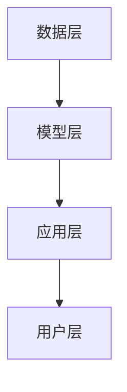

                 


好的，让我们一步步分析《费雪的宏观经济分析：把握大趋势》这篇文章的撰写思路。

---

# 费雪的宏观经济分析：把握大趋势

## 关键词：
费雪、宏观经济分析、经济周期、均衡模型、消费函数、投资函数

## 摘要：
本文从费雪的宏观经济分析理论入手，探讨其核心概念、数学模型、系统架构以及实际应用。通过详细讲解费雪的收入理论、利息理论和经济周期理论，结合实际案例和系统设计，帮助读者理解如何运用费雪的分析方法把握宏观经济大趋势。

---

## 第一部分: 宏观经济分析的背景与基础

### 第1章: 费雪的宏观经济分析概述

#### 1.1 宏观经济分析的背景
##### 1.1.1 经济学的基本概念
- 宏观经济学的研究对象是整体经济系统的运行规律，包括GDP、失业率、通胀率等宏观指标。
- 宏观经济分析的目标是理解经济波动、预测经济趋势并制定有效的政策。

##### 1.1.2 费雪的生平与贡献
- 费雪（Irving Fisher）是20世纪初美国著名经济学家，以其在货币理论、利息理论和经济周期研究方面的贡献闻名。
- 费雪提出了“利息理论”，认为利息是资本的时间价值，是资本所有者放弃当前消费的补偿。

##### 1.1.3 宏观经济分析的定义与范围
- 宏观经济分析研究的是整个经济系统的运行机制，包括总需求、总供给、货币政策和财政政策等。
- 宏观经济分析的应用范围广泛，包括政府政策制定、企业战略规划和投资决策。

#### 1.2 费雪的宏观经济分析方法
##### 1.2.1 费雪的收入理论
- 费雪的收入理论认为，收入是人们在一定时期内消费的总能力，包括工资、利息和租金等来源。
- 收入与价格的关系是宏观经济分析的核心之一。

##### 1.2.2 费雪的利息理论
- 费雪认为，利息是资本的时间价值，是资本所有者放弃当前消费的补偿。
- 利息理论在货币政策和金融市场的分析中具有重要应用。

##### 1.2.3 费雪的经济周期理论
- 费雪将经济周期分为繁荣、衰退、萧条和复苏四个阶段。
- 他提出了“债务通缩理论”，认为债务危机是导致经济衰退的重要原因。

---

### 第2章: 费雪宏观经济分析的核心概念

#### 2.1 费雪的收入与价格理论
##### 2.1.1 收入理论的基本原理
- 收入是消费能力的总和，包括工资、利息和租金。
- 收入与价格的关系是影响消费和投资的重要因素。

##### 2.1.2 价格理论的核心要素
- 价格是商品和服务的价值表现，受供求关系、成本和货币价值的影响。
- 价格理论在通货膨胀和通货紧缩分析中具有重要作用。

##### 2.1.3 收入与价格的关系
- 收入增长会带动消费增长，进而影响价格水平。
- 价格水平的变化会影响实际收入，从而影响消费和投资行为。

#### 2.2 费雪的经济均衡模型
##### 2.2.1 均衡的概念
- 均衡是宏观经济系统在某一时刻达到的稳定状态，供给与需求相等。
- 均衡模型是理解经济波动和政策制定的基础。

##### 2.2.2 费雪的均衡模型
- 费雪提出了总需求与总供给的均衡模型，认为价格水平和实际产出在总需求和总供给曲线的交点处达到均衡。

##### 2.2.3 均衡与经济周期的关系
- 经济周期的波动是围绕均衡点展开的。
- 均衡模型可以帮助我们理解经济周期的形成和变化。

---

### 第3章: 费雪宏观经济分析的数学模型

#### 3.1 费雪的消费函数模型
##### 3.1.1 消费函数的定义
- 消费函数描述的是消费与收入之间的关系。
- 消费函数的公式为：C = a + bY，其中C是消费，Y是收入，a是自发消费，b是边际消费倾向。

##### 3.1.2 消费函数的数学表达式
$$ C = a + bY $$

##### 3.1.3 消费函数的应用
- 消费函数可以帮助我们预测消费水平，从而分析总需求的变化。
- 消费函数在货币政策和财政政策的制定中具有重要作用。

#### 3.2 费雪的投资函数模型
##### 3.2.1 投资函数的定义
- 投资函数描述的是投资与利率之间的关系。
- 投资函数的公式为：I = I_r，其中I是投资，r是利率。

##### 3.2.2 投资函数的数学表达式
$$ I = I_r $$

##### 3.2.3 投资函数的应用
- 投资函数可以帮助我们理解利率变化对投资的影响。
- 投资函数在货币政策和金融市场分析中具有重要作用。

#### 3.3 费雪的总需求与总供给模型
##### 3.3.1 总需求曲线
- 总需求曲线描述的是价格水平与总需求之间的关系。
- 总需求曲线的公式为：AD = a + bY + cP，其中AD是总需求，Y是收入，P是价格，a、b、c是常数。

##### 3.3.2 总供给曲线
- 总供给曲线描述的是价格水平与总供给之间的关系。
- 总供给曲线的公式为：AS = a + bY + cP，其中AS是总供给，Y是收入，P是价格，a、b、c是常数。

##### 3.3.3 总需求与总供给的均衡点
- 总需求与总供给的均衡点是价格水平和实际产出的交点。
- 均衡点的公式为：AD = AS。

---

### 第4章: 费雪宏观经济分析的系统架构

#### 4.1 系统分析与设计
##### 4.1.1 宏观经济分析的系统结构
- 宏观经济分析系统包括数据采集、模型构建、预测与模拟、结果分析等功能模块。

##### 4.1.2 系统功能模块划分
- 数据采集模块：负责收集宏观经济数据，包括GDP、失业率、通胀率等。
- 模型构建模块：负责构建费雪的宏观经济模型，包括消费函数、投资函数和总需求与总供给模型。
- 预测与模拟模块：负责根据模型预测未来经济趋势。
- 结果分析模块：负责分析预测结果并提出政策建议。

##### 4.1.3 系统输入与输出
- 系统输入：宏观经济数据、模型参数。
- 系统输出：经济预测结果、政策建议。

#### 4.2 系统架构设计
##### 4.2.1 分层架构
- 系统架构分为数据层、模型层、应用层和用户层。
- 数据层负责存储和管理宏观经济数据。
- 模型层负责构建和运行宏观经济模型。
- 应用层负责接收用户输入并输出结果。
- 用户层负责与用户交互，提供友好的用户界面。

##### 4.2.2 系统架构图


---

### 第5章: 项目实战

#### 5.1 环境安装与配置
- 需要安装Python、NumPy、Pandas、Matplotlib等库。
- 安装命令：`pip install numpy pandas matplotlib`

#### 5.2 核心实现
##### 5.2.1 数据采集
```python
import pandas as pd

# 从互联网获取宏观经济数据
data = pd.read_csv('macroeconomic_data.csv')
```

##### 5.2.2 模型构建
```python
import numpy as np

# 构建消费函数模型
def consumption_function(Y):
    a = 100
    b = 0.8
    return a + b * Y

# 构建投资函数模型
def investment_function(r):
    I_r = 50 - 2 * r
    return I_r
```

##### 5.2.3 预测与模拟
```python
import matplotlib.pyplot as plt

# 预测不同利率下的投资水平
r_values = [0, 5, 10, 15]
I_values = [investment_function(r) for r in r_values]

# 绘制投资函数曲线
plt.plot(r_values, I_values)
plt.xlabel('利率 (%)')
plt.ylabel('投资水平')
plt.title('投资函数曲线')
plt.show()
```

#### 5.3 结果分析与解读
- 通过投资函数曲线可以看出，利率越高，投资水平越低。
- 这表明货币政策在影响投资方面具有重要作用。

#### 5.4 案例分析
##### 5.4.1 美国经济趋势分析
- 通过费雪的宏观经济模型，我们可以分析美国经济的波动趋势。
- 例如，2008年金融危机期间，投资水平大幅下降，导致经济衰退。

##### 5.4.2 经济政策模拟
- 通过模型模拟不同的经济政策效果，如加息或减税政策。
- 例如，加息会导致投资水平下降，从而影响整体经济产出。

#### 5.5 项目小结
- 费雪的宏观经济分析方法在实际应用中具有重要意义。
- 通过系统化的模型构建和数据分析，我们可以更好地理解经济趋势并制定有效的政策。

---

### 第6章: 最佳实践与总结

#### 6.1 小结
- 费雪的宏观经济分析方法为我们提供了一种理解经济系统运行规律的重要工具。
- 通过消费函数、投资函数和总需求与总供给模型，我们可以更好地分析经济波动和政策效果。

#### 6.2 注意事项
- 在实际应用中，需要结合具体的数据和实际情况调整模型参数。
- 需要注意模型的局限性，如忽略了技术创新和制度变化的影响。

#### 6.3 拓展阅读
- 建议进一步阅读费雪的经典著作《利息理论》和《债务通缩理论》。
- 可以学习其他经济学家的宏观经济理论，如凯恩斯的需求侧分析和货币主义的理论。

---

## 作者：
AI天才研究院/AI Genius Institute  
禅与计算机程序设计艺术/Zen And The Art of Computer Programming

