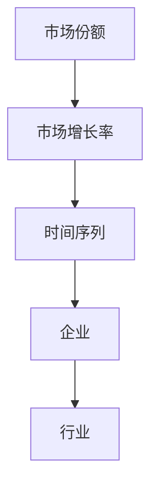
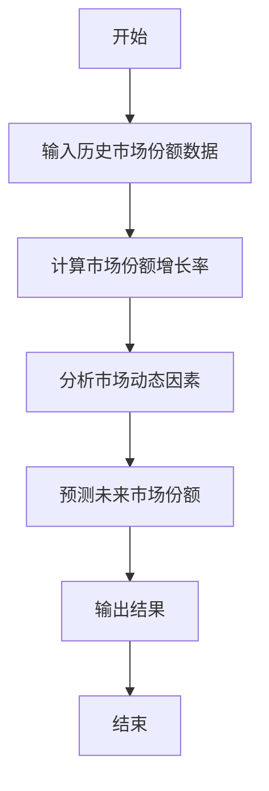
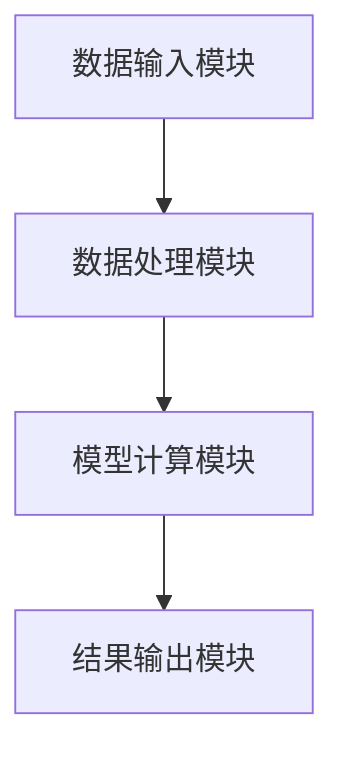
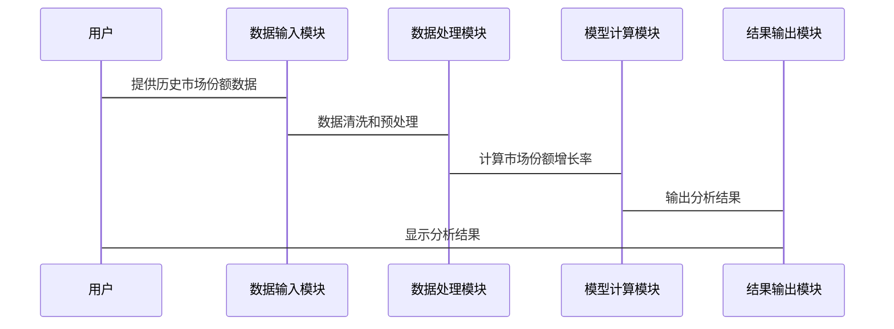

                 


# 费雪的市场份额增长分析方法

## 关键词：市场份额增长分析方法, 费雪模型, 市场增长率, 企业战略规划, 数据分析

## 摘要：  
费雪的市场份额增长分析方法是一种用于评估和预测市场中各企业市场份额变化趋势的系统性方法。本文将从背景、核心概念、算法原理、系统设计、项目实战等多角度详细分析这一方法，结合实例和代码实现，帮助读者深入理解其应用场景和实现细节。

---

# 第1章: 费雪的市场份额增长分析方法背景介绍

## 1.1 问题背景  
在企业战略规划和投资决策中，市场份额是衡量企业市场地位的重要指标。传统的市场份额分析方法往往缺乏对增长趋势的动态预测能力，难以满足企业在复杂市场环境中的决策需求。费雪的市场份额增长分析方法应运而生，通过结合数学模型和市场动态分析，为企业提供更精准的市场份额增长预测。

## 1.2 问题描述  
市场份额增长分析的核心在于理解市场中各企业在不同时间段内的市场份额变化。传统的分析方法通常基于静态数据，无法捕捉市场的动态变化。而费雪方法通过引入动态模型，结合时间序列分析和市场竞争因素，能够更准确地预测市场份额的变化趋势。

## 1.3 问题解决  
费雪方法通过构建数学模型，将市场份额的增长率与市场动态、企业竞争能力等因素相结合，提供了一种动态分析的方法。这种方法不仅能够预测未来市场份额的变化，还能帮助企业制定更有针对性的战略规划。

## 1.4 边界与外延  
费雪方法主要适用于企业内部战略分析和投资决策，其边界在于假设市场环境相对稳定，且竞争格局不会发生重大变化。其外延则包括对行业趋势的分析和对市场潜力的评估。

## 1.5 概念结构与核心要素  
- **市场份额**：企业在市场中所占的销售额或用户比例。  
- **市场增长率**：企业在一定时间内的市场份额变化率。  
- **竞争强度**：市场中竞争的激烈程度，影响市场份额的变化。  

---

# 第2章: 费雪的市场份额增长分析方法的核心概念与联系

## 2.1 核心概念  
费雪方法的核心在于将市场份额的增长率与市场动态、竞争能力等因素结合起来，通过数学模型进行量化分析。其核心概念包括：  
1. **市场份额增长率**：衡量企业在一定时间内市场份额的变化幅度。  
2. **市场动态因素**：包括市场需求变化、竞争格局调整等。  
3. **企业竞争能力**：包括产品优势、品牌影响力等，影响市场份额的变化。

## 2.2 核心要素对比  
以下是费雪方法与其他市场份额分析方法的核心要素对比：

| 对比维度 | 费雪方法 | 传统市场份额分析方法 | 竞争对手分析方法 |
|----------|----------|-----------------------|------------------|
| 分析目标 | 市场份额增长预测 | 当前市场份额统计 | 竞争对手份额变化 |
| 方法特点 | 动态模型，引入时间序列分析 | 静态分析，基于历史数据 | 竞争强度分析 |
| 适用场景 | 企业战略规划、投资决策 | 市场现状分析 | 行业竞争分析 |

## 2.3 实体关系图  
以下是一个简单的ER实体关系图，展示了费雪方法中的核心实体及其关系：



---

# 第3章: 费雪的市场份额增长分析方法的算法原理讲解

## 3.1 数学模型  
费雪方法的核心在于构建一个动态的市场份额增长模型。其数学公式如下：

$$
\text{市场份额增长率} = \frac{\text{市场份额}_{t+1} - \text{市场份额}_t}{\text{市场份额}_t}
$$

其中，$\text{市场份额}_t$ 表示企业在时间 $t$ 的市场份额，$\text{市场份额}_{t+1}$ 表示企业在时间 $t+1$ 的市场份额。

## 3.2 算法流程  
以下是费雪方法的算法流程图：



## 3.3 代码实现  
以下是一个简单的Python代码示例，用于实现费雪方法的核心计算：

```python
import pandas as pd

# 示例数据：企业A的市场份额数据
data = {'时间': [2018, 2019, 2020, 2021],
         '市场份额': [0.2, 0.25, 0.3, 0.35]}
df = pd.DataFrame(data)

# 计算市场份额增长率
df['市场份额增长率'] = df['市场份额'].pct_change()

print(df)
```

## 3.4 示例分析  
假设某企业过去四年的市场份额分别为 20%、25%、30% 和 35%。根据上述代码计算，其市场份额增长率分别为 25%、20% 和 16.67%。这表明企业在逐年增长，但增长率呈现下降趋势。

---

# 第4章: 费雪的市场份额增长分析方法的系统分析与架构设计

## 4.1 问题场景介绍  
在实际应用中，企业需要通过系统化的分析方法来评估其市场份额增长潜力。费雪方法可以应用于企业内部的战略规划、投资决策以及市场研究。

## 4.2 系统功能设计  
以下是系统功能设计的类图：


## 4.3 系统架构设计  
以下是系统架构设计的架构图：



## 4.4 接口设计  
以下是系统接口设计的交互序列图：



---

# 第5章: 费雪的市场份额增长分析方法的项目实战

## 5.1 环境安装  
在进行费雪方法的代码实现之前，需要安装必要的Python库，例如Pandas和Matplotlib。以下是安装命令：

```bash
pip install pandas matplotlib
```

## 5.2 核心代码实现  
以下是费雪方法的完整代码实现：

```python
import pandas as pd
import matplotlib.pyplot as plt

# 示例数据：企业A的市场份额数据
data = {'时间': [2018, 2019, 2020, 2021],
         '市场份额': [0.2, 0.25, 0.3, 0.35]}
df = pd.DataFrame(data)

# 计算市场份额增长率
df['市场份额增长率'] = df['市场份额'].pct_change()

# 绘制市场份额增长率折线图
plt.figure(figsize=(10, 6))
plt.plot(df['时间'], df['市场份额增长率'], 'b-')
plt.title('市场份额增长率变化趋势')
plt.xlabel('时间')
plt.ylabel('市场份额增长率')
plt.grid(True)
plt.show()
```

## 5.3 案例分析  
假设某企业过去四年的市场份额数据如下：

| 时间  | 市场份额 |
|-------|----------|
| 2018  | 0.2      |
| 2019  | 0.25     |
| 2020  | 0.3      |
| 2021  | 0.35     |

根据上述代码，计算出的市场份额增长率为 25%、20% 和 16.67%。这表明企业的市场份额在逐年增长，但增长率呈现下降趋势，可能表明市场竞争加剧或企业增长动力不足。

## 5.4 项目小结  
通过上述案例分析，我们可以看到费雪方法在实际应用中的有效性和实用性。企业可以根据分析结果制定更有针对性的战略规划。

---

# 第6章: 费雪的市场份额增长分析方法的最佳实践

## 6.1 小结  
费雪的市场份额增长分析方法通过动态模型和数学公式，为企业提供了更精准的市场份额增长预测能力。其核心在于将市场份额的增长率与市场动态、竞争能力等因素相结合。

## 6.2 注意事项  
在实际应用中，需要注意以下几点：  
1. 数据的准确性和完整性。  
2. 市场动态分析的复杂性。  
3. 模型的适用性和局限性。

## 6.3 拓展阅读  
- 《数据分析实战：从入门到精通》  
- 《市场预测与企业战略规划》  
- 《数学模型在商业分析中的应用》

---

# 作者：AI天才研究院/AI Genius Institute & 禅与计算机程序设计艺术 /Zen And The Art of Computer Programming

