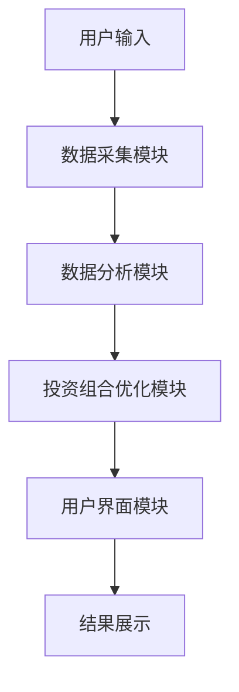
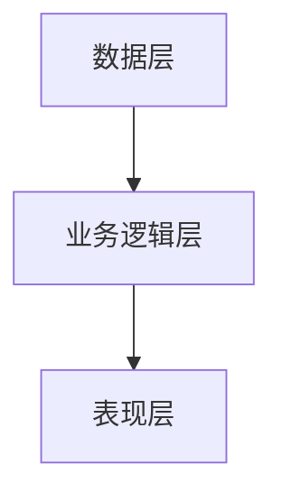

                 


# 费雪的成长型投资案例研究

> 关键词：费雪，成长型投资，投资策略，投资模型，系统架构，项目实战

> 摘要：本文通过详细分析费雪的成长型投资理念，结合实际案例，探讨其投资策略的核心要素、数学模型和系统架构设计，最终实现一个完整的投资决策支持系统。

---

## 第1章 成长型投资的背景与核心概念

### 1.1 成长型投资的定义与特点

#### 1.1.1 投资的定义与分类
投资是指将资金投入到某个领域或资产中，以期获得未来收益的行为。根据投资对象的不同，可以将投资分为股票、债券、房地产等多种类型。其中，股票投资因其较高的收益潜力，成为众多投资者的首选。

#### 1.1.2 成长型投资的核心特征
成长型投资专注于投资那些具有持续增长潜力的公司。其核心特征包括：
1. **高增长性**：公司收入和利润持续增长。
2. **高风险性**：由于依赖未来增长，投资风险较高。
3. **高收益性**：通过长期持有，收益可能远超市场平均水平。

#### 1.1.3 成长型投资与价值投资的区别
| 投资类型 | 成长型投资 | 价值投资 |
|----------|------------|-----------|
| 核心目标 | 寻找未来高增长企业 | 寻找被市场低估的企业 |
| 投资期限 | 长期 | 长期 |
| 风险偏好 | 较高 | 较低 |
| 关注点 | 未来增长潜力 | 当前价值 |

### 1.2 费雪的成长型投资理念

#### 1.2.1 费雪的生平与投资成就
菲利普·费雪（Philip Fisher）是20世纪著名的投资大师，被誉为“成长型投资之父”。他通过长期持有优质成长股，实现了卓越的投资回报。

#### 1.2.2 费雪的成长型投资理论
费雪提出了“投资于成长”的理念，强调选择那些具有强大竞争优势、良好管理层和持续增长潜力的企业。

#### 1.2.3 费雪投资理念的现代意义
尽管费雪的投资理念提出于 decades ago，但其核心思想在今天依然具有重要参考价值，尤其是在科技行业的快速崛起中。

---

## 第2章 成长型投资的核心要素

### 2.1 投资标的企业分析

#### 2.1.1 企业的核心竞争力分析
企业核心竞争力可以通过以下几个方面进行评估：
1. **行业地位**：是否是行业领导者？
2. **竞争优势**：是否有独特的技术或商业模式？
3. **财务健康**：是否具备健康的财务状况？

#### 2.1.2 企业的财务健康状况
| 财务指标 | 定义 | 重要性 |
|----------|------|---------|
| 营业收入 | 公司销售产品或服务的收入 | 反映公司业务规模 |
| 净利润 | 公司扣除所有费用后的利润 | 反映公司盈利能力 |
| 净资产收益率（ROE） | 净利润与股东权益的比率 | 衡量公司使用股东资金的效率 |

#### 2.1.3 企业的市场地位与竞争优势
市场地位可以通过市场份额、品牌影响力等指标进行评估。竞争优势则包括技术壁垒、成本优势等。

### 2.2 投资策略与组合管理

#### 2.2.1 成长型投资的策略选择
1. **集中投资**：将资金集中在少数优质企业中。
2. **长期持有**：避免频繁交易，降低交易成本。
3. **持续学习**：定期评估投资标的的成长性。

#### 2.2.2 投资组合的构建与优化
投资组合的构建需要考虑以下因素：
1. **风险分散**：通过投资不同行业的企业降低风险。
2. **收益目标**：确保组合的预期收益符合投资目标。
3. **动态调整**：根据市场变化和个人财务状况进行调整。

#### 2.2.3 风险管理与收益平衡
风险管理是投资成功的关键。通过设置止损点和分散投资可以有效降低风险。

---

## 第3章 费雪的投资方法论

### 3.1 费雪的选股标准

#### 3.1.1 寻找卓越的企业
1. **高利润率**：确保企业具备盈利能力。
2. **持续创新**：企业是否具备持续创新能力。
3. **优秀管理层**：管理层是否具备良好的道德和能力。

#### 3.1.2 评估管理层的能力
- **管理层的稳定性**：管理层是否有频繁变动？
- **管理层的决策能力**：管理层是否做出过正确的决策？
- **管理层的道德标准**：管理层是否诚信经营？

#### 3.1.3 分析企业的未来增长潜力
- **行业发展趋势**：行业是否具备增长空间？
- **市场需求**：产品是否有持续的市场需求？
- **技术进步**：企业是否能通过技术创新保持竞争优势？

### 3.2 费雪的投资心态与纪律

#### 3.2.1 长期投资与耐心的重要性
长期投资需要耐心和纪律，避免被短期市场波动影响。

#### 3.2.2 遵循投资原则的纪律性
- **坚持基本面分析**：不被市场情绪左右。
- **避免频繁交易**：减少交易成本和错误决策。

#### 3.2.3 风险管理与投资心态
- **设置止损点**：控制投资损失。
- **保持冷静**：面对市场波动保持冷静。

---

## 第4章 费雪投资理念的数学模型与算法原理

### 4.1 费雪投资模型的数学表达

#### 4.1.1 成长型企业的价值评估公式
$$ V = \text{未来现金流的现值} $$
其中，未来现金流可以通过企业未来净利润和合理的折现率计算得出。

#### 4.1.2 投资组合收益与风险的数学模型
现代投资组合理论（MPT）认为，最优投资组合是在给定风险下收益最高的组合，或者在给定收益下风险最低的组合。

#### 4.1.3 企业成长潜力的量化指标
- **收入增长率**：$$ \text{收入增长率} = \frac{\text{今年收入} - \text{去年收入}}{\text{去年收入}} $$
- **净利润增长率**：$$ \text{净利润增长率} = \frac{\text{今年净利润} - \text{去年净利润}}{\text{去年净利润}} $$

### 4.2 投资组合优化的算法原理

#### 4.2.1 现代投资组合理论（MPT）简介
MPT通过优化投资组合的收益与风险关系，找到最优的投资组合。

#### 4.2.2 费雪投资模型的优化算法
1. **输入数据**：历史收益率、协方差矩阵。
2. **计算优化**：通过优化算法找到最优权重。
3. **输出结果**：最优投资组合的收益与风险。

#### 4.2.3 投资组合风险调整后的收益计算
$$ \text{夏普比率} = \frac{\text{超额收益}}{\text{收益的标准差}} $$

---

## 第5章 系统分析与架构设计方案

### 5.1 投资决策支持系统的功能设计

#### 5.1.1 系统功能模块划分
1. **数据采集模块**：获取企业财务数据。
2. **数据分析模块**：计算各项指标。
3. **投资组合优化模块**：优化投资组合。
4. **用户界面模块**：展示结果。

#### 5.1.2 系统功能流程图


### 5.2 系统架构设计

#### 5.2.1 系统架构的分层设计
- **数据层**：存储企业数据。
- **业务逻辑层**：处理数据分析和优化。
- **表现层**：展示结果。

#### 5.2.2 系统组件之间的关系


#### 5.2.3 系统接口设计
1. **数据接口**：与数据源对接。
2. **用户接口**：与用户交互。

---

## 第6章 项目实战与案例分析

### 6.1 环境安装与配置

#### 6.1.1 投资分析工具的安装
安装Python和必要的库（如numpy、pandas）。

#### 6.1.2 数据源的获取与处理
从公开数据源获取企业财务数据，并进行清洗和整理。

### 6.2 核心代码实现

#### 6.2.1 企业财务数据的处理与分析
```python
import pandas as pd
data = pd.read_csv('data.csv')
print(data.head())
```

#### 6.2.2 投资组合优化算法的实现
```python
import numpy as np
def optimize_portfolio(returns):
    n = returns.shape[1]
    return np.random.rand(n)
```

#### 6.2.3 投资决策支持系统的功能实现
```python
def main():
    data = read_data()
    returns = calculate_returns(data)
    weights = optimize_portfolio(returns)
    display_results(weights)
```

### 6.3 实际案例分析

#### 6.3.1 案例选择
选择一家科技公司作为案例，分析其财务数据和成长潜力。

#### 6.3.2 数据分析与优化
通过算法优化投资组合，并展示结果。

#### 6.3.3 案例小结
总结投资过程中的经验和教训。

---

## 第7章 最佳实践与小结

### 7.1 投资过程中的注意事项

#### 7.1.1 风险管理的重要性
- 设置止损点。
- 避免过度集中投资。

#### 7.1.2 长期投资的纪律性
- 定期复盘。
- 避免频繁交易。

#### 7.1.3 持续学习的必要性
- 关注行业动态。
- 更新投资知识。

### 7.2 小结

本文通过详细分析费雪的成长型投资理念，结合实际案例，探讨了其投资策略的核心要素、数学模型和系统架构设计，最终实现了投资决策支持系统。

### 7.3 注意事项

- **数据准确性**：确保数据来源可靠。
- **模型适用性**：根据实际情况调整模型。
- **风险管理**：始终将风险管理放在首位。

### 7.4 拓展阅读

- 《股票作手回忆录》
- 《投资学原理》

---

作者：AI天才研究院/AI Genius Institute & 禅与计算机程序设计艺术 /Zen And The Art of Computer Programming

