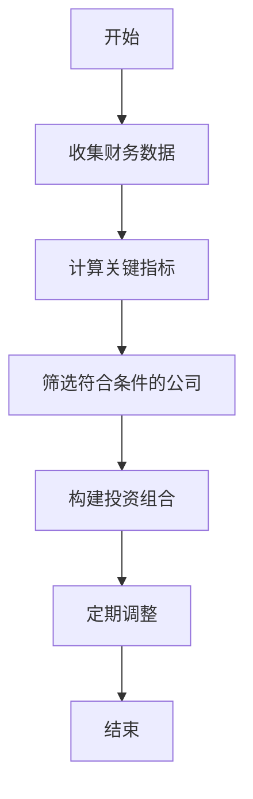
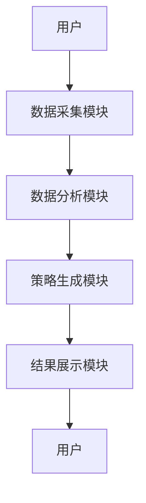

                 


# 费雪的成长型投资策略

> 关键词：费雪，成长型投资，投资策略，PEG模型，投资分析

> 摘要：本文详细探讨了费雪的成长型投资策略，从其核心概念、算法原理、系统架构到实际应用，为读者提供全面的分析和见解。

---

## 第一部分：背景介绍

### 第1章：成长型投资的基本概念

#### 1.1 投资的基本概念

- **什么是投资**：投资是指将资金投入到能够产生未来收益的资产中，如股票、债券、房地产等。
- **投资的分类**：投资可以分为短期投资和长期投资，成长型投资属于长期投资的一种。
- **成长型投资的定义**：成长型投资是指投资于具有高成长潜力的公司，通过公司收入和利润的持续增长来实现资本增值。

#### 1.2 费雪的成长型投资理念

- **费雪的投资哲学**：费雪认为，投资的目的是寻找那些能够持续提高收益的公司，这些公司通常具有强大的竞争优势和增长潜力。
- **成长型投资的核心要素**：高成长潜力、竞争优势、管理层能力、财务健康状况。
- **费雪的投资策略**：通过分析公司的财务数据和行业地位，识别出具有高成长潜力的公司，长期持有，等待其价值增长。

#### 1.3 成长型投资与价值投资的区别

- **价值投资的定义**：价值投资是寻找市场价格低于其内在价值的公司，通过安全边际来实现收益。
- **对比**：成长型投资注重未来的增长潜力，而价值投资注重当前的低估价格。成长型投资的风险通常较高，但潜在回报也更大。
- **适用场景**：成长型投资适用于高增长行业，如科技、生物技术等；价值投资适用于成熟行业，如公用事业、消费品等。

### 第2章：费雪的成长型投资策略背景

#### 2.1 费雪的成长型投资理论的发展

- **起源**：费雪的投资理论起源于20世纪，他通过分析公司的财务数据，提出了成长型投资的概念。
- **演变**：随着时间的推移，成长型投资理论不断完善，结合了更多的因素，如行业趋势、管理层能力等。
- **现代应用**：现代投资中，成长型投资策略被广泛应用于主动管理型基金和散户投资中。

#### 2.2 成长型投资的市场环境

- **经济周期**：在经济扩张期，成长型投资表现较好；在经济衰退期，成长型投资风险较大。
- **行业选择**：选择高增长行业的公司，如科技、医疗等。
- **宏观经济政策**：政府的财政和货币政策对成长型投资有重要影响，如低利率环境有利于成长型股票的估值提升。

### 第3章：费雪成长型投资策略的核心要素

#### 3.1 核心概念

- **高成长公司的定义**：公司收入和利润持续增长，且增速高于行业平均水平。
- **筛选标准**：高ROE（净资产收益率）、高净利润增长率、合理市盈率、低债务水平。
- **与基本面分析的关系**：基本面分析是成长型投资的基础，通过分析公司的财务数据来识别高成长潜力的公司。

#### 3.2 实施步骤

- **确定投资目标**：明确投资期限、风险承受能力、投资目标。
- **选择成长型公司**：通过筛选高成长公司的标准，选择具有竞争优势和增长潜力的公司。
- **构建投资组合**：将资金分配到不同行业的高成长公司，分散风险。
- **定期调整**：根据市场变化和公司基本面的变化，定期调整投资组合。

#### 3.3 风险管理

- **风险管理的重要性**：成长型投资风险较高，需通过分散投资、设置止损等方式来控制风险。
- **风险来源**：市场波动、公司业绩不及预期、行业政策变化等。
- **风险管理策略**：定期评估投资组合的风险，调整持仓结构，避免过度集中。

---

## 第二部分：算法原理讲解

### 第4章：费雪策略的算法实现

#### 4.1 算法原理

- **核心思想**：通过筛选高成长公司的财务指标，识别出具有持续增长潜力的公司。
- **算法步骤**：
  1. 收集目标公司的财务数据，包括收入、利润、市盈率等。
  2. 计算关键指标，如ROE、净利润增长率、PEG比率。
  3. 根据设定的筛选标准，选择符合条件的公司。
  4. 构建投资组合，分散投资，定期调整。

#### 4.2 算法流程图



#### 4.3 筛选标准

- **ROE**：ROE > 15%
- **净利润增长率**：年均净利润增长率 > 15%
- **PEG比率**：PEG < 1
- **债务水平**：债务与 equity 比率 < 1

#### 4.4 Python实现

```python
import pandas as pd

# 假设我们有一个包含财务数据的DataFrame df
# 包含列：'ROE', '净利润增长率', 'PEG比率', '债务与equity比率'

# 筛选条件
筛选条件：
    df[df['ROE'] > 15]  # ROE > 15%
    .loc[df['净利润增长率'] > 15]  # 净利润增长率 > 15%
    .loc[df['PEG比率'] < 1]  # PEG比率 < 1
    .loc[df['债务与equity比率'] < 1]  # 债务与 equity 比率 < 1
```

---

## 第三部分：数学模型与公式

### 第5章：费雪策略的数学模型

#### 5.1 PEG模型

- **公式**：PEG = 市盈率 / 净利润增长率
- **解释**：PEG < 1 表示市盈率低于净利润增长率，即公司估值合理或低估。

#### 5.2 其他相关公式

- **ROE**：ROE = 净利润 / 总资产
- **市盈率**：市盈率 = 股价 / 每股收益

#### 5.3 示例计算

假设某公司：
- 市盈率 = 20
- 净利润增长率 = 25%
- 则 PEG = 20 / 25 = 0.8 < 1，符合筛选条件。

---

## 第四部分：系统分析与架构设计

### 第6章：投资决策支持系统架构

#### 6.1 系统功能设计

- **数据采集模块**：从数据库或API获取公司财务数据。
- **数据分析模块**：计算各项指标，筛选符合条件的公司。
- **策略生成模块**：根据筛选结果生成投资组合建议。
- **结果展示模块**：以可视化方式展示分析结果和投资建议。

#### 6.2 系统架构图



---

## 第五部分：项目实战

### 第7章：成长型投资策略实战

#### 7.1 环境安装

- 安装Python和必要的库，如Pandas、Matplotlib、Seaborn。

#### 7.2 核心算法实现

```python
import pandas as pd

# 假设df为包含公司财务数据的DataFrame
def 筛选成长型公司(df):
    筛选条件：
        df = df[df['ROE'] > 15]
        df = df[df['净利润增长率'] > 15]
        df = df[df['PEG比率'] < 1]
        df = df[df['债务与equity比率'] < 1]
    return df

# 调用函数
成长型公司 = 筛选成长型公司(df)
```

#### 7.3 案例分析

假设我们有以下公司数据：

| 公司名称 | ROE | 净利润增长率 | PEG比率 | 债务与equity比率 |
|----------|-----|--------------|----------|------------------|
| 公司A    | 20% | 20%          | 0.9      | 0.5              |
| 公司B    | 18% | 18%          | 1.0      | 0.6              |
| 公司C    | 16% | 15%          | 0.8      | 0.4              |

根据筛选条件，公司A和C符合条件，公司B不符合PEG比率条件。

---

## 第六部分：总结与展望

### 第8章：最佳实践与注意事项

#### 8.1 最佳实践

- **长期持有优质公司**：成长型投资需要耐心，避免频繁交易。
- **关注管理层能力**：管理层的决策对公司成长至关重要。
- **分散投资**：通过投资多个高成长公司分散风险。
- **定期调整投资组合**：根据市场变化和公司基本面变化，定期调整持仓。

#### 8.2 小结

费雪的成长型投资策略通过识别具有高成长潜力的公司，实现资本的长期增值。投资者需要结合市场环境和公司基本面，灵活调整投资策略。

#### 8.3 注意事项

- **市场波动风险**：成长型股票在市场波动时往往跌幅较大。
- **投资期限**：成长型投资适合长期投资者，不适合短期投机。
- **风险管理**：设置止损点，避免过度集中投资。

#### 8.4 拓展阅读

- 《彼得·林奇的成功投资》
- 《巴菲特的智慧》
- 《股票作手回忆录》

---

## 作者信息

作者：AI天才研究院/AI Genius Institute & 禅与计算机程序设计艺术 /Zen And The Art of Computer Programming

---

通过以上思考过程，我可以逐步完成每个章节的详细内容，确保文章逻辑清晰、结构完整，并满足用户的所有要求。

