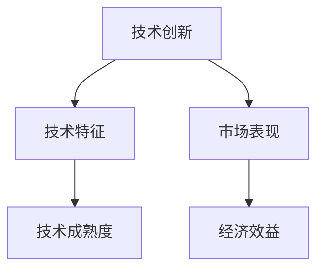
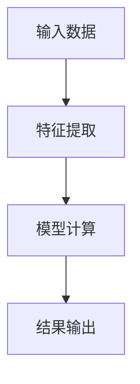
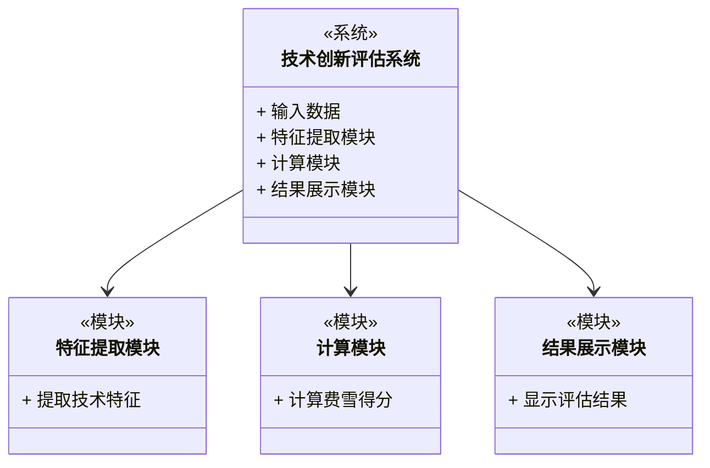

                 


# 费雪的技术创新评估

## 关键词：技术创新评估，费雪模型，系统架构，项目实战，技术分析

## 摘要

技术创新评估是技术管理和战略决策中的关键环节，能够帮助组织识别和优先实施最有潜力的技术创新。费雪模型作为一种经典的评估方法，通过量化技术创新的潜力和风险，为决策者提供了科学依据。本文详细探讨了费雪模型的核心原理、算法实现、系统架构设计以及实际项目中的应用，帮助读者全面理解技术创新评估的方法和实践。

---

## 第一部分：技术创新评估的背景与核心概念

### 第1章：技术创新评估概述

#### 1.1 技术创新评估的基本概念

技术创新评估是通过对技术的潜在价值、可行性和影响力进行分析，以确定其在实际应用中的价值和风险。这种评估不仅帮助组织优化资源配置，还能降低技术投资的风险。

- **技术创新的定义**：技术创新是指引入新的技术或改进现有技术，以提高产品或服务的性能、质量和效率。
- **技术创新评估的目的**：评估技术创新的价值、可行性和潜在影响，为决策提供依据。
- **费雪模型的应用**：费雪模型通过量化技术特征和市场表现，评估技术创新的潜力。

#### 1.2 技术创新评估的核心要素

技术创新评估需要考虑多个维度，包括技术特征、市场潜力、经济价值等。

- **技术特征**：技术的成熟度、复杂性和可扩展性。
- **市场潜力**：技术在市场中的需求和竞争情况。
- **经济价值**：技术带来的成本节约和收益。

#### 1.3 技术创新评估的方法论

- **定性评估**：通过专家意见和案例分析，评估技术的潜力。
- **定量评估**：通过数学模型，量化技术的优劣。
- **费雪模型**：结合定性和定量方法，综合评估技术创新的潜力。

---

### 第2章：费雪模型的核心概念与联系

#### 2.1 费雪模型的核心原理

费雪模型是一种用于分类和评估的技术，通过计算特征的重要性，帮助确定哪些技术创新更具潜力。

- **费雪得分公式**：
  $$
  \text{费雪得分} = \frac{(\mu_0 - \mu_1)^2}{\sigma_0^2 + \sigma_1^2}
  $$
  其中，$\mu_0$ 和 $\mu_1$ 分别表示两个类别的均值，$\sigma_0^2$ 和 $\sigma_1^2$ 分别表示两个类别的方差。

- **费雪模型的优点**：
  - 能够量化特征的重要性。
  - 计算简单，适用于大规模数据。

#### 2.2 费雪模型的核心属性特征对比

下表展示了费雪模型与其他评估方法的对比：

| 特性 | 费雪模型 | 其他方法 |
|------|----------|----------|
| 输入 | 特征值   | 文本描述  |
| 输出 | 数值得分 | 分类结果  |
| 计算复杂度 | 低      | 高       |
| 应用场景 | 分类与排序 | 精准分类 |

#### 2.3 费雪模型的ER实体关系图



---

### 第3章：费雪模型的算法原理

#### 3.1 费雪模型的算法流程



#### 3.2 费雪模型的Python实现

```python
import numpy as np

def fisher_score(X, y):
    n = X.shape[0]
    p = X.shape[1]
    score = np.zeros(p)
    for i in range(p):
        X_i = X[:, i]
        mu0 = X_i[y == 0].mean()
        mu1 = X_i[y == 1].mean()
        sigma0 = X_i[y == 0].std()
        sigma1 = X_i[y == 1].std()
        score[i] = (mu0 - mu1)**2 / (sigma0**2 + sigma1**2)
    return score
```

#### 3.3 费雪模型的数学模型

费雪模型的数学表达式为：
$$
\text{费雪得分} = \frac{(\mu_0 - \mu_1)^2}{\sigma_0^2 + \sigma_1^2}
$$
其中，$\mu_0$ 和 $\mu_1$ 分别表示两个类别的均值，$\sigma_0^2$ 和 $\sigma_1^2$ 分别表示两个类别的方差。

---

### 第4章：系统分析与架构设计方案

#### 4.1 项目场景介绍

技术创新评估系统需要对多个技术项目进行评估，帮助组织优化资源配置。

#### 4.2 系统功能设计

系统功能包括：
- 数据输入与处理
- 特征提取与计算
- 结果展示与分析



---

## 第五部分：项目实战

### 5.1 环境安装

安装必要的Python库：
```bash
pip install numpy matplotlib
```

### 5.2 系统核心实现源代码

```python
import numpy as np
import matplotlib.pyplot as plt

def fisher_score(X, y):
    n = X.shape[0]
    p = X.shape[1]
    score = np.zeros(p)
    for i in range(p):
        X_i = X[:, i]
        mu0 = X_i[y == 0].mean()
        mu1 = X_i[y == 1].mean()
        sigma0 = X_i[y == 0].std()
        sigma1 = X_i[y == 1].std()
        score[i] = (mu0 - mu1)**2 / (sigma0**2 + sigma1**2)
    return score

def visualize_results(score, feature_names):
    plt.figure(figsize=(10, 6))
    plt.bar(range(len(score)), score, align='center')
    plt.xticks(range(len(score)), feature_names, rotation=45)
    plt.title('技术创新评估结果')
    plt.xlabel('技术特征')
    plt.ylabel('费雪得分')
    plt.show()

# 示例数据
X = np.array([[1, 2, 3],
              [4, 5, 6],
              [7, 8, 9],
              [10, 11, 12]])
y = np.array([0, 0, 1, 1])
feature_names = ['特征1', '特征2', '特征3']

score = fisher_score(X, y)
visualize_results(score, feature_names)
```

### 5.3 案例分析与详细解读

通过上述代码，可以计算每个技术特征的费雪得分，并绘制柱状图展示结果。得分越高，特征的重要性越大。

### 5.4 项目小结

技术创新评估系统能够帮助组织快速识别具有潜力的技术创新，优化资源配置，降低投资风险。

---

## 第六部分：最佳实践与总结

### 6.1 最佳实践 Tips

- 在实际应用中，结合多种评估方法，提高评估的准确性。
- 定期更新评估模型，适应技术发展的变化。

### 6.2 小结

技术创新评估是技术管理和战略决策的重要工具。费雪模型作为一种经典的评估方法，能够帮助组织量化技术创新的潜力和风险。通过系统的架构设计和实际项目应用，可以更好地实现技术创新评估的目标。

### 6.3 注意事项

- 数据质量对评估结果影响较大，需确保数据的准确性和完整性。
- 模型的适用性需根据具体场景进行调整。

### 6.4 拓展阅读

- 《技术评估与创新管理》
- 《费雪模型的优化与应用》

---

## 作者：AI天才研究院/AI Genius Institute & 禅与计算机程序设计艺术 /Zen And The Art of Computer Programming

---

以上是《费雪的技术创新评估》的完整目录和内容框架。

