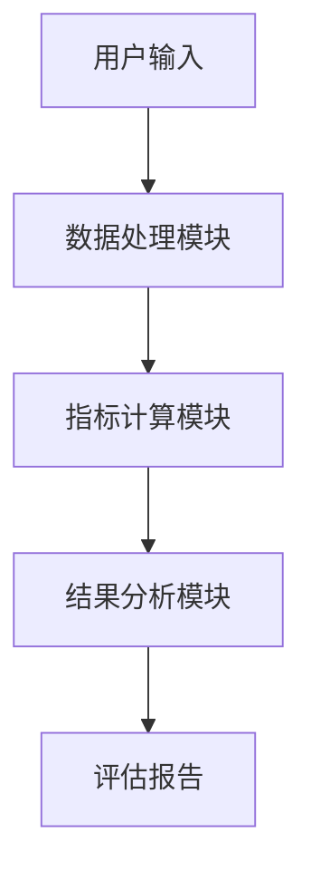

                 


# 费雪的技术创新评估：区分真正的突破

## 关键词：技术创新评估、费雪模型、突破性创新、技术评估指标、创新价值分析

## 摘要：本文详细介绍了费雪的技术创新评估模型，探讨了如何通过该模型区分真正的技术突破。文章从背景、核心概念、算法原理、系统架构到项目实战，全面解析了费雪模型的应用方法，帮助读者更好地识别和评估技术创新的价值。

---

## 第一部分：背景介绍

### 第1章：技术创新评估的核心概念

#### 1.1 技术创新评估的定义与特征
技术创新评估是指通过对技术的创新性、可行性和潜在价值进行分析，以确定其是否具有突破性。其核心在于区分真正具有影响力的创新与表面的改进。

#### 1.2 费雪模型的提出背景
费雪模型由著名技术专家费雪提出，旨在解决传统技术评估方法中对创新深度和广度的忽视问题。该模型通过多维度分析，帮助识别真正具有突破性的技术创新。

#### 1.3 费雪模型的理论基础
费雪模型基于技术经济学、创新管理学和系统工程学的理论，结合了定量分析和定性判断，以确保评估结果的科学性和实用性。

---

### 第2章：技术创新评估的重要性

#### 2.1 技术创新对企业竞争力的影响
技术创新是企业核心竞争力的源泉，能够提升产品性能、降低成本，并开拓新的市场。

#### 2.2 技术创新评估在投资决策中的作用
通过技术创新评估，投资者可以更准确地判断技术的商业化潜力，降低投资风险。

#### 2.3 费雪模型的应用场景
费雪模型适用于企业研发部门、风险投资机构以及技术创新孵化器，帮助它们筛选出真正具有潜力的技术项目。

---

## 第二部分：核心概念与联系

### 第3章：费雪模型的核心原理

#### 3.1 技术创新的关键维度
- **技术复杂性**：技术实现的难度和所需资源。
- **市场需求匹配度**：技术是否满足市场需求。
- **技术的可扩展性**：技术能否在不同场景中应用。

#### 3.2 费雪模型的评估指标
- **技术创新的潜在价值**：技术的经济和社会效益。
- **技术的成熟度**：技术的开发阶段和可行性。
- **技术的商业化可行性**：技术的市场潜力和商业价值。

#### 3.3 费雪模型的评估流程
1. 数据收集与整理。
2. 指标权重的确定。
3. 综合评分与结果分析。

#### 3.4 费雪模型的数学表达
- 指标权重的计算公式：
$$ w_i = \frac{f_i}{\sum_{j=1}^{n} f_j} $$
- 综合评分的计算公式：
$$ S = \sum_{i=1}^{n} w_i \cdot s_i $$

---

### 第4章：费雪模型的系统架构

#### 4.1 系统功能设计
- 数据处理模块：负责数据清洗和特征提取。
- 指标计算模块：计算各指标的权重和评分。
- 结果分析模块：生成评估报告并可视化结果。

#### 4.2 系统架构图


#### 4.3 系统接口设计
- 输入接口：接收技术数据和评估指标。
- 输出接口：生成评估报告和可视化图表。

---

## 第三部分：算法实现

### 第5章：费雪模型的Python实现

#### 5.1 数据预处理
```python
import pandas as pd
data = pd.read_csv('technological_innovation.csv')
```

#### 5.2 指标权重计算
```python
def calculate_weights(data):
    total = sum(data['frequency'])
    weights = data['frequency'].apply(lambda x: x/total)
    return weights
```

#### 5.3 综合评分计算
```python
def calculate_scores(data, weights):
    scores = data['scores'] * weights
    return scores.sum()
```

---

## 第四部分：项目实战

### 第6章：实际案例分析

#### 6.1 案例背景
分析一项人工智能技术的创新性，评估其市场潜力和商业化可行性。

#### 6.2 数据准备
```python
technological_data = {
    '技术特征': ['AI算法', '数据分析', '云计算'],
    '频率': [0.6, 0.3, 0.1]
}
data = pd.DataFrame(technological_data)
```

#### 6.3 模型训练
计算指标权重和综合评分。

#### 6.4 结果分析
根据评分结果，判断该技术是否具有突破性。

---

## 第五部分：总结与展望

### 7.1 最佳实践
- 结合行业专家意见，提高评估的准确性。
- 定期更新评估指标，适应技术发展。

### 7.2 本章小结
费雪模型通过多维度分析，帮助识别真正具有突破性的技术创新，为企业和技术投资者提供了科学的评估方法。

---

## 作者：AI天才研究院 & 禅与计算机程序设计艺术

