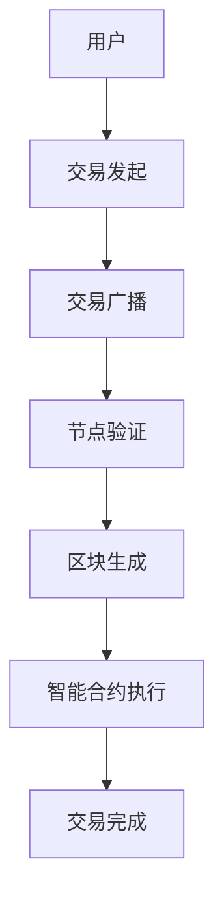

                 

# 费雪的技术创新评估：区块链技术的投资潜力分析

> **关键词**：区块链技术、技术创新评估、投资潜力分析、去中心化、共识机制、智能合约

> **摘要**：本文系统地分析了区块链技术的投资潜力，从技术创新、应用场景、市场前景等多个维度进行了深入探讨。文章首先介绍了区块链技术的基本概念和核心原理，然后分析了区块链技术在去中心化金融、供应链管理等领域的应用潜力，接着从技术性能、安全性、可扩展性等方面评估了区块链技术的创新价值。最后，本文提出了区块链技术投资的策略建议，为投资者提供了有价值的参考。

---

## 第一部分：区块链技术基础

### 第1章：区块链技术概述

#### 1.1 区块链的基本概念

- **1.1.1 区块链的定义与特点**
  - 区块链是一种去中心化的分布式账本技术，通过密码学方法确保数据的安全性和不可篡改性。
  - 区块链的核心特点包括去中心化、不可篡改、透明性和可追溯性。
  - 区块链的应用场景涵盖金融、供应链管理、医疗、版权保护等领域。

- **1.1.2 区块链的核心技术原理**
  - 数据结构：区块链由多个区块组成，每个区块包含交易数据和一个 Merkel 树哈希值，用于验证数据的完整性。
  - 共识机制：通过共识算法（如 PoW、PoS）确保所有节点达成一致，保证账本的一致性。
  - 智能合约：通过区块链上的脚本自动化执行预设的交易规则，实现无需信任的自动交易。

- **1.1.3 区块链的分类与应用场景**
  - 公有链、联盟链、私有链：公有链（如比特币、以太坊）适用于去中心化金融，联盟链（如 Hyperledger）适用于企业协作，私有链适用于特定机构内部的管理。
  - 典型应用场景：供应链金融、智能合约、数字身份认证、去中心化存储等。

#### 1.2 区块链的技术架构

- **1.2.1 区块链的组成要素**
  - 网络层：节点之间的通信协议。
  - 数据层：区块数据的组织和存储。
  - 共识层：共识算法的实现。
  - 智能合约层：智能合约的编写和执行。
  - 应用层：区块链的应用场景实现。

- **1.2.2 区块链的共识机制**
  - 工作量证明（PoW）：通过计算哈希值来验证工作量，确保网络安全。
  - 权益证明（PoS）：通过持有代币的数量来决定记账权。
  - 拜占庭容错（BFT）：通过投票机制达成共识。

- **1.2.3 区块链的激励机制**
  - 代币发行：通过发行代币激励节点参与网络。
  - 奖励机制：通过区块奖励和交易手续费激励节点完成交易验证。

#### 1.3 区块链的创新与挑战

- **1.3.1 区块链的技术创新点**
  - 去中心化：打破传统中心化机构的垄断，降低信任成本。
  - 不可篡改性：通过加密算法确保数据的安全性。
  - 自动化执行：智能合约实现自动化的交易和业务流程。

- **1.3.2 区块链面临的挑战与局限性**
  - 性能瓶颈：区块链的交易速度和吞吐量远低于传统数据库。
  - 能耗问题：PoW共识机制消耗大量能源，不利于环保。
  - 监管风险：区块链的去中心化特性可能与现有法律法规冲突。

- **1.3.3 区块链的未来发展趋势**
  - 技术升级：通过 Layer2 技术（如 Rollup、侧链）提升性能。
  - 应用扩展：区块链技术在元宇宙、Web3 等新兴领域的应用。
  - 跨链 interoperability：实现不同区块链之间的互操作性。

---

## 第二部分：区块链技术创新评估

### 第2章：区块链技术创新的核心要素

#### 2.1 区块链的核心技术原理

- **2.1.1 区块链的数据结构**
  - 区块链由一系列区块组成，每个区块包含交易数据和 Merkel 树。
  - Merkel 树用于快速验证数据的完整性和一致性。

- **2.1.2 区块链的共识机制**
  - PoW：比特币采用的工作量证明机制，通过计算哈希值来验证工作量。
  - PoS：以太坊 2.0 采用的权益证明机制，通过质押代币来获得记账权。

- **2.1.3 区块链的智能合约**
  - 智能合约是区块链上的自动执行程序，用于实现复杂的业务逻辑。
  - 智能合约通过区块链的去中心化特性实现信任和自动化。

#### 2.2 区块链技术创新的驱动因素

- **2.2.1 技术进步的推动**
  - Layer2 技术（如 Rollup、侧链）提升了区块链的性能。
  - 新型共识机制（如 BFT、DPOS）提高了效率和安全性。

- **2.2.2 市场需求的驱动**
  - 去中心化金融（DeFi）的需求推动了智能合约的发展。
  - 供应链管理和数字身份认证的需求推动了区块链的行业应用。

- **2.2.3 政策法规的支持**
  - 各国政府出台政策支持区块链技术的发展。
  - 金融机构和企业逐渐接受区块链技术，推动了技术创新。

#### 2.3 区块链技术创新的评估指标

- **2.3.1 技术性能指标**
  - 交易速度：TPS（每秒交易数）是衡量区块链性能的重要指标。
  - 延展性：区块链支持的节点数量和网络规模。
  - 安全性：抗攻击能力和漏洞数量。

- **2.3.2 安全性评估**
  - 51% 攻击：攻击者控制超过 50% 的算力或权益。
  - 智能合约漏洞：智能合约的代码错误可能导致资金损失。
  - 隐私泄露：区块链上的数据可能被恶意利用。

- **2.3.3 可扩展性评估**
  - 网络容量：区块链支持的最大节点数和交易量。
  - 跨链互操作性：不同区块链之间的数据互通性。
  - 可编程性：区块链支持的编程语言和开发工具。

---

## 第三部分：区块链技术的投资潜力分析

### 第3章：区块链技术的应用场景与投资价值

#### 3.1 区块链技术在去中心化金融（DeFi）中的应用

- **3.1.1 DeFi 的定义与特点**
  - DeFi 是基于区块链的去中心化金融服务。
  - DeFi 包括去中心化交易所（DEX）、借贷平台、稳定币发行等。

- **3.1.2 DeFi 的投资价值**
  - 去中心化交易所：降低了传统交易所的交易成本和信任成本。
  - 智能合约借贷：通过自动化实现无需信任的借贷业务。
  - 稳定币：为 DeFi 提供了稳定的货币基础。

- **3.1.3 DeFi 的市场前景**
  - DeFi 的市场规模快速增长，2023 年已超过 1000 亿美元。
  - DeFi 的应用范围逐渐扩展到保险、供应链金融等领域。

#### 3.2 区块链技术在供应链管理中的应用

- **3.2.1 供应链管理的定义与特点**
  - 供应链管理是指对产品从生产到交付的全过程进行管理。
  - 供应链管理需要高效协同和数据透明。

- **3.2.2 区块链在供应链管理中的应用**
  - 数据透明性：通过区块链确保供应链数据的不可篡改性。
  - 可追溯性：消费者可以追踪产品的来源和生产过程。
  - 质量控制：通过智能合约实现自动化的产品质量验证。

- **3.2.3 区块链在供应链管理中的投资价值**
  - 提高供应链效率：降低库存成本和物流成本。
  - 提升信任度：通过区块链实现供应链的透明化和可追溯性。
  - 扩大市场：企业可以利用区块链技术拓展新的市场和客户。

#### 3.3 区块链技术在数字身份认证中的应用

- **3.3.1 数字身份认证的定义与特点**
  - 数字身份认证是指通过数字技术验证用户身份的过程。
  - 数字身份认证需要具备安全性和隐私保护。

- **3.3.2 区块链在数字身份认证中的应用**
  - 去中心化身份：用户可以自主控制自己的身份信息。
  - 隐私保护：通过零知识证明实现身份验证而不泄露隐私信息。
  - 跨平台兼容性：支持不同平台和应用的互操作性。

- **3.3.3 区块链在数字身份认证中的投资价值**
  - 提高安全性：区块链技术可以防止身份信息被篡改和伪造。
  - 降低成本：通过自动化实现身份认证流程的简化。
  - 扩大应用范围：区块链技术可以支持更多场景的数字身份认证。

---

## 第四部分：区块链技术的系统设计与实战

### 第4章：区块链技术的系统架构设计

#### 4.1 区块链系统的功能设计

- **4.1.1 区块链系统的功能模块**
  - 节点管理：负责节点的注册、验证和管理。
  - 区块生成：负责区块的生成、广播和验证。
  - 共识机制：负责节点之间的共识达成。
  - 智能合约：负责智能合约的编写、部署和执行。

- **4.1.2 区块链系统的功能流程**
  - 节点加入：新节点通过验证加入区块链网络。
  - 交易广播：交易发起者将交易广播到网络。
  - 区块生成：节点通过共识机制生成新区块。
  - 智能合约执行：智能合约根据交易自动执行业务逻辑。

#### 4.2 区块链系统的架构设计

- **4.2.1 区块链系统的架构图**

- **4.2.2 区块链系统的实现细节**
  - 网络通信：节点之间通过 P2P 网络进行通信。
  - 数据存储：区块数据存储在分布式存储系统中。
  - 共识算法：节点通过共识算法达成一致。

#### 4.3 区块链系统的接口设计

- **4.3.1 区块链系统的 API 接口**
  - `getBalance(address: string)`: 获取指定地址的余额。
  - `transfer(from: string, to: string, amount: number)`: 实现转账功能。
  - `deployContract(contractCode: string)`: 部署智能合约。
  - `executeContract(contractAddress: string, input: string)`: 执行智能合约。

- **4.3.2 区块链系统的交互设计**
  - 用户通过 API 接口与区块链系统进行交互。
  - 智能合约通过事件监听实现与外部系统的交互。

---

## 第五部分：区块链技术的投资策略与未来展望

### 第5章：区块链技术的最佳实践与投资建议

#### 5.1 区块链技术的投资策略

- **5.1.1 选择优质项目**
  - 项目团队：团队背景和经验。
  - 技术创新：项目的独特性和技术优势。
  - 市场需求：项目的市场潜力和应用场景。

- **5.1.2 风险管理**
  - 投资分散：避免将所有资金投入单一项目。
  - 风险评估：评估项目的法律风险和市场风险。
  - 退出策略：制定合理的退出机制。

#### 5.2 区块链技术的未来展望

- **5.2.1 技术发展趋势**
  - Layer2 技术的成熟：提升区块链的性能。
  - 跨链技术的发展：实现不同区块链之间的互操作性。
  - 新型共识机制的出现：提高效率和安全性。

- **5.2.2 市场发展趋势**
  - DeFi 的持续增长：去中心化金融的市场规模扩大。
  - 区块链应用的扩展：区块链技术在更多行业的应用。
  - 政策支持的加强：政府和监管机构对区块链技术的支持。

#### 5.3 区块链技术的投资注意事项

- **5.3.1 技术风险**
  - 技术不成熟：区块链技术仍处于发展初期，存在技术瓶颈。
  - 安全漏洞：区块链系统可能面临攻击和漏洞利用。

- **5.3.2 市场风险**
  - 市场波动：区块链市场的波动性较大，投资者需谨慎操作。
  - 法律风险：区块链技术可能面临法律法规的不确定性。

- **5.3.3 人性风险**
  - 投资者情绪波动：市场情绪的波动可能影响投资决策。
  - 热钱涌入：短期资金的涌入可能导致市场泡沫。

---

## 作者信息

作者：AI天才研究院/AI Genius Institute & 禅与计算机程序设计艺术 /Zen And The Art of Computer Programming

---

通过以上目录和内容设计，我们希望为读者提供一个全面的区块链技术投资潜力分析，帮助读者从技术、市场和投资策略等多个角度理解区块链技术的潜力和挑战。

