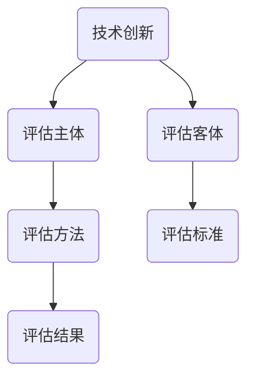
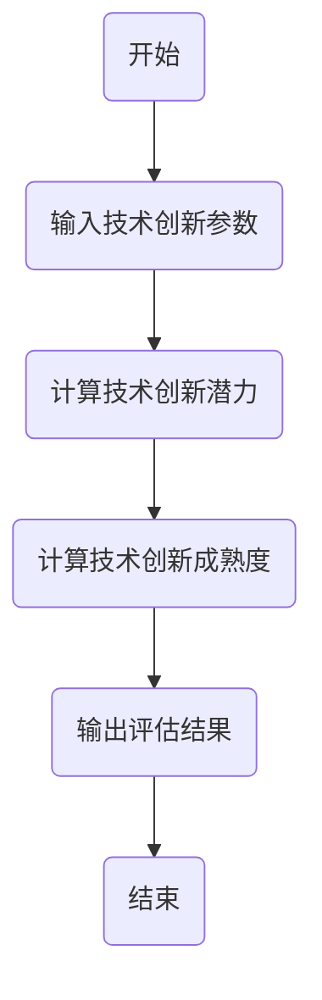
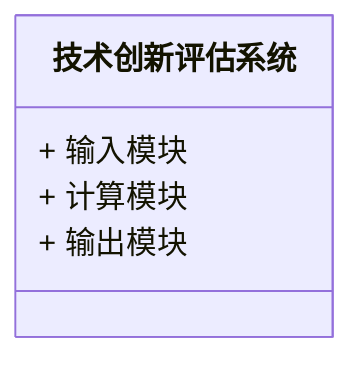
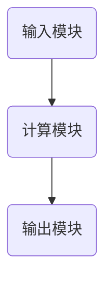
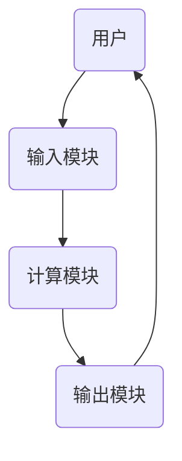

                 


# 费雪的技术创新评估：未来领导者的特征

## 关键词：技术创新评估、费雪模型、技术领导力、创新管理、技术战略、评估框架

## 摘要：  
本文系统地阐述了费雪技术创新评估的核心概念、理论基础、方法论及实际应用。通过分析技术创新评估的重要性、核心要素、数学模型以及实际案例，深入探讨了如何通过技术创新评估来培养和提升未来领导者的特征。文章结合理论与实践，为技术领导者和管理者提供了清晰的指导和实用的工具，以帮助他们更好地应对技术变革和市场竞争。

---

# 第1章: 技术创新评估的背景与意义

## 1.1 技术创新评估的定义与核心要素

### 1.1.1 技术创新的定义  
技术创新是指通过引入新的技术、方法或工具，创造出具有显著改进或革命性变化的产品、服务或过程。它是推动企业和社会进步的核心动力。

### 1.1.2 技术创新评估的核心要素  
技术创新评估的核心要素包括：  
1. **技术可行性**：技术是否能够在实际应用中实现其目标。  
2. **市场适应性**：技术是否能够满足市场需求并被广泛采用。  
3. **经济性**：技术的投入产出比是否合理。  
4. **竞争性**：技术是否能够在市场上占据竞争优势。  
5. **可持续性**：技术是否符合可持续发展的要求。  

### 1.1.3 技术创新评估的边界与外延  
技术创新评估的边界包括：  
1. **技术层面**：评估技术的科学性和可行性。  
2. **市场层面**：评估技术的市场需求和商业潜力。  
3. **组织层面**：评估技术对组织战略和管理的影响。  

外延包括：  
1. **技术生命周期**：从研发到市场应用的全生命周期。  
2. **创新生态系统**：技术创新与产业链、政策、资本等外部环境的互动。  

## 1.2 费雪技术创新评估的背景

### 1.2.1 技术创新评估的历史发展  
技术创新评估的理论基础可以追溯到20世纪60年代的技术接受模型（TAM），后来发展出多种评估方法，如技术成熟度曲线（Gartner Hype Cycle）。费雪技术创新评估是在这些理论基础上，结合现代技术特点提出的新型评估框架。

### 1.2.2 当前技术创新评估的重要性  
在数字化转型和全球化竞争的背景下，技术创新评估已成为企业制定技术战略、优化资源配置的重要工具。它能够帮助企业识别技术风险，抓住技术机遇，保持竞争优势。

### 1.2.3 费雪技术创新评估的提出  
费雪技术创新评估的核心思想是将技术创新视为一个系统工程，强调从技术、市场和组织三个维度进行全面评估。这种方法能够帮助企业领导者更全面地理解和管理技术创新过程。

---

# 第2章: 技术创新评估的核心概念与联系

## 2.1 技术创新评估的核心原理

### 2.1.1 技术创新的核心要素  
技术创新的核心要素包括：  
- **技术优势**：技术是否具有独特性和领先性。  
- **市场需求**：技术是否能够满足用户需求。  
- **竞争环境**：技术在市场上的竞争优势。  

### 2.1.2 技术创新评估的基本原则  
技术创新评估的基本原则包括：  
1. **系统性原则**：从技术、市场和组织三个维度进行全面评估。  
2. **动态性原则**：技术创新是一个动态过程，需要持续评估和调整。  
3. **可操作性原则**：评估方法和工具应具有实际操作性。  

### 2.1.3 技术创新评估的指标体系  
技术创新评估的指标体系包括：  
1. **技术指标**：如技术复杂度、研发周期、专利数量等。  
2. **市场指标**：如市场规模、市场增长率、用户满意度等。  
3. **经济指标**：如投资回报率、成本效益比等。  

## 2.2 技术创新评估的核心概念对比

### 2.2.1 技术创新与管理创新的对比  
| 维度 | 技术创新 | 管理创新 |  
|------|----------|----------|  
| 核心内容 | 新技术的开发与应用 | 新管理方法的引入与实施 |  
| 风险 | 技术失败风险较高 | 管理失败风险相对较低 |  
| 评估重点 | 技术可行性、市场适应性 | 管理效率、员工接受度 |  

### 2.2.2 技术创新与商业模式创新的对比  
| 维度 | 技术创新 | 商业模式创新 |  
|------|----------|-------------|  
| 核心内容 | 新技术的开发与应用 | 新商业模式的设计与实施 |  
| 依赖关系 | 技术创新是商业模式创新的基础 | 商业模式创新是技术创新的放大器 |  
| 评估重点 | 技术可行性、市场适应性 | 商业模式的可扩展性、盈利能力 |  

### 2.2.3 技术创新与市场竞争的关系  
技术创新是市场竞争的核心驱动力。企业通过技术创新可以提高产品性能、降低成本、增强客户体验，从而在竞争中占据优势。

## 2.3 技术创新评估的ER实体关系图  
以下是技术创新评估的实体关系图：  


---

# 第3章: 费雪技术创新评估的数学模型与公式

## 3.1 技术创新评估的数学模型

### 3.1.1 技术创新潜力的评估公式  
技术创新潜力 $P$ 的计算公式如下：  
$$ P = \frac{f}{n} $$  
其中，$f$ 表示技术可行性，$n$ 表示市场适应性。

### 3.1.2 技术创新成熟度的评估公式  
技术创新成熟度 $S$ 的计算公式如下：  
$$ S = \frac{a \cdot b}{c} $$  
其中，$a$ 表示技术优势，$b$ 表示市场需求，$c$ 表示竞争环境。

## 3.2 技术创新评估的算法原理  
以下是技术创新评估的算法流程图：  


## 3.3 技术创新评估的Python实现  

### 3.3.1 环境安装  
需要安装以下Python库：  
```bash
pip install numpy matplotlib
```

### 3.3.2 核心代码实现  
```python
def calculate_technological_potential(f, n):
    return f / n

def calculate_technological_maturity(a, b, c):
    return (a * b) / c

# 示例代码
f = 0.8  # 技术可行性
n = 0.6  # 市场适应性
a = 0.9  # 技术优势
b = 0.7  # 市场需求
c = 0.5  # 竞争环境

potential = calculate_technological_potential(f, n)
maturity = calculate_technological_maturity(a, b, c)

print(f"技术创新潜力: {potential}")
print(f"技术创新成熟度: {maturity}")
```

### 3.3.3 代码解读与分析  
- `calculate_technological_potential` 函数计算技术创新潜力，公式为 $P = \frac{f}{n}$。  
- `calculate_technological_maturity` 函数计算技术创新成熟度，公式为 $S = \frac{a \cdot b}{c}$。  
- 示例代码中，$f=0.8$，$n=0.6$，计算出技术创新潜力 $P=1.33$，说明该技术具有较高的潜力。  

---

# 第4章: 技术创新评估的方法论与系统架构

## 4.1 技术创新评估的方法论

### 4.1.1 技术创新评估的步骤  
技术创新评估的步骤包括：  
1. **明确目标**：确定评估的目的和范围。  
2. **收集数据**：收集技术、市场和竞争环境的相关数据。  
3. **选择方法**：根据需求选择合适的评估方法。  
4. **计算指标**：计算技术创新潜力和成熟度等指标。  
5. **分析结果**：根据评估结果制定相应的策略。  

### 4.1.2 技术创新评估的工具  
常用的工具包括：  
1. **技术成熟度曲线（Gartner Hype Cycle）**：用于分析技术的生命周期。  
2. **SWOT分析**：用于评估技术的优势、劣势、机会和威胁。  
3. **NPV分析**：用于评估技术的经济回报。  

## 4.2 技术创新评估的系统架构

### 4.2.1 系统功能设计  
以下是技术创新评估系统的功能模块图：  


### 4.2.2 系统架构设计  
以下是技术创新评估系统的架构图：  


### 4.2.3 系统接口设计  
技术创新评估系统的接口包括：  
1. 输入接口：接收技术参数和市场数据。  
2. 输出接口：输出评估结果和建议。  

### 4.2.4 系统交互流程  
以下是技术创新评估系统的交互流程图：  


---

# 第5章: 技术创新评估的项目实战

## 5.1 项目背景与目标

### 5.1.1 项目背景  
某科技公司计划开发一款人工智能辅助医疗诊断系统，需要评估该技术的创新性和可行性。

### 5.1.2 项目目标  
通过技术创新评估，确定该技术是否具有市场竞争力和商业潜力。

## 5.2 项目实施过程

### 5.2.1 技术参数输入  
输入技术参数包括：  
- 技术可行性 $f=0.9$  
- 市场适应性 $n=0.7$  
- 技术优势 $a=0.8$  
- 市场需求 $b=0.6$  
- 竞争环境 $c=0.4$  

### 5.2.2 技术创新潜力计算  
$$ P = \frac{f}{n} = \frac{0.9}{0.7} \approx 1.2857 $$  

### 5.2.3 技术创新成熟度计算  
$$ S = \frac{a \cdot b}{c} = \frac{0.8 \cdot 0.6}{0.4} = 1.2 $$  

### 5.2.4 评估结果分析  
- 技术创新潜力 $P=1.2857$，说明该技术具有较高的潜力。  
- 技术创新成熟度 $S=1.2$，说明该技术处于较成熟阶段。  

### 5.2.5 项目小结  
通过评估，该人工智能辅助医疗诊断系统具有较高的技术创新潜力和成熟度，可以在市场上推广。

---

# 第6章: 技术创新评估的总结与展望

## 6.1 项目总结  
技术创新评估是帮助企业识别技术机会和风险的重要工具。通过系统化的方法和模型，企业可以更好地管理技术创新过程，提升竞争力。

## 6.2 未来展望  
随着人工智能和大数据技术的发展，技术创新评估将更加智能化和精准化。未来的研究方向包括：  
1. **动态评估模型**：基于实时数据调整评估结果。  
2. **多维度评估框架**：结合更多维度（如伦理、政策）进行评估。  
3. **自动化评估工具**：利用AI技术实现自动化评估。  

---

# 附录: 技术创新评估的工具与资源

## 附录A: 常用技术创新评估工具  
1. Gartner Hype Cycle  
2. SWOT分析  
3. NPV分析  
4. 技术成熟度矩阵  

## 附录B: 技术创新评估框架  
1. 技术可行性分析  
2. 市场需求分析  
3. 竞争环境分析  
4. 经济效益分析  

---

# 作者：AI天才研究院 & 禅与计算机程序设计艺术

