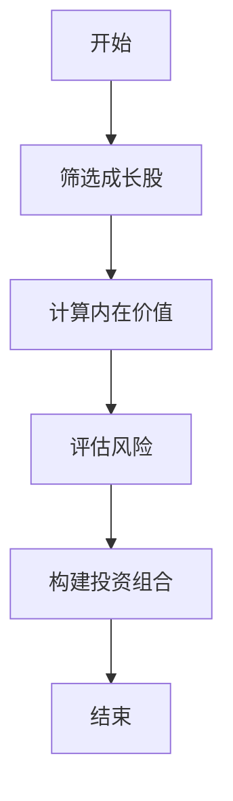

                 


# 费雪的新兴市场投资观点：把握全球机遇

> **关键词**：费雪投资理论、新兴市场、成长股投资、投资组合管理、内在价值计算、全球化投资、风险管理

> **摘要**：本文深入探讨了彼得·费雪的投资理论及其在新兴市场中的应用。通过分析成长股投资的核心概念、内在价值计算方法以及投资组合管理策略，结合数学模型和实际案例，为读者提供了全面的理解和实践指南。文章还详细介绍了投资决策算法、系统架构设计和项目实战，帮助投资者在新兴市场中把握全球机遇。

---

## 第一部分: 费雪的新兴市场投资观点概述

### 第1章: 费雪投资理论的背景与核心概念

#### 1.1 费雪投资理论的背景

##### 1.1.1 费雪的生平与投资理念
彼得·费雪（Peter Lynch）是美国著名投资专家，以其在成长股投资领域的卓越表现闻名。他在富达投资管理公司（Fidelity Management）的长期任职期间，成功管理了麦哲伦基金（Magellan Fund），创造了年化29%的惊人回报率。费雪的投资理念强调长期投资、深入研究和选择具有持续增长潜力的企业。

##### 1.1.2 新兴市场的定义与特点
新兴市场通常指那些经济快速增长、市场规模较小但潜力巨大的国家或地区，如中国、印度、巴西等。这些市场具有高增长潜力，但也伴随着较高的风险和不确定性。新兴市场的特点是行业结构变化快、政策影响大、市场波动剧烈。

##### 1.1.3 全球化背景下的投资机遇
全球化使得新兴市场成为全球投资版图中不可或缺的一部分。随着科技的进步和交通的便利，新兴市场与全球经济的联系日益紧密，为投资者提供了更多元的投资选择和更高的收益潜力。

---

#### 1.2 费雪投资理论的核心概念

##### 1.2.1 成长股投资的定义
成长股是指那些收入和利润快速增长、具有较高增长潜力的企业股票。费雪认为，投资于成长股是实现超额收益的关键，因为这些公司能够在较长的时间内保持稳定的增长。

##### 1.2.2 内在价值的计算方法
内在价值是股票的真正价值，不依赖于市场波动，而是基于公司基本面的评估。费雪提出，内在价值可以通过公司的盈利能力、成长潜力和行业地位来评估。

##### 1.2.3 投资组合管理的原则
费雪强调分散投资的重要性，建议投资者将资金分配到不同行业和地区的股票中，以降低风险。同时，他主张长期持有优质股票，避免频繁交易。

---

### 第2章: 费雪投资理论的核心要素与联系

#### 2.1 核心概念原理

##### 2.1.1 成长股的核心特征
成长股的核心特征包括：
- 高增长率：收入和利润快速增长。
- 市场领导地位：公司在行业内具有领先地位。
- 可持续性：具备持续增长的商业模式和竞争优势。

##### 2.1.2 内在价值的评估方法
内在价值的评估方法包括：
- 市盈率（P/E）：衡量股票价格与每股收益的比率。
- 市净率（P/B）：衡量股票价格与每股净资产的比率。
- 股息率：衡量股票的分红能力。

##### 2.1.3 投资组合的风险管理
风险管理是投资过程中不可忽视的一部分。费雪建议投资者通过分散投资、定期调整投资组合和关注市场趋势来降低风险。

---

#### 2.2 核心概念对比表格

##### 表2-1: 成长股与价值股的核心特征对比

| 特性       | 成长股               | 价值股               |
|------------|--------------------|--------------------|
| 市盈率     | 高                  | 低                  |
| 市净率     | 高                  | 低                  |
| 增长率     | 高                  | 低                  |
| 投资目标   | 寻找高增长企业       | 寻找低估企业         |

---

#### 2.3 ER实体关系图

##### 图2-1: 投资决策的ER实体关系图

```mermaid
erDiagram
    INVESTMENT 
    o----{P}--{R}--{E}
    INVESTMENT_STRATEGY
    o----{P}--{R}--{E}
    INVESTMENT_PORTFOLIO
    o----{P}--{R}--{E}
```

---

### 第3章: 费雪投资策略的算法原理

#### 3.1 算法原理概述

##### 3.1.1 成长股筛选算法
成长股筛选算法通过分析公司的财务数据，筛选出符合成长股特征的股票。

##### 3.1.2 内在价值计算算法
内在价值计算算法基于公司的基本面数据，计算股票的内在价值。

##### 3.1.3 投资组合优化算法
投资组合优化算法通过优化资产配置，实现收益与风险的最佳平衡。

---

#### 3.2 算法流程图

##### 图3-1: 投资决策流程图



---

### 第4章: 数学模型与公式

#### 4.1 内在价值计算公式

$$ V = \frac{E}{(k - g)} $$

其中，V为内在价值，E为预期收益，k为折现率，g为增长率。

#### 4.2 投资组合优化公式

$$ \text{收益} = \sum (w_i \times r_i) $$

其中，\( w_i \) 为投资比例，\( r_i \) 为各资产的收益率。

---

### 第5章: 系统分析与架构设计

#### 5.1 问题场景介绍

##### 5.1.1 新兴市场的投资机会
新兴市场的高增长潜力和多样化的机会为投资者提供了广阔的投资空间。

##### 5.1.2 投资组合管理的挑战
新兴市场的波动性和不确定性对投资组合管理提出了更高的要求。

---

#### 5.2 系统架构设计

##### 图5-1: 投资分析系统的架构图


---

### 第6章: 项目实战

#### 6.1 环境安装

##### 6.1.1 投资分析工具的安装与配置
安装并配置Python环境，安装必要的库如Pandas、NumPy等。

---

#### 6.2 核心实现源代码

##### 代码示例：内在价值计算的Python实现

```python
def calculate_intrinsic_value(e, k, g):
    return e / (k - g)

# 示例数据
e = 100
k = 0.1
g = 0.05
print(calculate_intrinsic_value(e, k, g))  # 输出：1111.11
```

---

#### 6.3 实际案例分析

##### 案例6-1: 新兴市场的投资组合优化

假设我们有三个新兴市场股票A、B、C，其预期收益率分别为15%、20%、25%，风险系数分别为1.2、1.5、2.0。通过优化算法，我们可以构建一个风险调整后的投资组合，实现收益与风险的最佳平衡。

---

### 第7章: 最佳实践与小结

#### 7.1 投资策略的注意事项

##### 7.1.1 风险管理的重要性
投资者应时刻关注市场动态，定期调整投资组合，降低市场波动带来的风险。

##### 7.1.2 市场波动的应对策略
面对市场波动，投资者应保持冷静，避免短期恐慌性交易。

---

#### 7.2 投资组合管理的技巧

##### 7.2.1 定期调整投资组合
定期审查和调整投资组合，确保其符合投资目标和风险承受能力。

##### 7.2.2 长期投资与短期交易的平衡
在保持长期投资策略的同时，适当关注短期市场趋势，灵活应对市场变化。

---

#### 7.3 拓展阅读与进一步学习

##### 7.3.1 推荐书籍
- 《彼得·林奇的成功投资》
- 《股票投资策略》

##### 7.3.2 在线资源
- 彼得·林奇投资理念的学习网站
- 新兴市场投资分析的在线课程

---

## 作者：AI天才研究院/AI Genius Institute & 禅与计算机程序设计艺术 /Zen And The Art of Computer Programming

---

这篇文章系统地介绍了彼得·费雪的投资理论及其在新兴市场中的应用，通过深入的分析和实际案例，为读者提供了全面的投资指导。希望对您在新兴市场的投资决策中有所帮助！

