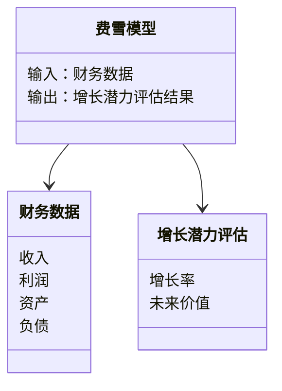
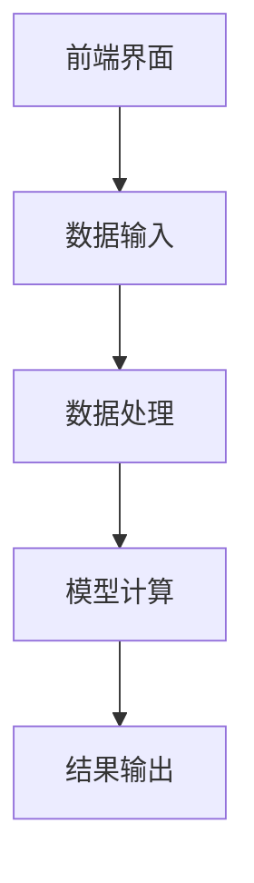
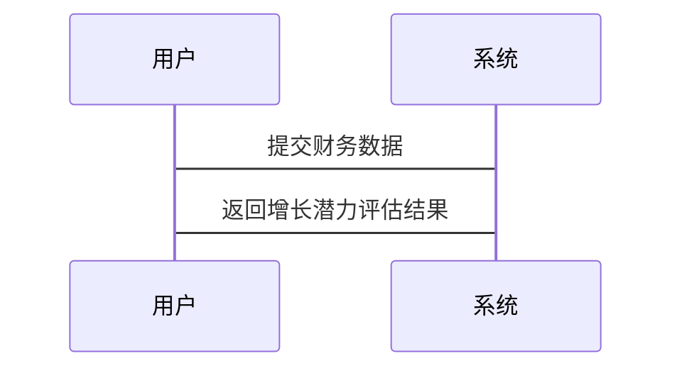

                 

# 费雪的未来增长潜力评估：看透当前财务数据

## 关键词：费雪模型, 财务数据, 未来增长潜力, 投资评估, 企业价值评估

## 摘要：本文深入探讨了费雪未来增长潜力评估的核心原理和方法，结合实际案例分析，展示了如何通过财务数据分析和数学模型构建，准确评估企业的未来增长潜力。文章从基础概念到系统架构，从算法推导到项目实战，全面解析了费雪模型的应用及其在投资决策中的重要性。

---

# 第1章: 费雪未来增长潜力评估概述

## 1.1 费雪未来增长潜力评估的背景与意义

### 1.1.1 费雪未来增长潜力评估的背景

在现代商业环境中，企业价值的评估不再仅仅依赖于历史表现，而是更加关注未来的增长潜力。投资者和企业管理者需要通过分析当前的财务数据，预测企业的未来表现，从而做出更明智的投资和管理决策。费雪未来增长潜力评估作为一种基于财务数据分析的方法，为我们提供了一个量化企业未来价值的框架。

### 1.1.2 费雪未来增长潜力评估的意义

通过费雪模型，我们可以将企业的财务数据转化为可量化的未来价值，帮助投资者和企业管理者更好地理解企业的增长潜力。这种评估方法不仅能够帮助我们识别高增长潜力的企业，还能够为投资决策提供科学依据。

## 1.2 费雪未来增长潜力评估的核心概念

### 1.2.1 费雪未来增长潜力的定义

费雪未来增长潜力是指企业在未来一段时间内，基于当前的财务状况和市场环境，所能实现的收入和利润的增长能力。这种增长潜力可以通过对企业财务数据的分析和建模来量化。

### 1.2.2 财务数据在评估中的作用

财务数据是评估企业未来增长潜力的核心依据。通过分析收入、利润、资产和负债等财务指标，我们可以了解企业的经营状况和财务健康程度，从而预测其未来的表现。

### 1.2.3 费雪模型的核心原理

费雪模型基于财务数据的可预测性和增长率的可量化性，通过数学模型将企业的当前价值与未来价值联系起来。其核心原理是通过计算企业的增长率，预测其未来价值。

## 1.3 费雪未来增长潜力评估的方法论

### 1.3.1 数据驱动的分析方法

费雪模型采用数据驱动的分析方法，通过对企业财务数据的分析，识别出影响企业增长的关键因素。

### 1.3.2 费雪模型的构建步骤

1. 收集企业的财务数据。
2. 计算企业的增长率。
3. 通过数学模型预测企业的未来价值。

## 1.4 本章小结

本章介绍了费雪未来增长潜力评估的背景和意义，明确了其核心概念和方法论，为后续的详细分析奠定了基础。

---

# 第2章: 财务数据与未来增长潜力的关系

## 2.1 财务数据的构成与分类

### 2.1.1 财务报表的三张表概述

企业的财务数据主要来源于资产负债表、利润表和现金流量表。这三张报表分别从不同的角度反映了企业的财务状况和经营成果。

- 资产负债表：反映企业在某一特定时点的资产、负债和所有者权益的状况。
- 利润表：反映企业在一定会计期间的收入、费用和利润情况。
- 现金流量表：反映企业在一定会计期间的现金流入和流出情况。

### 2.1.2 主要财务指标的定义与作用

- **收入**：企业在一定会计期间内通过销售商品或提供服务所获得的总收入。
- **利润**：企业在一定会计期间内的经营成果，即收入减去费用后的净收益。
- **资产**：企业过去的交易或事项形成的，由企业拥有或者控制的资源。
- **负债**：企业过去的交易或事项形成的，预期会导致经济利益流出的义务。

### 2.1.3 财务数据的可比性与可预测性

为了准确评估企业的未来增长潜力，财务数据需要具备可比性和可预测性。可比性是指财务数据能够与其他企业的数据进行比较，而可预测性是指财务数据能够反映出企业的未来趋势。

## 2.2 财务数据与企业增长潜力的关联性分析

### 2.2.1 收入与利润的关系

收入是企业增长的核心驱动因素，而利润则是收入扣除费用后的净收益。高收入和高利润通常意味着企业具有较高的增长潜力。

### 2.2.2 资产与负债对企业增长的影响

资产反映了企业的资源，而负债则反映了企业的债务。合理的资产和负债结构是企业持续增长的重要保障。

### 2.2.3 财务杠杆与企业增长潜力

财务杠杆是指企业通过债务融资来放大股东权益回报的能力。适度的财务杠杆可以提升企业的增长潜力，但过高的杠杆则可能增加企业的财务风险。

## 2.3 财务数据的质量评估

### 2.3.1 数据的真实性与准确性

真实的财务数据是评估企业增长潜力的基础。虚假或错误的数据可能导致评估结果的偏差。

### 2.3.2 数据的完整性与可比性

完整的财务数据能够全面反映企业的财务状况，而可比性则是指数据能够与其他企业或行业标准进行比较。

## 2.4 本章小结

本章分析了财务数据的构成与分类，探讨了财务数据与企业增长潜力的关联性，并提出了财务数据质量评估的重要性。

---

# 第3章: 费雪模型的核心原理与数学基础

## 3.1 费雪模型的基本假设

### 3.1.1 增长潜力的可量化性

费雪模型假设企业的增长潜力可以通过财务数据进行量化。

### 3.1.2 财务数据的可预测性

费雪模型假设企业的未来财务数据可以通过当前数据进行预测。

## 3.2 费雪模型的数学公式推导

### 3.2.1 增长率的计算公式

增长率的计算公式如下：

$$增长率 = \frac{收入增长}{初始收入}$$

其中，收入增长可以通过收入的变化量与初始收入的比率来衡量。

### 3.2.2 费雪模型的核心公式

费雪模型的核心公式是未来价值的计算公式：

$$未来价值 = 当前价值 \times (1 + 增长率)^n$$

其中，\( n \) 表示预测的年数。

### 3.2.3 增长率的验证与优化

为了验证增长率的计算公式，我们可以使用历史数据进行回测。通过比较实际增长率与模型预测的增长率，我们可以评估模型的准确性，并对其进行优化。

## 3.3 费雪模型的实现步骤

### 3.3.1 数据收集与预处理

收集企业的财务数据，并对其进行清洗和预处理，确保数据的准确性和完整性。

### 3.3.2 增长率的计算

根据财务数据，计算企业的增长率。

### 3.3.3 未来价值的预测

使用费雪模型的核心公式，预测企业的未来价值。

## 3.4 本章小结

本章详细推导了费雪模型的数学公式，并通过步骤说明了模型的实现过程。

---

# 第4章: 费雪模型的系统分析与架构设计

## 4.1 系统分析

### 4.1.1 问题场景介绍

企业在进行未来增长潜力评估时，需要一个系统化的解决方案。费雪模型为我们提供了一个基于财务数据分析的框架。

### 4.1.2 项目目标与范围

项目目标是通过构建费雪模型，评估企业的未来增长潜力。项目范围包括数据收集、模型构建和结果分析。

## 4.2 系统功能设计

### 4.2.1 领域模型（Mermaid 类图）

### 4.2.2 系统架构设计

### 4.2.3 系统接口设计

系统接口设计包括数据输入接口和结果输出接口。数据输入接口用于接收企业的财务数据，结果输出接口用于返回增长潜力评估结果。

### 4.2.4 系统交互设计

## 4.3 本章小结

本章通过系统分析与架构设计，展示了费雪模型的实现过程，包括领域模型、系统架构和系统交互设计。

---

# 第5章: 费雪模型的项目实战

## 5.1 项目背景

假设我们是一家科技公司，需要评估未来三年的增长潜力。

## 5.2 数据收集与预处理

### 5.2.1 数据收集

收集过去三年的收入、利润、资产和负债数据。

### 5.2.2 数据预处理

清洗数据，确保数据的完整性和准确性。

## 5.3 模型实现

### 5.3.1 增长率计算

根据历史数据，计算出年均增长率。

$$增长率 = \frac{收入增长}{初始收入}$$

### 5.3.2 未来价值预测

使用费雪模型的核心公式，预测未来三年的价值。

$$未来价值 = 当前价值 \times (1 + 增长率)^3$$

## 5.4 结果分析

通过对比实际增长率和模型预测的增长率，评估模型的准确性。

## 5.5 本章小结

本章通过一个实际案例，展示了费雪模型的项目实战过程。

---

# 第6章: 费雪模型的最佳实践与注意事项

## 6.1 最佳实践

### 6.1.1 数据质量的重要性

确保财务数据的准确性和完整性。

### 6.1.2 模型的可解释性

模型的可解释性是评估结果的重要保证。

## 6.2 注意事项

### 6.2.1 模型的局限性

费雪模型基于财务数据的可预测性，但实际市场环境可能会影响预测的准确性。

### 6.2.2 数据的时滞性

财务数据通常具有时滞性，可能无法反映最新的市场变化。

## 6.3 拓展阅读

建议进一步阅读相关文献，深入了解费雪模型的优化方法和应用案例。

## 6.4 本章小结

本章总结了费雪模型的最佳实践，并提出了使用模型时的注意事项。

---

# 第7章: 总结与展望

## 7.1 本文总结

本文详细介绍了费雪未来增长潜力评估的核心原理和方法，结合实际案例，展示了模型的实现过程和应用价值。

## 7.2 未来展望

未来，随着大数据和人工智能技术的发展，费雪模型可以通过更复杂的算法和模型进行优化，提高评估的准确性和实用性。

---

# 作者：AI天才研究院/AI Genius Institute & 禅与计算机程序设计艺术 /Zen And The Art of Computer Programming

