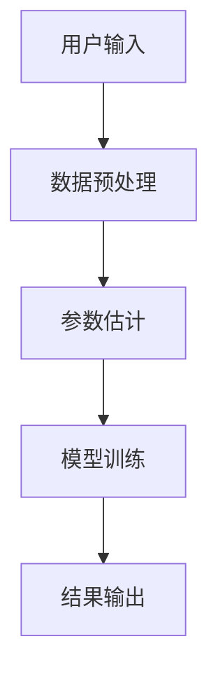

                 


# 费雪的未来增长预测模型：把握长期趋势

## 关键词
- 费雪增长模型
- 经济增长预测
- 长期趋势分析
- 数学模型
- 系统架构设计

## 摘要
费雪的未来增长预测模型是一种用于分析和预测经济增长趋势的数学模型，通过分析资本回报率、劳动投入以及其他关键因素，帮助我们把握长期经济增长的方向和潜在风险。本文将从模型的背景、核心概念、算法原理、系统架构设计、项目实战等多方面详细阐述费雪增长预测模型的理论与实践应用，帮助读者全面理解并掌握这一模型的使用方法。

---

## 第一部分: 费雪未来增长预测模型的背景与意义

### 第1章: 费雪未来增长预测模型概述

#### 1.1 模型的背景与提出
经济增长是现代社会发展的核心动力，准确预测经济增长趋势对于政策制定、投资决策以及企业战略规划具有重要意义。然而，传统的经济增长预测方法往往依赖于简单的线性回归或统计分析，难以捕捉经济增长的复杂性和动态性。费雪的未来增长预测模型作为一种基于经济理论和数学模型的预测工具，为解决这一问题提供了新的思路。

#### 1.2 模型的核心思想与意义
费雪模型的核心思想是通过分析资本回报率、劳动投入以及其他关键经济变量之间的关系，预测未来经济增长的潜在趋势。与传统模型相比，费雪模型更加注重变量之间的动态关系和系统性，能够更好地捕捉经济增长的长期趋势。

#### 1.3 模型的实际应用优势
费雪模型不仅能够提供经济增长的定量预测，还可以通过分析模型参数的变化，揭示经济增长的关键驱动因素，为政策制定者和企业提供科学依据。

---

### 第2章: 费雪未来增长预测模型的核心概念与联系

#### 2.1 模型的基本假设
- 经济系统是一个开放的复杂系统，受到多种内外部因素的影响。
- 资本回报率和劳动投入是经济增长的主要驱动因素。
- 经济变量之间的关系是动态且非线性的。

#### 2.2 模型的输入变量与输出变量
- **输入变量**: 资本（K）、劳动（L）、资本回报率（r）、技术进步（T）。
- **输出变量**: 经济增长（GDP）。

#### 2.3 模型的核心公式与数学表达
$$ G = r \times K + \alpha \times L + \beta \times T $$

其中：
- $G$ 表示经济增长率。
- $r$ 表示资本回报率。
- $K$ 表示资本存量。
- $\alpha$ 表示劳动对经济增长的贡献系数。
- $L$ 表示劳动投入。
- $\beta$ 表示技术进步对经济增长的贡献系数。
- $T$ 表示技术进步水平。

---

## 第二部分: 费雪未来增长预测模型的算法原理

### 第3章: 模型的数学模型与公式

#### 3.1 模型的数学表达
费雪模型通过将资本回报率、劳动投入和技术进步等因素结合起来，预测经济增长的趋势。其数学表达式如下：

$$ G = r \times K + \alpha \times L + \beta \times T $$

其中，$r$ 和 $\beta$ 是需要通过数据拟合和参数估计确定的模型参数。

#### 3.2 模型的变量关系分析
- 资本回报率 $r$ 是模型的核心变量之一，其变化直接影响经济增长率 $G$。
- 劳动投入 $L$ 和技术进步 $T$ 则通过参数 $\alpha$ 和 $\beta$ 影响经济增长。

---

### 第4章: 模型的算法实现

#### 4.1 数据收集与预处理
- 数据来源：包括国家统计局的GDP数据、资本存量数据、劳动数据等。
- 数据预处理：包括数据清洗、标准化和特征提取。

#### 4.2 参数估计
- 方法：使用最小二乘法（OLS）或最大似然估计（MLE）进行参数估计。
- 代码示例：
```python
import numpy as np
from sklearn.linear_model import LinearRegression

# 示例数据
capital = np.array([100, 200, 300, 400])
labor = np.array([50, 60, 70, 80])
growth = np.array([5, 10, 15, 20])

X = np.vstack((capital, labor))
y = growth

# 模型训练
model = LinearRegression()
model.fit(X.reshape(-1, 2), y)

# 参数估计
r = model.coef_[0]
alpha = model.coef_[1]
```

#### 4.3 模型验证与优化
- 交叉验证：通过训练集和测试集验证模型的预测能力。
- 模型优化：调整模型参数或引入更多变量以提高预测精度。

---

## 第三部分: 系统分析与架构设计方案

### 第5章: 系统功能设计

#### 5.1 问题场景介绍
- 用户需求：企业或政策制定者需要预测未来经济增长趋势。
- 使用场景：经济预测、投资决策、政策制定。

#### 5.2 系统功能模块
- 数据输入与预处理模块。
- 参数估计与模型训练模块。
- 预测结果输出模块。

#### 5.3 系统架构设计


---

### 第6章: 项目实战

#### 6.1 环境安装
- Python 3.8+
- NumPy、Pandas、Scikit-learn库。

#### 6.2 核心代码实现
```python
import numpy as np
import pandas as pd
from sklearn.linear_model import LinearRegression
from sklearn.metrics import mean_squared_error

# 数据加载
data = pd.read_csv('economic_data.csv')
capital = data['capital']
labor = data['labor']
growth = data['growth']

# 模型训练
model = LinearRegression()
model.fit(capital.values.reshape(-1, 1), growth)

# 预测结果
predicted_growth = model.predict(capital.values.reshape(-1, 1))
print('预测经济增长:', predicted_growth)
print('均方误差:', mean_squared_error(growth, predicted_growth))
```

#### 6.3 案例分析
- 数据来源：假设我们有一个包含资本、劳动和经济增长的数据集。
- 模型训练：使用线性回归方法训练模型。
- 预测结果：输出经济增长的预测值和模型性能指标。

---

## 第四部分: 总结与展望

### 第7章: 模型总结与展望

#### 7.1 模型的优缺点
- 优点：简单易懂，计算效率高。
- 缺点：忽略了其他重要因素，如政府政策、国际市场波动等。

#### 7.2 模型的实际应用建议
- 结合其他模型（如ARIMA、机器学习模型）进行综合预测。
- 定期更新模型参数，以适应经济环境的变化。

#### 7.3 未来研究方向
- 探索非线性模型，提高预测精度。
- 引入更多经济指标，丰富模型的变量组合。

---

## 附录: 数据集与参考文献

### 附录A: 数据集说明
- 数据集名称：economic_data.csv
- 数据描述：包括资本、劳动和经济增长的相关数据。

### 附录B: 参考文献
1. 费雪的经典著作。
2. 相关经济增长理论的文献。

---

## 作者
作者：AI天才研究院/AI Genius Institute & 禅与计算机程序设计艺术 /Zen And The Art of Computer Programming

