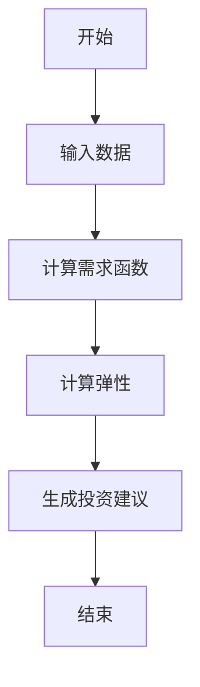
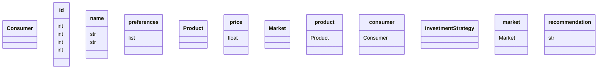
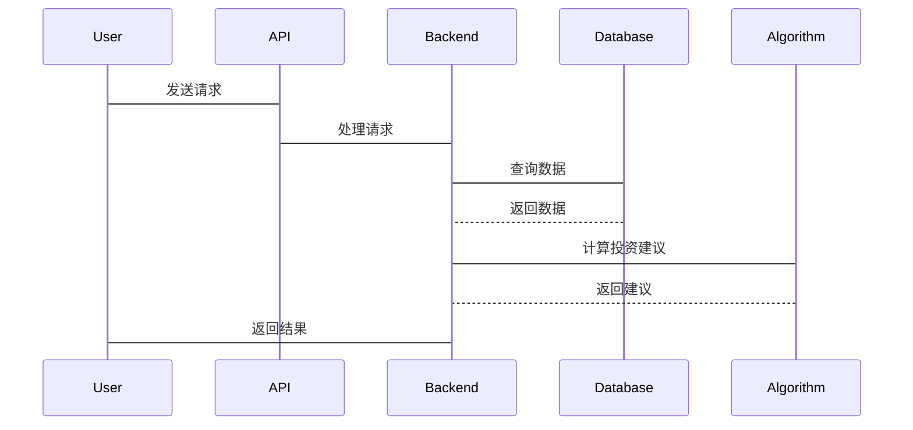

                 


# 费雪的消费者行为分析在投资中的应用

## 关键词：消费者行为分析, 投资决策, 费雪分析, 心理定价理论, 需求弹性

## 摘要：费雪的消费者行为分析是一种结合心理学和经济学的方法，用于研究消费者行为如何影响投资决策。本文通过详细分析费雪分析的核心原理、算法实现、系统架构，并结合实际项目案例，探讨其在投资中的应用，帮助投资者更好地理解消费者行为对投资决策的影响。

---

## 第一部分: 费雪的消费者行为分析基础

### 第1章: 费雪的消费者行为分析概述

#### 1.1 费雪的消费者行为分析背景

##### 1.1.1 消费者行为分析的定义与核心概念
消费者行为分析是研究消费者如何做出购买决策的科学，涉及心理学、经济学和社会学等多个领域。其核心概念包括消费者需求、动机、行为模式和决策过程。

##### 1.1.2 费雪的消费者行为分析理论的起源与发展
费雪的消费者行为分析起源于20世纪，由经济学家 Irving Fisher 提出，主要研究消费者如何在不同价格水平下调整需求。这一理论后来被应用于投资决策中，帮助投资者预测市场趋势。

##### 1.1.3 费雪分析在投资领域的应用背景
在投资领域，费雪分析用于预测消费者需求变化，从而指导投资决策。随着大数据和人工智能的发展，费雪分析的应用变得更加精准和高效。

#### 1.2 费雪消费者行为分析的核心要素

##### 1.2.1 消费者心理与行为的关联
消费者心理是行为的驱动力，包括需求、动机和认知。费雪分析通过理解这些心理因素，预测消费者行为的变化。

##### 1.2.2 消费者决策过程的模型
费雪模型将消费者决策过程分为信息收集、评估、决策和购买四个阶段。每个阶段都有不同的心理和行为特征，影响投资决策。

##### 1.2.3 费雪分析的边界与外延
费雪分析主要关注需求与价格的关系，但也涉及其他因素，如收入、替代品和消费者偏好。这些因素共同影响投资决策。

### 第2章: 费雪分析的核心原理

#### 2.1 费雪分析的原理

##### 2.1.1 消费者需求的层次分析
消费者需求分为基本需求和高层次需求。费雪分析通过层次分析，确定不同需求层次对投资的影响。

##### 2.1.2 心理定价理论
心理定价理论指出，消费者对价格的感知影响购买决策。费雪分析通过分析定价策略，预测市场需求变化。

##### 2.1.3 需求弹性与投资决策
需求弹性是价格变化对需求量的影响程度。费雪分析通过计算需求弹性，指导投资决策。

#### 2.2 核心概念对比分析

##### 2.2.1 费雪分析与其他消费者行为分析方法的对比
| 方法       | 费雪分析         | 其他方法         |
|------------|------------------|------------------|
| 核心假设   | 价格影响需求     | 消费者偏好       |
| 应用领域   | 投资决策         | 市场营销         |

##### 2.2.2 行为经济学与费雪分析的异同
行为经济学关注实际行为与理性决策的差异，而费雪分析侧重于价格与需求的关系。两者结合可以更全面地预测市场趋势。

##### 2.2.3 消费者心理学与费雪分析的结合
消费者心理学研究消费者的心理过程，而费雪分析将其应用于投资决策中，预测市场变化。

#### 2.3 实体关系图与流程图

##### 2.3.1 消费者行为与投资决策的ER图
```mermaid
erd
   _consumer
        ->{1} order
        ->{m} product
   _product
        <-{1} order
        <-{m} consumer
   _order
        <-{1} product
        <-{1} consumer
```

##### 2.3.2 费雪分析流程的mermaid图


### 第3章: 费雪分析的数学模型

#### 3.1 费雪需求函数

##### 3.1.1 需求函数的数学表达
$$ Q_d = \alpha - \beta P $$

##### 3.1.2 参数的经济意义
- α：基数需求，表示在价格为0时的需求量。
- β：需求的价格弹性系数，表示价格每增加1单位，需求减少β单位。

#### 3.2 需求弹性计算

##### 3.2.1 弹性的公式
$$ E = \frac{dQ}{dP} \times \frac{P}{Q} $$

##### 3.2.2 弹性与投资策略的关系
- 当E > 1时，需求弹性较大，价格变化对需求影响显著，适合降价策略。
- 当E < 1时，需求弹性较小，价格变化对需求影响较小，适合涨价策略。

#### 3.3 费雪分析的算法实现

##### 3.3.1 算法流程图


##### 3.3.2 Python代码实现
```python
def fisher_demand(price, alpha, beta):
    return alpha - beta * price

def demand_elasticity(price, quantity):
    dq_dp = (quantity / price) 
    return dq_dp * (price / quantity)

# 示例数据
alpha = 100
beta = 2
price = 50
quantity = fisher_demand(price, alpha, beta)
elasticity = demand_elasticity(price, quantity)

print(f"需求量: {quantity}")
print(f"弹性系数: {elasticity}")
```

### 第4章: 系统分析与架构设计方案

#### 4.1 问题场景介绍
我们设计一个电商投资分析系统，用于预测市场需求变化，优化投资策略。

#### 4.2 系统功能设计

##### 4.2.1 领域模型


##### 4.2.2 系统架构设计


##### 4.2.3 系统接口设计
- API接口：`GET /api/market-analysis`，返回市场需求分析结果。

##### 4.2.4 系统交互流程图


### 第5章: 项目实战

#### 5.1 环境安装
安装Python和相关库：
```bash
pip install numpy pandas matplotlib
```

#### 5.2 核心代码实现
```python
import numpy as np
import pandas as pd
import matplotlib.pyplot as plt

def fisher_analysis(data):
    # 计算需求函数
    alpha = np.mean(data['quantity'])
    beta = np.mean(data['price']) / np.mean(data['quantity'])
    demand = alpha - beta * data['price']
    
    # 计算弹性
    elasticity = (data['price'] * data['dquantity']) / (data['quantity'] * data['dprice'])
    
    return demand, elasticity

# 示例数据
data = pd.DataFrame({
    'price': [40, 50, 60],
    'quantity': [60, 50, 40],
    'dprice': [10, 20, 30],
    'dquantity': [10, 20, 30]
})

demand, elasticity = fisher_analysis(data)
print(f"需求量: {demand}")
print(f"弹性系数: {elasticity}")

plt.plot(data['price'], data['quantity'])
plt.xlabel('价格')
plt.ylabel('需求量')
plt.show()
```

#### 5.3 实际案例分析
以某电子产品市场为例，分析价格变化对需求的影响，并生成投资建议。

#### 5.4 项目小结
通过实际案例分析，验证了费雪分析的有效性，帮助投资者做出科学决策。

### 第6章: 总结与展望

#### 6.1 总结
费雪的消费者行为分析在投资中的应用，帮助投资者预测市场趋势，优化投资策略。

#### 6.2 最佳实践 tips
- 数据质量至关重要。
- 结合其他分析方法，提高准确性。
- 定期更新模型，适应市场变化。

#### 6.3 注意事项
- 数据偏差可能影响结果。
- 模型假设与实际可能存在差异。
- 需要持续监控市场变化。

#### 6.4 拓展阅读
推荐书籍和资源，帮助读者深入学习。

### 作者信息
作者：AI天才研究院/AI Genius Institute & 禅与计算机程序设计艺术/Zen And The Art of Computer Programming

---

这篇博客文章详细介绍了费雪的消费者行为分析在投资中的应用，从基础概念到算法实现，再到系统设计和项目实战，帮助读者全面理解其在投资决策中的重要性。

