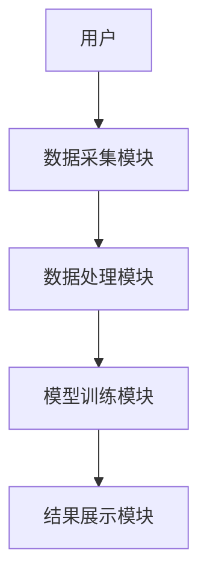
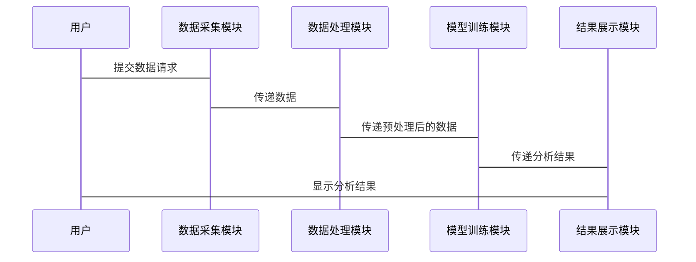

                 


# 费雪的消费者行为分析：把握市场需求变化

> **关键词**：消费者行为分析、费雪需求函数、市场需求变化、数据分析、算法实现、系统架构设计

> **摘要**：本文深入探讨了费雪的消费者行为分析理论，结合数学模型和实际案例，详细讲解了如何通过数据分析和算法实现来预测和把握市场需求变化。文章从背景介绍、核心概念、算法原理、系统架构设计到实战应用，全面剖析了费雪理论在现代市场分析中的应用及其重要意义。

---

## 第1章: 费雪的消费者行为分析概述

### 1.1 费雪的消费者行为分析背景

#### 1.1.1 消费者行为分析的起源与发展

消费者行为分析是一门研究消费者在市场中的行为模式及其决策过程的学科。它起源于20世纪初，随着市场营销学的发展而逐渐成熟。费雪（John R. Hicks）在1934年提出了需求函数的概念，为消费者行为分析奠定了理论基础。

#### 1.1.2 费雪理论的核心思想

费雪的需求函数理论认为，消费者的需求量不仅受到价格的影响，还受到收入、偏好等多种因素的影响。需求函数可以表示为：
$$ Q = Q(P, I, U) $$
其中，$Q$是需求量，$P$是价格，$I$是收入，$U$是消费者效用。

#### 1.1.3 消费者行为分析的现实意义

在现代市场经济中，消费者行为分析帮助企业更好地理解市场需求，优化产品策略和营销策略。通过分析消费者行为，企业可以预测市场需求变化，制定更有效的市场战略。

### 1.2 消费者行为分析的核心概念

#### 1.2.1 消费者需求的层次划分

消费者需求可以分为不同的层次，从基本的生理需求到高层次的心理需求。费雪的需求函数将需求划分为价格需求和效用需求。

#### 1.2.2 消费者决策过程的模型

消费者决策过程通常包括五个阶段：问题识别、信息收集、评估和选择、购买和使用、效果反馈。

#### 1.2.3 市场需求变化的驱动因素

市场需求的变化由多种因素驱动，包括经济环境、消费者偏好、技术进步和市场竞争等。

---

## 第2章: 费雪的消费者行为分析理论

### 2.1 费雪需求函数的数学模型

#### 2.1.1 需求函数的基本形式

费雪的需求函数可以表示为：
$$ Q = Q(P, I, U) $$

#### 2.1.2 需求函数的参数解释

- $P$：商品价格
- $I$：消费者收入
- $U$：消费者效用

#### 2.1.3 需求函数的假设条件

假设消费者在预算约束下追求效用最大化。

### 2.2 费雪需求函数的推导过程

#### 2.2.1 假设条件的设定

消费者在价格和收入约束下选择最优商品组合。

#### 2.2.2 推导过程的详细步骤

1. 建立效用函数：$U = U(x_1, x_2, \dots, x_n)$
2. 建立预算约束：$\sum_{i=1}^n P_i x_i = I$
3. 使用拉格朗日乘数法求解最优解。

#### 2.2.3 推导结果的验证

通过数学推导验证需求函数的合理性。

### 2.3 费雪需求函数的扩展与应用

#### 2.3.1 多商品需求函数的扩展

将单商品需求函数扩展为多商品需求函数。

#### 2.3.2 需求函数在市场预测中的应用

利用需求函数预测市场销售量和价格变化。

#### 2.3.3 需求函数在政策制定中的作用

为企业制定价格策略和政府制定政策提供理论依据。

---

## 第3章: 消费者行为分析的数据收集与处理

### 3.1 数据收集方法

#### 3.1.1 调查问卷设计

设计有效的问卷，收集消费者行为数据。

#### 3.1.2 实验设计与实施

通过实验方法收集消费者行为数据。

#### 3.1.3 数据采集工具的选择

选择适合的数据采集工具，如问卷星、Google Forms等。

### 3.2 数据处理与清洗

#### 3.2.1 数据清洗的必要性

确保数据的准确性和完整性。

#### 3.2.2 数据清洗的步骤与方法

包括去除重复数据、处理缺失值、纠正异常值等。

#### 3.2.3 数据标准化与归一化

对数据进行标准化和归一化处理，以便后续分析。

### 3.3 数据分析与建模

#### 3.3.1 数据分析的基本方法

包括描述性分析、诊断性分析和预测性分析。

#### 3.3.2 数据建模的步骤与流程

包括数据预处理、模型选择、模型训练和模型评估。

#### 3.3.3 数据建模的验证与评估

通过交叉验证和评估指标（如R²、MAE等）验证模型的准确性。

---

## 第4章: 费雪需求函数的算法实现

### 4.1 算法原理

#### 4.1.1 费雪需求函数的数学模型

$$ Q = Q(P, I, U) $$

#### 4.1.2 算法的基本思想

通过数据拟合和优化算法求解需求函数的参数。

#### 4.1.3 算法的实现步骤

1. 数据预处理：清洗和标准化数据。
2. 模型选择：选择适合的回归模型。
3. 模型训练：使用优化算法求解模型参数。
4. 模型验证：评估模型的准确性和稳定性。

### 4.2 算法实现的具体步骤

#### 4.2.1 数据预处理

```python
import pandas as pd
import numpy as np

# 读取数据
data = pd.read_csv('consumer_behavior.csv')

# 处理缺失值
data = data.dropna()

# 标准化数据
from sklearn.preprocessing import StandardScaler
scaler = StandardScaler()
data_scaled = scaler.fit_transform(data)
```

#### 4.2.2 模型选择与训练

```python
from sklearn.linear_model import LinearRegression
from sklearn.metrics import mean_squared_error

# 训练模型
model = LinearRegression()
model.fit(data_scaled, target)

# 预测结果
predicted = model.predict(data_scaled)
```

#### 4.2.3 模型验证

```python
# 计算均方误差
mse = mean_squared_error(target, predicted)
print('均方误差:', mse)
```

### 4.3 算法的优化与改进

#### 4.3.1 算法的优化策略

使用正则化方法（如Lasso回归）优化模型。

#### 4.3.2 算法的并行计算

利用并行计算加速模型训练过程。

#### 4.3.3 算法的调参与优化

通过网格搜索（Grid Search）优化模型参数。

---

## 第5章: 系统架构设计与实现

### 5.1 系统功能设计

#### 5.1.1 系统功能模块

- 数据采集模块
- 数据处理模块
- 模型训练模块
- 结果展示模块

#### 5.1.2 系统功能流程

1. 数据采集模块：收集消费者行为数据。
2. 数据处理模块：清洗和预处理数据。
3. 模型训练模块：训练需求函数模型。
4. 结果展示模块：展示分析结果。

### 5.2 系统架构设计

#### 5.2.1 系统架构图



#### 5.2.2 系统接口设计

- 数据接口：数据输入和输出接口。
- 模型接口：模型训练和预测接口。

#### 5.2.3 系统交互设计



### 5.3 系统实现与优化

#### 5.3.1 系统实现步骤

1. 环境搭建：安装必要的开发工具和库。
2. 模块开发：分别开发数据采集、处理、训练和展示模块。
3. 系统集成：将各模块集成到一个完整的系统中。

#### 5.3.2 系统优化策略

- 使用分布式计算优化数据处理和模型训练。
- 采用缓存技术优化数据访问效率。
- 使用图形化界面优化用户体验。

---

## 第6章: 实战应用与案例分析

### 6.1 实战环境搭建

#### 6.1.1 环境配置

```bash
pip install pandas numpy scikit-learn
```

#### 6.1.2 数据集准备

使用公开数据集或企业内部数据集。

### 6.2 核心代码实现

#### 6.2.1 数据处理代码

```python
import pandas as pd
import numpy as np
from sklearn.linear_model import LinearRegression
from sklearn.metrics import mean_squared_error
from sklearn.preprocessing import StandardScaler

# 读取数据
data = pd.read_csv('consumer_behavior.csv')

# 处理缺失值
data = data.dropna()

# 标准化数据
scaler = StandardScaler()
data_scaled = scaler.fit_transform(data)

# 训练模型
model = LinearRegression()
model.fit(data_scaled, target)

# 预测结果
predicted = model.predict(data_scaled)
```

#### 6.2.2 模型训练代码

```python
from sklearn.model_selection import train_test_split

# 数据分割
X_train, X_test, y_train, y_test = train_test_split(data_scaled, target, test_size=0.2)

# 训练模型
model.fit(X_train, y_train)

# 预测结果
predicted = model.predict(X_test)
```

#### 6.2.3 结果展示代码

```python
import matplotlib.pyplot as plt

# 可视化结果
plt.scatter(y_test, predicted)
plt.xlabel('真实值')
plt.ylabel('预测值')
plt.show()
```

### 6.3 实战案例分析

#### 6.3.1 案例背景

分析某企业的消费者行为数据，预测市场需求变化。

#### 6.3.2 数据分析与建模

使用费雪需求函数模型进行数据分析和建模。

#### 6.3.3 结果解读与策略制定

根据模型预测结果，制定市场策略。

### 6.4 实战总结

#### 6.4.1 实战收获

掌握费雪需求函数的算法实现和实战应用。

#### 6.4.2 注意事项

注意数据质量和模型选择，避免过拟合和欠拟合。

#### 6.4.3 拓展思考

探索其他消费者行为分析方法，如协同过滤和机器学习方法。

---

## 第7章: 总结与展望

### 7.1 总结

本文详细介绍了费雪的消费者行为分析理论，结合数据分析和算法实现，展示了如何通过费雪需求函数预测市场需求变化。

### 7.2 当前趋势与未来展望

随着大数据和人工智能技术的发展，消费者行为分析将更加精准和智能化。

### 7.3 最佳实践 tips

- 数据质量是关键，确保数据的准确性和完整性。
- 模型选择要结合实际场景，选择合适的算法。
- 结果解读要结合业务背景，制定有效的市场策略。

---

## 作者信息

作者：AI天才研究院/AI Genius Institute & 禅与计算机程序设计艺术 /Zen And The Art of Computer Programming

---

以上就是《费雪的消费者行为分析：把握市场需求变化》的完整目录大纲和文章内容，涵盖了从理论到实践的各个方面，结合了技术博客的专业性和易懂性。希望对您有所帮助！

