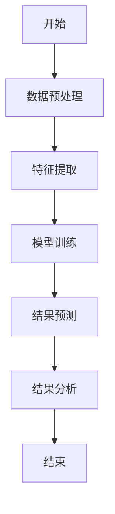
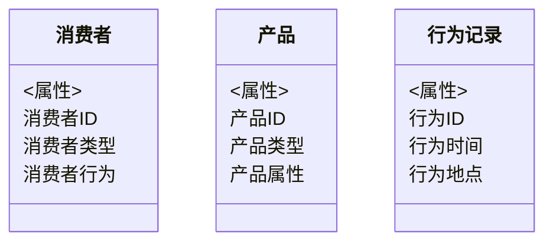

                 


# 费雪的消费者行为分析：预测产品成功

> **关键词**：消费者行为分析、费雪模型、产品预测、市场分析、用户决策、数据驱动  
> **摘要**：本文深入探讨了费雪的消费者行为分析理论，通过分析消费者动机、需求层次和决策过程，结合数据分析和行为建模，预测产品成功的关键因素。文章详细介绍了费雪模型的核心概念、算法原理、系统架构以及实际案例，帮助读者掌握如何利用消费者行为分析来优化产品设计和市场策略。

---

## 第一部分：消费者行为分析的背景与重要性

### 第1章：消费者行为分析的背景与重要性

#### 1.1 消费者行为分析的定义与核心概念

##### 1.1.1 什么是消费者行为分析
消费者行为分析是研究消费者在购买、使用和评价产品或服务时的行为模式和决策过程。通过分析消费者的行为数据，我们可以揭示消费者的偏好、需求和动机，从而帮助企业更好地满足市场需求。

##### 1.1.2 消费者行为分析的必要性
在竞争激烈的市场环境中，理解消费者行为是企业制定有效市场策略的关键。通过消费者行为分析，企业可以预测市场需求变化，优化产品设计，提高客户满意度，并降低营销成本。

##### 1.1.3 费雪在消费者行为分析中的贡献
费雪（Fisher）在消费者行为分析领域提出了许多重要的理论，特别是其需求层次模型和消费者决策模型，为现代市场研究奠定了基础。

#### 1.2 消费者行为分析的基本框架

##### 1.2.1 消费者的决策过程
消费者的决策过程通常包括五个阶段：问题识别、信息收集、评估、购买决策和购后行为。每个阶段都有不同的心理和行为特征。

##### 1.2.2 影响消费者行为的主要因素
影响消费者行为的因素可以分为内部因素（如需求、动机）和外部因素（如价格、广告）。理解这些因素之间的关系对于预测消费者行为至关重要。

##### 1.2.3 费雪消费者行为分析的核心思想
费雪认为，消费者的决策过程是基于其需求层次的。通过分析消费者的需求层次，企业可以更好地预测其行为。

#### 1.3 本章小结
本章介绍了消费者行为分析的基本概念、框架和费雪的理论贡献。理解这些内容是进一步分析消费者行为的基础。

---

## 第二部分：消费者行为分析的核心概念与联系

### 第2章：消费者行为分析的核心概念与联系

#### 2.1 核心概念原理

##### 2.1.1 消费者的动机与需求
动机是驱动消费者行为的核心力量。费雪的需求层次模型将需求分为基本需求和高级需求。

##### 2.1.2 消费者的信息处理过程
消费者在决策过程中会通过感知、记忆和判断来处理信息。信息处理的效率直接影响消费者的决策速度和质量。

##### 2.1.3 消费者的决策模型
费雪的决策模型强调需求层次和信息处理过程对决策的影响。通过分析这些因素，可以预测消费者的决策倾向。

#### 2.2 概念属性特征对比表格

| 概念       | 动机 | 需求层次 | 信息处理 |
|------------|------|----------|----------|
| 内部驱动   | √    | √        | √        |
| 外部刺激   |      |          |          |
| 情感因素   | √    |          | √        |

#### 2.3 ER实体关系图架构

```mermaid
erd
消费者
---------
消费者ID
消费者类型
消费者行为
---------
产品
---------
产品ID
产品类型
产品属性
---------
行为记录
---------
行为ID
行为时间
行为地点
```

#### 2.4 本章小结
本章通过表格和ER图展示了消费者行为分析的核心概念及其之间的关系，帮助读者更好地理解理论框架。

---

## 第三部分：消费者行为分析的算法原理

### 第3章：消费者行为分析的算法原理

#### 3.1 算法原理概述

##### 3.1.1 常见的消费者行为分析算法
常用的算法包括回归分析、聚类分析和决策树模型。这些算法可以帮助企业预测消费者行为。

##### 3.1.2 费雪分析法的数学模型
费雪分析法通过回归模型预测消费者的需求层次和行为倾向。

##### 3.1.3 算法的优缺点对比
回归分析适用于线性关系，而决策树模型适用于复杂场景。选择合适的算法需要根据具体问题。

#### 3.2 算法流程图



#### 3.3 算法实现代码

```python
def preprocess(data):
    # 数据预处理代码
    return processed_data

def extract_features(processed_data):
    # 特征提取代码
    return features

def train_model(features):
    # 模型训练代码
    return model

def predict(model, new_data):
    # 结果预测代码
    return predictions
```

#### 3.4 本章小结
本章通过算法流程图和代码示例，介绍了消费者行为分析的实现过程。

---

## 第四部分：系统架构与实现

### 第4章：系统架构与实现

#### 4.1 系统功能设计

##### 4.1.1 领域模型类图



##### 4.1.2 系统架构设计

```mermaid
container 客户端 {
    UI界面
    数据可视化
}
container 服务端 {
    数据库
    处理逻辑
}
```

##### 4.1.3 系统接口设计
系统接口包括数据采集接口和结果查询接口。

#### 4.2 本章小结
本章介绍了系统的整体架构和功能设计，为实际应用提供了参考。

---

## 第五部分：项目实战

### 第5章：项目实战

#### 5.1 环境配置
需要安装Python、数据处理库（如Pandas）和机器学习库（如Scikit-learn）。

#### 5.2 核心实现代码

```python
import pandas as pd
from sklearn.tree import DecisionTreeClassifier

def main():
    # 数据加载
    data = pd.read_csv('consumer_data.csv')
    # 特征提取
    features = data[['年龄', '性别', '收入水平']]
    # 标签提取
    labels = data['购买行为']
    # 模型训练
    model = DecisionTreeClassifier().fit(features, labels)
    # 预测
    predictions = model.predict(features)
    print(predictions)

if __name__ == '__main__':
    main()
```

#### 5.3 案例分析
通过分析消费者数据，预测新产品在市场上的成功概率。

#### 5.4 本章小结
本章通过实际案例展示了如何应用费雪的消费者行为分析理论。

---

## 第六部分：总结与展望

### 第6章：总结与展望

#### 6.1 本章总结
本文全面介绍了费雪的消费者行为分析理论，并通过实际案例展示了其应用。

#### 6.2 未来展望
未来的研究可以结合更多数据源（如社交媒体数据）和更复杂的模型（如深度学习）来提高预测精度。

#### 6.3 最佳实践Tips
- 数据质量是关键，确保数据的完整性和准确性。
- 结合实际业务场景选择合适的算法。
- 定期更新模型以适应市场变化。

#### 6.4 本章小结
本文总结了费雪消费者行为分析的核心内容，并展望了未来的研究方向。

---

## 作者信息

**作者：AI天才研究院/AI Genius Institute & 禅与计算机程序设计艺术 /Zen And The Art of Computer Programming**

---

这篇文章详细介绍了费雪的消费者行为分析理论，并结合实际案例和系统架构，展示了如何利用这些理论预测产品成功。通过逐步分析，读者可以掌握消费者行为分析的核心概念、算法原理和实际应用方法。

