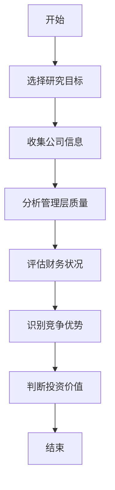
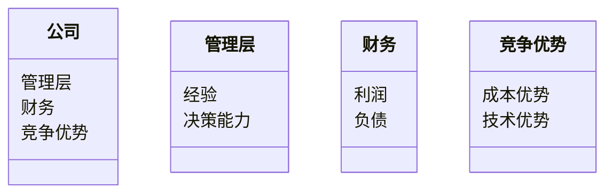

                 


# 费雪的深度研究方法：了解公司内部

## 关键词：
- 费雪投资方法
- 深度研究
- 公司分析
- 管理层评估
- 财务分析
- 竞争优势

## 摘要：
本文深入探讨了费雪的深度研究方法，分析了其在公司内部评估中的应用。通过详细分析费雪的核心理念、研究方法、算法原理、系统架构及实际案例，本文为投资者提供了全面的指导，帮助其更好地理解和应用费雪的投资策略。

---

# 第1章 费雪投资理念与研究方法背景

## 1.1 费雪投资理念的起源与发展

### 1.1.1 费雪的生平与投资背景
菲利普·费雪（Philip Fisher）是20世纪的投资大师，以“成长型投资”理念闻名。他于1906年进入投资领域，经历了大萧条时期，逐步发展出一套独特的投资方法。费雪的投资理念强调长期增长，关注公司的基本面和管理层质量。

### 1.1.2 费雪投资理念的核心思想
费雪的核心思想是“投资于成长”，即寻找那些能够持续增长的企业。他认为，企业的成长潜力比短期盈利能力更重要，因此需要深入分析公司的管理层、财务状况和行业地位。

### 1.1.3 费雪研究方法的演变与影响
费雪的方法最初用于分析制造业和科技公司，后来被广泛应用于其他行业。他的方法强调对公司内部的深度研究，尤其是管理层的质量和公司的财务健康状况。

## 1.2 费雪深度研究方法的背景

### 1.2.1 现代投资学的理论基础
费雪的方法建立在现代投资学的基础之上，尤其是关于资产定价和风险分析的理论。他结合这些理论，提出了自己的研究框架。

### 1.2.2 费雪方法与传统投资分析的区别
传统投资分析侧重于技术分析和市场趋势，而费雪的方法更注重基本面分析，尤其是公司的内部因素。

### 1.2.3 费雪方法在投资实践中的应用价值
费雪的方法在实践中被证明是有效的，尤其是在长期投资中。通过深度研究公司内部因素，投资者可以更准确地评估公司的潜在价值。

## 1.3 费雪研究方法的核心要素

### 1.3.1 核心概念
- **管理层质量**：管理层的能力和道德是公司成功的关键。
- **财务状况**：公司财务健康状况直接影响其增长潜力。
- **竞争优势**：公司在行业中的竞争优势决定了其长期盈利能力。

### 1.3.2 核心概念的属性特征
| 核心概念 | 属性 | 描述 |
|----------|------|------|
| 管理层质量 | 专业能力 | 管理层是否具备行业经验 |
| 财务状况 | 盈利能力 | 公司的盈利能力是否稳定 |
| 竞争优势 | 竞争壁垒 | 公司是否具备独特的竞争优势 |

### 1.3.3 核心概念的结构与联系


---

# 第2章 费雪深度研究方法的核心概念与联系

## 2.1 费雪方法的核心概念

### 2.1.1 管理层质量评估
评估管理层的质量包括考察其经验、决策能力和道德标准。例如，可以通过管理层的过往业绩和行业声誉来判断。

### 2.1.2 公司财务状况分析
财务状况分析包括利润表、资产负债表和现金流量表的分析。重点关注公司的盈利能力、负债水平和现金流状况。

### 2.1.3 行业竞争结构分析
行业分析包括市场集中度、竞争壁垒和市场增长潜力。了解行业结构有助于判断公司的竞争优势。

### 2.1.4 公司竞争优势分析
竞争优势分析包括成本优势、技术优势和品牌优势。这些因素决定了公司在行业中的地位和盈利能力。

## 2.2 核心概念的属性特征对比

### 2.2.1 管理层质量与财务状况的对比分析
- 管理层质量影响公司财务状况，但财务状况也可能反过来影响管理层的决策。

### 2.2.2 竞争优势与行业结构的对比分析
- 竞争优势是公司内部因素，而行业结构是外部因素，两者共同决定公司的市场地位。

### 2.2.3 核心概念的综合评价指标
- 综合评分：通过加权平均的方法，对管理层质量、财务状况和竞争优势进行综合评分。

## 2.3 费雪方法的ER实体关系图


---

# 第3章 费雪深度研究方法的算法原理

## 3.1 费雪方法的算法流程

### 3.1.1 算法流程图


### 3.1.2 算法实现的数学模型
$$投资价值 = f(管理层质量, 财务状况, 竞争优势)$$

### 3.1.3 核心变量的权重分配
$$权重矩阵 = [w_1, w_2, w_3]$$

## 3.2 算法实现的Python代码

```python
def fisher_analysis(company_info):
    管理层质量 = company_info['管理层']
    财务状况 = company_info['财务']
    竞争优势 = company_info['竞争优势']
    
    投资价值 = f(管理层质量, 财务状况, 竞争优势)
    return 投资价值
```

---

# 第4章 系统分析与架构设计方案

## 4.1 问题场景介绍
费雪方法的应用需要构建一个系统，用于收集和分析公司数据，评估管理层质量和竞争优势。

## 4.2 系统功能设计

### 4.2.1 功能模块
- 数据收集模块：收集公司信息。
- 数据分析模块：分析管理层质量、财务状况和竞争优势。
- 投资决策模块：根据分析结果做出投资决策。

### 4.2.2 领域模型


### 4.2.3 系统架构设计


---

# 第5章 项目实战

## 5.1 环境安装
- 安装Python和相关库（如pandas、numpy）。
- 安装数据分析工具（如Excel、SQL）。

## 5.2 核心实现源代码

```python
import pandas as pd

def analyze_management(team):
    return team['经验'] * 0.5 + team['决策能力'] * 0.5

def analyze_financial(finance):
    return finance['利润'] - finance['负债']

def analyze_competitive_advantage(company):
    return company['成本优势'] + company['技术优势']

# 示例数据
data = {
    '管理层': {'经验': 8, '决策能力': 7},
    '财务': {'利润': 10, '负债': 5},
    '竞争优势': {'成本优势': 6, '技术优势': 7}
}

# 调用函数
management_score = analyze_management(data['管理层'])
financial_score = analyze_financial(data['财务'])
competitive_score = analyze_competitive_advantage(data['竞争优势'])

# 综合评分
investment_value = (management_score + financial_score + competitive_score) / 3
print(investment_value)
```

## 5.3 案例分析与解读
以某科技公司为例，分析其管理层质量、财务状况和竞争优势，评估其投资价值。

---

# 第6章 最佳实践与小结

## 6.1 最佳实践 tips
- 定期更新公司数据。
- 结合多种分析方法进行综合评估。
- 注意行业动态和政策变化。

## 6.2 小结
费雪的深度研究方法是一种有效的投资工具，通过深入分析公司内部因素，可以帮助投资者做出更明智的投资决策。

## 6.3 注意事项
- 数据收集的准确性。
- 分析模型的适用性。
- 投资风险的控制。

## 6.4 拓展阅读
- 费雪的《投资成功》
- 其他投资经典著作

---

# 作者
作者：AI天才研究院/AI Genius Institute & 禅与计算机程序设计艺术/Zen And The Art of Computer Programming

