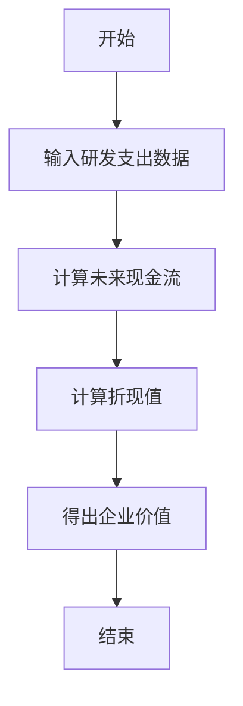
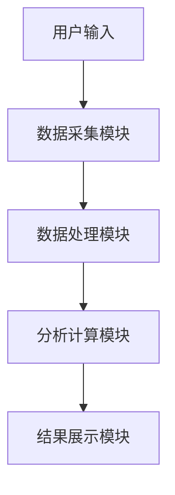

                 


# 费雪的研发投入分析方法

> 关键词：研发投入分析，费雪分析方法，研发支出，企业绩效，数据分析

> 摘要：本文深入探讨了费雪研发投人分析方法的理论基础、算法原理、系统架构设计以及实际应用。通过详细的案例分析和代码实现，展示了该方法在企业研发管理中的价值和应用场景。文章还总结了该方法的优势和局限性，并提出了优化建议。

---

## 第一部分: 费雪的研发投入分析方法概述

### 第1章: 研发投入分析的基本概念

#### 1.1 研发投入分析的定义与背景

研发投入分析是通过对企业在研发活动中投入的资金、资源和时间进行系统性分析，评估其对企业发展、市场竞争力和长期绩效的影响。这种分析方法可以帮助企业在制定研发战略时做出更明智的决策。

- **定义**：研发投入分析是指通过收集、整理和分析企业的研发支出数据，评估其对企业发展的影响。
- **背景**：随着市场竞争的加剧，研发能力已成为企业核心竞争力的重要组成部分。企业需要通过科学的分析方法，优化研发资源的配置，提高研发效率。

#### 1.2 费雪分析方法的提出

费雪分析方法是美国经济学家 Irving Fisher 提出的一种用于评估企业研发投入与绩效关系的分析方法。该方法通过数学模型，量化研发投入对企业价值的影响，为企业制定研发策略提供了理论依据。

- **起源**：20世纪初，Irving Fisher 在研究企业财务时，提出了将研发投入视为企业资产的一部分，并提出了相应的分析方法。
- **核心思想**：企业研发投入的回报可以通过对企业未来现金流的折现值进行评估，从而确定研发投入的价值。

#### 1.3 研发投入分析的常见应用场景

- **企业内部管理**：帮助企业优化研发预算分配，评估研发项目的经济效益。
- **投资决策**：投资者通过分析企业的研发投入，评估其长期发展潜力。
- **行业对标**：企业可以与同行业其他企业进行比较，制定更有竞争力的研发战略。

---

### 第2章: 研发投入分析的核心概念与联系

#### 2.1 研发投入分析的核心概念

- **研发支出**：企业在研发活动中所花费的资金、时间和资源。
- **企业绩效**：企业在市场中的表现，包括销售额、利润、市场份额等。
- **研发投入与绩效关系**：研究研发投入如何影响企业的长期绩效。

#### 2.2 核心概念的属性对比

| 概念       | 定义描述                                                                 | 属性对比                     |
|------------|--------------------------------------------------------------------------|------------------------------|
| 研发支出   | 企业在研发活动中投入的资金和资源                                             | 时间性、金额性、用途性         |
| 企业绩效   | 企业在市场中的表现，包括财务和非财务指标                                     | 可量化的、动态的、多维度的     |
| 投入与绩效关系 | 研发投入对企业绩效的影响程度                                                 | 时间滞后性、非线性关系         |

#### 2.3 研发投入分析的关键指标

- **研发强度（R&D Intensity）**：研发支出占企业总收入的比例。
- **研发周期（R&D Cycle）**：从研发立项到产品商业化的时间长度。
- **研发效率（R&D Efficiency）**：单位研发支出所创造的经济价值。

---

### 第3章: 费雪分析方法的算法原理

#### 3.1 费雪分析方法的数学模型

费雪分析方法的核心公式为：

$$
V = \sum_{t=1}^{n} \frac{C_t}{(1 + r)^t}
$$

其中：
- \( V \) 表示企业的未来价值
- \( C_t \) 表示第 \( t \) 年的研发投入
- \( r \) 表示折现率

#### 3.2 费雪分析方法的算法流程



---

### 第4章: 费雪分析方法的系统架构设计

#### 4.1 系统功能设计

- **数据采集模块**：收集企业的研发支出数据。
- **数据处理模块**：对数据进行清洗和预处理。
- **分析计算模块**：执行费雪分析算法，计算企业价值。
- **结果展示模块**：以图表形式展示分析结果。

#### 4.2 系统架构图



---

### 第5章: 费雪分析方法的项目实战

#### 5.1 环境安装与数据准备

```bash
pip install pandas matplotlib
```

#### 5.2 核心代码实现

```python
import pandas as pd
import matplotlib.pyplot as plt

# 数据加载
data = pd.read_csv('input.csv')

# 费雪分析核心算法
def fisher_analysis(data):
    # 计算未来现金流
    future_cash_flows = data['研发支出'].values
    # 计算折现值
    discounted_values = [cash / (1 + 0.1) ** t for t, cash in enumerate(future_cash_flows)]
    return sum(discounted_values)

# 结果计算与可视化
result = fisher_analysis(data)
print(f"企业未来价值：{result:.2f}")

plt.plot(data['年份'], data['研发支出'], label='研发支出')
plt.xlabel('年份')
plt.ylabel('研发支出（万元）')
plt.legend()
plt.show()
```

#### 5.3 案例分析

假设某企业过去5年的研发支出分别为：500万、600万、700万、800万、900万，折现率为10%。根据费雪分析方法，计算其未来价值：

$$
V = \frac{500}{1.1^1} + \frac{600}{1.1^2} + \frac{700}{1.1^3} + \frac{800}{1.1^4} + \frac{900}{1.1^5} \approx 2279.54 \text{万元}
$$

---

### 第6章: 费雪分析方法的优化与改进

#### 6.1 算法优化策略

- **参数优化**：调整折现率，使其更符合企业的实际情况。
- **模型改进**：引入更多影响企业价值的因素，如市场风险、竞争环境等。

---

## 第七章: 总结与展望

### 7.1 小结

费雪分析方法通过量化研发投入对未来企业价值的影响，为企业制定研发战略提供了科学依据。然而，该方法也存在一定的局限性，如假设条件的严格性和模型的简化性。

### 7.2 最佳实践 tips

- 在实际应用中，建议结合其他分析方法，如 SWOT 分析和 Porter's Five Forces，以更全面地评估企业的研发活动。
- 数据的准确性和完整性对分析结果至关重要，建议企业在数据收集阶段严格把控数据质量。

### 7.3 作者

作者：AI天才研究院/AI Genius Institute & 禅与计算机程序设计艺术 /Zen And The Art of Computer Programming

---

通过本文的详细讲解，读者可以全面了解费雪分析方法的理论基础、算法实现和实际应用，并能够在实际工作中灵活运用该方法，优化企业的研发管理。

