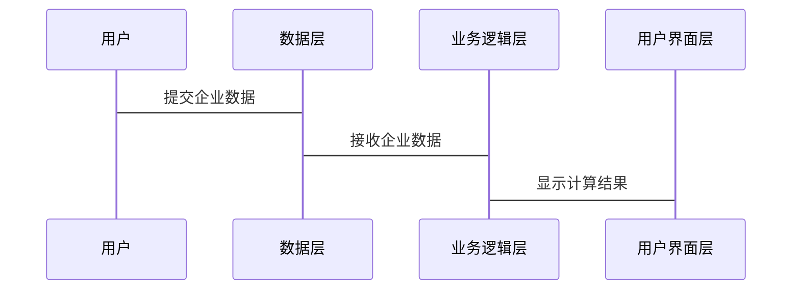

                 


# 费雪的研发投入分析：未来增长的关键

> **关键词**：研发投入分析，费雪模型，企业增长，价值投资，研发回报率

> **摘要**：本文深入探讨了费雪的投资理念与研发投入分析的结合，揭示了如何通过科学的方法评估研发支出对企业发展的影响。文章从费雪模型的基本原理出发，分析了研发投入的关键指标和数学模型，结合实际案例展示了如何将这些理论应用于实践。通过系统设计与项目实战，进一步阐述了如何构建高效的分析系统，并总结了最佳实践和未来趋势。

---

# 第一部分: 费雪的研发投入分析背景与概述

## 第1章: 研发投入分析的背景与重要性

### 1.1 研发投入分析的背景

#### 1.1.1 研发投入的定义与范围
研发投入（R&D，Research and Development）是指企业在研究与开发方面的支出，包括基础研究、应用研究和产品开发三个阶段。研发投入不仅是技术创新的核心驱动力，也是企业长期增长的关键因素。

#### 1.1.2 研发投入在企业增长中的作用
研发投入对企业竞争力的影响是深远的。通过研发投入，企业可以开发新产品、改进生产效率、降低成本，并在市场竞争中占据优势地位。尤其是在技术驱动型行业，研发投入直接关系到企业的未来增长潜力。

#### 1.1.3 研发投入分析的必要性
企业在进行研发投入时，需要对其投入的合理性、效率性和回报率进行科学评估。研发投入分析能够帮助企业优化资源配置，制定合理的研发战略，并为投资者提供重要的决策依据。

### 1.2 费雪的投资理念与研发投入的关系

#### 1.2.1 费雪投资理念的核心思想
费雪（Philip Fisher）是价值投资的先驱，他提出了“成长股”投资理念。他认为，投资者应该选择那些具有持续增长潜力的企业，特别是那些能够不断进行产品创新和市场扩展的企业。

#### 1.2.2 研发投入在费雪理念中的位置
在费雪看来，研发投入是企业增长的核心驱动力。他强调，那些能够持续进行研发投入的企业，往往具有更强的市场竞争力和增长潜力。因此，在评估企业的投资价值时，研发投入是一个关键指标。

#### 1.2.3 费雪理念与现代企业增长的结合
尽管费雪的投资理念提出于几十年前，但其核心思想在今天依然适用。现代企业可以通过对研发投入的分析，更好地理解其增长潜力，并制定相应的战略。

---

## 第2章: 研发投入分析的基本框架

### 2.1 研发投入分析的框架

#### 2.1.1 研发投入分析的维度
研发投入分析可以从多个维度进行，包括时间维度、行业维度、企业维度等。时间维度关注研发投入的周期性变化；行业维度分析不同行业间的研发投入差异；企业维度则关注单个企业的研发投入情况。

#### 2.1.2 研发投入分析的指标体系
以下是常见的研发投入分析指标：

| 指标名称               | 定义与计算方式                                                                 |
|------------------------|------------------------------------------------------------------------------|
| 研发投入强度（R&D Intensity） | 研发投入占企业总收入的比例。计算公式为：R&D Intensity = (R&D支出 / 总收入) × 100%       |
| 研发投入周期（R&D Cycle）   | 从研发到产品商业化的时间跨度，通常以年为单位。                                       |
| 研发投入回报率（ROI）     | 研发投入带来的净收益与研发投入的比率。计算公式为：ROI = (净收益 / R&D支出) × 100%          |

#### 2.1.3 研发投入分析的步骤
1. 收集企业过去几年的研发投入数据。
2. 计算研发投入强度、周期和回报率等关键指标。
3. 对比同行业企业的研发投入情况，评估企业的相对表现。
4. 结合企业的市场环境和财务状况，预测未来研发投入对增长的贡献。

### 2.2 费雪模型的核心要素

#### 2.2.1 费雪模型的基本假设
费雪模型假设企业的研发投入与其未来的增长潜力呈正相关关系。他提出，企业未来的价值可以通过以下公式计算：

$$\text{未来价值} = \text{当前价值} \times (1 + \text{增长率})^n$$

其中，增长率与企业的研发投入密切相关。

#### 2.2.2 研发投入与企业价值的关系
通过费雪模型可以看出，企业的研发投入直接影响其增长率，从而影响企业的未来价值。因此，在评估企业价值时，必须将研发投入作为重要的考量因素。

#### 2.2.3 研发投入的周期性与回报率
研发投入的周期性和回报率是影响企业增长的重要因素。周期较长的研发项目可能面临较高的风险，但回报也可能更高。因此，在进行研发投入分析时，需要综合考虑周期和回报率。

---

# 第二部分: 费雪模型的核心概念与分析方法

## 第3章: 费雪模型的原理与应用

### 3.1 费雪模型的基本原理

#### 3.1.1 费雪模型的数学表达式
$$\text{未来价值} = \text{当前价值} \times (1 + \text{增长率})^n$$

其中，增长率（$g$）可以通过企业的研发投入强度（$R$）和行业平均回报率（$r$）进行估算。具体公式如下：

$$g = R \times (1 + r)$$

#### 3.1.2 研发投入对增长率的影响
研发投入强度（$R$）是影响增长率（$g$）的关键因素。一般来说，研发投入强度越高，增长率也越高。然而，需要注意的是，研发投入的边际效益是递减的，因此过高的研发投入可能会导致回报率下降。

#### 3.1.3 费雪模型的适用条件与限制
费雪模型适用于那些具有稳定增长潜力的企业，特别是那些在技术研发方面具有较强优势的企业。然而，对于那些研发投入较低或周期较长的企业，该模型可能不太适用。

### 3.2 费雪模型的扩展与改进

#### 3.2.1 竞争环境对研发投入回报的影响
在竞争激烈的行业中，研发投入的回报率可能会受到较大的影响。因此，在应用费雪模型时，需要结合企业的竞争环境进行综合评估。

#### 3.2.2 不同行业中的研发投入差异
不同行业的研发投入强度和回报率存在显著差异。例如，科技行业通常具有较高的研发投入强度和回报率，而传统行业则可能较低。

#### 3.2.3 研发投入的边际效益递减规律
随着研发投入的增加，其边际效益会逐渐递减。因此，在进行研发投入分析时，需要找到一个合理的投入水平，以实现最大化的回报。

---

## 第4章: 研发投入分析的核心指标与模型

### 4.1 研发投入分析的关键指标

#### 4.1.1 研发投入强度（R&D Intensity）
研发投入强度是衡量企业研发投入水平的重要指标。通过计算研发投入强度，可以评估企业的技术创新能力。

#### 4.1.2 研发投入周期（R&D Cycle）
研发投入周期是指从研发到产品商业化的时间跨度。较长的周期可能会增加企业的风险，但也可能带来更高的回报。

#### 4.1.3 研发投入回报率（ROI）
研发投入回报率是评估研发投入效率的重要指标。通过计算回报率，可以判断企业的研发投入是否具有经济合理性。

### 4.2 研发投入分析的数学模型

#### 4.2.1 研发投入与增长率的关系
通过费雪模型，我们可以将研发投入与增长率联系起来。具体公式如下：

$$g = R \times (1 + r)$$

其中，$R$ 是研发投入强度，$r$ 是行业平均回报率，$g$ 是增长率。

#### 4.2.2 研发投入的边际效益递减规律
随着研发投入的增加，其边际效益会逐渐递减。因此，企业在进行研发投入时，需要找到一个合理的投入水平。

---

# 第三部分: 研发投入分析的系统设计与架构

## 第5章: 系统设计与架构

### 5.1 系统功能设计

#### 5.1.1 系统应用场景
该系统适用于企业内部的研发投入分析，也可以用于投资者的决策支持。

#### 5.1.2 系统功能模块
1. 数据采集模块：采集企业的研发投入数据。
2. 模型计算模块：根据费雪模型进行计算。
3. 结果展示模块：以图表形式展示分析结果。

#### 5.1.3 系统架构设计
系统架构采用分层设计，包括数据层、业务逻辑层和用户界面层。

### 5.2 系统交互设计

#### 5.2.1 系统交互流程
1. 用户输入企业数据。
2. 系统进行计算。
3. 用户查看分析结果。

#### 5.2.2 系统交互序列图


---

# 第四部分: 项目实战与案例分析

## 第6章: 项目实战

### 6.1 项目背景

#### 6.1.1 项目目标
通过分析某科技企业的研发投入，评估其未来增长潜力。

### 6.2 项目实现

#### 6.2.1 环境安装
需要安装Python和相关库（如pandas、numpy、matplotlib）。

#### 6.2.2 核心代码实现
```python
import pandas as pd
import numpy as np

# 假设企业数据存储在data.csv文件中
data = pd.read_csv('data.csv')

# 计算研发投入强度
data['R&D_Intensity'] = (data['R&D支出'] / data['总收入']) * 100

# 计算增长率
data['增长率'] = data['R&D_Intensity'] * (1 + data['行业平均回报率'])

# 显示结果
print(data[['企业名称', 'R&D_Intensity', '增长率']])
```

### 6.3 项目分析

#### 6.3.1 结果解读
通过代码计算出的企业研发投入强度和增长率，可以评估企业的未来增长潜力。

#### 6.3.2 案例分析
以某科技企业为例，分析其研发投入情况，并预测其未来价值。

### 6.4 项目小结
通过该项目，我们可以看到，费雪模型在实际应用中具有较高的实用价值。

---

# 第五部分: 总结与展望

## 第7章: 总结与展望

### 7.1 最佳实践 tips
1. 在进行研发投入分析时，需要结合企业的实际情况。
2. 费雪模型适用于具有稳定增长潜力的企业。

### 7.2 小结
本文通过费雪的投资理念，深入分析了研发投入对企业发展的影响，并提出了科学的分析方法和系统设计方案。

### 7.3 未来展望
随着技术的进步，研发投入分析将更加精准和高效。未来的研究可以进一步结合人工智能和大数据技术，提高分析的准确性和效率。

---

# 作者信息

作者：AI天才研究院/AI Genius Institute & 禅与计算机程序设计艺术 /Zen And The Art of Computer Programming

