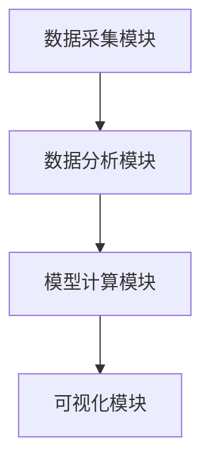

                 


# 费雪的研发投入分析：未来增长的动力

**关键词**：费雪投资理论、研发投入分析、企业增长、人工智能、投资模型、数学模型

**摘要**：本文从费雪的投资理论出发，详细探讨了研发投入分析在企业未来增长中的重要性。通过分析研发投入的核心概念、算法原理、系统架构以及实际项目案例，展示了如何利用技术手段对企业研发投入进行深入分析，以预测和优化企业未来的增长动力。文章内容涵盖背景介绍、核心概念、算法原理、系统设计、项目实战及最佳实践，旨在为企业提供一套科学的研发投入分析方法论。

---

## 第一部分: 费雪的投资理念与研发投入分析背景

### 第1章: 费雪投资理论的核心思想

#### 1.1 费雪投资理论的起源与发展
费雪（Philip Fisher）是20世纪著名的投资理论家，其投资理念强调长期增长和企业基本面分析。费雪认为，投资的本质是选择那些具有持续竞争优势和管理能力的公司，而研发投入是企业创新能力的核心体现。

#### 1.2 费雪投资理论的核心观点
费雪提出了“成长股”投资策略，认为企业的研发投入是其未来增长的关键驱动力。他强调，投资者应关注企业的研发投入强度、研发效率以及研发成果的转化能力。

#### 1.3 研发投入分析在费雪理论中的地位
研发投入分析是费雪理论的重要组成部分，它帮助企业识别具有持续创新能力的公司。通过分析企业的研发投入数据，投资者可以更好地预测企业的未来增长潜力。

### 第2章: 研发投入分析的定义与重要性

#### 2.1 研发投入的定义
研发投入（R&D expenditure）是指企业在研究与开发活动中投入的资金、资源和时间。这些投入主要用于开发新产品、改进现有产品或提升生产效率。

#### 2.2 研发投入对企业增长的影响
研发投入是企业创新能力的核心体现，直接影响企业的市场竞争力和未来增长潜力。高研发投入的企业通常能够更快地推出新产品，占据市场领先地位。

#### 2.3 研发投入分析的边界与外延
研发投入分析不仅关注企业的研发投入金额，还包括研发投入的效率、成果转化能力以及研发投入的结构。此外，还需要考虑行业特点和企业所处的生命周期阶段。

---

## 第二部分: 研发投入分析的核心概念与联系

### 第3章: 研发投入分析的核心原理

#### 3.1 研发投入与企业价值的关系
研发投入与企业价值密切相关。高研发投入的企业通常具有更强的创新能力和市场竞争力，从而能够实现更高的企业价值。

#### 3.2 研发投入的周期性与回报周期
研发投入具有周期性，通常需要较长时间才能转化为实际收益。因此，投资者需要耐心等待，同时关注研发投入的效率和成果转化能力。

#### 3.3 研发投入的边际效益递减规律
随着研发投入的增加，边际效益可能会逐渐递减。因此，企业需要在研发投入规模和效率之间找到平衡点。

### 第4章: 研发投入分析的关键模型

#### 4.1 费雪投资模型的核心公式
费雪投资模型强调企业研发投入的效率和成果转化能力。其核心公式为：
$$
\text{企业价值} = \text{研发投入强度} \times \text{研发效率} \times \text{市场潜力}
$$

#### 4.2 研发投入分析的主要指标
- 研发投入强度（R&D Intensity）：研发投入占销售收入的比例。
- 研发投入效率（R&D Efficiency）：单位研发投入产生的创新成果数量。
- 研发投入回报率（R&D ROI）：研发投入带来的收益与投入的比率。

#### 4.3 研发投入分析的对比表格
以下是一个简单的对比表格，展示了不同企业在研发投入强度和效率方面的差异：

| 企业名称 | 研发投入强度（%） | 研发投入效率（成果数/亿元） |
|----------|--------------------|-----------------------------|
| 企业A    | 5                  | 2                           |
| 企业B    | 10                 | 3                           |
| 企业C    | 8                  | 2.5                         |

---

## 第三部分: 研发投入分析的算法原理

### 第5章: 研发投入分析的数学模型

#### 5.1 研发投入与企业增长的数学模型
费雪提出了一个简单的数学模型，用于评估企业研发投入的效率和市场潜力：
$$
\text{企业增长潜力} = k \times \text{研发投入强度} \times \text{市场容量}
$$
其中，k 是一个常数，表示研发投入的效率系数。

#### 5.2 研发投入分析的算法步骤
以下是研发投入分析的主要算法步骤：
1. 收集企业的研发投入数据，包括研发投入金额、研发投入强度等。
2. 评估研发投入的效率，包括研发成果的数量和质量。
3. 分析企业的市场潜力，包括市场规模和竞争格局。
4. 结合研发投入效率和市场潜力，评估企业的增长潜力。

### 第6章: 研发投入分析的系统架构

#### 6.1 系统功能模块
- 数据采集模块：收集企业的研发投入数据和市场数据。
- 数据分析模块：对研发投入数据进行清洗、处理和分析。
- 模型计算模块：利用数学模型评估企业的增长潜力。
- 可视化模块：将分析结果以图表形式展示。

#### 6.2 系统架构图
以下是系统架构的Mermaid图：



---

## 第四部分: 研发投入分析的项目实战

### 第7章: 环境安装与系统实现

#### 7.1 环境安装
- 安装Python和相关库（如Pandas、Matplotlib）。
- 安装Jupyter Notebook用于数据处理和可视化。

#### 7.2 核心代码实现
以下是Python代码示例：

```python
import pandas as pd
import matplotlib.pyplot as plt

# 读取数据
data = pd.read_csv('input.csv')

# 数据清洗
data.dropna(inplace=True)

# 计算研发投入强度
data['研发投入强度'] = data['研发投入'] / data['销售收入']

# 可视化
plt.bar(data['企业名称'], data['研发投入强度'])
plt.title('研发投入强度对比')
plt.show()
```

#### 7.3 案例分析
以某科技公司为例，分析其研发投入强度和市场潜力。假设该公司的研发投入强度为10%，市场容量为100亿元，市场潜力为80亿元。根据费雪模型：
$$
\text{企业增长潜力} = 1 \times 10\% \times 100 = 10 \text{亿元}
$$

---

## 第五部分: 最佳实践与总结

### 第8章: 最佳实践

#### 8.1 小结
研发投入分析是企业增长的重要驱动力。通过科学的分析方法，投资者可以更好地识别具有潜力的企业。

#### 8.2 注意事项
- 数据质量是分析的关键，需确保数据的准确性和完整性。
- 需关注行业特点和企业所处的生命周期阶段。
- 投资者需耐心等待，关注研发投入的效率和成果转化能力。

#### 8.3 拓展阅读
推荐阅读《费雪的投资哲学》和《投资学基础》等书籍，以深入理解研发投入分析的理论基础。

---

## 作者

**作者：AI天才研究院 & 禅与计算机程序设计艺术**

---

通过以上分析，我们深入探讨了费雪的研发投入分析方法及其在企业增长中的应用。希望本文能够为企业和投资者提供有价值的参考，帮助他们在复杂的市场环境中做出更明智的决策。

