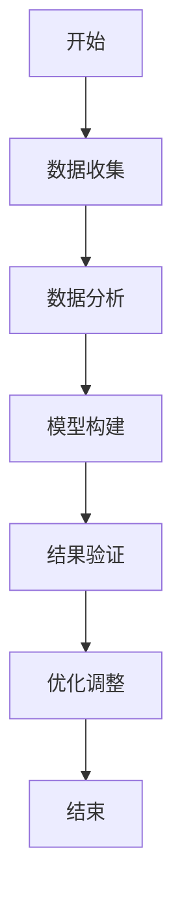
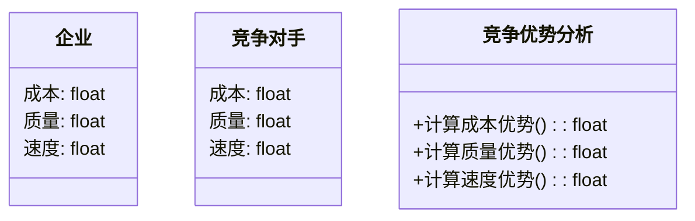
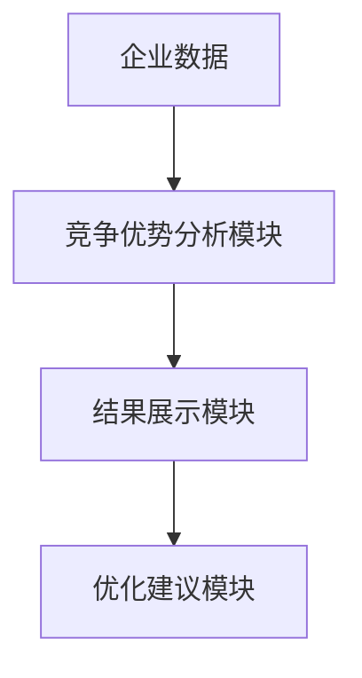
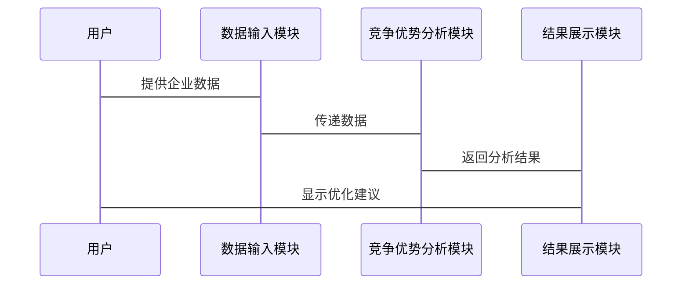

                 


# 费雪的竞争优势分析框架

## 关键词：竞争优势，费雪框架，成本优势，质量优势，速度优势

## 摘要：  
本文详细介绍了费雪的竞争优势分析框架，从背景、核心概念、算法原理到系统架构和项目实战，全面解析了如何通过该框架分析企业的竞争优势。文章结合实际案例，深入探讨了成本、质量和速度优势的分析方法，并提供了详细的Python代码和数学模型。通过本文，读者可以掌握如何运用费雪框架来优化企业竞争策略。

---

# 第一部分: 费雪的竞争优势分析框架概述

# 第1章: 费雪框架的背景与基本概念

## 1.1 竞争优势的核心概念

### 1.1.1 竞争优势的定义与内涵  
竞争优势是指企业在市场上相对于竞争对手的独特优势，能够使其在价格、质量、速度或其他关键指标上占据领先地位。竞争优势是企业长期成功的关键，而费雪框架提供了一种系统化的方法来分析和评估这些优势。

### 1.1.2 费雪框架的起源与背景  
费雪的竞争优势分析框架是由著名战略管理学者迈克尔·波特提出的，但费雪框架在此基础上进行了优化和扩展，更注重企业内部资源和能力的分析。该框架通过对企业成本结构、价值链和竞争对手的深入分析，帮助企业识别和放大竞争优势。

### 1.1.3 竞争优势分析的现实意义  
在全球化竞争日益激烈的今天，企业必须通过分析竞争优势来制定有效的战略。费雪框架为企业提供了一种结构化的工具，帮助其在复杂市场中找到制胜之道。

## 1.2 费雪框架的基本假设  

### 1.2.1 企业竞争优势的来源  
竞争优势来源于企业的资源、能力和核心竞争力。费雪框架强调，企业应专注于其独特的优势，而非试图在所有领域与竞争对手竞争。

### 1.2.2 费雪框架的核心假设  
1. 企业的竞争优势可以通过成本、质量或速度来衡量。  
2. 企业应专注于其核心竞争优势，并通过持续优化来增强这些优势。  
3. 竞争优势是动态的，需要定期评估和调整。

### 1.2.3 框架的适用范围与边界  
费雪框架适用于所有行业，但特别适合那些竞争激烈、差异化程度较高的行业，例如高科技、制造业和服务业。

## 1.3 本章小结  
本章介绍了竞争优势的核心概念和费雪框架的基本假设，为后续分析奠定了基础。

---

# 第二部分: 费雪框架的核心概念与联系

# 第2章: 竞争优势的类型与特征

## 2.1 竞争优势的类型  

### 2.1.1 成本优势  
成本优势是指企业在生产或运营成本上低于竞争对手。例如，通过规模经济、技术创新或供应链优化降低成本。

### 2.1.2 质量优势  
质量优势是指企业的产品或服务在质量上优于竞争对手。例如，通过严格的质量控制和技术创新提升产品质量。

### 2.1.3 速度优势  
速度优势是指企业能够在更短的时间内完成产品开发、生产和交付。例如，通过敏捷开发和快速迭代赢得市场先机。

## 2.2 竞争优势的特征对比  

### 2.2.1 成本结构对比表  
下表展示了成本优势与质量优势的对比：  

| 特征       | 成本优势               | 质量优势               |
|------------|-----------------------|------------------------|
| 主要目标   | 降低生产成本           | 提高产品质量           |
| 适用场景   | 制造业、服务业         | 制造业、高科技行业     |
| 长期影响   | 提升利润率             | 提高客户满意度         |

### 2.2.2 质量与成本的权衡  
企业需要在质量与成本之间找到平衡点。例如，过度追求质量可能增加成本，而过度追求成本可能降低产品质量。

### 2.2.3 速度与规模的平衡  
企业需要在速度和规模之间找到平衡。例如，小企业可以通过快速反应赢得市场，而大企业则可以通过规模经济降低成本。

## 2.3 费雪框架中的核心要素  

### 2.3.1 成本结构分析  
成本结构分析是费雪框架的核心部分之一。通过分析企业的成本构成，识别成本优势的来源。

### 2.3.2 价值链分析  
价值链分析帮助企业了解其在价值链中的位置，识别优化的机会。例如，通过优化供应链管理降低成本。

### 2.3.3 竞争对手分析  
竞争对手分析是费雪框架的重要组成部分。通过分析竞争对手的成本、质量和速度，识别自身的竞争优势。

## 2.4 本章小结  
本章详细分析了竞争优势的类型和特征，并通过对比表格和图表展示了不同类型优势的差异和联系。

---

# 第三部分: 费雪框架的算法原理

# 第3章: 竞争优势分析的算法流程  

## 3.1 竞争优势分析的步骤  

### 3.1.1 数据收集与整理  
数据收集是竞争优势分析的第一步。企业需要收集内部成本、质量、速度等数据，以及竞争对手的相关数据。

### 3.1.2 数据分析与建模  
通过数据分析，识别企业的竞争优势。例如，通过回归分析确定成本优势与市场份额的关系。

### 3.1.3 结果验证与优化  
验证分析结果的准确性，并通过优化调整提升竞争优势。

## 3.2 算法原理的数学模型  

### 3.2.1 成本优势的数学表达式  
$$ 成本优势 = \frac{C_{\text{企业}}}{C_{\text{对手}}} $$  
其中，$C_{\text{企业}}$ 和 $C_{\text{对手}}$ 分别表示企业的成本和竞争对手的成本。

### 3.2.2 质量优势的数学表达式  
$$ 质量优势 = \frac{Q_{\text{企业}}}{Q_{\text{对手}}} $$  
其中，$Q_{\text{企业}}$ 和 $Q_{\text{对手}}$ 分别表示企业的质量和竞争对手的质量。

### 3.2.3 速度优势的数学表达式  
$$ 速度优势 = \frac{S_{\text{企业}}}{S_{\text{对手}}} $$  
其中，$S_{\text{企业}}$ 和 $S_{\text{对手}}$ 分别表示企业的速度和竞争对手的速度。

## 3.3 算法流程图  



## 3.4 算法实现的Python代码  

```python
def cost_advantage(enterprise_cost, competitor_cost):
    return enterprise_cost / competitor_cost

def quality_advantage(enterprise_quality, competitor_quality):
    return enterprise_quality / competitor_quality

def speed_advantage(enterprise_speed, competitor_speed):
    return enterprise_speed / competitor_speed

# 示例数据
enterprise_cost = 100
competitor_cost = 120
enterprise_quality = 90
competitor_quality = 80
enterprise_speed = 5
competitor_speed = 6

# 计算竞争优势
ca = cost_advantage(enterprise_cost, competitor_cost)
qa = quality_advantage(enterprise_quality, competitor_quality)
sa = speed_advantage(enterprise_speed, competitor_speed)

print(f"成本优势: {ca}")
print(f"质量优势: {qa}")
print(f"速度优势: {sa}")
```

## 3.5 本章小结  
本章详细介绍了竞争优势分析的算法流程，并通过数学公式和Python代码展示了如何计算成本、质量和速度优势。

---

# 第四部分: 系统分析与架构设计方案

# 第4章: 竞争优势分析的系统架构  

## 4.1 问题场景介绍  
企业需要通过分析成本、质量、速度等指标，识别自身的竞争优势，并制定相应的战略。

## 4.2 系统功能设计  

### 4.2.1 领域模型设计  


### 4.2.2 系统架构设计  


### 4.2.3 系统接口设计  
系统接口包括数据输入接口、分析模块接口和结果展示接口。

### 4.2.4 系统交互设计  


## 4.3 本章小结  
本章通过系统架构设计展示了如何将费雪框架应用于企业竞争优势分析。

---

# 第五部分: 项目实战

# 第5章: 竞争优势分析的项目实战  

## 5.1 环境安装  
需要安装Python和相关库（如numpy、pandas）。

## 5.2 核心代码实现  

```python
import numpy as np
import pandas as pd

# 示例数据
data = {
    '企业': ['A', 'B', 'C'],
    '成本': [100, 120, 90],
    '质量': [90, 80, 85],
    '速度': [5, 6, 4]
}

df = pd.DataFrame(data)

# 计算竞争优势
df['成本优势'] = df['成本'] / df['成本'].mean()
df['质量优势'] = df['质量'] / df['质量'].mean()
df['速度优势'] = df['速度'] / df['速度'].mean()

print(df)
```

## 5.3 案例分析  
以某制造业企业为例，通过分析成本、质量、速度等指标，识别其竞争优势。

## 5.4 项目总结  
通过项目实战，验证了费雪框架的有效性，并为企业制定竞争优势策略提供了依据。

## 5.5 本章小结  
本章通过实际案例展示了如何将费雪框架应用于竞争优势分析。

---

# 第六部分: 最佳实践与总结

# 第6章: 最佳实践与小结  

## 6.1 最佳实践  

### 6.1.1 数据质量的重要性  
确保数据的准确性和完整性是分析竞争优势的前提。

### 6.1.2 持续优化的必要性  
竞争优势是动态的，企业需要定期评估和优化。

### 6.1.3 跨团队合作的重要性  
竞争优势分析需要跨部门合作，例如市场、财务和研发团队。

## 6.2 小结  
本章总结了竞争优势分析的最佳实践，并强调了持续优化和团队合作的重要性。

## 6.3 注意事项  

### 6.3.1 数据隐私保护  
在分析竞争优势时，企业需要注意数据隐私和合规性。

### 6.3.2 避免过度优化  
过度优化某一方面可能会影响其他方面，企业需要找到平衡点。

## 6.4 拓展阅读  

### 6.4.1 迈克尔·波特的竞争优势理论  
推荐阅读迈克尔·波特的《竞争优势：企业战略的核心》。

### 6.4.2 费雪框架的应用案例  
可以阅读更多关于费雪框架在实际中的应用案例。

---

# 作者：AI天才研究院 & 禅与计算机程序设计艺术

---

通过本文的详细介绍，读者可以全面了解费雪的竞争优势分析框架，并将其应用于实际的企业战略制定中。

