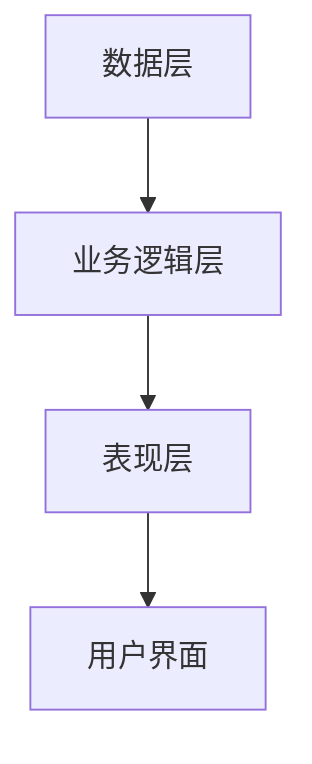

                 


# 费雪的竞争优势分析：寻找行业领导者

## 关键词：竞争优势分析、费雪分析法、行业领导者、商业策略、企业绩效

## 摘要：  
费雪的竞争优势分析是一种强大的工具，用于识别和评估企业在行业中的竞争优势，从而帮助企业制定有效的商业策略。本文将从竞争优势分析的基本概念入手，详细探讨费雪分析法的核心思想、数学模型、系统架构设计以及实际应用案例。通过理论与实践相结合的方式，本文旨在帮助读者掌握如何利用费雪的竞争优势分析方法，找到行业领导者，优化企业绩效。

---

# 正文

## 第1章: 竞争优势分析的背景与重要性

### 1.1 什么是竞争优势  
竞争优势是指企业在市场中相对于竞争对手所具有的独特优势，这种优势可以是资源、能力、技术、品牌、成本或市场占有率等方面。竞争优势是企业获取超额利润的关键。

**竞争优势的核心要素包括：**  
1. 资源优势：企业拥有的独特资源，如专利、技术、原材料等。  
2. 能力优势：企业的核心竞争力，如研发能力、生产效率等。  
3. 市场优势：企业在目标市场的影响力和客户忠诚度。  

竞争优势具有动态性，随着市场环境的变化而变化。企业需要不断调整和优化其竞争优势，以应对市场竞争。

### 1.2 费雪的竞争优势分析方法  
费雪分析法是一种基于竞争优势分析的理论方法，由著名经济学家约翰·费雪提出。该方法通过分析企业的资源、能力和市场定位，识别其竞争优势，并预测其在行业中的发展趋势。

**费雪分析法的核心思想：**  
1. 企业竞争优势的来源在于其独特的资源和能力。  
2. 通过分析企业的竞争优势，可以预测其未来的市场表现。  
3. 竞争优势是动态变化的，需要结合市场环境进行评估。  

### 1.3 为什么竞争优势分析重要  
竞争优势分析是企业制定战略的重要工具。通过分析竞争优势，企业可以：  
1. 识别自身的强项和弱项。  
2. 制定有效的市场进入策略。  
3. 优化资源配置，提升企业绩效。  
4. 识别潜在的行业领导者。  

竞争优势分析对投资者也具有重要意义，可以帮助投资者识别具有长期竞争优势的企业，进行投资决策。

---

## 第2章: 费雪竞争优势分析的核心概念

### 2.1 竞争优势的构成要素  
竞争优势的构成要素可以从以下几个方面进行分析：  
1. **资源优势**：企业拥有的独特资源，如专利、技术、品牌等。  
2. **能力优势**：企业的核心竞争力，如研发能力、生产效率等。  
3. **市场优势**：企业在目标市场的影响力和客户忠诚度。  

**资源与能力的对比分析：**  
| 要素 | 资源优势 | 能力优势 |  
|------|----------|----------|  
| 定义 | 特定资源的拥有情况 | 核心竞争力的强弱 |  
| 例子 | 专利技术 | 研发能力 |  
| 重要性 | 基础性 | 战略性 |  

---

### 2.2 费雪分析法的理论基础  
费雪分析法的理论基础包括资源基础视角和能力基础视角。  
1. **资源基础视角**：强调企业内部资源的独特性和不可模仿性对竞争优势的影响。  
2. **能力基础视角**：关注企业核心能力对竞争优势的作用。  

**竞争优势与企业绩效的关系：**  
竞争优势是企业绩效的决定性因素。具有明显竞争优势的企业，往往能够获得更高的市场份额和利润率。

---

## 第3章: 竞争优势分析的数学模型与算法

### 3.1 费雪分析法的数学模型  
费雪分析法的核心是通过数学模型计算企业的竞争优势指数。以下是常见的数学模型：  
1. **市场份额预测模型**：  
$$ \text{市场份额} = \frac{\text{企业收入}}{\text{行业总收入}} $$  
2. **财务指标分析模型**：  
$$ \text{竞争优势指数} = \frac{\text{净利润率} + \text{市场份额}}{2} $$  

### 3.2 算法原理与流程  
1. **数据收集与处理**：收集企业的财务数据和市场数据。  
2. **模型构建与验证**：通过数学模型计算竞争优势指数。  
3. **结果分析与优化**：根据分析结果调整企业的竞争优势策略。  

**Python代码示例：**  
```python
import pandas as pd

# 数据加载
df = pd.read_csv('market_data.csv')

# 计算市场份额
df['market_share'] = df['revenue'] / df['industry_revenue'].sum()

# 计算竞争优势指数
df['competitiveness_index'] = (df['net_profit_margin'] + df['market_share']) / 2

# 输出结果
print(df[['company', 'market_share', 'competitiveness_index']])
```

---

## 第4章: 竞争优势分析的系统架构设计

### 4.1 系统分析与设计概述  
1. **系统目标**：构建一个竞争优势分析的系统，帮助用户识别行业领导者。  
2. **系统范围**：包括数据采集、分析、结果展示等功能。  
3. **系统功能需求**：支持多行业分析、数据可视化、结果预测等功能。  

### 4.2 系统架构设计  
系统架构采用分层设计，包括数据层、业务逻辑层和表现层。  

**系统架构图：**  


### 4.3 系统接口设计  
1. 数据接口：与财务系统和市场数据源对接。  
2. 用户接口：提供数据输入和结果展示功能。  

---

## 第5章: 竞争优势分析的项目实战

### 5.1 项目介绍  
本项目旨在通过费雪分析法，分析某行业的市场竞争情况，识别行业领导者。  

### 5.2 核心实现  
1. 数据采集与清洗：收集企业的财务数据和市场数据。  
2. 竞争优势指数计算：使用数学模型计算竞争优势指数。  
3. 数据可视化：绘制市场份额和竞争优势指数的图表。  

**Python代码实现：**  
```python
import matplotlib.pyplot as plt

# 数据加载
df = pd.read_csv('market_data.csv')

# 数据可视化
plt.figure(figsize=(10, 6))
plt.plot(df['company'], df['market_share'], 'b-', label='市场份额')
plt.plot(df['company'], df['competitiveness_index'], 'r-', label='竞争优势指数')
plt.xlabel('公司')
plt.ylabel('指数')
plt.title('市场份额与竞争优势指数对比')
plt.legend()
plt.show()
```

### 5.3 实际案例分析  
以某行业为例，分析企业的竞争优势指数，识别行业领导者。  

---

## 第6章: 最佳实践与小结

### 6.1 最佳实践  
1. 定期更新数据，保持竞争优势分析的准确性。  
2. 结合市场环境，动态调整竞争优势策略。  
3. 利用技术手段，提升竞争优势分析的效率。  

### 6.2 小结  
费雪的竞争优势分析是一种强大的工具，能够帮助企业识别行业领导者，优化商业策略。通过理论与实践相结合，读者可以掌握如何应用费雪分析法，提升企业的竞争优势。

---

## 注意事项  
1. 数据来源要可靠，确保分析结果的准确性。  
2. 分析过程中要注意模型的适用性和限制性。  
3. 结果展示要清晰，便于理解和应用。  

## 拓展阅读  
1. 《竞争优势：企业战略的核心》  
2. 《费雪分析法：理论与实践》  

---

## 作者  
作者：AI天才研究院 & 禅与计算机程序设计艺术  

---

感谢您的阅读，希望本文能够帮助您更好地理解费雪的竞争优势分析方法，并在实际中加以应用。

