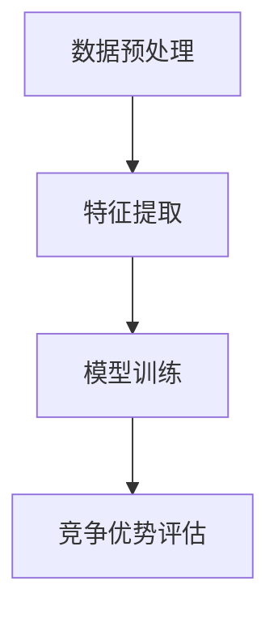
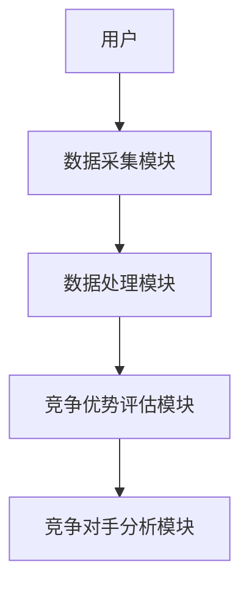
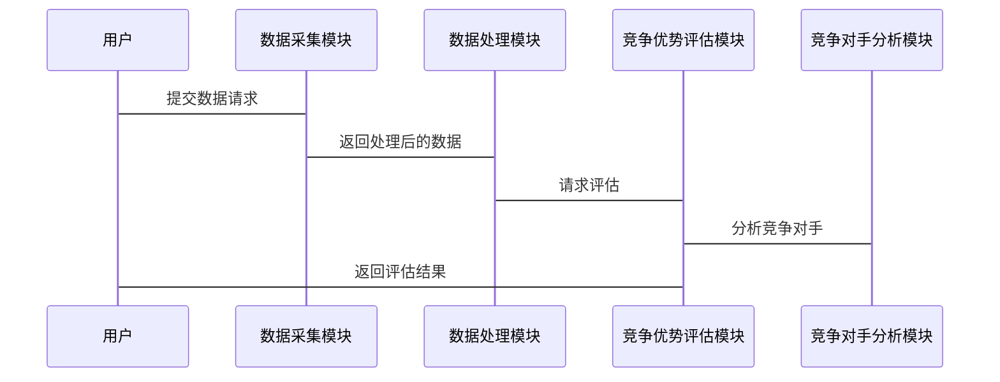

                 


# 费雪的竞争优势分析：持续成功的关键

## 关键词：竞争优势分析，企业战略，费雪分析，数据挖掘，机器学习，系统架构

## 摘要：  
费雪的竞争优势分析是一种系统化的方法，用于识别、评估和利用企业的竞争优势，以实现持续成功。本文通过详细阐述费雪竞争优势分析的核心概念、算法原理、系统架构及实际应用案例，帮助读者掌握这一方法，并将其应用于实际商业场景中。

---

## 第一部分: 费雪的竞争优势分析基础

### 第1章: 费雪竞争优势分析概述

#### 1.1 费雪竞争优势分析的背景与意义

##### 1.1.1 企业竞争的定义与内涵  
企业竞争是指企业在市场中通过提供产品或服务，满足客户需求的过程中所进行的竞争活动。竞争的核心在于企业如何在资源、能力、市场定位等方面优于竞争对手，从而获得更高的市场份额和利润。

##### 1.1.2 费雪竞争优势分析的起源与发展  
费雪竞争优势分析是由著名战略管理学家迈克尔·波特提出的竞争战略理论发展而来，结合了资源基础视角（RBV）和竞争优势视角（CAV）的核心思想，形成了独特的分析框架。

##### 1.1.3 费雪竞争优势分析的核心目标与价值  
费雪竞争优势分析的目标是通过识别企业的核心竞争优势，帮助企业制定有效的战略规划，提升市场竞争力。其价值在于帮助企业实现差异化竞争，优化资源配置，增强长期盈利能力。

#### 1.2 费雪竞争优势分析的理论基础

##### 1.2.1 企业竞争优势的定义与分类  
竞争优势是指企业在市场上相对于竞争对手所具有的独特优势，包括资源优势、能力优势、市场优势等。竞争优势可以分为静态竞争优势（基于资源）和动态竞争优势（基于能力）。

##### 1.2.2 费雪竞争优势分析与其他竞争分析方法的对比  
费雪竞争优势分析与波特的五力分析、SWOT分析等方法相比，更加注重企业内部资源与能力的分析，并结合外部市场环境，提供更全面的竞争优势评估。

##### 1.2.3 费雪竞争优势分析的框架与模型  
费雪竞争优势分析的框架包括以下几个步骤：  
1. 识别企业的核心资源与能力；  
2. 分析竞争对手的核心资源与能力；  
3. 比较企业与竞争对手的资源与能力差距；  
4. 评估企业的竞争优势强度；  
5. 制定基于竞争优势的战略。

#### 1.3 费雪竞争优势分析的实际应用案例

##### 1.3.1 传统行业中的应用  
以某传统制造企业为例，通过费雪竞争优势分析，帮助企业识别出其在生产成本和供应链管理方面的竞争优势，并制定相应的战略。

##### 1.3.2 高 tech行业中的应用  
在高 tech行业，费雪竞争优势分析可以帮助企业识别技术创新能力和研发速度等动态竞争优势，从而在快速变化的市场中保持领先地位。

##### 1.3.3 服务业中的应用  
在服务业，费雪竞争优势分析可以用于评估服务质量、客户关系管理和品牌影响力等方面的优势，帮助企业在服务行业中脱颖而出。

#### 1.4 本章小结  
本章介绍了费雪竞争优势分析的背景、理论基础及实际应用案例，为后续的分析提供了基础。

---

### 第2章: 费雪竞争优势分析的核心概念与联系

#### 2.1 核心概念与属性特征对比

##### 2.1.1 竞争优势的属性特征  
竞争优势的属性特征包括：  
- 稀缺性：资源或能力的独特性；  
- 价值性：能够为企业创造价值；  
- 不可模仿性：竞争对手难以复制；  
- 可扩展性：能够支持企业的发展。

##### 2.1.2 核心竞争力与竞争优势的对比  
| 对比维度         | 核心竞争力         | 竞争优势         |
|------------------|-------------------|------------------|
| 定义             | 企业的核心能力     | 企业的独特优势   |
| 范围             | 更广泛             | 更具体           |
| 竞争对手的可模仿性 | 较低              | 较高             |

##### 2.1.3 费雪竞争优势分析的ER实体关系图  
```mermaid
entity 竞争优势 {
    竞争优势类型
    竞争优势来源
    竞争优势强度
}
```

#### 2.2 竞争优势分析的原理与流程

##### 2.2.1 费雪竞争优势分析的基本原理  
费雪竞争优势分析基于资源基础视角（RBV）和竞争优势视角（CAV），通过识别企业的资源、能力和市场定位，评估其竞争优势。

##### 2.2.2 分析流程与步骤  
1. 识别企业的核心资源与能力；  
2. 分析竞争对手的核心资源与能力；  
3. 比较企业与竞争对手的资源与能力差距；  
4. 评估企业的竞争优势强度；  
5. 制定基于竞争优势的战略。

##### 2.2.3 分析工具与方法  
常用的工具包括：SWOT分析、五力分析、价值链分析等。

#### 2.3 本章小结  
本章详细阐述了费雪竞争优势分析的核心概念与联系，为后续的分析提供了理论基础。

---

### 第3章: 费雪竞争优势分析的算法原理

#### 3.1 竞争优势分析的算法概述

##### 3.1.1 数据预处理与特征提取  
数据预处理包括数据清洗、特征选择和数据标准化。特征提取则需要从企业资源、能力、市场定位等方面提取关键特征。

##### 3.1.2 竞争优势评估指标的数学模型  
$$
\text{竞争优势强度} = \sum_{i=1}^{n} (w_i \times f_i)
$$  
其中，$w_i$ 是第$i$个特征的权重，$f_i$ 是第$i$个特征的特征值。

##### 3.1.3 竞争优势评估的步骤  
1. 数据预处理；  
2. 特征提取；  
3. 模型训练；  
4. 竞争优势评估。

#### 3.2 竞争优势分析的算法实现

##### 3.2.1 算法流程图  


##### 3.2.2 竞争优势评估的Python代码实现  
```python
import pandas as pd
from sklearn.preprocessing import StandardScaler
from sklearn.linear_model import LinearRegression

# 数据预处理
data = pd.read_csv('competitive.csv')
data = data.dropna()
data = pd.get_dummies(data)

# 特征提取
features = data.drop('competitiveness', axis=1)
target = data['competitiveness']

# 数据标准化
scaler = StandardScaler()
features_scaled = scaler.fit_transform(features)

# 模型训练
model = LinearRegression()
model.fit(features_scaled, target)

# 竞争优势评估
def evaluate_competitiveness(new_data):
    new_features = pd.get_dummies(new_data)
    new_features_scaled = scaler.transform(new_features)
    prediction = model.predict(new_features_scaled)
    return prediction
```

#### 3.3 本章小结  
本章详细介绍了费雪竞争优势分析的算法原理及实现方法，为实际应用提供了技术支持。

---

## 第二部分: 费雪竞争优势分析的系统架构与应用

### 第4章: 竞争优势分析的系统架构设计

#### 4.1 系统功能设计

##### 4.1.1 功能模块  
1. 数据采集模块；  
2. 数据处理模块；  
3. 竞争优势评估模块；  
4. 竞争对手分析模块。

##### 4.1.2 功能流程  
数据采集 → 数据处理 → 竞争优势评估 → 竞争对手分析。

#### 4.2 系统架构设计

##### 4.2.1 系统架构图  


##### 4.2.2 系统接口设计  
API接口：  
- 数据接口：/api/data  
- 评估接口：/api/competitiveness  

#### 4.3 系统交互设计  


#### 4.4 本章小结  
本章详细设计了竞争优势分析系统的架构与功能，为实际应用提供了技术保障。

---

## 第三部分: 项目实战与案例分析

### 第5章: 费雪竞争优势分析的项目实战

#### 5.1 环境安装与数据准备

##### 5.1.1 环境安装  
安装Python、Pandas、Scikit-learn等工具。

##### 5.1.2 数据准备  
从公开数据源获取行业数据，清洗并整理数据。

#### 5.2 系统核心实现

##### 5.2.1 竞争优势评估模块的实现  
```python
def evaluate_competitiveness(new_data):
    new_features = pd.get_dummies(new_data)
    new_features_scaled = scaler.transform(new_features)
    prediction = model.predict(new_features_scaled)
    return prediction
```

##### 5.2.2 竞争对手分析模块的实现  
```python
def analyze_competitors(comp_data):
    comp_features = pd.get_dummies(comp_data)
    comp_features_scaled = scaler.transform(comp_features)
    prediction = model.predict(comp_features_scaled)
    return prediction
```

#### 5.3 实际案例分析与结果解读

##### 5.3.1 案例分析  
以某零售企业为例，通过费雪竞争优势分析，帮助企业识别出其在客户忠诚度和供应链管理方面的竞争优势。

##### 5.3.2 结果解读  
模型预测结果显示，该零售企业在客户忠诚度和供应链管理方面具有明显竞争优势，可以制定相应的战略以进一步巩固优势。

#### 5.4 本章小结  
本章通过实际案例分析，展示了费雪竞争优势分析在实际中的应用，验证了其有效性和实用性。

---

## 第四部分: 最佳实践与总结

### 第6章: 费雪竞争优势分析的最佳实践

#### 6.1 小结

##### 6.1.1 核心内容回顾  
费雪竞争优势分析是一种系统化的方法，通过识别、评估和利用企业的竞争优势，实现持续成功。

##### 6.1.2 实际应用中的注意事项  
1. 数据的准确性和完整性；  
2. 模型的可解释性和可操作性；  
3. 竞争对手分析的动态性。

#### 6.2 注意事项与优化建议

##### 6.2.1 模型优化建议  
1. 使用更复杂的机器学习模型；  
2. 增加更多的特征变量；  
3. 定期更新模型参数。

##### 6.2.2 实际应用中的其他注意事项  
1. 竞争优势的动态性；  
2. 模型的适用性；  
3. 数据隐私与安全。

#### 6.3 未来研究方向

##### 6.3.1 竞争优势分析的动态性研究  
研究竞争优势的动态变化，帮助企业及时调整战略。

##### 6.3.2 多元化竞争优势分析  
研究如何在多元化的市场环境中，识别和利用多种竞争优势。

##### 6.3.3 结合人工智能技术  
进一步结合自然语言处理、深度学习等技术，提升竞争优势分析的智能化水平。

#### 6.4 本章小结  
本章总结了费雪竞争优势分析的核心内容，提出了实际应用中的注意事项和未来研究方向。

---

## 作者：AI天才研究院/AI Genius Institute & 禅与计算机程序设计艺术/Zen And The Art of Computer Programming  

---

# 结语  
通过本文的详细阐述，读者可以全面了解费雪的竞争优势分析，并将其应用于实际商业场景中。希望本文能够为企业的持续成功提供有力的支持和指导。

