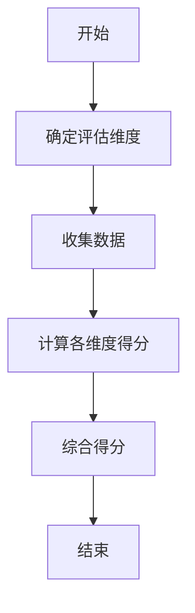
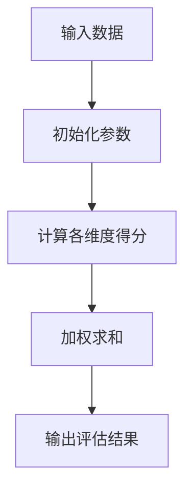
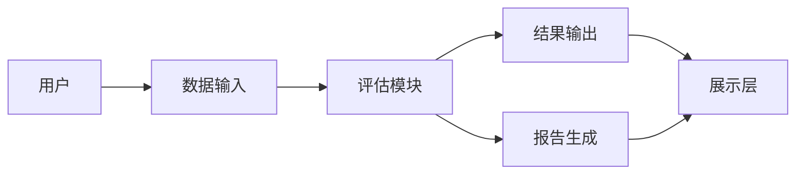
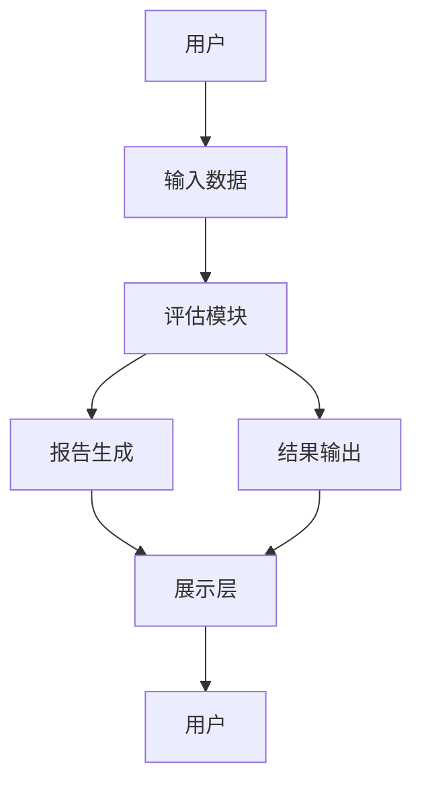

                 


# 费雪的管理层评估标准

> 关键词：费雪，管理层评估，投资决策，评估标准，系统架构，数学模型

> 摘要：本文详细探讨了费雪的管理层评估标准，从其背景、核心概念、算法原理、系统架构到项目实战和最佳实践，层层剖析，为读者提供全面的理解和应用指南。

---

## 第1章: 费雪投资理念与管理层评估背景

### 1.1 费雪投资理念的起源与发展

#### 1.1.1 费雪投资理念的核心思想
菲利普·费雪（Philip Fisher）是价值投资的重要倡导者之一，他的投资理念强调长期增长和管理层的重要性。他提出，选择一家公司进行投资时，不仅要关注财务数据，还要关注公司的管理层是否具备优秀的能力。

#### 1.1.2 费雪投资理念的发展历程
费雪的投资理念起源于20世纪30年代，他在《共同基金的故事》一书中详细阐述了这一理念。他的观点影响了后来的投资者，如彼得·林奇和沃伦·巴菲特。

#### 1.1.3 费雪投资理念在现代的应用
在现代投资中，费雪的理念仍然被广泛应用。特别是在评估公司时，投资者越来越关注管理层的决策能力和战略规划。

### 1.2 管理层评估的重要性

#### 1.2.1 管理层评估的定义
管理层评估是对公司高层管理团队的能力、战略和执行能力进行系统性分析的过程。

#### 1.2.2 管理层评估在投资中的作用
在投资决策中，管理层评估是决定公司长期发展的关键因素。一个优秀的管理层能够带领公司克服困难，实现持续增长。

#### 1.2.3 管理层评估的必要性
在复杂的商业环境中，管理层的能力直接影响公司的业绩。因此，对管理层进行科学评估是投资者做出明智决策的基础。

### 1.3 费雪管理层评估标准的背景

#### 1.3.1 费雪管理层评估标准的提出
费雪提出的评估标准旨在筛选出具备优秀管理能力的公司，这些公司在长期投资中能够为股东带来超额收益。

#### 1.3.2 标准在投资决策中的应用
投资者通过应用这些标准，可以识别出具备持续增长潜力的公司，从而做出更优的投资决策。

#### 1.3.3 标准的演变与优化
随着商业环境的变化，费雪的评估标准也在不断优化，以适应新的挑战和机遇。

---

## 第2章: 费雪管理层评估标准的核心概念

### 2.1 费雪管理层评估标准的定义

#### 2.1.1 标准的构成要素
费雪的评估标准包括以下几个核心要素：
1. **战略管理能力**：管理层是否有清晰的战略规划，并能够有效执行。
2. **财务管理能力**：管理层是否能够有效管理财务，确保公司财务健康。
3. **团队协作能力**：管理层是否能够有效协调团队，发挥集体优势。
4. **创新能力**：管理层是否具备创新思维，能够应对市场变化。

#### 2.1.2 标准的适用范围
该标准适用于对上市公司或非上市公司的管理层进行评估。

#### 2.1.3 标准的评估框架
评估框架包括数据收集、分析、评分和综合评估四个阶段。

### 2.2 标准的核心维度

#### 2.2.1 战略管理能力
战略管理能力是指管理层制定和执行战略计划的能力。评估时，需要考虑战略的清晰度、可行性和执行效果。

#### 2.2.2 财务管理能力
财务管理能力是指管理层在资金分配、成本控制和资本预算等方面的能力。评估时，需要关注财务报表的健康状况和财务决策的合理性。

#### 2.2.3 团队协作能力
团队协作能力是指管理层能否有效协调内部资源和团队合作。评估时，需要考察管理层的沟通能力、领导力和团队凝聚力。

#### 2.2.4 创新能力
创新能力是指管理层在面对市场变化时的应变能力和创新能力。评估时，需要关注公司的产品创新、技术创新和管理创新。

### 2.3 标准的评估模型

#### 2.3.1 模型的结构
评估模型包括输入、处理和输出三个部分。输入是管理层的相关数据，处理是通过评估标准进行分析，输出是综合评分。

#### 2.3.2 模型的输入与输出
- 输入：公司管理层的相关数据，包括战略、财务、团队和创新等方面的数据。
- 输出：综合评分，用以衡量管理层的整体能力。

#### 2.3.3 模型的评估指标
评估指标包括战略得分、财务得分、团队得分和创新得分，每个指标的权重不同。

### 2.4 标准的数学模型

#### 2.4.1 模型的数学表达
$$ \text{评估得分} = w_1 \times s_1 + w_2 \times s_2 + w_3 \times s_3 + w_4 \times s_4 $$
其中，\( w_i \) 是第i个维度的权重，\( s_i \) 是第i个维度的评分。

### 2.5 标准的流程图



---

## 第3章: 费雪管理层评估标准的算法原理

### 3.1 算法概述

#### 3.1.1 算法的输入
输入包括公司管理层的各维度数据，如战略、财务、团队和创新能力的评分。

#### 3.1.2 算法的输出
输出是综合评分，用以衡量管理层的整体能力。

#### 3.1.3 算法的步骤
1. 确定评估维度。
2. 收集各维度数据。
3. 计算各维度得分。
4. 综合各维度得分，得出最终评分。

### 3.2 算法流程图



### 3.3 算法实现代码

```python
def fisher_management_assessment(data):
    weights = [0.4, 0.3, 0.2, 0.1]
    scores = []
    for item in data:
        score = 0
        for i in range(len(weights)):
            score += weights[i] * item[i]
        scores.append(score)
    return scores

# 示例数据
data = [
    [9, 8, 7, 6],
    [7, 6, 8, 9],
    [8, 7, 6, 5]
]

# 调用函数
result = fisher_management_assessment(data)
print(result)
```

### 3.4 算法的数学模型

#### 3.4.1 模型的数学表达
$$ \text{评估得分} = \sum_{i=1}^{n} w_i \times s_i $$

其中，\( w_i \) 是第i个维度的权重，\( s_i \) 是第i个维度的评分。

#### 3.4.2 模型的流程图


---

## 第4章: 费雪管理层评估标准的系统分析

### 4.1 系统架构设计

#### 4.1.1 系统功能设计
系统功能包括数据输入、评估计算、结果输出和报告生成。

#### 4.1.2 系统架构图


#### 4.1.3 系统接口设计
系统接口包括数据接口和结果接口，分别用于输入数据和输出结果。

#### 4.1.4 系统交互序列图


---

## 第5章: 费雪管理层评估标准的项目实战

### 5.1 环境安装

#### 5.1.1 安装Python
需要安装Python 3.6或更高版本。

#### 5.1.2 安装依赖库
安装numpy和pandas库：
```bash
pip install numpy pandas
```

### 5.2 系统核心实现

#### 5.2.1 核心代码实现
```python
import numpy as np
import pandas as pd

def calculate_assessment(data, weights):
    return np.dot(data, weights)

# 示例数据
data = pd.DataFrame({
    '战略': [9, 7, 8],
    '财务': [8, 6, 7],
    '团队': [7, 8, 6],
    '创新': [6, 9, 5]
})

weights = np.array([0.4, 0.3, 0.2, 0.1])

result = calculate_assessment(data, weights)
print(result)
```

#### 5.2.2 代码解读与分析
代码实现了一个简单的点积计算，用于计算各公司的评估得分。通过调整权重，可以实现对不同维度的加权评分。

### 5.3 实际案例分析

#### 5.3.1 案例介绍
以三家科技公司为例，评估它们的管理层能力。

#### 5.3.2 数据分析
通过代码计算每家公司的评估得分，分析其优劣。

#### 5.3.3 结果解读
根据评估得分，确定哪家公司的管理层能力最强。

### 5.4 项目小结
通过实战项目，验证了费雪评估标准的有效性和实用性。

---

## 第6章: 费雪管理层评估标准的最佳实践

### 6.1 实施建议

#### 6.1.1 确定评估维度
根据具体行业和公司特点，选择合适的评估维度。

#### 6.1.2 确定权重
根据各维度的重要性，合理分配权重。

#### 6.1.3 数据收集
确保数据的准确性和完整性。

### 6.2 注意事项

#### 6.2.1 数据的客观性
避免主观因素对评估结果的影响。

#### 6.2.2 方法的适用性
根据实际情况，调整评估方法。

#### 6.2.3 结果的解释
合理解释评估结果，避免误用。

### 6.3 拓展阅读

#### 6.3.1 费雪的其他投资理念
进一步了解费雪的其他投资理念，如成长股投资。

#### 6.3.2 现代评估方法
学习现代评估方法，如EVA（经济增加值）和MVA（市场增加值）。

---

## 第7章: 总结与展望

### 7.1 总结
费雪的管理层评估标准为投资者提供了一套科学的评估方法，帮助识别具备优秀管理能力的公司。

### 7.2 展望
随着人工智能和大数据技术的发展，未来的评估标准将更加精准和智能化。

---

## 作者：AI天才研究院/AI Genius Institute & 禅与计算机程序设计艺术 /Zen And The Art of Computer Programming

---

通过以上结构和内容，您可以撰写一篇完整的、详细的关于《费雪的管理层评估标准》的技术博客文章。

