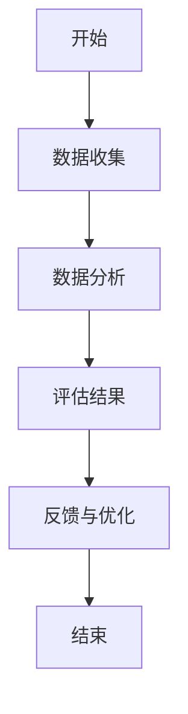

                 


# 费雪的管理层评估：远程办公时代的新挑战

## 关键词：远程办公、管理层评估、费雪评估法、团队管理、技术工具

## 摘要：  
随着远程办公的普及，传统的管理层评估方法面临新的挑战。本文深入分析了费雪的管理层评估方法在远程办公环境中的应用，探讨了远程办公带来的沟通、协作和技术依赖性等问题，并提出了相应的优化与创新策略，为现代管理者提供了实践指导。

---

## 第1章: 远程办公的兴起与发展

### 1.1 远程办公的起源与现状

#### 1.1.1 远程办公的起源  
远程办公的概念可以追溯到20世纪90年代，随着互联网技术的发展，远程办公逐渐从一种补充性工作方式转变为一种主流的工作模式。新冠疫情的爆发加速了这一趋势，许多企业开始全面拥抱远程办公。

#### 1.1.2 远程办公的现状与趋势  
当前，远程办公已成为企业灵活管理的重要手段。根据Statista的数据显示，2023年全球约有3.87亿人参与远程办公，预计这一数字将持续增长。远程办公不仅改变了工作方式，也对企业管理提出了新的要求。

#### 1.1.3 远程办公对管理的影响  
远程办公改变了传统的面对面管理方式，管理者需要更多依赖数据和工具来进行评估。这种变化对管理层的评估能力提出了更高的要求，尤其是在信任、沟通和绩效管理方面。

---

### 1.2 费雪的管理层评估的演变

#### 1.2.1 费雪评估法的定义与核心思想  
费雪的管理层评估法是一种基于数据分析和行为观察的评估方法，强调通过量化指标和定性分析来全面评估管理层的能力和表现。

#### 1.2.2 远程办公时代对费雪评估法的挑战  
远程办公环境下，传统的面对面沟通和团队协作受限，如何准确评估管理层的能力成为一个难题。此外，技术工具的依赖性和数据的准确性也对评估方法提出了新的挑战。

#### 1.2.3 费雪评估法在现代管理中的应用  
尽管面临挑战，费雪评估法的核心思想依然适用。通过结合现代技术工具和数据驱动的方法，费雪评估法在远程办公时代依然能够发挥重要作用。

---

## 第2章: 管理层评估的核心概念与框架

### 2.1 管理层评估的定义与维度

#### 2.1.1 管理层评估的定义  
管理层评估是对管理者在组织中的表现进行全面分析的过程，包括能力、绩效、领导力等多个维度。

#### 2.1.2 评估维度的分类与对比  
- **能力维度**：包括专业知识、决策能力、问题解决能力等。
- **绩效维度**：包括目标完成情况、团队绩效等。
- **领导力维度**：包括团队管理能力、沟通能力等。

#### 2.1.3 核心要素的ER实体关系图  
以下是一个简单的ER实体关系图，展示了管理层评估的核心要素：

```mermaid
er
actor: 管理层
dimensions: 能力、绩效、领导力
metrics: 量化指标、定性评估
```

---

### 2.2 费雪评估法的原理与流程

#### 2.2.1 费雪评估法的原理  
费雪评估法的核心在于通过数据收集和分析，全面评估管理者的绩效。这种方法强调客观性和系统性，避免主观偏见。

#### 2.2.2 评估流程的Mermaid流程图  
以下是一个费雪评估法的流程图：



#### 2.2.3 评估模型的数学公式  
费雪评估法可以通过以下公式进行量化：

$$
\text{综合评估得分} = \sum (\text{能力权重} \times \text{能力得分}) + \sum (\text{绩效权重} \times \text{绩效得分})
$$

---

## 第3章: 远程办公时代的新特点与挑战

### 3.1 远程办公中的沟通与协作

#### 3.1.1 沟通方式的变化  
远程办公依赖于在线沟通工具，如Zoom、Teams等。这种沟通方式的改变可能会影响管理层与团队的互动效果。

#### 3.1.2 协作工具的应用  
现代协作工具（如Slack、Trello）的应用使得团队协作更加高效，但也需要管理者掌握新的工具使用方法。

#### 3.1.3 沟通效率的评估  
远程办公中的沟通效率可以通过数据（如响应时间、会议效果）进行评估，但如何准确衡量这些数据的权重是一个挑战。

---

### 3.2 远程办公中的团队管理

#### 3.2.1 团队结构的变化  
远程办公可能导致团队结构的分散化，管理者需要更灵活地管理不同地区的团队成员。

#### 3.2.2 团队协作的挑战  
远程办公中，团队协作的协调性可能受到影响，管理者需要更多依赖技术工具来维持团队的协作效率。

#### 3.2.3 团队绩效的评估  
团队绩效的评估需要结合远程办公的特点，考虑目标完成情况、团队凝聚力等多个维度。

---

### 3.3 远程办公中的技术依赖

#### 3.3.1 技术工具的依赖性  
远程办公的高度依赖技术工具，如在线会议、协作软件等。这些工具的稳定性和安全性对管理层评估至关重要。

#### 3.3.2 技术工具的局限性  
技术工具的局限性可能导致信息传递的不完整，影响管理层对团队表现的准确评估。

#### 3.3.3 技术工具的优化建议  
为了克服技术工具的局限性，管理者需要选择适合的工具，并结合其他评估方法（如定期面谈）进行综合评估。

---

## 第4章: 费雪评估法在远程办公中的应用

### 4.1 费雪评估法的远程适应性

#### 4.1.1 远程评估的核心原则  
远程评估需要注重数据的全面性、评估过程的透明性和结果的可操作性。

#### 4.1.2 远程评估的实施步骤  
1. 数据收集：通过在线工具收集团队成员的反馈和绩效数据。
2. 数据分析：利用数据分析工具对数据进行整理和分析。
3. 结果反馈：将评估结果反馈给管理层，并提出改进建议。

#### 4.1.3 远程评估的注意事项  
- 确保数据的真实性和准确性。
- 注重评估过程的互动性和参与感。
- 定期更新评估方法以适应远程办公的变化。

---

### 4.2 远程评估的工具与技术

#### 4.2.1 远程评估工具的选择  
- **数据收集工具**：如SurveyMonkey、Google表单。
- **数据分析工具**：如Excel、Power BI。
- **协作工具**：如Slack、Teams。

#### 4.2.2 远程评估技术的优缺点  
- **优点**：高效、便捷、覆盖面广。
- **缺点**：可能缺乏深度互动，数据可能存在偏差。

#### 4.2.3 远程评估工具的使用案例  
例如，某企业通过Google表单和Power BI进行远程团队绩效评估，取得了显著效果。

---

## 第5章: 费雪评估法的优化与创新

### 5.1 远程评估的创新方法

#### 5.1.1 数据驱动的评估方法  
通过大数据分析，结合行为数据和绩效数据，进行更加精准的评估。

#### 5.1.2 智能化评估工具的应用  
引入AI技术，如自然语言处理，对团队成员的反馈进行自动分析，提高评估效率。

#### 5.1.3 远程评估的未来趋势  
随着技术的进步，远程评估将更加智能化和个性化，评估结果将更加精准和实用。

---

### 5.2 费雪评估法的数学模型

#### 5.2.1 评估模型的数学公式  
以下是一个优化后的评估模型公式：

$$
\text{综合评估得分} = \sum (\text{能力权重} \times \text{能力得分}) + \sum (\text{绩效权重} \times \text{绩效得分}) + \sum (\text{领导力权重} \times \text{领导力得分})
$$

#### 5.2.2 模型的优化与调整  
通过引入实时数据和动态权重调整，模型能够更好地适应远程办公的变化。

---

## 第6章: 案例分析与实际应用

### 6.1 远程办公中的费雪评估案例

#### 6.1.1 案例背景介绍  
某科技公司采用费雪评估法对远程团队进行绩效评估，取得了显著效果。

#### 6.1.2 评估过程分析  
- 数据收集：通过在线工具收集团队成员的反馈和绩效数据。
- 数据分析：利用数据分析工具对数据进行整理和分析。
- 结果反馈：将评估结果反馈给管理层，并提出改进建议。

#### 6.1.3 评估结果与启示  
通过优化评估方法，公司成功提升了远程团队的绩效和团队凝聚力。

---

### 6.2 费雪评估法的优化建议

#### 6.2.1 优化策略的制定  
- 引入数据驱动的方法。
- 结合智能化工具。
- 定期更新评估方法。

#### 6.2.2 优化措施的实施  
- 提高数据收集的准确性。
- 加强团队协作和技术工具的使用。
- 定期进行评估结果的反馈与优化。

#### 6.2.3 优化效果的总结  
通过优化措施，评估结果更加精准，团队绩效显著提升。

---

## 结语

远程办公时代对管理层评估提出了新的挑战，但通过结合费雪评估法和现代技术工具，管理者可以更加高效地进行评估。未来，随着技术的进步和管理理论的创新，远程办公中的管理层评估将更加精准和科学。

---

## 作者：AI天才研究院/AI Genius Institute & 禅与计算机程序设计艺术 /Zen And The Art of Computer Programming

