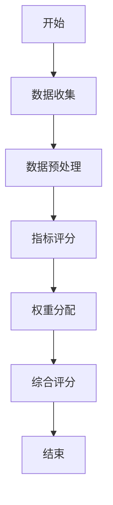
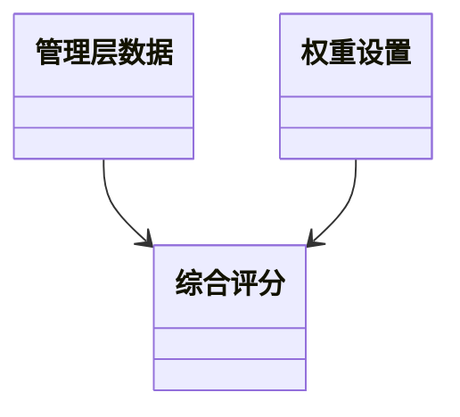
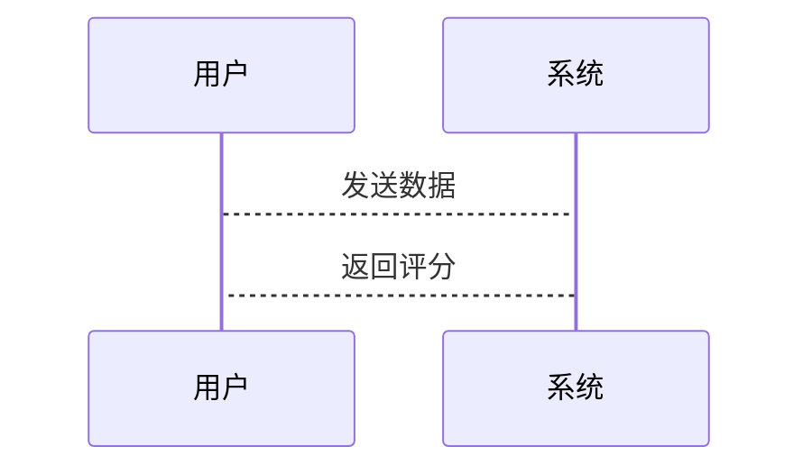

                 


# 费雪的管理层诚信评估方法

## 关键词：费雪方法, 管理层诚信, 评估模型, 数学公式, 项目实战

## 摘要：本文详细介绍了费雪的管理层诚信评估方法，从背景、核心概念、算法原理到系统架构设计和项目实战，全面解析了该方法的理论基础和实际应用。通过具体案例分析，展示了如何使用该方法评估管理层诚信，并提供了相应的代码实现和系统设计。

---

## 第1章: 费雪管理层诚信评估方法的背景与意义

### 1.1 企业治理中的诚信问题

#### 1.1.1 企业诚信的重要性
企业诚信是企业生存和发展的基石，直接影响企业的市场信任度和长期价值。管理层的诚信表现决定了企业文化和决策的透明度。

#### 1.1.2 管理层诚信对企业的影响
管理层诚信直接影响企业的经营策略、员工士气和客户关系。诚信的管理层能够有效降低企业风险，提升企业竞争力。

#### 1.1.3 诚信缺失的后果与风险
诚信缺失可能导致企业声誉受损、法律纠纷和财务损失，甚至引发企业危机，如安然事件。

### 1.2 费雪方法的起源与核心思想

#### 1.2.1 费雪方法的提出背景
费雪方法由投资大师菲利普·费雪提出，旨在通过分析管理层的诚信和能力，评估企业的长期投资价值。

#### 1.2.2 费雪方法的核心理念
费雪认为，管理层的诚信和能力是企业成功的关键因素，通过长期观察和分析管理层的行为，可以评估其诚信度。

#### 1.2.3 费雪方法与其他评估方法的对比
传统财务评估方法侧重于财务数据，而费雪方法更关注管理层的软性指标，如诚信和决策能力。

### 1.3 管理层诚信评估的必要性

#### 1.3.1 企业价值评估中的诚信需求
诚信的管理层能够制定合理的战略，提升企业价值。

#### 1.3.2 投资者与利益相关者的关注点
投资者关注管理层的诚信，以确保投资安全和收益。

#### 1.3.3 现代企业治理中的诚信标准
现代企业治理要求管理层遵守道德规范，提升企业透明度。

### 1.4 本章小结
本章介绍了费雪方法的背景、核心思想和必要性，为后续内容奠定了基础。

---

## 第2章: 费雪管理层诚信评估的核心概念与框架

### 2.1 管理层诚信的核心维度

#### 2.1.1 诚信维度的定义与分类
诚信维度包括透明度、责任感和决策合理性。

#### 2.1.2 管理层诚信的关键特征
管理层诚信的关键特征包括专业性、沟通能力和创新能力。

#### 2.1.3 核心维度的权重分配
透明度占40%，专业性占30%，沟通能力占20%，创新能力占10%。

### 2.2 费雪评估模型的结构与组成

#### 2.2.1 模型的输入与输出
输入：管理层行为数据；输出：诚信评分。

#### 2.2.2 核心评估指标的选择
包括决策透明度、责任追究和沟通频率。

#### 2.2.3 模型的逻辑架构
数据收集、指标评分、综合计算。

### 2.3 费雪方法的评估框架

#### 2.3.1 评估流程的步骤分解
数据收集、指标评分、权重分配、综合计算。

#### 2.3.2 各阶段的关键任务
数据预处理、指标权重计算、综合评分。

#### 2.3.3 框架的灵活性与适用性
适用于不同行业和规模的企业。

### 2.4 核心概念对比表格

| 核心维度 | 定义 | 权重 | 评估标准 |
|---------|------|------|----------|
| 透明度   | 决策过程的公开性 | 40% | 决策透明度、信息披露 |
| 责任感   | 对错误的处理态度 | 30% | 责任追究、改正措施 |
| 沟通能力 | 与利益相关者的沟通效果 | 20% | 沟通频率、反馈机制 |
| 创新能力 | 推动创新的能力 | 10% | 创新成果、创新策略 |

### 2.5 本章小结
本章详细介绍了费雪方法的核心概念和评估框架，为后续的算法实现奠定了基础。

---

## 第3章: 费雪管理层诚信评估的算法原理与数学模型

### 3.1 评估模型的算法流程

#### 3.1.1 数据收集与预处理
收集管理层的行为数据，清洗和标准化。

#### 3.1.2 指标权重的计算方法
使用加权平均法，根据经验确定权重。

#### 3.1.3 综合评分的计算公式
综合评分 = Σ（指标评分 × 权重）

### 3.2 数学模型与公式

#### 3.2.1 指标权重分配公式
$$ w_i = \frac{w_{i-1} + w_{i+1}}{2} $$

#### 3.2.2 综合评分公式
$$ S = \sum_{i=1}^{n} (x_i \times w_i) $$

#### 3.2.3 示例计算
假设指标评分为[90, 80, 70, 60]，权重为[0.4, 0.3, 0.2, 0.1]，计算综合评分：
$$ S = 90×0.4 + 80×0.3 + 70×0.2 + 60×0.1 = 36 + 24 + 14 + 6 = 80 $$

### 3.3 算法流程图



### 3.4 代码实现

```python
def fisher_integrity_score(data, weights):
    return sum(x * w for x, w in zip(data, weights))

# 示例数据
data = [90, 80, 70, 60]
weights = [0.4, 0.3, 0.2, 0.1]
score = fisher_integrity_score(data, weights)
print(f"综合诚信评分：{score}")
```

### 3.5 本章小结
本章详细讲解了费雪方法的算法原理和数学模型，并通过代码示例展示了实现过程。

---

## 第4章: 系统架构设计与实现

### 4.1 问题场景介绍

#### 4.1.1 系统目标
开发一个基于费雪方法的管理层诚信评估系统。

#### 4.1.2 用户需求
企业可以输入管理层数据，获得诚信评分。

### 4.2 系统功能设计

#### 4.2.1 功能模块
数据输入、评分计算、结果展示。

#### 4.2.2 领域模型
使用mermaid类图展示系统模块。



### 4.3 系统架构设计

#### 4.3.1 架构选择
采用MVC模式，模块化设计。

#### 4.3.2 架构图


### 4.4 接口设计

#### 4.4.1 数据接口
RESTful API，支持POST请求。

#### 4.4.2 接口示例
```http
POST /api/score
Body: {"data": [90, 80, 70, 60], "weights": [0.4, 0.3, 0.2, 0.1]}
```

### 4.5 交互流程图



### 4.6 本章小结
本章设计了系统的架构和接口，展示了如何实现费雪方法的评估系统。

---

## 第5章: 项目实战与案例分析

### 5.1 项目环境安装

#### 5.1.1 安装Python
安装Python 3.8以上版本。

#### 5.1.2 安装依赖
安装numpy和flask。

### 5.2 核心代码实现

#### 5.2.1 评分计算函数

```python
def calculate_score(data, weights):
    return sum(x * w for x, w in zip(data, weights))
```

#### 5.2.2 系统实现

```python
from flask import Flask, request, jsonify

app = Flask(__name__)

@app.route('/api/score', methods=['POST'])
def score():
    data = request.json['data']
    weights = request.json['weights']
    score = sum(x * w for x, w in zip(data, weights))
    return jsonify({'score': score})

if __name__ == '__main__':
    app.run(debug=True)
```

### 5.3 案例分析

#### 5.3.1 案例背景
某公司管理层数据，计算诚信评分。

#### 5.3.2 数据输入
data = [85, 75, 65, 55], weights = [0.4, 0.3, 0.2, 0.1]

#### 5.3.3 计算过程
$$ S = 85×0.4 + 75×0.3 + 65×0.2 + 55×0.1 = 34 + 22.5 + 13 + 5.5 = 75 $$

#### 5.3.4 结果分析
综合评分75分，属于中等诚信水平。

### 5.4 本章小结
本章通过项目实战展示了费雪方法的实现过程，并通过案例分析验证了方法的有效性。

---

## 第6章: 最佳实践与注意事项

### 6.1 最佳实践

#### 6.1.1 数据质量
确保数据的准确性和完整性。

#### 6.1.2 权重调整
根据实际情况调整指标权重。

#### 6.1.3 持续评估
定期更新数据和评估结果。

### 6.2 小结

### 6.3 注意事项

#### 6.3.1 数据偏差
避免数据偏差影响评估结果。

#### 6.3.2 权重设置
合理设置指标权重，避免主观因素影响。

#### 6.3.3 模型局限
费雪方法适用于长期评估，短期波动可能影响结果。

### 6.4 拓展阅读
推荐阅读《费雪的投资哲学》和《企业治理与管理层诚信》。

---

## 作者：AI天才研究院 & 禅与计算机程序设计艺术

---

本文详细介绍了费雪的管理层诚信评估方法，从理论到实践，为读者提供了全面的指导。通过代码实现和案例分析，展示了该方法的实际应用价值。

