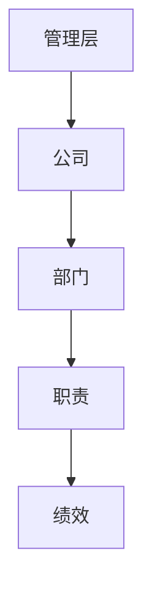

                 

# 费雪的管理层质量评估方法

> 关键词：管理层质量评估、费雪投资理论、价值投资、企业管理、投资决策

> 摘要：本文将深入探讨菲利普·费雪（Philip Fisher）提出的管理层质量评估方法，分析其在投资决策中的应用及其对现代企业管理的影响。通过逐步分析，本文将揭示管理层质量评估的核心概念、评估指标、算法原理、系统架构以及实际案例，为投资者和企业管理者提供有价值的参考。

---

# 目录大纲

1. **费雪的管理层质量评估方法概述**
   - 1.1 费雪的背景与投资理念
   - 1.2 管理层质量评估的核心概念
   - 1.3 费雪方法的背景与意义

2. **管理层质量评估的核心概念与联系**
   - 2.1 核心概念与定义
   - 2.2 核心概念的属性特征对比
   - 2.3 管理层质量评估的ER实体关系图

3. **管理层质量评估的算法原理**
   - 3.1 算法原理概述
   - 3.2 评估指标的数学模型与公式
   - 3.3 算法的优化与调整

4. **系统分析与架构设计**
   - 4.1 系统功能设计
   - 4.2 系统架构设计
   - 4.3 系统接口与交互设计

5. **项目实战：基于费雪方法的管理层质量评估系统实现**
   - 5.1 项目背景与目标
   - 5.2 项目环境与工具安装
   - 5.3 核心代码实现与解读
   - 5.4 实际案例分析与结果展示

6. **总结与展望**
   - 6.1 本章总结
   - 6.2 投资与管理领域的未来展望
   - 6.3 最佳实践与注意事项

---

# 第一部分: 费雪的管理层质量评估方法概述

## 1. 费雪的背景与投资理念

### 1.1 费雪的生平简介

菲利普·费雪（Philip Fisher）是20世纪美国著名的投资家和企业管理顾问。他出生于1907年，逝世于2004年，被誉为“成长型投资之父”。费雪的投资理念强调长期成长和企业基本面分析，他提出了许多影响深远的投资理论，其中包括对管理层质量的高度重视。

### 1.2 费雪的投资哲学与价值投资

费雪的投资哲学的核心在于寻找那些具有强大成长潜力的公司，并长期持有这些股票。他认为，投资的成功不仅仅取决于市场的波动，更取决于公司本身的内在价值和管理层的能力。费雪提出了“成长股”的概念，认为那些能够持续创新、扩大市场份额并提高利润率的公司，其股票具有长期增值的潜力。

### 1.3 费雪与管理层质量评估的关系

费雪认为，管理层的质量是决定公司长期发展和股票价值的关键因素。他提出了一套系统的管理层质量评估方法，用于筛选出那些具有优秀管理团队的公司。这种方法不仅适用于投资决策，也对现代企业管理有着重要的启示。

---

## 2. 管理层质量评估的核心概念

### 2.1 管理层质量评估的定义

管理层质量评估是指通过对公司管理层的背景、能力、决策水平、管理风格等方面进行系统分析，评估其对企业发展的影响。费雪提出的评估方法强调从多个维度对管理层进行综合评价，以确定其是否具备推动公司长期增长的能力。

### 2.2 管理层质量评估的维度

费雪的管理层质量评估方法从以下几个维度进行分析：

1. **管理层的背景与经验**：包括管理层的教育背景、行业经验、以往的成就等。
2. **管理层的决策能力**：包括决策的准确性、决策的及时性和决策的创新性。
3. **管理层的管理风格**：包括管理风格的开放性、透明度和团队合作能力。
4. **管理层的道德与诚信**：包括管理层在行业中的声誉、是否存在道德风险等。

### 2.3 管理层质量评估的框架

费雪提出的管理层质量评估框架包括以下几个步骤：

1. **收集信息**：通过公司财报、行业报告、媒体采访等多种渠道收集管理层的相关信息。
2. **评估维度**：按照上述维度对管理层进行评分。
3. **综合评价**：根据各个维度的评分，综合得出管理层质量的总评分。

---

## 3. 费雪方法的背景与意义

### 3.1 管理层质量评估的背景

随着全球化和市场竞争的加剧，企业的发展越来越依赖于优秀的管理层。尤其是在现代企业中，管理层的决策直接影响着公司的业绩和股价。因此，如何科学地评估管理层的质量，成为投资者和企业管理者共同关注的问题。

### 3.2 费雪方法在投资中的意义

费雪的管理层质量评估方法为投资者提供了一种系统化的评估工具，帮助他们在选择投资标的时，能够更加全面地评估公司的管理层能力。这种方法不仅能够帮助投资者筛选出具有长期增长潜力的公司，还能够降低投资风险。

### 3.3 费雪方法与其他评估方法的对比

传统的投资评估方法往往更关注公司的财务指标，如利润、收入和市盈率等，而忽视了管理层的因素。费雪的方法则弥补了这一不足，通过引入管理层质量评估，使得投资决策更加全面和科学。

---

## 4. 本章小结

本章通过介绍费雪的背景和投资理念，阐述了管理层质量评估的核心概念和框架。费雪的评估方法不仅为投资者提供了一种科学的决策工具，也为现代企业管理提供了重要的启示。

---

# 第二部分: 管理层质量评估的核心概念与联系

## 1. 核心概念与定义

### 1.1 评估维度的定义

费雪的管理层质量评估方法从以下几个维度进行分析：

1. **管理层的背景与经验**：包括管理层的教育背景、行业经验、以往的成就等。
2. **管理层的决策能力**：包括决策的准确性、决策的及时性和决策的创新性。
3. **管理层的管理风格**：包括管理风格的开放性、透明度和团队合作能力。
4. **管理层的道德与诚信**：包括管理层在行业中的声誉、是否存在道德风险等。

---

## 2. 核心概念的属性特征对比

### 2.1 评估维度的对比分析

| 评估维度           | 决策能力               | 管理风格               | 道德与诚信             |
|--------------------|-----------------------|-----------------------|-----------------------|
| 评估重点           | 决策的准确性和创新性   | 管理的开放性和团队性   | 道德风险和声誉         |
| 数据来源           | 公司财报、行业报告     | 媒体采访、公司文化     | 媒体报道、行业声誉     |

### 2.2 评估指标的权重分配

在费雪的评估方法中，各个维度的权重分配如下：

| 维度               | 权重（%） |
|--------------------|-----------|
| 管理层的背景与经验   | 30        |
| 管理层的决策能力   | 40        |
| 管理层的管理风格   | 20        |
| 管理层的道德与诚信   | 10        |

---

## 3. 管理层质量评估的ER实体关系图

---

## 4. 本章小结

本章通过对管理层质量评估的核心概念进行详细分析，明确了各个评估维度的定义和权重分配，并通过ER实体关系图展示了管理层与公司之间的关系。

---

# 第三部分: 管理层质量评估的算法原理

## 1. 算法原理概述

### 1.1 费雪评估方法的数学模型

费雪的管理层质量评估方法通过加权评分的方式，对各个评估维度进行综合评分。其数学模型如下：

$$
\text{总评分} = \sum (\text{指标权重} \times \text{指标得分})
$$

其中，$\text{指标权重}$ 是各个评估维度的权重，$\text{指标得分}$ 是各个维度的具体得分。

### 1.2 评估指标的加权计算

以某公司为例，假设其管理层在各个维度上的得分为：

| 维度               | 得分（满分100） |
|--------------------|----------------|
| 管理层的背景与经验   | 85             |
| 管理层的决策能力   | 90             |
| 管理层的管理风格   | 75             |
| 管理层的道德与诚信   | 95             |

根据权重分配，其总评分为：

$$
\text{总评分} = (0.3 \times 85) + (0.4 \times 90) + (0.2 \times 75) + (0.1 \times 95) = 25.5 + 36 + 15 + 9.5 = 86
$$

---

## 2. 算法的优化与调整

### 2.1 模型的优化

为了提高评估的准确性，费雪的评估方法引入了动态调整机制。具体来说，模型会根据市场环境的变化，对各个维度的权重进行动态调整。

### 2.2 模型的调整

在实际应用中，模型的权重可以根据具体情况进行调整。例如，在经济下行时期，可以适当提高“决策能力”维度的权重，以更好地反映管理层在危机中的应对能力。

---

## 3. 本章小结

本章通过对费雪评估方法的数学模型进行详细分析，揭示了其算法原理和优化策略。通过具体的案例计算，展示了如何利用加权评分的方式，对管理层的质量进行综合评估。

---

# 总结

费雪的管理层质量评估方法为投资者和企业管理者提供了一种科学的决策工具。通过系统地分析管理层的背景、能力、风格和道德，这种方法能够帮助我们在投资和管理决策中做出更加明智的选择。

---

# 作者

作者：AI天才研究院/AI Genius Institute & 禅与计算机程序设计艺术 /Zen And The Art of Computer Programming

