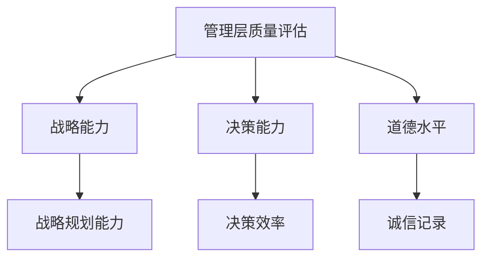

                 


# 费雪的管理层质量评估：公司治理在投资决策中的作用

> 关键词：费雪、管理层质量评估、公司治理、投资决策、价值投资、战略能力、道德水平

> 摘要：本文深入探讨了费雪的管理层质量评估理论，分析了公司治理在投资决策中的关键作用。通过详细阐述管理层评估的核心要素、公司治理框架、投资策略的优化以及实际案例分析，本文为投资者提供了基于管理层质量评估的科学投资决策方法。文章还结合现代投资环境，探讨了管理层质量评估的未来发展趋势。

---

## 第1章: 费雪的管理层质量评估概述

### 1.1 费雪的背景与投资理念

#### 1.1.1 费雪的生平简介
本杰明·格雷厄姆的学生，价值投资的奠基人，著有《证券分析》和《聪明的投资者》。他强调“安全边际”和长期投资的理念，认为投资的本质是寻找具有持续竞争优势的企业。

#### 1.1.2 费雪的价值投资理论
费雪提出了“成长股投资”理论，主张投资于具有持续盈利能力和高成长潜力的企业。他强调管理层的质量是企业成长的关键因素。

#### 1.1.3 管理层质量评估的重要性
费雪认为，企业的价值不仅取决于财务数据，还取决于管理层的战略能力、决策能力和道德水平。优秀的管理层能够带领企业持续增长，为投资者创造长期价值。

---

### 1.2 管理层质量评估的核心概念

#### 1.2.1 管理层的定义与组成
管理层是企业的决策核心，包括 CEO、 CFO、COO 等高级管理人员。他们的能力和决策直接影响企业的绩效。

#### 1.2.2 管理层质量评估的意义
- 评估管理层的战略能力，判断其是否能够带领企业应对市场变化。
- 评估管理层的道德水平，确保企业合规经营。
- 评估管理层的决策效率，判断其是否能够快速响应市场机会和挑战。

#### 1.2.3 费雪的管理层质量评估框架
费雪提出了“管理层质量评估框架”，包括以下几个方面：
- **战略能力**：管理层是否能够制定出清晰的战略目标，并有效执行。
- **决策能力**：管理层在面对复杂问题时的决策效率和质量。
- **道德水平**：管理层是否具备诚信和责任感，能否以企业利益为重。

---

### 1.3 公司治理在投资决策中的作用

#### 1.3.1 公司治理的定义与目标
公司治理是指通过合理的制度安排，确保企业决策的科学性和合规性。其目标是实现企业价值最大化，同时保护股东和其他利益相关者的权益。

#### 1.3.2 公司治理与投资决策的关系
- 良好的公司治理能够提高企业的透明度和信任度，吸引更多的投资者。
- 公司治理的优劣直接影响企业的管理效率和盈利能力，进而影响投资回报。

#### 1.3.3 费雪的公司治理视角
费雪认为，公司治理的核心在于管理层与股东之间的利益协调。他主张通过合理的股权结构和治理机制，确保管理层的利益与股东的利益一致。

---

## 第2章: 管理层质量评估的核心要素

### 2.1 管理层的战略能力

#### 2.1.1 战略规划能力的定义
战略规划能力是指管理层制定企业长期发展目标和实现目标的路径的能力。

#### 2.1.2 战略执行能力的评估
- **战略执行能力**：管理层是否能够将战略目标分解为具体的行动计划，并有效执行。
- **执行效率**：管理层在执行过程中是否能够快速响应市场变化，调整策略。

#### 2.1.3 战略调整能力的重要性
在复杂多变的市场环境中，管理层需要具备快速调整战略的能力，以应对突发情况和市场变化。

---

### 2.2 管理层的决策能力

#### 2.2.1 决策效率的评估
- **决策效率**：管理层在面对问题时，是否能够快速做出决策。
- **决策透明度**：管理层的决策过程是否公开透明，是否能够得到股东和员工的理解。

#### 2.2.2 决策质量的衡量
- **决策质量**：管理层的决策是否具有前瞻性和科学性，是否能够为企业创造长期价值。
- **决策失误率**：管理层在决策过程中是否经常出现重大失误。

#### 2.2.3 决策透明度的影响
决策透明度高的管理层更容易赢得股东和员工的信任，有助于企业长期发展。

---

### 2.3 管理层的道德与诚信

#### 2.3.1 管理层道德的定义
管理层道德是指管理层在经营企业过程中是否具备诚信、责任感和职业道德。

#### 2.3.2 管理层诚信的评估标准
- **诚信记录**：管理层是否曾经有过欺诈或不诚信的行为。
- **道德表现**：管理层在日常经营中是否遵守职业道德，是否关注企业社会责任。

#### 2.3.3 管理层道德对公司治理的影响
- 诚信的管理层更容易获得股东的信任和支持。
- 道德水平高的管理层能够推动企业实现可持续发展，增强企业的社会形象。

---

### 2.4 管理层的团队协作能力

#### 2.4.1 团队协作的定义
团队协作能力是指管理层内部是否能够有效协作，共同推动企业目标的实现。

#### 2.4.2 团队协作能力的评估
- **协作效率**：管理层内部是否能够高效协作，避免内耗。
- **团队凝聚力**：管理层是否能够形成统一的团队，共同应对挑战。

#### 2.4.3 团队协作对公司治理的作用
- 团队协作能力强的管理层能够提高企业的管理效率，增强企业的竞争力。
- 良好的团队协作能够减少公司治理中的冲突，提高决策的科学性。

---

## 第3章: 公司治理的框架与机制

### 3.1 公司治理的结构

#### 3.1.1 董事会的组成与职责
- **董事会组成**：董事会由董事长、独立董事和其他董事组成，独立董事的比例通常不低于1/3。
- **董事会职责**：制定企业战略，监督管理层的经营行为，确保企业合规经营。

#### 3.1.2 高级管理层的职责
- **高级管理层**：包括 CEO、CFO、COO 等，负责日常经营管理和战略执行。
- **职责分工**：明确各高级管理人员的职责，确保企业运营的高效性。

#### 3.1.3 股东与利益相关者的角色
- **股东**：企业的最终所有者，享有分红权和投票权。
- **利益相关者**：包括员工、客户、供应商、债权人等，他们的利益也应得到保护。

---

### 3.2 公司治理的机制

#### 3.2.1 股权结构的优化
- **股权结构**：合理的股权结构能够避免一股独大，确保董事会的独立性和决策的科学性。
- **股权分散化**：通过分散股权，避免控股股东对企业的控制权过度集中。

#### 3.2.2 治理制度的完善
- **治理制度**：包括公司章程、董事会制度、股东大会制度等。
- **制度优化**：通过制度优化，确保公司治理的透明性和合规性。

#### 3.2.3 监督机制的建立
- **内部监督**：包括内部审计、风险管理等部门，确保企业经营的合规性。
- **外部监督**：包括会计师事务所、律师事务所等外部机构，对企业的财务报告和法律行为进行监督。

---

### 3.3 公司治理的评价体系

#### 3.3.1 治理评价指标的设计
- **评价指标**：包括董事会独立性、独立董事比例、管理层薪酬与绩效挂钩程度等。
- **指标权重**：根据企业实际情况，合理分配各评价指标的权重。

#### 3.3.2 治理评价方法的选择
- **定性评价**：通过对企业治理结构和机制的分析，进行定性评价。
- **定量评价**：通过对企业财务数据和治理指标的量化分析，进行定量评价。

#### 3.3.3 治理评价结果的应用
- **评价结果应用**：将评价结果作为企业治理优化的依据，不断改进和完善公司治理结构。

---

## 第4章: 管理层质量评估与投资策略

### 4.1 投资决策中的管理层评估

#### 4.1.1 管理层质量评估在投资中的作用
- **投资决策**：管理层质量评估是投资决策的重要依据，能够帮助投资者筛选出具有持续增长潜力的企业。
- **风险控制**：通过评估管理层的质量，投资者可以降低投资风险，避免投资于管理不善的企业。

#### 4.1.2 管理层质量评估的指标体系
- **战略能力**：包括战略规划能力、战略执行能力等。
- **决策能力**：包括决策效率、决策质量等。
- **道德水平**：包括诚信记录、道德表现等。

#### 4.1.3 管理层质量评估的权重分配
- **权重分配**：根据企业的行业特点和投资目标，合理分配各评估指标的权重。

---

### 4.2 管理层质量评估的数学模型

#### 4.2.1 数据分析模型


#### 4.2.2 评估模型的实现
```python
def calculate_management_quality(战略能力, 决策能力, 道德水平):
    权重 = [0.4, 0.3, 0.3]
    总分 = 战略能力 * 权重[0] + 决策能力 * 权重[1] + 道德水平 * 权重[2]
    return 总分

# 示例数据
战略能力 = 85
决策能力 = 90
道德水平 = 80

总分 = calculate_management_quality(战略能力, 决策能力, 道德水平)
print(f"管理层质量总分：{总分}")
```

#### 4.2.3 模型的优势与局限性
- **优势**：模型能够量化管理层质量，为投资决策提供科学依据。
- **局限性**：模型的权重分配需要根据实际情况调整，可能存在主观性。

---

## 第5章: 管理层质量评估的案例分析

### 5.1 苹果公司的管理层评估

#### 5.1.1 苹果公司的战略能力
- **战略规划能力**：苹果公司以创新为核心战略，每年推出新产品，保持市场领先地位。
- **战略执行能力**：苹果公司能够高效执行战略，产品开发周期短，市场反应迅速。

#### 5.1.2 苹果公司的决策能力
- **决策效率**：苹果公司在市场变化中能够快速做出决策，例如及时调整产品定价策略。
- **决策质量**：苹果公司的决策通常具有前瞻性，能够引领市场潮流。

#### 5.1.3 苹果公司的道德水平
- **诚信记录**：苹果公司注重企业社会责任，积极推动环保和可持续发展。
- **道德表现**：苹果公司高管薪酬与绩效挂钩，高管团队整体道德水平较高。

---

### 5.2 微软公司的管理层评估

#### 5.2.1 微软公司的战略能力
- **战略规划能力**：微软公司以云服务为核心战略，积极布局人工智能和大数据领域。
- **战略执行能力**：微软公司能够高效执行战略，Azure 云服务市场份额持续增长。

#### 5.2.2 微软公司的决策能力
- **决策效率**：微软公司在收购交易中能够快速做出决策，例如收购 GitHub 和 Nuance。
- **决策质量**：微软公司的决策通常具有长期性和战略性，能够为公司创造持续价值。

#### 5.2.3 微软公司的道德水平
- **诚信记录**：微软公司注重企业合规性，积极参与社会公益事业。
- **道德表现**：微软公司高管团队整体道德水平较高，能够推动公司实现可持续发展。

---

## 第6章: 管理层质量评估的现代应用

### 6.1 管理层质量评估与ESG投资

#### 6.1.1 ESG投资的定义
ESG投资是指在投资决策中考虑环境、社会和公司治理三个维度的因素。

#### 6.1.2 管理层质量评估与ESG投资的关系
- **管理层质量评估**：是 ESG 投资的重要组成部分，能够帮助投资者筛选出具有可持续发展能力的企业。
- **ESG投资的优势**：通过关注企业的社会责任和治理结构，ESG 投资能够降低投资风险，实现长期收益。

#### 6.1.3 管理层质量评估在ESG投资中的应用
- **评估企业治理结构**：通过评估企业的治理结构，判断其是否具备良好的公司治理机制。
- **评估管理层道德水平**：通过评估管理层的道德水平，判断其是否具备社会责任感。

---

### 6.2 管理层质量评估的未来发展趋势

#### 6.2.1 数字化与智能化
- **数字化工具**：通过大数据和人工智能技术，提高管理层质量评估的效率和准确性。
- **智能化评估**：利用机器学习算法，自动分析和评估管理层的质量。

#### 6.2.2 全球化与多元化
- **全球化视角**：在跨国投资中，需要考虑不同国家和地区的公司治理差异。
- **多元化评估**：在评估管理层质量时，需要考虑文化差异和市场环境的多样性。

#### 6.2.3 可持续发展
- **可持续发展理念**：管理层质量评估需要关注企业的可持续发展能力，推动企业实现绿色经济。
- **社会责任投资**：通过关注企业的社会责任表现，推动企业实现社会价值。

---

## 第7章: 结论与展望

### 7.1 本文总结
本文深入探讨了费雪的管理层质量评估理论，分析了公司治理在投资决策中的关键作用。通过详细阐述管理层评估的核心要素、公司治理框架、投资策略的优化以及实际案例分析，本文为投资者提供了基于管理层质量评估的科学投资决策方法。

### 7.2 未来展望
随着全球经济的不断发展和投资环境的复杂化，管理层质量评估的重要性将更加凸显。未来的研究可以进一步探索管理层质量评估的数字化和智能化方法，结合 ESG 投资理念，推动企业实现可持续发展。

---

## 作者：AI天才研究院/AI Genius Institute & 禅与计算机程序设计艺术 /Zen And The Art of Computer Programming

