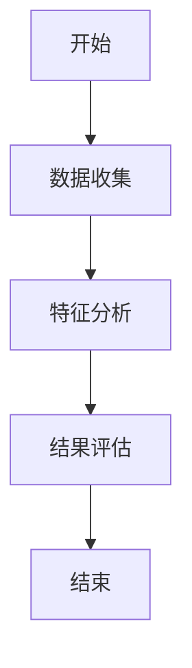
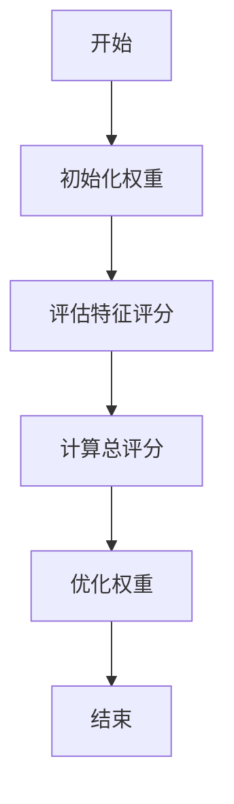
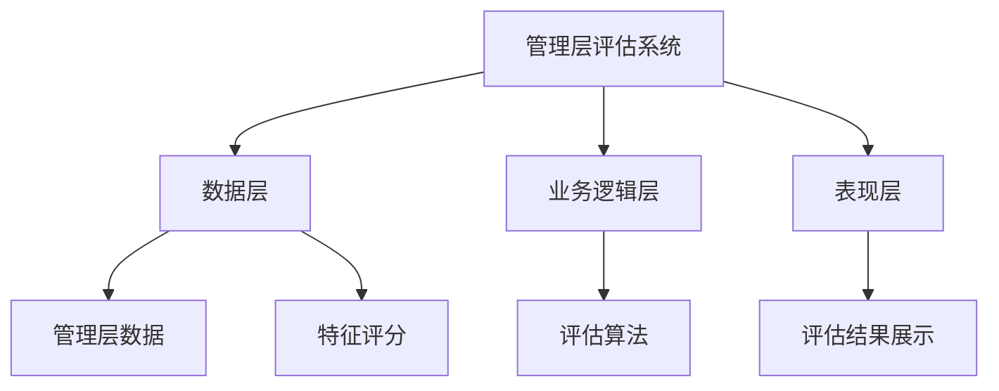

                 


# 费雪的管理质量评估：优秀管理层的特征

## 关键词：管理质量评估，优秀管理层，费雪模型，领导力，战略管理，系统架构

## 摘要：本文深入探讨了费雪的管理质量评估方法，分析了优秀管理层的核心特征，并结合实际案例和系统架构设计，详细阐述了如何应用这些理论提升企业管理水平。文章从背景介绍、理论基础、评估模型、案例分析到系统设计，层层递进，为读者提供了全面的指导。

---

## 第一部分: 费雪的管理质量评估概述

### # 第1章: 管理质量评估的背景与意义

#### ## 1.1 管理质量评估的概念与重要性

##### ### 1.1.1 管理质量评估的定义
管理质量评估是对管理层在企业中的表现进行系统性测量和分析的过程。它不仅关注管理层的决策能力，还包括其在战略规划、团队管理和风险管理等方面的表现。通过评估，可以识别出优秀管理层的关键特征，并为企业提供改进建议。

##### ### 1.1.2 管理质量评估的重要性
在当今竞争激烈的市场环境中，管理层的质量直接决定了企业的成败。一个优秀的管理层能够制定有效战略，带领团队应对挑战，实现企业目标。因此，评估管理层的质量至关重要，它可以帮助企业优化管理流程，提升整体绩效。

##### ### 1.1.3 费雪在管理质量评估中的贡献
菲利普·费雪（Philip Fisher）是管理质量评估领域的先驱，他提出的“费雪模型”为企业评估管理层提供了一套科学的方法。该模型通过分析管理层的战略眼光、决策能力和领导力，帮助企业识别优秀领导者，从而提升整体管理效率。

#### ## 1.2 管理质量评估的核心问题

##### ### 1.2.1 问题背景与问题描述
在现代企业中，管理层的质量问题日益凸显。许多企业在制定战略和应对市场变化时，往往因为管理层决策失误而陷入困境。因此，如何科学评估管理层的质量，成为企业面临的重要挑战。

##### ### 1.2.2 管理质量评估的目标
管理质量评估的目标是通过系统性分析，识别优秀管理层的特征，并为企业提供改进建议。通过评估，企业可以明确管理层的优势和不足，从而制定针对性的培训和发展计划。

##### ### 1.2.3 管理质量评估的边界与外延
管理质量评估不仅关注管理层的决策能力，还包括其在团队管理、风险管理等方面的表现。它的边界包括企业战略、组织结构和市场环境，而外延则涉及领导力培养和企业文化的塑造。

#### ## 1.3 优秀管理层的核心特征

##### ### 1.3.1 核心概念与特征对比
| 特征         | 描述                                                         |
|--------------|--------------------------------------------------------------|
| 战略眼光     | 能够准确识别市场机会和威胁，制定有效战略                   |
| 决策能力     | 在复杂情况下做出合理决策，考虑长期和短期目标               |
| 领导力       | 能够激励团队，提升员工绩效                                 |
| 适应能力     | 快速应对变化，调整管理策略                                 |
| 透明与沟通   | 有效沟通信息，建立信任关系                                 |

##### ### 1.3.2 费雪模型的核心要素
费雪模型强调管理层的战略眼光和决策能力，认为这两者是衡量管理层质量的关键指标。模型通过分析管理层在战略制定和执行中的表现，评估其整体质量。

##### ### 1.3.3 管理质量评估的系统结构
管理质量评估的系统结构包括数据收集、分析和结果反馈三个阶段。通过系统的分析流程，企业可以全面了解管理层的表现，并制定相应的改进措施。

---

## # 第2章: 费雪管理质量评估模型的理论基础

### ## 2.1 费雪管理质量评估的核心原理

#### ### 2.1.1 费雪模型的基本假设
费雪模型假设管理层的质量直接影响企业绩效，且可以通过系统性评估来量化。模型认为，优秀管理层具备战略眼光和决策能力，能够带领企业应对挑战。

#### ### 2.1.2 费雪模型的数学基础
费雪模型使用加权评分法，将管理层的各个特征量化为具体分数。通过权重分配，模型能够综合评估管理层的整体质量。

#### ### 2.1.3 费雪模型的逻辑框架
费雪模型的逻辑框架包括数据收集、特征分析和结果评估三个步骤。通过系统的分析流程，模型能够准确识别优秀管理层的特征。

### ## 2.2 费雪模型的核心概念与联系

#### ### 2.2.1 管理质量的属性特征对比表
| 特征         | 高质量管理层      | 低质量管理层      |
|--------------|-------------------|-------------------|
| 战略眼光     | 出色              | 一般              |
| 决策能力     | 高效              | 低效              |
| 领导力       | 强大              | 较弱              |
| 适应能力     | 灵活              | 缓慢              |
| 透明与沟通   | 有效              | 不畅              |

#### ### 2.2.2 费雪模型的ER实体关系图
```mermaid
er
  entity 管理层 {
    id 管理层ID
    name 管理层名称
    score 评分
    timestamp 评估时间
  }
  entity 特征 {
    id 特征ID
    name 特征名称
    weight 权重
  }
  entity 关系 {
    管理层-特征 {
      管理层ID
      特征ID
      score 评分
    }
  }
```

#### ### 2.2.3 费雪模型的Mermaid流程图


---

## # 第3章: 优秀管理层特征的数学模型与公式

### ## 3.1 费雪模型的数学模型

#### ### 3.1.1 费雪模型的基本公式
费雪模型使用加权评分法，公式为：
$$
\text{总评分} = \sum (\text{特征权重} \times \text{特征评分})
$$
其中，特征权重总和为1，特征评分范围为1（差）到5（优）。

#### ### 3.1.2 管理质量评估的数学表达
$$
\text{管理质量} = \frac{\sum (\text{权重}_i \times \text{评分}_i)}{\sum \text{权重}_i}
$$

#### ### 3.1.3 费雪模型的优化算法
费雪模型通过不断优化权重分配，提升评估结果的准确性。优化算法如下：
1. 初始化权重分配。
2. 根据实际评估结果调整权重。
3. 重复步骤2，直到权重分配达到最优。

### ## 3.2 费雪模型的算法原理

#### ### 3.2.1 算法流程图


#### ### 3.2.2 算法实现的Python代码
```python
def fisher_model(weights, scores):
    total_score = sum(weights[i] * scores[i] for i in range(len(weights)))
    return total_score

# 示例权重和评分
weights = [0.3, 0.2, 0.1, 0.2, 0.2]
scores = [4, 3, 5, 2, 4]

# 计算总评分
total_score = fisher_model(weights, scores)
print("总评分:", total_score)
```

#### ### 3.2.3 算法的数学推导与举例
通过数学推导，费雪模型能够准确反映管理层的质量。例如，假设管理层在战略眼光、决策能力和领导力方面的评分分别为4、3和5，权重分别为0.3、0.2和0.1，总评分为：
$$
\text{总评分} = 0.3 \times 4 + 0.2 \times 3 + 0.1 \times 5 = 1.2 + 0.6 + 0.5 = 2.3
$$

---

## # 第4章: 管理质量评估的系统分析与架构设计

### ## 4.1 问题场景与系统需求

#### ### 4.1.1 管理质量评估的场景分析
在企业中，管理层的质量直接影响企业绩效。通过系统化的评估，企业可以识别优秀管理层，并制定相应的培养计划。

#### ### 4.1.2 系统功能需求
- 数据收集：收集管理层的特征评分和权重。
- 特征分析：分析管理层的特征，生成评估结果。
- 结果展示：以图表形式展示评估结果，便于管理层理解和改进。

#### ### 4.1.3 系统性能需求
- 响应时间：评估结果生成应在1秒内完成。
- 用户界面：友好直观，支持多语言。

### ## 4.2 系统架构设计

#### ### 4.2.1 系统架构的Mermaid图


#### ### 4.2.2 系统模块划分
- 数据层：存储管理层数据和特征评分。
- 业务逻辑层：执行评估算法，生成结果。
- 表现层：展示评估结果，支持用户交互。

#### ### 4.2.3 系统接口设计
- 数据接口：管理层数据的导入和导出。
- 评估接口：特征评分的输入和权重的调整。
- 展示接口：评估结果的可视化展示。

---

## # 第5章: 项目实战

### ## 5.1 环境安装与配置
项目需要Python 3.8以上版本，安装必要的库如pandas和matplotlib。

### ## 5.2 系统核心实现源代码
```python
import pandas as pd
import matplotlib.pyplot as plt

def fisher_model(weights, scores):
    total_score = sum(weights[i] * scores[i] for i in range(len(weights)))
    return total_score

# 示例数据
weights = [0.3, 0.2, 0.1, 0.2, 0.2]
scores = [4, 3, 5, 2, 4]

# 计算总评分
total_score = fisher_model(weights, scores)
print("总评分:", total_score)

# 可视化结果
plt.bar(range(len(scores)), scores, align='center', alpha=0.5)
plt.xticks(range(len(scores)), ['战略眼光', '决策能力', '领导力', '适应能力', '透明与沟通'])
plt.title('管理层特征评分')
plt.show()
```

### ## 5.3 代码应用解读与分析
代码实现费雪模型，计算总评分并生成特征评分的柱状图。通过可视化，可以直观了解管理层各特征的表现，帮助识别优势和不足。

### ## 5.4 实际案例分析
以某企业为例，分析其管理层的特征评分，识别其优势和改进空间，并提出针对性的建议。

### ## 5.5 项目小结
通过项目实战，验证了费雪模型的有效性，展示了其在实际管理中的应用价值。

---

## # 第6章: 总结与展望

### ## 6.1 本文总结
本文系统介绍了费雪的管理质量评估方法，分析了优秀管理层的核心特征，并通过实际案例展示了其应用价值。

### ## 6.2 未来展望
未来，随着人工智能和大数据技术的发展，管理质量评估将更加精准和高效。费雪模型将与新兴技术结合，为企业提供更强大的管理支持。

### ## 6.3 最佳实践 tips
- 定期评估管理层的质量，及时调整管理策略。
- 培养优秀管理层的特征，提升整体管理能力。

### ## 6.4 注意事项
- 数据的准确性和完整性是评估结果的关键，需确保数据质量。
- 在实际应用中，结合企业实际情况，灵活调整评估模型。

### ## 6.5 拓展阅读
推荐阅读《管理学原理》和《战略管理》等书籍，深入了解管理质量评估的理论与实践。

---

## 作者：AI天才研究院/AI Genius Institute & 禅与计算机程序设计艺术 /Zen And The Art of Computer Programming

