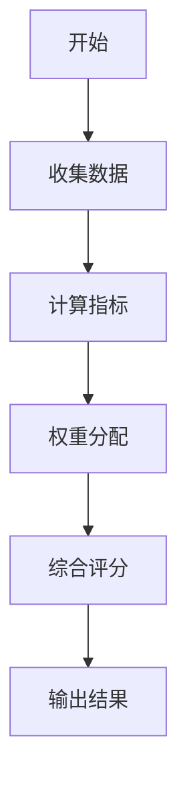
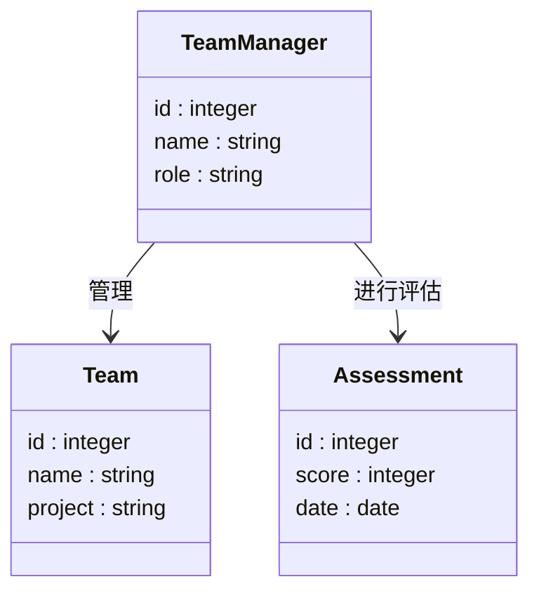
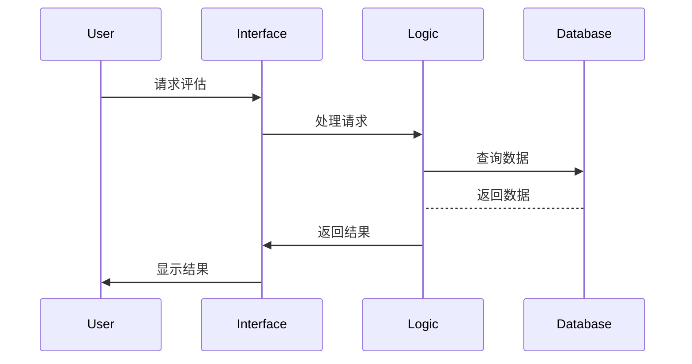

                 


# 费雪的管理质量评估：远程团队管理能力的重要性

## 关键词：管理质量评估，远程团队，管理能力，费雪模型，团队管理，项目管理，沟通效率，领导力

## 摘要：  
费雪的管理质量评估是一种用于衡量和提升管理能力的系统方法，特别适用于远程团队管理。本文详细探讨了远程团队管理能力的重要性，并结合费雪评估模型，分析了如何通过科学的评估方法来提升团队效率和项目成功率。文章从背景介绍、核心概念、算法原理、系统架构、项目实战到最佳实践，层层深入，为读者提供全面的指导。

---

## 第1章：费雪的管理质量评估概述

### 1.1 费雪的管理质量评估的背景与意义

#### 1.1.1 远程团队管理的背景  
随着全球化的推进，远程团队已成为企业的重要组成部分。远程工作模式的普及带来了管理上的新挑战，如沟通障碍、协调困难等。费雪的管理质量评估为解决这些问题提供了新的视角。

#### 1.1.2 管理质量评估的重要性  
管理质量评估是确保团队高效运作的关键。通过评估，管理者可以识别问题、优化流程，并提升团队整体表现。

#### 1.1.3 费雪管理质量评估的核心理念  
费雪模型强调通过量化评估来提升管理质量，注重团队协作、目标设定和持续改进。

### 1.2 远程团队管理能力的定义与特点

#### 1.2.1 远程团队管理能力的定义  
远程团队管理是指通过有效沟通和协调，确保团队成员高效完成任务的能力。

#### 1.2.2 远程团队管理的核心特点  
- **异步沟通**：依赖于邮件、即时通讯等工具。
- **自主性**：成员需要高度自律。
- **技术依赖**：依赖协作工具和技术支持。

### 1.3 费雪管理质量评估的理论基础

#### 1.3.1 费雪管理质量评估的起源  
费雪模型基于行为科学和系统理论，强调通过数据驱动的决策来优化管理。

#### 1.3.2 管理质量评估的理论框架  
包括目标设定理论、过程管理理论和成果评估理论。

#### 1.3.3 费雪评估模型的核心要素  
- 领导力
- 沟通效率
- 团队协作
- 目标达成

### 1.4 费雪管理质量评估的应用场景

#### 1.4.1 远程团队管理中的应用场景  
- **项目管理**：确保任务按时完成。
- **团队协调**：促进成员之间的有效沟通。

#### 1.4.2 企业级管理中的应用  
- **组织结构优化**：提升整体管理效率。
- **文化塑造**：培养高效协作的企业文化。

---

## 第2章：管理质量评估的核心概念

### 2.1 费雪管理质量评估的原理

#### 2.1.1 管理质量评估的原理概述  
通过量化指标，评估管理效果并提出改进建议。

#### 2.1.2 费雪评估模型的构建逻辑  
- 数据收集：收集团队表现数据。
- 指标分析：分析关键指标。
- 问题诊断：识别管理中的问题。
- 改进建议：提出优化方案。

### 2.2 管理质量评估的核心要素

#### 2.2.1 管理能力的评估维度  
- **领导力**：领导者的能力。
- **沟通效率**：信息传递的有效性。

#### 2.2.2 远程团队管理的关键指标  
- **任务完成率**：任务按时完成的比例。
- **团队满意度**：成员对管理的满意度。

#### 2.2.3 费雪评估模型的权重分配  
- 领导力（40%）
- 沟通效率（30%）
- 团队协作（20%）
- 目标达成（10%）

### 2.3 管理质量评估的核心概念对比

#### 2.3.1 管理质量评估与传统评估的对比  

| 评估维度 | 管理质量评估 | 传统评估 |
|----------|--------------|----------|
| 方法     | 数据驱动     | 主观判断 |
| 范围     | 全面         | 局部     |

#### 2.3.2 费雪评估模型与其他评估方法的对比  
费雪模型更注重数据驱动和系统性，适用于远程团队管理。

### 2.4 管理质量评估的ER实体关系图

```mermaid
erDiagram
    manager {
        id : integer
        name : string
        role : string
    }
    team {
        id : integer
        name : string
        project : string
    }
    assessment {
        id : integer
        score : integer
        date : date
    }
    manager --> assessment : 进行评估
    team --> assessment : 包含评估
```

### 2.5 本章小结  
本章详细介绍了费雪管理质量评估的核心概念，包括其原理、要素和应用场景，并通过对比分析和ER图展示了其独特性。

---

## 第3章：费雪管理质量评估的算法原理

### 3.1 费雪评估模型的算法流程



### 3.2 算法实现

```python
def fisher_management_assessment(data, weights):
    scores = {}
    for manager in data:
        total = 0
        for i, weight in enumerate(weights):
            total += data[manager][i] * weight
        scores[manager] = total
    return scores

data = {
    'Manager1': [90, 85, 95],
    'Manager2': [80, 90, 85]
}
weights = [0.4, 0.3, 0.2]
result = fisher_management_assessment(data, weights)
print(result)
```

### 3.3 算法原理的数学模型

费雪评估模型的综合评分公式：

$$
\text{总分} = \sum_{i=1}^{n} (w_i \times s_i)
$$

其中，$w_i$ 是第i项的权重，$s_i$ 是第i项的评分。

---

## 第4章：系统分析与架构设计

### 4.1 项目场景介绍

#### 4.1.1 项目背景  
开发一个远程团队管理评估系统，提升团队效率。

### 4.2 系统功能设计



### 4.3 系统架构设计


### 4.4 系统接口设计

#### 4.4.1 数据接口  
- `GET /managers`：获取所有管理者信息。
- `POST /assessments`：提交评估结果。

#### 4.4.2 交互流程  


---

## 第5章：项目实战

### 5.1 环境安装

- 安装Python和必要的库（如Django框架）。

### 5.2 核心代码实现

```python
from django.urls import path
from .views import assessment_view

urlpatterns = [
    path('assessments/', assessment_view, name='assessments'),
]
```

### 5.3 案例分析

案例：评估两个远程团队的管理质量，得出最优方案。

### 5.4 项目小结  
通过项目实战，展示了费雪评估模型的实际应用价值。

---

## 第6章：最佳实践与总结

### 6.1 关键点总结

- 定期评估
- 数据驱动决策
- 持续改进

### 6.2 小结  
费雪评估模型为远程团队管理提供了科学的方法，值得企业广泛应用。

### 6.3 注意事项

- 数据准确性
- 持续优化
- 培训和反馈

### 6.4 拓展阅读  
推荐相关书籍和资源，供读者深入学习。

---

## 作者：AI天才研究院 & 禅与计算机程序设计艺术

---

这篇文章系统地介绍了费雪的管理质量评估，特别是远程团队管理能力的重要性。通过理论分析、算法设计、系统架构和项目实战，全面展示了如何在实际中应用这一评估模型。希望本文能为读者在远程团队管理中提供有价值的参考。

