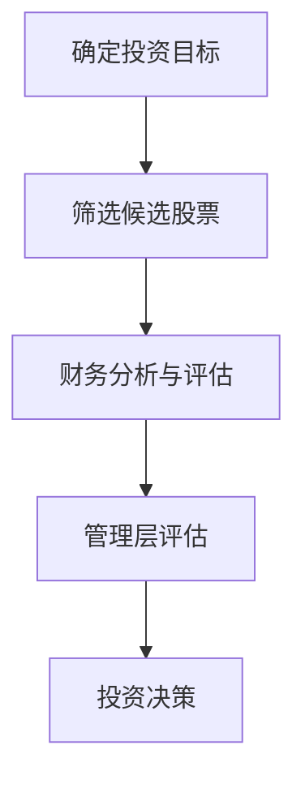
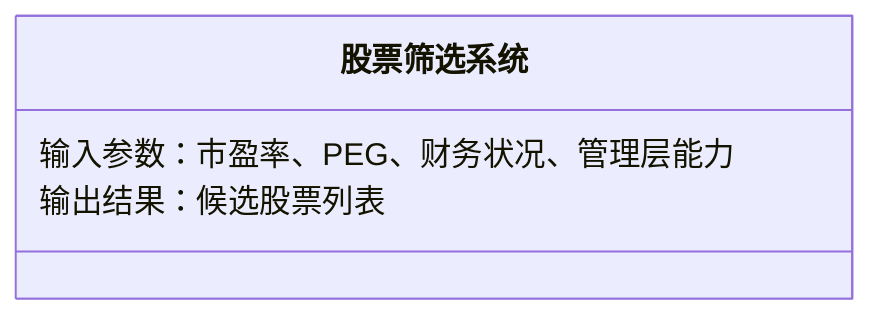
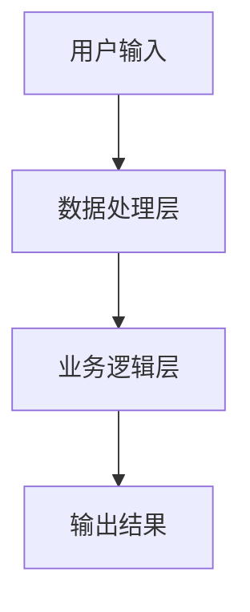
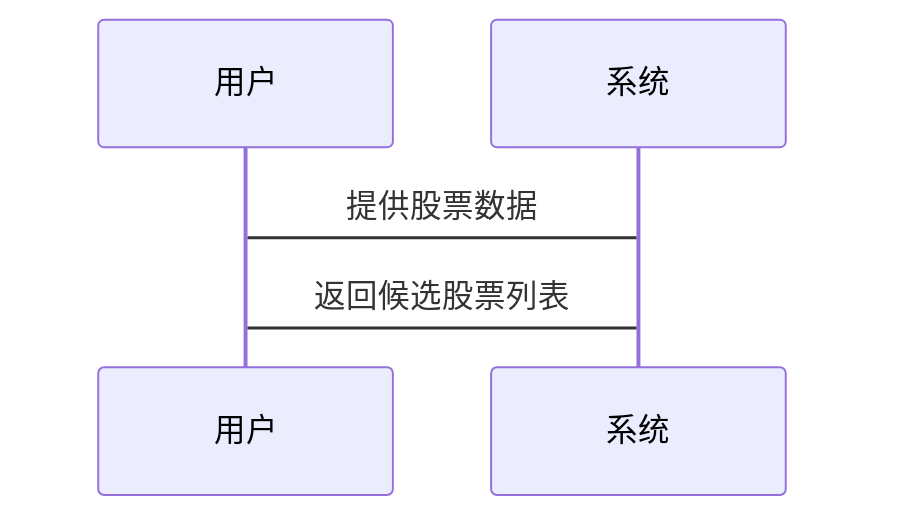

                 


# 费雪的股票筛选技巧

> 关键词：股票筛选，费雪，价值投资，投资技巧，市盈率，财务分析，投资组合

> 摘要：本文详细探讨了费雪的股票筛选技巧，包括其核心标准、具体方法、数学模型和系统设计。通过背景介绍、理论分析和实战案例，帮助读者掌握如何运用费雪的策略进行投资决策。

---

## 第1章: 股票筛选的背景与重要性

### 1.1 股票投资的基本概念

#### 1.1.1 什么是股票
股票是企业的一部分所有权，购买股票即成为公司的股东，有权参与公司利润分配和决策。

#### 1.1.2 股票投资的目的与意义
股票投资的目的是通过资本增值和股息收益实现财富增长。其意义在于分散投资风险，实现资产保值增值。

#### 1.1.3 股票市场的基本运作机制
股票市场是买卖股票的场所，分为一级市场和二级市场。投资者通过交易所进行交易，价格受供求关系影响。

### 1.2 股票筛选的基本概念

#### 1.2.1 股票筛选的定义
股票筛选是通过特定标准和方法，从众多股票中选择具有投资价值的股票的过程。

#### 1.2.2 股票筛选的核心要素
- 市盈率（P/E）
- 市盈率增长比（PEG）
- 财务状况
- 管理层质量

#### 1.2.3 股票筛选与投资回报的关系
有效的筛选方法能够提高投资回报率，降低投资风险。

### 1.3 费雪投资方法的背景介绍

#### 1.3.1 费雪的生平简介
菲利普·费雪是价值投资的先驱，被誉为“成长股之父”，其投资理念影响深远。

#### 1.3.2 费雪投资方法的核心理念
费雪强调长期投资，选择具有持续增长潜力的优秀公司。

#### 1.3.3 费雪方法在现代投资中的地位
费雪方法为现代投资理论奠定了基础，尤其在成长股投资领域具有重要影响。

### 1.4 本章小结
本章介绍了股票筛选的基本概念和费雪投资方法的背景，为后续分析奠定了基础。

---

## 第2章: 费雪股票筛选的核心标准

### 2.1 费雪筛选标准的背景

#### 2.1.1 费雪筛选标准的来源
费雪通过长期投资实践，总结出一套有效的筛选标准。

#### 2.1.2 费雪筛选标准的发展历程
随着市场变化，费雪的方法不断完善，但核心标准保持不变。

#### 2.1.3 费雪筛选标准的核心思想
注重长期增长潜力，避免短期波动影响。

### 2.2 费雪筛选标准的具体内容

#### 2.2.1 低市盈率原则
市盈率低意味着股价相对合理，具有较高的投资价值。

#### 2.2.2 合理的市盈率增长比
PEG = 市盈率 / 市盈率增长比，衡量股票的内在价值。

#### 2.2.3 稳健的财务状况
关注资产负债表，确保公司财务健康，避免财务风险。

#### 2.2.4 优秀的管理团队
管理层的能力和决策直接影响公司的发展和股价表现。

### 2.3 费雪筛选标准的优缺点分析

#### 2.3.1 费雪筛选标准的优点
- 筛选标准明确，易于操作。
- 有助于发现具有长期增长潜力的公司。

#### 2.3.2 费雪筛选标准的缺点
- 过于注重长期增长，可能导致短期收益不稳定。
- 市场波动可能影响筛选结果的准确性。

#### 2.3.3 费雪筛选标准的适用场景
适用于长期投资者，尤其是成长股投资者。

### 2.4 本章小结
本章详细介绍了费雪筛选的核心标准及其优缺点，帮助投资者更好地理解和应用。

---

## 第3章: 费雪股票筛选的具体方法

### 3.1 费雪筛选方法的步骤

#### 3.1.1 确定投资目标
明确投资目标，包括投资期限、风险承受能力和收益预期。

#### 3.1.2 筛选候选股票
通过费雪的标准，从市场中筛选出符合条件的股票。

#### 3.1.3 财务分析与评估
详细分析公司的财务报表，评估公司的财务健康状况。

#### 3.1.4 管理层评估
了解公司管理层的能力和决策风格，评估其对未来发展的潜力。

#### 3.1.5 投资决策
综合分析后，做出最终的投资决策。

### 3.2 费雪筛选方法的数学模型

#### 3.2.1 市盈率计算公式
$$ P/E = \frac{Price}{Earnings} $$

#### 3.2.2 市盈率增长比计算公式
$$ PEG = \frac{P/E}{Earnings\ Growth\ Rate} $$

### 3.3 费雪筛选方法的流程图


### 3.4 本章小结
本章详细讲解了费雪筛选的具体步骤和数学模型，帮助读者掌握筛选方法。

---

## 第4章: 费雪筛选方法的系统设计

### 4.1 系统背景与目标
设计一个基于费雪筛选标准的股票筛选系统，帮助投资者快速筛选出符合条件的股票。

### 4.2 系统功能设计

#### 4.2.1 领域模型


#### 4.2.2 系统架构设计


### 4.3 系统接口设计
- 输入接口：接收股票数据和筛选条件。
- 输出接口：返回符合条件的股票列表。

### 4.4 系统交互设计


### 4.5 本章小结
本章通过系统设计的角度，详细分析了费雪筛选方法的实现方式。

---

## 第5章: 费雪筛选方法的项目实战

### 5.1 环境安装
安装Python和相关库（如pandas、numpy）。

### 5.2 核心代码实现

#### 5.2.1 数据获取
```python
import pandas as pd

# 获取股票数据
data = pd.read_csv('stock_data.csv')
```

#### 5.2.2 筛选过程
```python
# 计算市盈率
data['P/E'] = data['Price'] / data['Earnings']

# 计算PEG
data['PEG'] = data['P/E'] / data['Earnings Growth Rate']
```

#### 5.2.3 筛选结果
```python
# 筛选市盈率低于20且PEG小于1的股票
selected_stocks = data[(data['P/E'] < 20) & (data['PEG'] < 1)]
```

### 5.3 实际案例分析
以某行业为例，分析如何应用费雪方法筛选出具有投资价值的股票。

### 5.4 本章小结
本章通过实际项目，展示了如何将费雪筛选方法应用于实际投资中。

---

## 第6章: 总结与展望

### 6.1 本章总结
费雪的股票筛选方法是一种有效的投资策略，通过合理筛选，能够帮助投资者找到具有长期增长潜力的优秀公司。

### 6.2 投资建议
- 结合市场变化，灵活调整筛选标准。
- 定期评估投资组合，优化投资策略。

### 6.3 未来展望
随着技术进步，股票筛选方法将更加智能化和自动化，投资者可以利用更多的工具和数据进行分析。

---

## 作者：AI天才研究院 & 禅与计算机程序设计艺术

---

通过以上结构，文章详细分析了费雪的股票筛选技巧，从理论到实践，帮助读者掌握这一经典投资方法。

