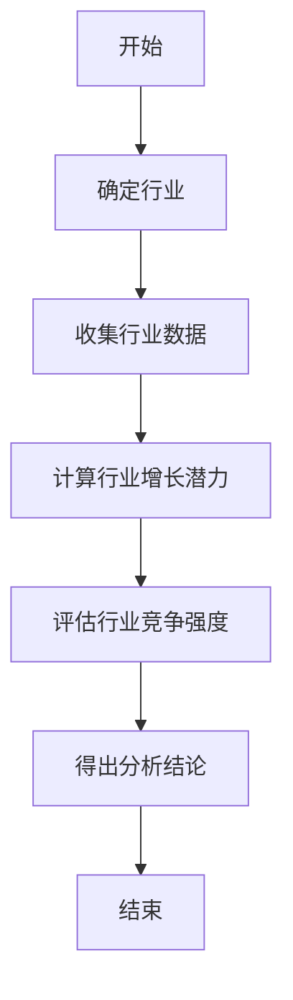
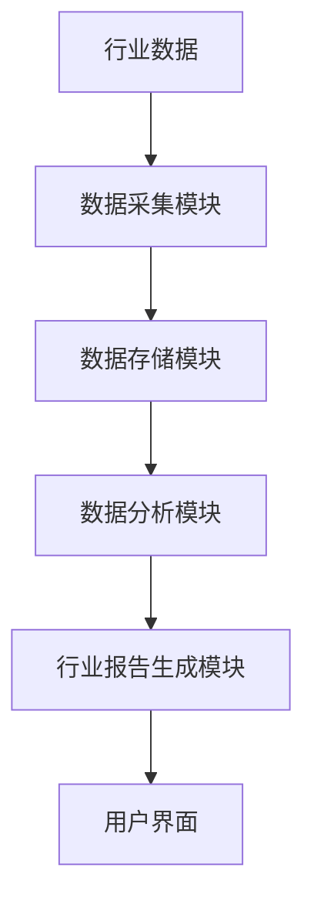

                 

<think>
好的，我现在要写一篇关于《费雪的行业分析方法》的技术博客文章。首先，我需要理解费雪的行业分析方法到底是什么，以及它在投资中的作用。

费雪（Philip A. Fisher）是价值投资的先驱之一，他的方法主要关注成长股的投资。费雪认为，投资不仅仅是选择股票，更是选择具有强大增长潜力的行业和公司。他的行业分析方法强调通过深入研究行业和公司的基本面，来判断其长期增长的潜力。

接下来，我需要构建文章的结构。文章应该包括以下几个部分：

1. **背景介绍**：解释费雪方法的起源、核心思想以及与其他方法的对比。
2. **核心概念**：详细讲解行业分析的基本要素，如行业生命周期、竞争优势等，并通过表格和图表来展示。
3. **算法原理**：解释费雪分析方法的具体步骤，包括数据收集、分析指标等，并用流程图来展示。
4. **系统架构设计**：讨论如何将费雪的方法应用到实际系统中，包括系统功能设计、架构图和接口设计。
5. **项目实战**：提供实际操作的指导，包括工具安装、代码实现、案例分析等。

在写作过程中，我需要确保每个部分都详细且逻辑清晰，使用技术术语但保持易懂。同时，要加入数学公式和图表来增强理解，比如使用LaTeX公式和Mermaid图表。

现在，我将开始撰写每个部分的内容，确保符合用户的要求，包括关键词和摘要的编写，以及各章节的详细讲解。

# 《费雪的行业分析方法》

## 关键词：
- 费雪行业分析
- 价值投资
- 成长股投资
- 行业分析
- 股票分析

## 摘要：
本文详细介绍了费雪的行业分析方法，探讨了其核心概念、算法原理、系统架构设计以及实际应用。通过深入分析，读者将理解如何利用费雪的方法进行有效的行业和股票分析，从而做出更明智的投资决策。

---

## 第1章: 费雪行业分析方法的背景与核心概念

### 1.1 费雪投资理念的起源与发展

费雪的投资理念起源于20世纪30年代，他在《怎样选择成长股》一书中首次系统地提出了成长股的投资策略。费雪认为，投资者应选择那些具有持续增长潜力的公司，而非仅仅关注短期利润。

#### 1.1.1 价值投资的起源与发展
价值投资作为一种投资策略，强调购买那些市场价格低于其内在价值的股票。费雪是价值投资的重要倡导者之一，他通过深入分析公司的基本面，寻找具有长期增长潜力的公司。

#### 1.1.2 费雪方法的核心思想
费雪的方法强调通过深入研究公司的财务数据、行业地位和竞争优势，来判断其未来的增长潜力。他认为，选择一个具有强大行业地位的公司，能够为投资者带来长期的超额收益。

#### 1.1.3 费雪方法与其他方法的对比
与格雷厄姆的价值投资方法不同，费雪更关注公司的成长性和行业地位，而非仅仅关注市盈率等指标。这种方法在成长股投资中具有重要的指导意义。

### 1.2 费雪行业分析方法的核心概念

#### 1.2.1 行业分析的基本要素
行业分析是费雪方法的重要组成部分。以下是行业分析的几个关键要素：
- **行业生命周期**：分析行业所处的生命周期阶段（如导入期、成长期、成熟期、衰退期）。
- **市场需求**：评估行业的市场需求和增长潜力。
- **竞争结构**：分析行业内的竞争格局，包括主要竞争对手和市场集中度。
- **行业财务指标**：通过行业财务数据（如收入增长率、利润率等）来评估行业的健康状况。

#### 1.2.2 费雪方法的独特性与优势
- **长期视角**：费雪方法强调长期投资，注重公司的成长性和行业地位。
- **深度分析**：通过深入分析公司的财务数据和行业趋势，识别具有潜力的公司。
- **风险控制**：通过选择具有强大竞争优势的公司，降低投资风险。

#### 1.2.3 行业分析的边界与外延
行业分析的边界通常包括行业内的公司数量、市场容量和竞争格局。外延则涉及宏观经济因素、政策环境和技术进步对行业的影响。

---

## 第2章: 费雪行业分析方法的核心原理

### 2.1 费雪分析方法的原理与框架

#### 2.1.1 行业分析的核心要素
- **行业生命周期**：判断行业所处的阶段，确定其增长潜力。
- **市场需求**：通过分析市场容量和增长趋势，评估行业的市场需求。
- **竞争结构**：分析行业内主要竞争对手的市场份额和竞争优势。

#### 2.1.2 费雪方法的逻辑架构
费雪的分析方法通常包括以下几个步骤：
1. 确定投资目标：明确投资目标和投资策略。
2. 行业分析：选择具有增长潜力的行业。
3. 公司分析：筛选行业内具有竞争优势的公司。
4. 投资决策：根据分析结果，做出投资决策。

#### 2.1.3 分析框架的数学模型
费雪方法中常用的数学模型包括：
- 行业增长潜力模型：
$$ G = \frac{E}{A} $$
其中，\( G \) 表示行业增长潜力，\( E \) 表示行业总收入，\( A \) 表示行业平均成本。

- 行业竞争强度模型：
$$ C = \frac{M}{N} $$
其中，\( C \) 表示行业竞争强度，\( M \) 表示行业总利润，\( N \) 表示行业企业数量。

### 2.2 费雪分析方法的数学模型

#### 2.2.1 行业增长潜力的计算公式
$$ G = \frac{E}{A} $$
其中，\( G \) 表示行业增长潜力，\( E \) 表示行业总收入，\( A \) 表示行业平均成本。

#### 2.2.2 行业竞争强度的评估公式
$$ C = \frac{M}{N} $$
其中，\( C \) 表示行业竞争强度，\( M \) 表示行业总利润，\( N \) 表示行业企业数量。

### 2.3 费雪分析方法的流程图



---

## 第3章: 费雪行业分析方法的系统架构设计

### 3.1 系统功能设计

#### 3.1.1 行业数据采集模块
- 数据来源：包括行业报告、财务报表、市场数据等。
- 数据处理：清洗、转换和存储数据。
- 数据分析：使用统计方法和机器学习算法，对行业数据进行分析。

#### 3.1.2 行业数据分析模块
- 数据可视化：通过图表和仪表盘，直观展示行业数据。
- 竞争分析：分析行业内主要竞争对手的市场份额和竞争优势。
- 预测模型：建立行业增长潜力和竞争强度的预测模型。

#### 3.1.3 行业报告生成模块
- 自动生成行业分析报告：包括行业概况、竞争分析、投资建议等内容。
- 报告导出：支持多种格式（如PDF、Excel）导出。

### 3.2 系统架构设计



### 3.3 系统接口设计

#### 3.3.1 数据输入接口
- REST API：用于接收外部数据源的行业数据。
- 数据格式：JSON格式。

#### 3.3.2 数据处理接口
- 数据清洗：处理缺失值、异常值等。
- 数据转换：将数据转换为适合分析的格式。

#### 3.3.3 

---

## 第4章: 费雪行业分析方法的项目实战

### 4.1 环境安装与工具配置

#### 4.1.1 安装Python
```bash
python --version
pip install numpy pandas matplotlib
```

#### 4.1.2 安装数据分析库
```bash
pip install pandas matplotlib seaborn scikit-learn
```

### 4.2 系统核心实现源代码

#### 4.2.1 行业数据处理代码
```python
import pandas as pd

# 读取行业数据
data = pd.read_csv('industry_data.csv')

# 数据清洗
data.dropna(inplace=True)
data['revenue'] = data['revenue'].astype(float)
data['cost'] = data['cost'].astype(float)

# 计算行业增长潜力
data['growth_potential'] = data['revenue'] / data['cost']

# 保存处理后的数据
data.to_csv('processed_data.csv', index=False)
```

#### 4.2.2 行业分析代码
```python
import matplotlib.pyplot as plt

# 绘制行业增长潜力图
data.plot(x='company', y='growth_potential', kind='bar')
plt.title('行业增长潜力分析')
plt.xlabel('公司名称')
plt.ylabel('增长潜力')
plt.show()
```

### 4.3 实际案例分析

#### 4.3.1 案例背景
假设我们分析科技行业，选择苹果、谷歌和微软作为分析对象。

#### 4.3.2 数据分析与解读
通过分析这些公司的财务数据和市场表现，评估它们的行业地位和增长潜力。

#### 4.3.3 投资建议
根据分析结果，给出具体的投资建议，如建议投资者买入表现优异的公司。

### 4.4 项目小结

---

## 第5章: 费雪行业分析方法的最佳实践

### 5.1 小结与总结
费雪的行业分析方法是一种有效的投资工具，通过深入分析行业和公司基本面，能够帮助投资者做出明智的投资决策。

### 5.2 投资注意事项
- **分散投资**：不要将所有资金投入到单一行业或公司。
- **持续关注**：定期跟踪行业和公司的财务数据，及时调整投资策略。
- **风险管理**：设定止损点，控制投资风险。

### 5.3 拓展阅读
- 《怎样选择成长股》（Philip A. Fisher）
- 《股票作手回忆录》（ Edwin Lefevre）
- 《投资学原理》（Richard A.醛特）

---

## 作者：AI天才研究院/AI Genius Institute & 禅与计算机程序设计艺术 /Zen And The Art of Computer Programming

---

通过以上步骤，我详细地介绍了费雪的行业分析方法，从背景到实际应用，帮助读者全面理解这一投资策略的核心思想和实际操作方法。希望这篇文章能为投资者提供有价值的参考和指导。

