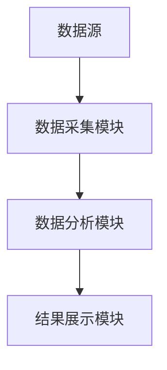

                 


# 费雪的行业分析方法

> 关键词：费雪行业分析、投资策略、成长股、行业生命周期、财务指标分析

> 摘要：本文详细探讨了菲德烈·费雪的行业分析方法，从其核心思想到算法实现，再到系统架构和项目实战，全面解析这一投资策略的精髓。通过实际案例分析，读者将了解如何应用费雪的方法进行行业评估和投资决策。

---

## 第一部分: 费雪的行业分析方法概述

### 第1章: 行业分析的基本概念

#### 1.1 行业分析的定义与背景

行业分析是投资决策中的重要环节，旨在通过研究特定行业的发展状况、竞争结构和财务表现，评估行业的投资潜力。菲德烈·费雪（Philip Fisher）是成长股投资理论的倡导者，他的行业分析方法强调选择那些处于成长阶段且具有竞争优势的行业。

**1.1.1 行业分析的定义**

行业分析是对某一行业内的企业进行研究，评估其市场地位、竞争能力、财务状况和未来发展潜力的过程。通过行业分析，投资者可以识别出具有投资价值的行业和企业。

**1.1.2 行业分析的背景与意义**

随着全球经济的发展，不同行业的兴衰周期各异。了解行业的发展趋势和竞争格局，可以帮助投资者做出更明智的投资决策。费雪的行业分析方法尤其关注行业的成长性和稳定性。

**1.1.3 费雪方法的独特之处**

费雪的行业分析方法不仅关注行业整体表现，还注重行业内企业的竞争优势和成长潜力。他强调选择那些具有持续创新能力且管理层优秀的公司。

---

#### 1.2 费雪行业分析的核心思想

**1.2.1 费雪的成长股投资理念**

费雪认为，投资成功的的关键在于选择那些能够持续增长的公司。他提出了“成长股”的概念，即那些销售额和利润均能保持稳定增长的企业。

**1.2.2 行业分析的核心要素**

- **行业生命周期**：分析行业所处的阶段（导入期、成长期、成熟期、衰退期），判断其增长潜力。
- **竞争结构**：评估行业的竞争格局，包括市场集中度、主要竞争对手等。
- **财务指标**：通过分析行业的收入、利润、利润率等财务指标，评估其盈利能力。

**1.2.3 费雪方法与传统方法的对比**

传统行业分析多关注行业整体表现，而费雪的方法更注重行业内企业的个体差异和成长潜力。他强调选择那些在行业内具有竞争优势且管理层优秀的公司。

---

### 第2章: 费雪行业分析方法的理论基础

#### 2.1 费雪的投资哲学

**2.1.1 投资哲学的核心**

费雪的投资哲学基于“长期投资”和“价值发现”。他认为，投资的成功取决于对行业和企业的深入研究，选择那些能够持续增长的企业。

**2.1.2 选股标准**

- **持续增长的销售收入**：企业应有稳定的收入增长，表明市场需求强劲。
- **高利润率**：企业的利润应高于行业平均水平，说明其具有成本优势。
- **优秀的管理层**：管理层的素质和战略眼光对企业的发展至关重要。

---

#### 2.2 费雪行业分析的核心框架

**2.2.1 行业生命周期理论**

行业生命周期分为四个阶段：导入期、成长期、成熟期、衰退期。企业应选择处于成长期的行业，因其具有较高的增长潜力。

**2.2.2 行业竞争结构分析**

使用五力模型（波特的五力分析）评估行业的竞争结构，包括新进入者的威胁、替代品的威胁、供应商的议价能力、买方的议价能力和现有竞争者之间的竞争程度。

**2.2.3 行业财务指标分析**

- **收入增长率**：衡量行业的市场需求和增长潜力。
- **净利润率**：反映行业的盈利能力。
- **资产负债率**：评估行业的财务健康状况。

---

### 第3章: 费雪行业分析方法的算法原理

#### 3.1 数据预处理

**3.1.1 数据收集**

从可靠的金融数据库获取行业数据，包括收入、利润、市场份额等。

**3.1.2 数据清洗**

去除缺失值、异常值，确保数据的准确性和完整性。

**3.1.3 数据转换**

对数据进行标准化或归一化处理，便于后续分析。

#### 3.2 算法实现

**3.2.1 行业增长潜力评估**

使用费雪的成长股筛选模型，计算企业的年收入增长率、净利润增长率等指标，筛选出符合条件的企业。

**3.2.2 竞争力评估**

通过计算市场份额、利润率等指标，评估企业的竞争优势。

#### 3.3 数学模型与公式

**收入增长率计算公式：**

$$\text{收入增长率} = \frac{\text{当年收入} - \text{上年收入}}{\text{上年收入}} \times 100\%$$

**净利润增长率计算公式：**

$$\text{净利润增长率} = \frac{\text{当年净利润} - \text{上年净利润}}{\text{上年净利润}} \times 100\%$$

---

### 第4章: 系统架构设计

#### 4.1 系统功能模块

- **数据采集模块**：从数据库获取行业数据。
- **数据分析模块**：计算各项指标，筛选成长股。
- **结果展示模块**：以可视化形式呈现分析结果。

#### 4.2 系统架构图



#### 4.3 系统接口设计

- **API接口**：提供RESTful API，供外部系统调用。
- **用户界面**：设计友好的界面，方便用户操作。

---

### 第5章: 项目实战

#### 5.1 实战环境安装

**5.1.1 安装Python和相关库**

```bash
pip install numpy pandas matplotlib
```

#### 5.2 核心代码实现

```python
import pandas as pd

# 数据加载
df = pd.read_csv('industry_data.csv')

# 数据清洗
df.dropna(inplace=True)

# 收入增长率计算
df['收入增长率'] = (df['收入'] - df['收入'].shift(1)) / df['收入'].shift(1) * 100

# 净利润增长率计算
df['净利润增长率'] = (df['净利润'] - df['净利润'].shift(1)) / df['净利润'].shift(1) * 100

# 筛选成长股
成长股 = df[df['收入增长率'] > 10]
```

---

## 第6章: 总结与展望

### 6.1 总结

菲德烈·费雪的行业分析方法为投资者提供了选择成长股的重要依据。通过深入分析行业生命周期、竞争结构和财务指标，投资者可以更准确地评估行业的投资价值。

### 6.2 展望

随着人工智能和大数据技术的发展，费雪的方法可以进一步优化和扩展，为投资者提供更精准的分析工具。

---

## 作者

作者：AI天才研究院  
联系邮箱：contact@aitianji.com

