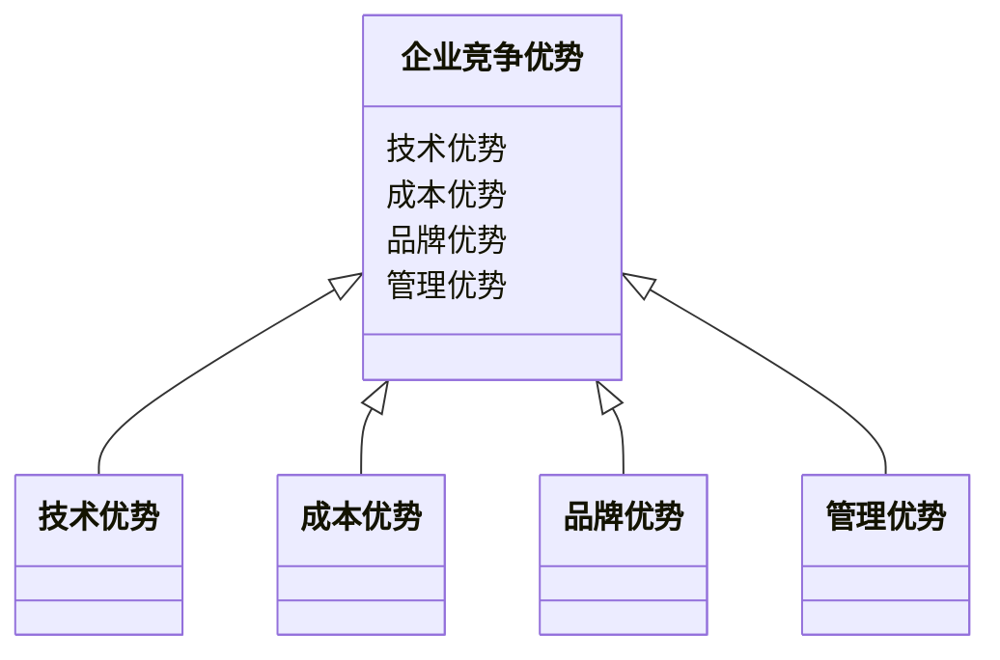
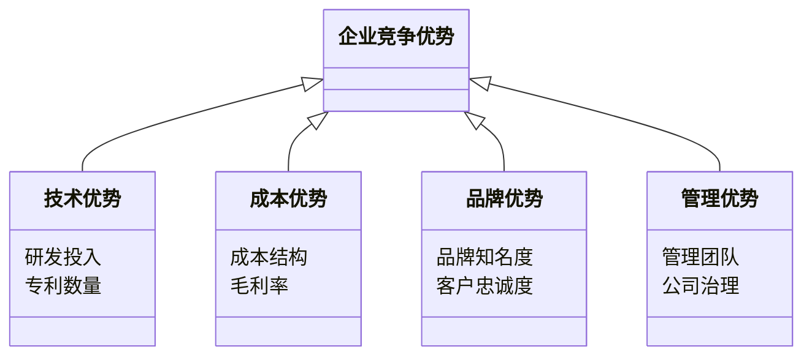

                 

# 费雪的行业分析方法：寻找高增长机会

## 关键词：费雪、行业分析、成长股、投资策略、高增长机会

## 摘要：本文详细介绍了费雪的成长股投资理念及其行业分析方法，通过系统化的分析框架、数学模型和实际案例，指导读者如何识别高增长行业和企业，制定有效的投资策略，以实现长期的资本增值。

---

# 第1章：费雪的成长股投资理念

## 1.1 费雪的成长股投资理论

### 1.1.1 费雪的成长股投资理念概述

菲利普·费雪（Philip Fisher）是20世纪著名的投资大师，提出了“成长股投资”的理念。他主张投资那些能够持续增长的企业，而不是仅仅关注市场的短期波动。费雪认为，成功的投资取决于对企业的深入了解，尤其是企业的成长潜力和竞争优势。

### 1.1.2 费雪投资理论的核心观点

- **长期增长**：投资的目标是寻找那些能够持续增长的企业，而非短期的市场波动。
- **企业质量**：企业必须具备强大的竞争优势，包括技术、管理、市场占有率等。
- **管理团队**：优秀的管理团队是企业长期增长的关键因素。
- **行业地位**：企业在行业中的地位决定了其未来的增长潜力。

### 1.1.3 费雪投资理论的现代应用

随着科技的发展，费雪的投资理念在现代投资中依然具有重要价值。特别是在科技行业，费雪的方法可以帮助投资者识别那些具备持续创新能力的企业。

## 1.2 费雪分析方法的背景与意义

### 1.2.1 行业分析的重要性

行业分析是投资决策的基础。通过分析行业的生命周期、竞争格局和增长潜力，投资者可以更好地识别高增长机会。

### 1.2.2 费雪分析方法的独特性

费雪的行业分析方法注重企业的成长性和竞争优势，强调从长期的角度看待投资机会。这种方法在科技行业尤为重要，因为科技行业的变化速度极快，企业竞争优势容易被颠覆。

### 1.2.3 费雪分析方法的实际应用价值

通过费雪的分析方法，投资者可以系统地筛选出具备长期增长潜力的企业，从而制定出有效的投资策略。

## 1.3 费雪分析方法的核心要素

### 1.3.1 行业生命周期分析

行业生命周期分为导入期、成长期、成熟期和衰退期。在不同的阶段，行业的增长潜力和投资策略也有所不同。

### 1.3.2 企业竞争优势分析

企业的竞争优势包括技术优势、成本优势、品牌优势等。具备竞争优势的企业更容易在行业中占据领先地位。

### 1.3.3 财务指标筛选标准

通过分析企业的财务指标，如ROE（净资产收益率）、毛利率等，可以筛选出具备盈利能力的企业。

---

# 第2章：费雪行业分析框架

## 2.1 行业生命周期分析

### 2.1.1 行业生命周期的定义

行业生命周期是指行业从诞生到衰退的全过程。不同的阶段具有不同的增长潜力和投资机会。

### 2.1.2 行业生命周期的四个阶段

- **导入期**：行业刚刚出现，增长潜力大，但风险也高。
- **成长期**：行业快速发展，企业数量增加，竞争加剧。
- **成熟期**：行业增长放缓，竞争格局稳定。
- **衰退期**：行业需求下降，企业逐步退出。

### 2.1.3 不同阶段的行业投资策略

- **导入期**：适合风险偏好较高的投资者，寻找具有创新潜力的企业。
- **成长期**：适合大多数投资者，行业增长快，企业数量多。
- **成熟期**：适合稳健投资者，寻找具备稳定收益的企业。
- **衰退期**：适合风险厌恶的投资者，行业增长潜力有限。

### 2.1.4 行业生命周期的Mermaid图

## 2.2 企业竞争优势分析

### 2.2.1 企业竞争优势的定义

企业竞争优势是指企业在行业中相对于竞争对手的独特优势，包括技术、成本、品牌、管理等方面。

### 2.2.2 企业竞争优势的分类

- **技术优势**：企业具备领先的技术创新能力。
- **成本优势**：企业在生产或运营成本上具有优势。
- **品牌优势**：企业具有强大的品牌影响力。
- **管理优势**：企业具备优秀的管理团队和管理能力。

### 2.2.3 企业竞争优势的评估方法

- **技术优势**：评估企业的研发投入和专利数量。
- **成本优势**：分析企业的成本结构和毛利率。
- **品牌优势**：评估企业在市场中的品牌知名度和客户忠诚度。
- **管理优势**：考察企业的管理团队和公司治理结构。

### 2.2.4 企业竞争优势评估的Mermaid图

## 2.3 财务指标筛选标准

### 2.3.1 主要财务指标介绍

- **ROE（净资产收益率）**：衡量企业盈利能力的重要指标。
- **毛利率**：反映企业的成本控制能力和定价策略。
- **净利润率**：衡量企业的盈利效率。
- **资产负债率**：评估企业的财务健康状况。

### 2.3.2 财务指标的筛选标准

- **ROE**：建议选择ROE高于行业平均水平的企业。
- **毛利率**：建议选择毛利率稳定且较高的企业。
- **净利润率**：净利润率越高，企业的盈利效率越高。
- **资产负债率**：建议选择资产负债率合理的低杠杆企业。

### 2.3.3 财务指标的计算与分析

#### 2.3.3.1 ROE的计算公式

$$ROE = \frac{\text{净利润}}{\text{所有者权益}}$$

#### 2.3.3.2 毛利率的计算公式

$$\text{毛利率} = \frac{\text{收入} - \text{成本}}{\text{收入}}$$

#### 2.3.3.3 净利润率的计算公式

$$\text{净利润率} = \frac{\text{净利润}}{\text{收入}}$$

#### 2.3.3.4 资产负债率的计算公式

$$\text{资产负债率} = \frac{\text{总负债}}{\text{总资产}}$$

---

# 第3章：企业竞争优势的评估

## 3.1 企业竞争优势的定义与分类

### 3.1.1 企业竞争优势的定义

企业竞争优势是指企业在行业中相对于竞争对手的独特优势，这些优势可以是技术、成本、品牌、管理等多个方面的综合体现。

### 3.1.2 企业竞争优势的分类

- **技术优势**：企业在技术开发和创新方面具备优势。
- **成本优势**：企业在生产或运营成本上具有竞争优势。
- **品牌优势**：企业在市场中的品牌影响力强，客户忠诚度高。
- **管理优势**：企业具备优秀的管理团队和高效的管理能力。

## 3.2 企业竞争优势的评估方法

### 3.2.1 技术优势的评估

- **研发投入**：评估企业的研发投入占收入的比例。
- **专利数量**：评估企业拥有的专利数量和质量。
- **技术创新**：评估企业在技术创新方面的表现。

### 3.2.2 成本优势的评估

- **成本结构**：分析企业的成本构成，判断其是否具备成本优势。
- **毛利率**：通过毛利率的高低来衡量成本控制能力。

### 3.2.3 品牌优势的评估

- **品牌知名度**：评估企业在市场中的品牌影响力。
- **客户忠诚度**：通过客户满意度和回购率来衡量品牌优势。

### 3.2.4 管理优势的评估

- **管理团队**：评估企业的管理团队的背景和能力。
- **公司治理**：分析企业的治理结构和透明度。

## 3.3 企业竞争优势评估的Mermaid图

---

# 第4章：行业分析的系统化方法

## 4.1 行业分析的系统化方法

### 4.1.1 行业分析的步骤

1. **确定行业**：选择具有增长潜力的行业。
2. **分析行业生命周期**：判断行业所处的阶段。
3. **评估行业竞争格局**：分析主要竞争对手的情况。
4. **筛选具备竞争优势的企业**：根据财务指标和竞争优势进行筛选。

### 4.1.2 行业分析的工具

- **PEST分析**：从政治、经济、社会、技术四个维度分析行业环境。
- **SWOT分析**：分析行业的优势、劣势、机会和威胁。
- **波特五力模型**：分析行业内的竞争格局。

### 4.1.3 行业分析的Mermaid图

---

# 第5章：费雪分析方法的实际应用

## 5.1 费雪分析方法的实际应用案例

### 5.1.1 案例背景

选择一个具体的行业，例如科技行业，分析其现状和未来趋势。

### 5.1.2 行业分析

- **行业生命周期**：科技行业处于成长期，技术创新驱动行业增长。
- **竞争格局**：主要竞争对手包括苹果、谷歌、微软等。
- **竞争优势**：选择那些具备技术创新和成本优势的企业。

### 5.1.3 财务指标分析

- **ROE**：选择ROE高于行业平均水平的企业。
- **毛利率**：选择毛利率稳定且较高的企业。

### 5.1.4 投资建议

根据分析结果，建议投资者关注那些具备技术优势和财务健康的企业。

## 5.2 费雪分析方法的优缺点

### 5.2.1 优点

- **长期视角**：注重企业的长期增长潜力。
- **系统化分析**：通过系统化的分析方法，降低投资风险。

### 5.2.2 缺点

- **依赖于管理团队**：分析结果依赖于对企业管理团队的判断。
- **行业特定性**：方法在某些行业中的应用可能受限。

---

# 第6章：最佳实践与注意事项

## 6.1 费雪分析方法的最佳实践

### 6.1.1 持续学习

投资市场变化迅速，投资者需要不断学习和更新知识。

### 6.1.2 风险管理

通过分散投资和风险控制，降低投资组合的整体风险。

### 6.1.3 长期视角

坚持长期投资，避免短期市场的波动干扰。

## 6.2 费雪分析方法的注意事项

### 6.2.1 数据质量

确保使用的数据准确可靠，避免因为数据问题导致分析错误。

### 6.2.2 市场变化

密切关注市场变化，及时调整分析策略。

### 6.2.3 财务造假

警惕企业的财务造假行为，选择财务健康的企业。

---

# 附录

## 附录A：常用财务指标公式

- **ROE**：$$ROE = \frac{\text{净利润}}{\text{所有者权益}}$$
- **毛利率**：$$\text{毛利率} = \frac{\text{收入} - \text{成本}}{\text{收入}}$$
- **净利润率**：$$\text{净利润率} = \frac{\text{净利润}}{\text{收入}}$$
- **资产负债率**：$$\text{资产负债率} = \frac{\text{总负债}}{\text{总资产}}$$

## 附录B：行业分析工具

- **PEST分析**：分析行业环境的四个维度。
- **SWOT分析**：分析行业的优势、劣势、机会和威胁。
- **波特五力模型**：分析行业的竞争格局。

---

# 结语

费雪的行业分析方法为投资者提供了一套系统化的分析工具，帮助识别具备长期增长潜力的企业。通过深入理解行业生命周期、竞争优势和财务指标，投资者可以制定出科学的投资策略，实现资本的长期增值。希望本文对您在投资领域的探索有所帮助。

---

# 作者：AI天才研究院/AI Genius Institute & 禅与计算机程序设计艺术 /Zen And The Art of Computer Programming

