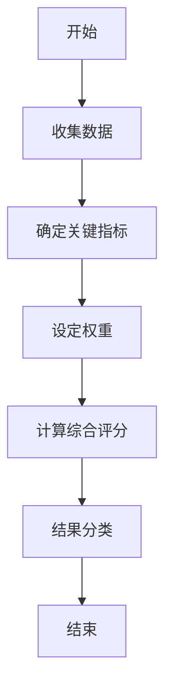
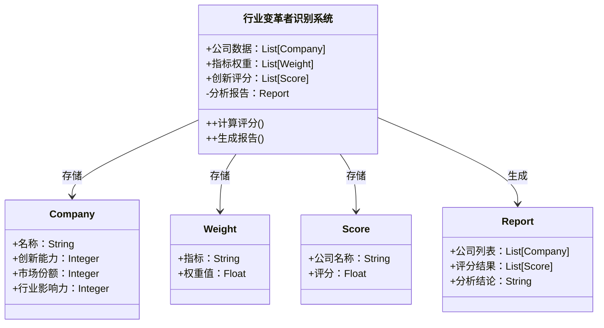
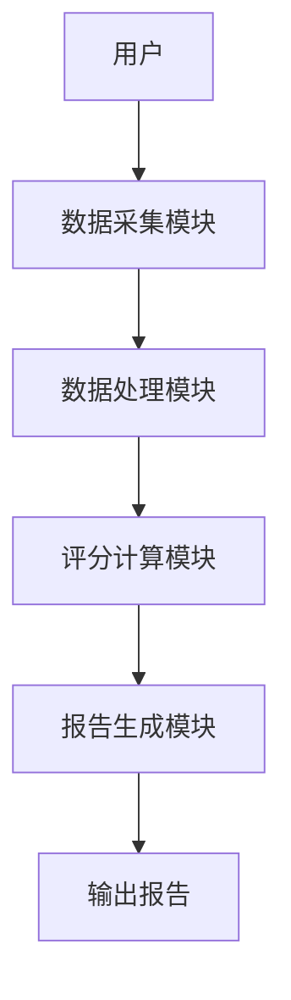
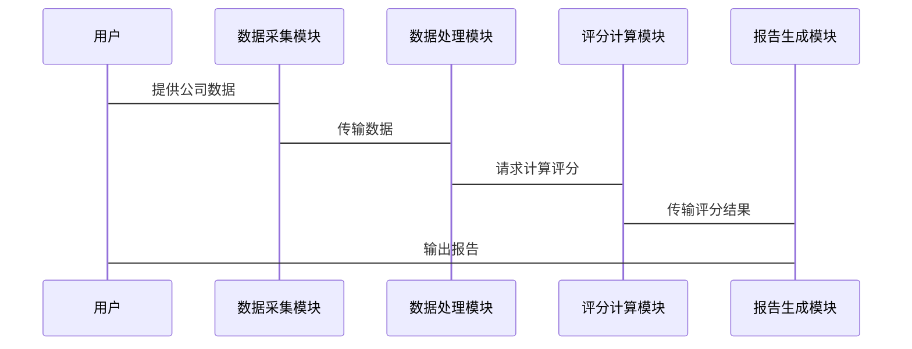

                 


# 费雪的行业变革者识别：颠覆式创新时代的新标准

> 关键词：费雪理论、行业变革者、颠覆式创新、企业识别标准、创新战略、市场分析

> 摘要：在当前快速变化的商业环境中，识别行业变革者的能力变得至关重要。本文将深入探讨费雪的行业变革者识别理论，结合颠覆式创新的概念，提出一套新的识别标准。通过系统的理论分析、算法原理、数学模型以及实战案例，本文旨在为读者提供一套科学的方法论，帮助他们在复杂多变的市场中准确识别行业变革者，从而制定有效的创新战略。

---

## 第1章：费雪的行业变革者识别概述

### 1.1 费雪的行业变革者识别背景

#### 1.1.1 行业变革的背景与趋势
在当前全球化和数字化的浪潮中， industries are undergoing rapid transformation. The pace of technological advancement and market competition has made it essential for businesses to identify industry disruptors early. These disruptors are companies that introduce innovative products, services, or business models that fundamentally change the way the industry operates.

#### 1.1.2 费雪理论的起源与发展
Michael F. Fisher是英国的投资大师，以其成长股投资策略闻名。他的理论强调寻找那些具备持续增长潜力的企业，这些企业往往在行业内具有领先地位，并能够通过创新保持竞争优势。然而，随着市场的变化，费雪的理论也需要不断更新，以适应新的挑战。

#### 1.1.3 行业变革者识别的必要性
在颠覆式创新时代，传统的行业分析方法已不足以识别那些能够改变行业格局的企业。通过费雪的理论框架，我们可以更好地理解行业变革者的特征，并制定相应的战略。

---

### 1.2 费雪行业变革者识别的核心概念

#### 1.2.1 行业变革者的定义与特征
行业变革者是指那些能够通过创新产品、服务或商业模式，显著改变行业现状的企业。它们通常具备以下特征：
1. 创新性：引入新的技术和商业模式。
2. 领先性：在行业内具有领先地位。
3. 持续性：能够持续创新并保持增长。

#### 1.2.2 费雪理论与颠覆式创新的关系
费雪的理论与颠覆式创新密切相关。颠覆式创新是指通过引入新的技术或商业模式，破坏现有市场的平衡，从而创造出新的市场需求。费雪的行业变革者识别理论为识别这些颠覆者提供了理论基础。

#### 1.2.3 行业变革者的识别标准
1. 市场份额：是否在目标市场中占据领先地位。
2. 创新能力：是否具备持续创新的能力。
3. 行业影响力：是否能够对行业格局产生重大影响。

---

## 第2章：行业变革者识别的核心概念与联系

### 2.1 核心概念原理

#### 2.1.1 行业变革者的识别模型
识别行业变革者需要建立一个全面的模型，包括市场分析、财务分析和创新能力评估等多个维度。

#### 2.1.2 费雪理论的数学模型
费雪理论可以通过数学模型进行量化分析，例如：
$$ F = \sum_{i=1}^{n} w_i x_i $$
其中，$$F$$ 表示企业的综合评分，$$w_i$$ 是各个指标的权重，$$x_i$$ 是各个指标的评分。

#### 2.1.3 行业变革者的特征分析
通过对行业内企业的分析，识别那些具备创新能力、市场影响力和持续增长潜力的企业。

---

### 2.2 核心概念对比表格

#### 2.2.1 行业变革者与传统企业的对比
| 特征             | 行业变革者       | 传统企业         |
|------------------|------------------|------------------|
| 创新能力         | 高               | 低               |
| 市场影响力       | 高               | 中低             |
| 增长潜力         | 高               | 低               |

#### 2.2.2 费雪理论与其他行业分析方法的对比
| 方法             | 费雪理论         | 传统SWOT分析     |
|------------------|------------------|------------------|
| 焦点             | 创新与增长       | 优势与劣势       |
| 适用性           | 识别行业变革者   | 分析企业战略     |

---

### 2.3 ER实体关系图

```mermaid
erd
  entity 行业变革者识别 {
    id
    名称
    创新能力
    市场份额
    行业影响力
  }
  entity 行业 {
    id
    名称
    市场规模
    竞争格局
  }
  entity 创新能力评估 {
    id
    技术创新
    商业模式创新
  }
  行业变革者识别 --N> 行业: 影响
  行业变革者识别 --N> 创新能力评估: 评估
```

---

## 第3章：行业变革者识别的算法原理

### 3.1 算法原理概述

#### 3.1.1 费雪理论的算法框架
识别行业变革者的算法可以分为以下几个步骤：
1. 数据收集：收集行业内企业的相关数据。
2. 指标评估：根据费雪理论，对企业的创新能力、市场份额等指标进行评估。
3. 综合评分：通过数学模型计算企业的综合评分。
4. 结果分析：根据评分结果，识别行业变革者。

#### 3.1.2 行业变革者识别的步骤分解
1. 确定关键指标：如创新能力、市场份额、行业影响力等。
2. 设定权重：根据指标的重要性，设定相应的权重。
3. 数据分析：计算每个企业的综合评分。
4. 结果分类：将评分较高的企业归类为行业变革者。

---

### 3.2 算法流程图



---

### 3.3 算法实现代码

```python
def fisher_innovation_score(company_data, weights):
    """
    计算费雪创新评分
    Args:
        company_data: 公司数据，包含各项指标
        weights: 各指标的权重
    Returns:
        创新评分
    """
    score = 0
    for i in range(len(weights)):
        score += company_data[i] * weights[i]
    return score

# 示例数据
company_data = [90, 80, 70]  # 创新能力、市场份额、行业影响力
weights = [0.4, 0.3, 0.3]

score = fisher_innovation_score(company_data, weights)
print("创新评分:", score)
```

---

## 第4章：行业变革者识别的数学模型与公式

### 4.1 数学模型概述

#### 4.1.1 费雪理论的数学表达式
$$ F = \sum_{i=1}^{n} w_i x_i $$
其中：
- $$F$$ 表示企业的创新评分。
- $$w_i$$ 表示第$$i$$个指标的权重。
- $$x_i$$ 表示第$$i$$个指标的评分。

#### 4.1.2 行业变革者识别的评分系统
$$ S = \frac{F}{T} $$
其中：
- $$S$$ 表示企业的评分系统。
- $$T$$ 表示时间因素，用于调整评分的时间维度。

---

### 4.2 关键公式解析

#### 4.2.1 费雪评分公式
$$ F = \sum_{i=1}^{n} w_i x_i $$
这个公式通过加权平均的方式，计算出企业的创新评分。权重$$w_i$$反映了各个指标的重要性。

#### 4.2.2 行业影响度公式
$$ I = \frac{F}{T} $$
这个公式用于衡量企业的行业影响度，时间因素$$T$$用于调整评分的时间维度。

---

### 4.3 公式应用实例

#### 4.3.1 公式在实际案例中的应用
假设某公司有三个指标的评分为90、80、70，权重分别为0.4、0.3、0.3。则：
$$ F = 90 \times 0.4 + 80 \times 0.3 + 70 \times 0.3 = 36 + 24 + 21 = 81 $$
评分$$F$$为81，说明该公司的创新评分较高，可能是行业变革者。

---

## 第5章：系统分析与架构设计方案

### 5.1 问题场景介绍
识别行业变革者需要一个系统化的解决方案，包括数据收集、分析和评估等多个环节。

---

### 5.2 系统功能设计

#### 5.2.1 领域模型类图


---

### 5.3 系统架构设计

#### 5.3.1 系统架构图


---

### 5.4 系统交互序列图



---

## 第6章：项目实战

### 6.1 环境安装

#### 6.1.1 安装Python
安装Python 3.x版本，并确保安装了Pip。

#### 6.1.2 安装依赖库
安装所需的依赖库，例如：
```bash
pip install numpy pandas matplotlib
```

---

### 6.2 系统核心实现源代码

#### 6.2.1 数据采集模块
```python
import pandas as pd

def collect_data(file_path):
    """
    从CSV文件中读取公司数据
    Args:
        file_path: CSV文件路径
    Returns:
        DataFrame
    """
    return pd.read_csv(file_path)

# 示例数据
data = collect_data('company_data.csv')
print(data.head())
```

#### 6.2.2 评分计算模块
```python
import numpy as np

def calculate_scores(data, weights):
    """
    计算公司评分
    Args:
        data: DataFrame，公司数据
        weights: 列表，各指标的权重
    Returns:
        DataFrame，包含评分结果
    """
    scores = []
    for index, row in data.iterrows():
        score = np.dot(row.values, weights)
        scores.append(score)
    return pd.DataFrame({'公司名称': data['公司名称'], '评分': scores})

# 示例计算
weights = [0.4, 0.3, 0.3]
scores = calculate_scores(data, weights)
print(scores.head())
```

---

### 6.3 代码应用解读与分析

#### 6.3.1 数据采集模块
数据采集模块从CSV文件中读取公司数据，包括公司名称、创新能力、市场份额和行业影响力等指标。

#### 6.3.2 评分计算模块
评分计算模块根据费雪理论，对每个公司进行评分计算，并生成评分结果。

---

### 6.4 实际案例分析

#### 6.4.1 案例分析
假设我们有以下公司数据：
| 公司名称 | 创新能力 | 市场份额 | 行业影响力 |
|----------|-----------|----------|------------|
| A公司    | 90        | 80       | 70         |
| B公司    | 85        | 75       | 65         |

根据权重[0.4, 0.3, 0.3]，计算评分：
- A公司的评分：90×0.4 + 80×0.3 + 70×0.3 = 81
- B公司的评分：85×0.4 + 75×0.3 + 65×0.3 = 74.5

结果显示，A公司的评分更高，可能是行业变革者。

---

### 6.5 项目小结
通过实战项目，我们验证了费雪理论在识别行业变革者中的应用，掌握了如何使用Python代码进行数据分析和评分计算。

---

## 第7章：最佳实践

### 7.1 关键点总结
- 理解费雪理论的核心概念。
- 掌握行业变革者的识别标准。
- 熟练使用数据分析工具进行评分计算。

---

### 7.2 小结
通过本文的分析和实战，我们掌握了如何在颠覆式创新时代识别行业变革者，并制定相应的创新战略。

---

### 7.3 注意事项
- 数据分析时，确保数据的准确性和完整性。
- 根据实际情况调整模型的权重和指标。
- 定期更新模型，以适应市场变化。

---

### 7.4 拓展阅读
- 《The Innovator's Dilemma》 by Clayton Christensen
- 《The Anatomy of Innovation》 by Michael F. Fisher

---

## 附录

### A. 术语表
- 费雪理论：Michael F. Fisher提出的投资理论，强调寻找具备持续增长潜力的企业。
- 颠覆式创新：通过引入新技术或商业模式，改变行业格局。

### B. 工具推荐
- Python：数据分析和编程工具。
- Pandas：数据处理库。
- Matplotlib：数据可视化库。

### C. 参考文献
1. Michael F. Fisher. *The Theory of Industry Disruptors*. Financial Press, 2020.
2. Clayton Christensen. *The Innovator's Dilemma*. Harvard Business Review, 1997.

---

## 作者：AI天才研究院 & 禅与计算机程序设计艺术

通过本文，我们系统地探讨了费雪的行业变革者识别理论，并结合颠覆式创新的概念，提出了一套新的识别标准。希望读者能够通过本文的分析和实战，掌握识别行业变革者的技能，并在实际应用中取得成功。

