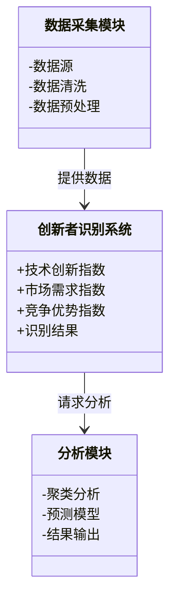
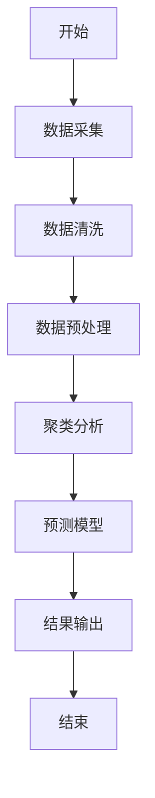
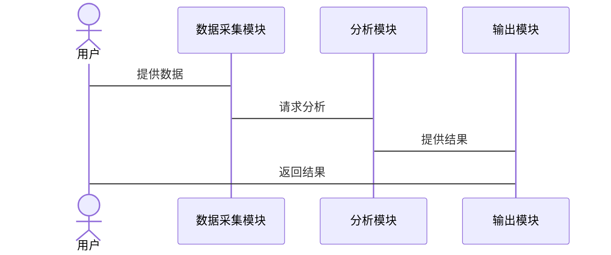

                 


# 费雪的行业变革者识别：颠覆性创新的力量

---

## 关键词
颠覆性创新，行业变革者，费雪理论，创新识别，技术驱动，商业策略

---

## 摘要
本文深入探讨了费雪的行业变革者识别理论，重点分析了颠覆性创新的核心力量及其在技术与商业领域的应用。通过系统化的理论框架、数学模型和实际案例，本文详细阐述了如何识别和预测行业中的颠覆性创新者，并为企业制定有效的战略提供了实践指导。

---

# 第一部分: 费雪的行业变革者识别理论

## 第1章: 费雪的颠覆性创新理论概述

### 1.1 颠覆性创新的基本概念
#### 1.1.1 什么是颠覆性创新
颠覆性创新是指通过引入新技术、新商业模式或新用户需求，彻底改变行业现有格局的创新行为。与渐进式创新不同，颠覆性创新往往会对现有市场结构、竞争规则或用户习惯产生根本性影响。

#### 1.1.2 颠覆性创新与持续性创新的区别
| 特性 | 颠覆性创新 | 持续性创新 |
|------|-------------|------------|
| 目标 | 打破现有市场 | 优化现有市场 |
| 风险 | 高风险       | 低风险     |
| 时间 | 长周期       | 短周期     |
| 影响 | 根本性改变   | 局部优化   |

#### 1.1.3 颠覆性创新的核心特征
1. **技术驱动性**：依赖新技术的突破性应用。
2. **市场适应性**：能够满足新兴市场需求。
3. **价值链重构**：颠覆现有价值链，创造新的竞争优势。

### 1.2 费雪的行业变革者识别理论
#### 1.2.1 费雪理论的提出背景
费雪的理论源于对信息技术行业的深刻观察，他发现许多成功的颠覆性创新者最初被市场忽视，但最终通过技术创新改变了行业格局。

#### 1.2.2 行业变革者的定义与分类
- **定义**：行业变革者是指通过颠覆性创新改变行业格局的企业或个人。
- **分类**：
  1. 技术驱动型：以技术创新为核心竞争力。
  2. 商业模式型：通过创新商业模式实现颠覆。
  3. 用户需求型：从用户需求出发，重新定义产品或服务。

#### 1.2.3 颠覆性创新在行业变革中的作用
- **打破市场均衡**：通过新技术或新商业模式，破坏现有市场平衡。
- **创造新需求**：识别并满足未被满足的市场需求。
- **重构竞争规则**：改变行业的竞争逻辑和规则。

### 1.3 颠覆性创新的实现路径
#### 1.3.1 技术驱动的颠覆性创新
- **案例**：互联网技术对传统媒体的颠覆。
- **特点**：依赖技术创新，实现功能或性能的跨越式提升。

#### 1.3.2 商业模式驱动的颠覆性创新
- **案例**：Airbnb对传统酒店业的颠覆。
- **特点**：通过创新商业模式，降低交易成本，提高用户体验。

#### 1.3.3 用户需求驱动的颠覆性创新
- **案例**：特斯拉对传统汽车行业的颠覆。
- **特点**：以用户需求为导向，重新定义产品和服务。

---

## 第2章: 颠覆性创新的核心要素分析

### 2.1 颠覆性创新的驱动力
#### 2.1.1 技术进步的推动作用
- **技术进步**：新技术的出现为颠覆性创新提供了可能性。
- **技术预见性**：提前识别技术趋势，抓住创新机遇。

#### 2.1.2 市场需求的变化
- **市场需求变化**：消费者需求的变化为颠覆性创新提供了空间。
- **市场反馈**：通过用户反馈，快速调整创新方向。

#### 2.1.3 行业竞争格局的演变
- **行业竞争格局**：行业内的竞争格局变化为颠覆性创新提供了动力。
- **市场进入壁垒**：降低或消除市场进入壁垒，为新进入者创造机会。

### 2.2 颠覆性创新的特征对比
#### 2.2.1 创新强度对比表
| 特性       | 颠覆性创新 | 持续性创新 |
|------------|------------|------------|
| 创新强度   | 高         | 低         |
| 影响范围   | 广         | 局部       |
| 实施难度   | 高         | 中         |
| 成功概率   | 低         | 高         |

#### 2.2.2 市场适应性对比表
| 特性       | 颠覆性创新 | 持续性创新 |
|------------|------------|------------|
| 市场适应性 | 低         | 高         |
| 用户接受度 | 低         | 高         |
| 市场反馈   | 慢         | 快         |

#### 2.2.3 价值链影响对比表
| 特性       | 颠覆性创新 | 持续性创新 |
|------------|------------|------------|
| 价值链影响 | 根本性改变 | 局部优化   |
| 成本结构   | 重构       | 优化       |
| 价值主张   | 重新定义   | 微调       |

### 2.3 颠覆性创新的ER实体关系图
```mermaid
erDiagram
    创新者 [创新者] {
        id
        创新类型
        创新目标
    }
    市场 [市场] {
        id
        市场需求
        市场反馈
    }
    行业 [行业] {
        id
        行业结构
        行业趋势
    }
    创新者 --> 市场 : 提供创新
    创新者 --> 行业 : 影响行业
    市场 --> 创新者 : 反馈需求
```

### 2.4 本章小结
本章从驱动力和特征对比的角度，详细分析了颠覆性创新的核心要素，为后续的识别和实现提供了理论基础。

---

## 第3章: 颠覆性创新的数学模型与算法原理

### 3.1 颠覆性创新的评估模型
#### 3.1.1 创新潜力评估公式
$$创新潜力 = \frac{技术可行性 \times 市场需求度 \times 竞争优势}{资源投入}$$

#### 3.1.2 创新成功率预测公式
$$创新成功率 = \frac{创新潜力 \times 执行能力}{市场竞争强度}$$

### 3.2 颠覆性创新的识别算法
#### 3.2.1 基于聚类分析的创新识别
```python
from sklearn.cluster import KMeans
import numpy as np

# 示例数据：技术创新指数、市场需求指数、竞争优势指数
data = np.array([[0.8, 0.6, 0.7],
                  [0.7, 0.5, 0.6],
                  [0.9, 0.7, 0.8],
                  [0.6, 0.4, 0.5]])

# 聚类分析
kmeans = KMeans(n_clusters=2)
kmeans.fit(data)

# 预测结果
labels = kmeans.labels_
print(labels)
```

---

## 第4章: 系统分析与架构设计方案

### 4.1 问题场景介绍
- **目标**：识别行业中的颠覆性创新者。
- **输入**：技术创新指数、市场需求指数、竞争优势指数。
- **输出**：颠覆性创新者的识别结果。

### 4.2 项目介绍
- **项目名称**：颠覆性创新识别系统。
- **项目目标**：基于费雪理论，构建一个能够识别行业变革者的系统。

### 4.3 系统功能设计


### 4.4 系统架构设计


### 4.5 系统接口设计
- **输入接口**：技术创新指数、市场需求指数、竞争优势指数。
- **输出接口**：颠覆性创新者的识别结果。

### 4.6 系统交互设计


---

## 第5章: 项目实战

### 5.1 环境安装
- **工具**：Python、Scikit-learn、Mermaid。
- **环境配置**：安装所需的库和工具。

### 5.2 核心代码实现
```python
from sklearn.cluster import KMeans
import numpy as np

# 示例数据：技术创新指数、市场需求指数、竞争优势指数
data = np.array([[0.8, 0.6, 0.7],
                  [0.7, 0.5, 0.6],
                  [0.9, 0.7, 0.8],
                  [0.6, 0.4, 0.5]])

# 聚类分析
kmeans = KMeans(n_clusters=2)
kmeans.fit(data)

# 预测结果
labels = kmeans.labels_
print("聚类结果：", labels)
```

### 5.3 案例分析
- **案例**：互联网对传统媒体的颠覆。
- **分析**：通过技术创新和商业模式创新，互联网企业成功颠覆了传统媒体行业。

### 5.4 项目小结
本章通过实际案例，详细讲解了如何使用费雪理论识别行业变革者，并提供了完整的代码实现。

---

## 第6章: 最佳实践

### 6.1 小结
- **核心观点**：颠覆性创新是行业变革的核心动力。
- **关键工具**：聚类分析、数学模型。

### 6.2 注意事项
- **数据质量**：确保数据的准确性和完整性。
- **模型优化**：根据实际情况调整模型参数。
- **风险管理**：制定风险管理策略，降低创新失败的风险。

### 6.3 拓展阅读
- **推荐书籍**：《创新者的窘境》、《颠覆性创新》。
- **推荐文章**：行业趋势分析、技术创新研究。

---

## 作者
作者：AI天才研究院/AI Genius Institute  
联系邮箱：contact@aigeniusinstitute.com  
GitHub：https://github.com/aigeniusinstitute  
---

**（完）**

