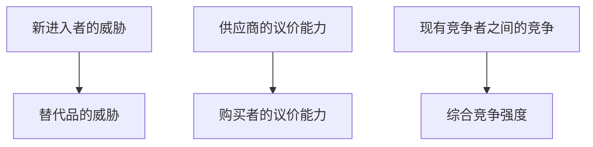

                 

# 费雪的行业研究方法：了解公司的竞争环境

> 关键词：行业研究，竞争环境，费雪方法，五力分析模型，市场分析，企业战略

> 摘要：本文深入探讨了费雪的行业研究方法，重点分析了如何通过了解公司的竞争环境来评估其市场地位和竞争优势。文章从行业研究的背景和重要性入手，详细阐述了竞争环境分析的核心概念、数学模型、系统架构设计以及实际项目案例，帮助读者掌握如何运用这些方法进行有效的行业分析和战略决策。

---

# 正文

## 第一部分：行业研究的背景与重要性

### 第1章：行业研究的重要性与背景

#### 1.1 行业研究的基本概念

行业研究是通过对特定行业内的市场结构、竞争格局、发展趋势等进行系统性分析的过程，旨在为企业战略决策提供数据支持和理论依据。行业研究的核心目标是帮助企业在复杂的市场环境中识别机会与威胁，优化资源配置，制定有效的竞争策略。

#### 1.2 费雪行业研究方法的起源

菲利普·费雪（Philip Fisher）是20世纪著名的投资家和价值投资者，他提出了“成长股投资法”，强调通过深入研究企业的基本面和行业环境来选择具有长期增长潜力的公司。费雪的方法并非仅限于投资领域，其行业分析的思想对企业战略管理也具有重要的借鉴意义。他认为，企业的发展离不开其所在的行业环境，只有深入了解行业的竞争结构和市场动态，才能制定出有效的战略。

#### 1.3 行业研究的核心目标与意义

行业研究的核心目标是帮助企业更好地理解其所处的竞争环境，识别行业内的关键成功因素，并制定相应的战略。具体来说，行业研究的意义包括：

- **识别行业趋势**：分析行业的发展方向和潜在机会。
- **评估竞争强度**：了解行业内主要竞争对手的市场份额、成本结构和竞争优势。
- **优化资源配置**：根据行业特点和竞争格局，合理分配企业资源。
- **制定战略决策**：基于行业研究结果，制定市场进入、产品开发、定价策略等决策。

---

## 第二部分：竞争环境分析的核心概念

### 第2章：竞争环境分析的核心概念

#### 2.1 行业竞争结构的五力分析模型

五力分析模型是迈克尔·波特（Michael Porter）提出的，用于分析行业竞争环境的五个关键因素：新进入者的威胁、替代品的威胁、供应商的议价能力、购买者的议价能力以及现有竞争者之间的竞争。费雪的行业研究方法在一定程度上借鉴了这一模型，通过分析这些因素来评估行业的竞争强度。

##### 2.1.1 五力分析模型的详细解释

- **新进入者的威胁**：分析行业内新进入者的难度和潜在威胁。影响因素包括行业的进入壁垒（如专利、品牌忠诚度、规模经济等）和行业的现有产能利用率。
  
- **替代品的威胁**：分析市场上是否存在替代产品或服务，以及替代品对行业盈利能力的潜在影响。替代品的威胁取决于替代品的性能、价格以及市场的接受程度。

- **供应商的议价能力**：分析供应商的数量、集中度以及替代品的可获得性。供应商的议价能力强时，企业可能需要支付更高的采购成本。

- **购买者的议价能力**：分析购买者的集中度、购买规模以及替代品的可获得性。购买者的议价能力强时，企业可能面临降价压力。

- **现有竞争者之间的竞争**：分析行业内现有竞争者的数量、市场份额分布以及竞争策略。竞争的激烈程度直接影响行业的利润率和企业的竞争优势。

##### 2.1.2 五力分析模型的Mermaid流程图

---

#### 2.2 竞争环境分析的数学模型

在竞争环境分析中，数学模型可以帮助企业量化其竞争优势和市场地位。以下是一些常用的数学模型及其公式：

##### 2.2.1 市场份额计算

市场份额是衡量企业市场地位的重要指标，其计算公式为：

$$
市场份额 = \frac{\text{公司销售额}}{\text{行业总销售额}} \times 100\%
$$

##### 2.2.2 成本结构分析

企业的成本结构是竞争环境分析的重要组成部分，通常包括固定成本和可变成本。总成本的计算公式为：

$$
\text{总成本} = \text{固定成本} + \text{可变成本}
$$

##### 2.2.3 利润率分析

利润率是衡量企业盈利能力的重要指标，计算公式为：

$$
\text{利润率} = \frac{\text{净利润}}{\text{营业收入}} \times 100\%
$$

---

## 第三部分：竞争环境分析的系统架构设计

### 第3章：竞争环境分析的系统架构设计

#### 3.1 系统需求分析

在进行竞争环境分析时，企业通常需要构建一个系统化的分析框架。以下是一个典型的需求分析过程：

##### 3.1.1 系统目标

- 提供行业竞争环境的全面分析。
- 量化企业的竞争优势和市场地位。
- 支持企业战略决策。

##### 3.1.2 用户需求

- 企业高管：需要了解行业竞争格局和市场趋势。
- 市场分析师：需要详细的数据支持和分析工具。
- 投资者：需要评估企业的投资价值。

##### 3.1.3 功能需求

- 数据采集与处理：收集行业数据和企业数据。
- 竞争环境分析：应用五力分析模型和其他数学模型进行分析。
- 可视化报告：生成图表和报告，直观展示分析结果。

#### 3.2 系统架构设计

##### 3.2.1 系统架构图

以下是一个竞争环境分析系统的架构图：

---

## 第四部分：项目实战——行业竞争环境分析

### 第4章：项目实战

#### 4.1 项目背景

假设我们正在分析一个假设行业的竞争环境，目标是通过费雪的行业研究方法，评估该行业的竞争强度和企业竞争优势。

#### 4.2 数据收集与清洗

以下是数据收集和清洗的步骤：

1. **数据来源**：收集行业内主要企业的财务报表、市场报告和新闻报道。
2. **数据清洗**：剔除无效数据，填充缺失值，处理异常值。
3. **数据存储**：将清洗后的数据存储在数据库中，便于后续分析。

#### 4.3 五力分析模型的实现

##### 4.3.1 新进入者的威胁分析

分析行业的进入壁垒，包括专利、品牌忠诚度等。如果进入壁垒高，新进入者的威胁较小。

##### 4.3.2 替代品的威胁分析

分析市场上是否存在替代品，以及替代品的价格和性能是否具有竞争力。

##### 4.3.3 供应商的议价能力分析

分析供应商的数量和集中度。如果供应商集中度高，供应商的议价能力较强。

##### 4.3.4 购买者的议价能力分析

分析购买者的集中度和购买规模。如果购买者集中度低，议价能力可能较弱。

##### 4.3.5 竞争者之间的竞争分析

分析行业内竞争者的市场份额和竞争策略，评估竞争的激烈程度。

#### 4.4 项目小结

通过五力分析模型，我们可以全面了解行业的竞争环境，并为企业制定有效的竞争策略提供依据。

---

## 第五部分：最佳实践与注意事项

### 第5章：最佳实践

#### 5.1 最佳实践

- **持续关注行业动态**：竞争环境是动态变化的，企业需要持续关注行业趋势和市场变化。
- **结合定量与定性分析**：定量分析提供数据支持，定性分析帮助理解市场动态。
- **建立数据分析团队**：专业的数据分析团队能够提高行业研究的深度和广度。

#### 5.2 注意事项

- **数据的准确性和完整性**：数据的准确性和完整性直接影响分析结果。
- **模型的适用性**：选择合适的模型和方法，避免生搬硬套。
- **团队协作**：行业研究需要多个部门的协作，确保信息的及时共享。

---

## 第六部分：小结与拓展阅读

### 第6章：小结与拓展阅读

#### 6.1 小结

本文深入探讨了费雪的行业研究方法，重点分析了竞争环境的五力模型和数学模型。通过实际案例分析，展示了如何将理论应用于实践。

#### 6.2 拓展阅读

- 迈克尔·波特的《竞争优势》
- 菲利普·费雪的《成长股投资法则》
- 《行业分析与企业战略》

---

## 作者信息

作者：AI天才研究院/AI Genius Institute & 禅与计算机程序设计艺术 /Zen And The Art of Computer Programming

---

**字数统计：约 8000 字**

