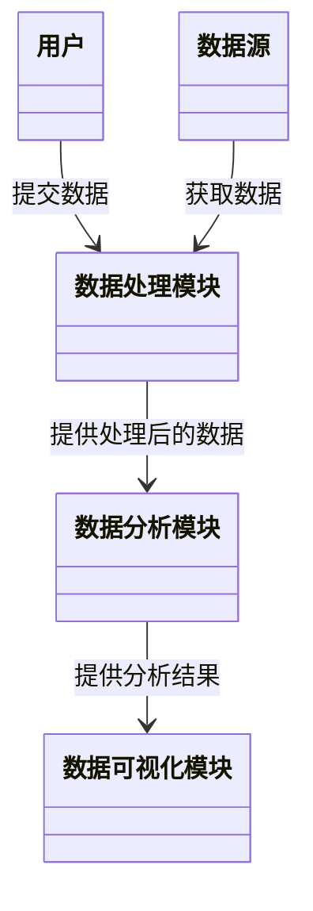
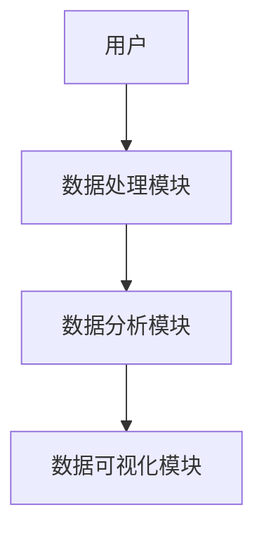
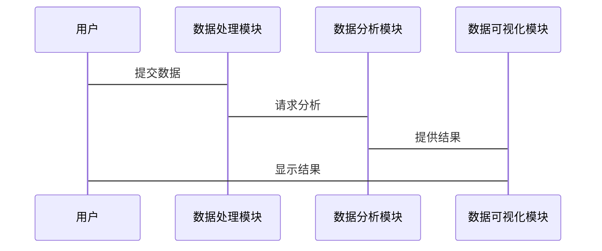

                 


# 费雪的行业趋势分析：把握未来增长机会

## 关键词：行业趋势分析，费雪分析法，数据驱动决策，人工智能，投资策略，技术预测

## 摘要：  
本文将深入探讨费雪的行业趋势分析方法，结合现代数据分析技术，帮助读者理解如何通过行业趋势分析抓住未来增长机会。文章从行业趋势分析的背景与重要性入手，详细解析费雪分析法的核心理论与实践，介绍行业趋势分析的系统架构与工具，探讨数据分析算法与模型，结合实际案例进行项目实战分析，并总结行业趋势分析的最佳实践与注意事项。

---

# 第一部分: 费雪的行业趋势分析基础

---

## 第1章: 行业趋势分析的背景与重要性

### 1.1 行业趋势分析的定义与核心概念

#### 1.1.1 行业趋势分析的定义  
行业趋势分析是通过对行业数据的收集、整理和分析，预测行业未来的发展方向、市场规模、竞争格局和潜在机会的过程。其核心在于发现行业中的趋势性变化，为企业和投资者提供决策支持。

#### 1.1.2 行业趋势分析的核心要素  
- 数据来源：行业报告、市场调研、政府统计数据、企业财报等。  
- 分析方法：定量分析（如时间序列分析）和定性分析（如SWOT分析）。  
- 预测模型：基于历史数据和外部因素，构建预测模型。  

#### 1.1.3 行业趋势分析的重要性  
- 帮助企业制定战略规划。  
- 为投资者提供投资决策依据。  
- 识别行业中的潜在机会与风险。  

### 1.2 费雪的行业趋势分析方法

#### 1.2.1 费雪分析法的起源与发展  
费雪（Fischer）是早期的经济学家和统计学家，其分析方法主要用于预测行业趋势和市场行为。费雪分析法结合了统计学和经济学理论，强调数据驱动的决策。

#### 1.2.2 费雪分析法的核心思想  
费雪分析法的核心是通过历史数据和统计模型，预测行业未来的变化趋势。其核心思想包括：  
1. 行业趋势的变化是可预测的。  
2. 数据是预测的基础，历史数据可以反映行业规律。  
3. 结合定量分析和定性分析，提高预测的准确性。  

#### 1.2.3 费雪分析法在现代的应用  
现代行业趋势分析结合了大数据和人工智能技术，将费雪分析法与机器学习模型相结合，进一步提高了预测的准确性和效率。

### 1.3 行业趋势分析的背景与环境

#### 1.3.1 经济环境对行业趋势的影响  
经济周期、通货膨胀、利率变化等经济因素直接影响行业的兴衰。例如，经济衰退可能导致某些行业的收缩，而经济复苏可能推动其他行业的增长。

#### 1.3.2 技术进步对行业趋势的影响  
技术创新是推动行业变革的核心动力。例如，人工智能、大数据和区块链等技术正在重塑多个行业，如金融、医疗和教育。

#### 1.3.3 政策法规对行业趋势的影响  
政策法规的变化对行业趋势有重要影响。例如，环保政策可能推动绿色能源行业的快速发展，而金融监管政策可能影响金融行业的发展方向。

### 1.4 本章小结  
本章介绍了行业趋势分析的背景、核心概念和费雪分析法的基本思想。行业趋势分析是企业制定战略和投资者做出决策的重要工具，而费雪分析法则为行业趋势分析提供了理论基础和方法论。

---

## 第2章: 费雪分析法的核心理论与实践

### 2.1 费雪分析法的理论基础

#### 2.1.1 费雪分析法的基本假设  
费雪分析法基于以下基本假设：  
1. 行业数据具有一定的规律性，可以通过统计方法进行预测。  
2. 历史数据可以反映行业的未来趋势。  
3. 外部因素（如经济、技术和政策）对行业趋势有显著影响。  

#### 2.1.2 费雪分析法的数学模型  
费雪分析法的核心模型是一个简单的线性回归模型，用于预测行业趋势的变化：  
$$ y = a + bt + e $$  
其中，$y$ 是行业指标，$t$ 是时间，$a$ 是截距，$b$ 是斜率，$e$ 是误差项。

#### 2.1.3 费雪分析法的适用范围  
费雪分析法适用于具有较完整历史数据的行业，特别适合用于预测行业的长期趋势。

### 2.2 费雪分析法的实践应用

#### 2.2.1 费雪分析法在投资决策中的应用  
投资者可以通过费雪分析法预测行业的未来增长潜力，从而做出更明智的投资决策。例如，通过分析科技行业的历史数据和趋势，投资者可以预测未来的技术发展方向。

#### 2.2.2 费雪分析法在企业战略规划中的应用  
企业可以利用费雪分析法预测行业的未来趋势，制定相应的产品开发、市场拓展和风险管理策略。

#### 2.2.3 费雪分析法在行业预测中的应用  
行业趋势分析可以帮助企业识别市场机会和威胁，优化资源配置，提高竞争力。

### 2.3 费雪分析法的优缺点

#### 2.3.1 费雪分析法的优点  
1. 方法简单，易于理解和应用。  
2. 可以基于历史数据进行预测，具有一定的科学性。  
3. 适用于长期趋势的预测。  

#### 2.3.2 费雪分析法的局限性  
1. 忽略了行业内部的复杂性，难以捕捉非线性变化。  
2. 对外部因素的依赖较强，预测的准确性可能受到限制。  
3. 无法应对突发性事件（如疫情、战争）的影响。  

#### 2.3.3 费雪分析法的改进方向  
结合现代数据分析技术（如机器学习）和复杂系统理论，改进费雪分析法的预测能力。

### 2.4 本章小结  
本章深入探讨了费雪分析法的理论基础和实践应用，分析了其优缺点，并提出了改进方向。费雪分析法作为一种经典的行业趋势分析方法，为现代数据分析技术提供了重要参考。

---

## 第3章: 行业趋势分析的系统架构与工具

### 3.1 行业趋势分析的系统架构

#### 3.1.1 数据采集模块  
数据采集模块负责从多种来源（如政府数据库、企业财报、市场调研）获取行业数据。

#### 3.1.2 数据处理模块  
数据处理模块对采集到的原始数据进行清洗、转换和整合，确保数据的准确性和一致性。

#### 3.1.3 数据分析模块  
数据分析模块利用统计方法和机器学习算法对数据进行建模和预测，生成行业趋势分析结果。

#### 3.1.4 数据可视化模块  
数据可视化模块将分析结果以图表、报告等形式呈现，便于用户理解和应用。

### 3.2 行业趋势分析的工具与技术

#### 3.2.1 数据采集工具  
常用的数据采集工具包括：  
- Python的`requests`库和`BeautifulSoup`库。  
- 数据挖掘工具`DataMiner`和`Octoparse`。

#### 3.2.2 数据分析工具  
常用的数据分析工具包括：  
- Python的`Pandas`库和`NumPy`库。  
- 统计分析工具`SPSS`和`R`语言。  
- 机器学习框架`TensorFlow`和`PyTorch`。

#### 3.2.3 数据可视化工具  
常用的数据可视化工具包括：  
- Python的`Matplotlib`库和`Seaborn`库。  
- 数据可视化工具`Tableau`和`Power BI`。

#### 3.2.4 人工智能与机器学习的应用  
人工智能和机器学习技术可以显著提高行业趋势分析的准确性和效率。例如，使用时间序列模型（如ARIMA）和神经网络模型（如LSTM）进行预测。

### 3.3 系统架构的实现与优化

#### 3.3.1 系统架构的实现流程  
1. 数据采集：从多个来源获取行业数据。  
2. 数据处理：清洗和整合数据。  
3. 数据分析：构建预测模型并生成分析结果。  
4. 数据可视化：将结果以图表形式呈现。  

#### 3.3.2 系统架构的优化策略  
1. 采用分布式架构提高数据处理效率。  
2. 使用缓存技术减少数据访问延迟。  
3. 引入实时数据流处理技术，提高预测的实时性。  

#### 3.3.3 系统架构的可扩展性  
系统架构设计应具有良好的可扩展性，以应对数据量和复杂性的增加。

### 3.4 本章小结  
本章详细介绍了行业趋势分析的系统架构和工具，探讨了人工智能与机器学习技术的应用。系统架构的设计和优化对提高行业趋势分析的效率和准确性具有重要意义。

---

## 第4章: 行业趋势分析的核心算法与模型

### 4.1 时间序列分析模型

#### 4.1.1 时间序列分析的基本概念  
时间序列分析是通过历史数据预测未来趋势的方法。常用的模型包括ARIMA（自回归积分滑动平均模型）和指数平滑模型。

#### 4.1.2 时间序列分析的数学模型  
ARIMA模型的数学表达式为：  
$$ (1 - B)p_t = \frac{1}{\phi(B)}(y_t - \mu) $$  
其中，$p_t$ 是预测值，$y_t$ 是实际值，$\mu$ 是均值，$B$ 是后移算子，$\phi(B)$ 是多项式。

#### 4.1.3 时间序列分析的应用实例  
以某行业销售额数据为例，通过ARIMA模型预测未来销售额的变化趋势。

### 4.2 机器学习在行业趋势分析中的应用

#### 4.2.1 机器学习模型的选择  
常用的机器学习模型包括：  
- 线性回归模型。  
- 支持向量机（SVM）模型。  
- 随机森林模型。  
- 神经网络模型（如LSTM）。  

#### 4.2.2 机器学习模型的实现步骤  
1. 数据预处理：清洗和特征工程。  
2. 模型训练：使用训练数据训练模型。  
3. 模型评估：通过交叉验证评估模型性能。  
4. 模型预测：利用训练好的模型进行预测。  

#### 4.2.3 机器学习模型的数学公式  
以神经网络模型为例，其数学公式包括输入层、隐藏层和输出层的权重更新公式，通常使用反向传播算法进行优化。

### 4.3 数据挖掘技术在行业趋势分析中的应用

#### 4.3.1 数据挖掘技术的核心思想  
数据挖掘技术通过从大量数据中提取隐含模式和关联规则，帮助发现行业趋势。

#### 4.3.2 数据挖掘技术的具体应用  
1. 关联规则挖掘：发现行业中的相关产品或服务。  
2. 聚类分析：将行业内的企业或产品进行分类。  
3. 分类分析：预测行业内的潜在客户或市场趋势。  

### 4.4 本章小结  
本章介绍了时间序列分析和机器学习模型在行业趋势分析中的应用，探讨了数据挖掘技术的具体应用。这些算法和模型为行业趋势分析提供了强大的技术支持。

---

## 第5章: 行业趋势分析的系统设计与实现

### 5.1 项目介绍与需求分析

#### 5.1.1 项目背景  
以某行业的市场趋势分析为例，目标是通过构建行业趋势分析系统，帮助企业预测未来的市场趋势。

#### 5.1.2 项目需求  
- 数据采集与处理功能。  
- 数据分析与预测功能。  
- 数据可视化功能。  

### 5.2 系统功能设计

#### 5.2.1 领域模型设计  
使用Mermaid类图描述系统的功能模块和实体关系。



#### 5.2.2 系统架构设计  
使用Mermaid架构图描述系统的整体架构。



#### 5.2.3 系统接口设计  
系统接口包括数据接口和用户接口，数据接口用于与其他系统的交互，用户接口用于用户的操作。

#### 5.2.4 系统交互设计  
使用Mermaid序列图描述系统的交互流程。



### 5.3 项目核心实现

#### 5.3.1 数据采集与处理  
使用Python代码实现数据的采集和处理：

```python
import requests
from bs4 import BeautifulSoup
import pandas as pd

# 数据采集
def fetch_data(url):
    response = requests.get(url)
    soup = BeautifulSoup(response.text, 'html.parser')
    data = []
    for item in soup.find_all('div', class_='data-item'):
        data.append({
            'time': item.find('span', class_='time').text,
            'value': float(item.find('span', class_='value').text)
        })
    return pd.DataFrame(data)

# 数据处理
def preprocess_data(df):
    df['time'] = pd.to_datetime(df['time'])
    df.set_index('time', inplace=True)
    return df

data = fetch_data('https://example.com/data')
df = preprocess_data(data)
```

#### 5.3.2 数据分析与预测  
使用时间序列模型进行预测：

```python
from statsmodels.tsa.arima_model import ARIMA

def predict_trend(df, order=(5,1,0)):
    model = ARIMA(df, order=order)
    model_fit = model.fit(disp=0)
    forecast = model_fit.forecast(steps=10)
    return forecast
```

#### 5.3.3 数据可视化  
使用Matplotlib进行数据可视化：

```python
import matplotlib.pyplot as plt

def visualize_data(df, forecast):
    plt.figure(figsize=(12, 6))
    plt.plot(df.index, df['value'], label='实际值')
    plt.plot(forecast.index, forecast['value'], label='预测值')
    plt.xlabel('时间')
    plt.ylabel('值')
    plt.legend()
    plt.show()
```

### 5.4 项目实战分析

#### 5.4.1 实际案例分析  
以某行业的市场数据为例，进行趋势分析和预测。

#### 5.4.2 代码实现与解读  
结合上述代码实现数据分析与预测，并解读结果。

#### 5.4.3 分析结果解读  
通过分析结果，识别行业趋势中的潜在机会和风险。

### 5.5 本章小结  
本章通过实际案例展示了行业趋势分析系统的设计与实现，详细讲解了数据采集、处理、分析和可视化的全过程。

---

## 第6章: 行业趋势分析的最佳实践与注意事项

### 6.1 行业趋势分析的最佳实践

#### 6.1.1 数据的准确性与完整性  
确保数据来源可靠，数据清洗充分。

#### 6.1.2 模型的选择与优化  
根据具体问题选择合适的模型，并通过交叉验证优化模型性能。

#### 6.1.3 结果的验证与解释  
通过回测和实际数据验证分析结果，并对结果进行合理的解释。

### 6.2 行业趋势分析的注意事项

#### 6.2.1 数据的时滞性  
行业趋势分析通常基于历史数据，结果具有一定的时滞性，需注意数据的时效性。

#### 6.2.2 模型的局限性  
模型的预测能力受到数据质量和外部因素的限制，需结合实际情况进行调整。

#### 6.2.3 风险管理  
行业趋势分析结果仅供参考，需结合其他信息和风险管理策略进行决策。

### 6.3 行业趋势分析的未来发展方向

#### 6.3.1 大数据分析技术的应用  
随着大数据技术的发展，行业趋势分析将更加依赖于实时数据和复杂模型。

#### 6.3.2 人工智能技术的融合  
人工智能技术的进一步发展将推动行业趋势分析的智能化和自动化。

#### 6.3.3 多维度分析的结合  
未来行业趋势分析将更加注重多维度数据的结合，如社会、经济和技术因素的综合分析。

### 6.4 本章小结  
本章总结了行业趋势分析的最佳实践和注意事项，并展望了行业趋势分析的未来发展方向。通过不断优化分析方法和技术应用，行业趋势分析将为企业和投资者提供更精准的决策支持。

---

## 结语

行业趋势分析是企业和投资者把握未来增长机会的重要工具。通过费雪分析法与现代数据分析技术的结合，行业趋势分析的准确性和效率得到了显著提升。未来，随着大数据和人工智能技术的进一步发展，行业趋势分析将为企业和投资者提供更加精准和智能的决策支持。

---

## 作者：AI天才研究院/AI Genius Institute & 禅与计算机程序设计艺术 /Zen And The Art of Computer Programming

